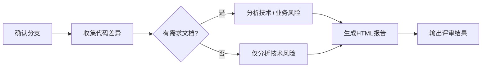

# /branch-review - 分支代码评审

启动分支代码评审流程,对比功能分支与主分支(master/main)的代码差异,自动识别技术风险和业务风险,生成可视化 HTML 评审报告。

## 用法

```
/branch-review [需求文档路径]
```

## 参数

- **需求文档路径**(可选): 本次开发需求的文档路径,用于业务风险分析
  - 支持格式: PRD / 用户故事 / 需求规格说明 / Markdown
  - 示例: `docs/prd-order-module.md`

## 示例

### 示例 1: 仅技术风险分析

```
/branch-review
```

**效果**: 
- 对比当前分支与主分支的代码差异
- 分析技术类风险(性能、安全、错误处理等)
- 生成可视化 HTML 报告

### 示例 2: 技术 + 业务风险分析

```
/branch-review docs/prd-order-module.md
```

**效果**:
- 读取需求文档,提取业务目标和验收标准
- 对比代码差异,分析技术风险
- 对照需求文档,分析业务风险(功能缺失、流程错误等)
- 生成包含技术风险和业务风险的完整报告

### 示例 3: 指定分支对比

在对话中说明:

```
请对比 feature/new-payment 和 master 分支的差异,需求文档在 docs/payment-requirements.md
```

**效果**:
- 使用指定的功能分支和主分支
- 读取需求文档进行业务风险分析
- 生成完整评审报告

## 报告输出

报告将保存到:
```
.code-review/review-[分支名]-[日期].html
```

报告包含:
1. **概览面板**: 变更统计、风险统计、通过率
2. **文件导航**: 文件树、变更行数、风险标记
3. **代码差异**: 并排/统一模式、语法高亮
4. **技术风险**: 按严重程度分级、关联代码行
5. **业务风险**: 需求覆盖度、缺失功能、流程问题
6. **交互功能**: 搜索、过滤、评论、导出

## 风险等级说明

| 等级 | 技术风险 | 业务风险 |
|------|---------|---------|
| 🔴 严重 | 崩溃、安全漏洞、数据丢失 | 缺失核心功能、业务流程错误 |
| 🟡 警告 | 性能问题、可维护性差 | 缺少异常处理、边界条件遗漏 |
| 🔵 建议 | 代码优化、重构建议 | 体验优化、流程改进 |
| ⚪ 提示 | 信息说明、最佳实践 | - |

## 工作流程



## 相关命令

- `/spec-start` - 启动需求交付
- `/spec-continue` - 继续需求交付
- `/spec-status` - 查看需求状态
- `execute-task` 技能 - 基于评审结果创建修复任务

## 注意事项

- 必须在 Git 仓库中执行
- 确保功能分支已提交变更
- 业务风险分析需要提供需求文档
- 报告为独立 HTML 文件,无需外部依赖
- 不会修改任何源代码文件

## 后续操作

评审完成后可执行:

1. **修复风险**: 使用 `execute-task` 技能创建修复任务
2. **更新需求**: 使用 `/spec-update` 补充需求文档
3. **重新评审**: 修复后再次运行 `/branch-review` 验证
4. **合并代码**: 解决所有严重风险后可安全合并
