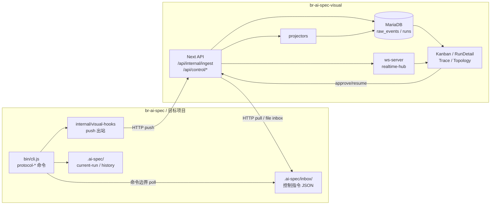
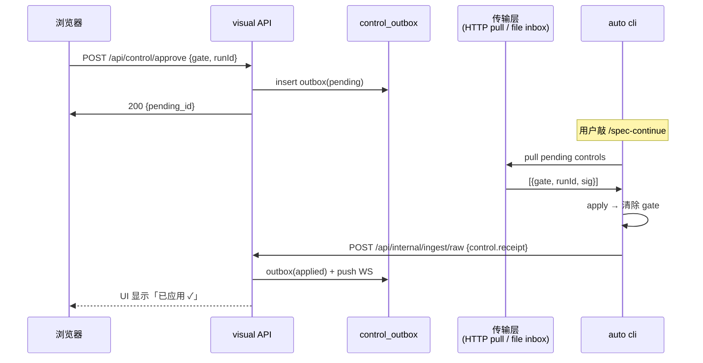

# 实时运行监控与可视化控制台 — Routa 风格重做方案

## 0. 设计 3 条铁律（解决"零侵入 vs 全功能"的矛盾）

1. **auto 侧零依赖**：所有 visual 相关代码只用 Node 内置 `http/fs/crypto/path`，不进 `package.json`，不进 `install.sh / init / sync` 主链。
2. **opt-in 才落盘**：目标项目目录在用户显式跑 `ai-spec-auto visual init` 之前，不出现任何 visual 相关文件；卸载只需删 `~/.ai-spec/visual.json` 或项目 `.ai-spec/visual-bridge.json`。
3. **控制面靠"自然边界 poll"，不靠常驻进程**：auto 不开 WebSocket 客户端、不起 daemon；只在 `protocol-step / -advance / -update / -status` 命令入口同步拉一次 inbox（≤50ms 超时，失败静默）。

这是 visual 能"既反向控制又零侵入"的关键 — 用**命令边界 + inbox 文件/HTTP**替代长连接。

---

## 1. 现状盘点（已确认事实）

- auto 侧：[bin/visual-bridge.js](bin/visual-bridge.js)、[internal/visual-hooks/index.js](internal/visual-hooks/index.js)、[internal/visual-hooks/push-client.js](internal/visual-hooks/push-client.js)、[internal/visual-hooks/config-loader.js](internal/visual-hooks/config-loader.js) 已就绪；hook 注入点：onRunStart / onRunStateChange / onArchiveComplete。
- visual 侧：Next.js 16 + Prisma + MariaDB + 自定义 `server.mjs` 内嵌 ws；已有页面 `workspaces / runs / changes / topology`；已有 ingest pipeline (`src/lib/ingest/`* → `src/lib/projectors/`* → read-model)；已有 `/api/control/approve` 与 `/api/control/resume`（接口存在但未真正回灌 auto）。
- **真正的缺口**：① 反向控制面只到 visual DB 就断了，没回到 auto；② 页面是"JSON 查看器"，不是 Routa 风格的工作流操作台；③ 没有 Trace 流、没有卡片演进、没有健康度评分。

---

## 2. 整体架构（一图看清）




- **正向（事件上行）**：hooks/Collector → `/api/internal/ingest/raw` → DB → projector → read-model → SSR/WS。
- **反向（控制下行）**：浏览器点 Approve → `/api/control/`* → 出站记录入 `control_outbox` 表 → **auto 下次命令边界 pull**（HTTP）或 **visual 写入项目 inbox 文件**（File 兜底）→ auto 应用后回发 `control_receipt` 上行。

---

## 3. auto 侧最小改动（关键：增量 ≤ 5 文件，0 依赖）

### 3.1 已有保留（不动）

- [internal/visual-hooks/index.js](internal/visual-hooks/index.js) `initVisualHooks()` 已实现优雅降级，沿用。
- [internal/visual-hooks/push-client.js](internal/visual-hooks/push-client.js) HTTP push，沿用。

### 3.2 新增 3 个文件（全部 Node 内置）

- `internal/visual-hooks/inbox-consumer.js`：扫 `.ai-spec/inbox/control-*.json`，校验签名 → 应用为本地 approval / cancel / resume；处理后移入 `.ai-spec/inbox/.processed/`。
- `internal/visual-hooks/control-puller.js`：可选 HTTP 拉取 `GET /api/control/pending?workspace_id=...&since=...`，把响应转成 inbox 文件再交给 inbox-consumer（统一一条消费链）。
- `internal/visual-hooks/receipt-pusher.js`：把消费结果（applied / rejected / conflict）作为 `control.receipt` 事件 push 回 visual。

### 3.3 现有 1 个文件 +3 行

- [bin/cli.js](bin/cli.js) 在 `protocol-step / -advance / -update / -status` 命令体首行加：

```javascript
const { consumeInbox } = require('../internal/visual-hooks/inbox-consumer');
await consumeInbox({ targetDir: process.cwd(), timeoutMs: 50 }).catch(() => {});
```

加在 hook 调用之前，**始终静默失败**。

### 3.4 接入命令（新增 1 个 CLI 子命令，不改 init/sync 主链）

- `ai-spec-auto visual init`：交互式生成 `.ai-spec/visual-bridge.json`（仅 8 字段：`enabled / server_url / workspace_id / agent_id / connect_token / push_mode / inbox_transport / poll_interval_hint`）。**这条命令是用户主动调用的，init/sync 不会自动调用它**。
- `ai-spec-auto visual disable / status / test`：分别用于关闭、看连通性、单次回放最近一次推送。

### 3.5 安装侵入度对照（这是给评审看的"零侵入证据"）


| 维度                            | 现状          | 方案后                   | 增量   |
| ----------------------------- | ----------- | --------------------- | ---- |
| auto 的 `package.json` 依赖      | 0 visual 相关 | 0                     | 0    |
| `install.sh / init / sync` 主链 | 不触 visual   | 不触 visual             | 0    |
| 目标项目 `.ai-spec/` 默认文件         | 无 visual    | 无 visual              | 0    |
| `bin/cli.js` 改动               | hook 已注入    | 各命令首行 +1 行 inbox poll | +4 行 |
| 卸载 visual                     | 无           | 删 1 个 json 文件即可       | -    |


---

## 4. visual 侧重做（Routa 风格全面化）

### 4.1 信息架构 — 6 个一级页面


| 路径                          | 角色                 | 关键组件                                                                            |
| --------------------------- | ------------------ | ------------------------------------------------------------------------------- |
| `/overview`                 | 全局仪表盘              | Workspace 健康度卡 × N、Active Run 心跳、最近 Archive 时间线                                 |
| `/workspaces/[id]/board`    | **Kanban 操作台**（核心） | 5 泳道：Backlog / Proposal / Implementation / Guardian / Archive；卡=run；可拖审批        |
| `/runs/[runId]`             | **卡片证据墙**（核心）      | 左：proposal→design→tasks→checklist→iterations Tab 累积；右：Trace Stream；底：Gate Panel |
| `/workspaces/[id]/changes`  | OpenSpec 变更浏览器     | proposal diff / specs/ 增量、按 change 维度归档                                         |
| `/workspaces/[id]/topology` | 拓扑（已有 xyflow）      | roles ↔ skills ↔ flows ↔ rules，run 实时高亮当前节点                                     |
| `/settings`                 | 接入向导 + 成员权限        | 一键生成 `visual init` 命令、connect_token 管理                                          |


### 4.2 Routa 概念 → ai-spec 映射


| Routa                   | ai-spec                                                    | visual 落地组件                                                   |
| ----------------------- | ---------------------------------------------------------- | ------------------------------------------------------------- |
| Lane Specialist         | requirement-analyst / frontend-implementer / code-guardian | Kanban 列头展示当前 lane 的 expert 名 + 当前 turn 数                     |
| Card artifacts grow     | proposal → design → tasks → checklist → iterations         | RunDetail Tab 按阶段亮起，过期阶段灰显但可回溯                                |
| Harness Monitor         | runtime-state snapshot + omx logs                          | Trace Stream Drawer，事件 chips 标 attribution（who / when / from） |
| Entrix Fitness          | before-implementation / before-guardian / before-archive   | Gate Panel：每个 gate 一张卡，显示阻断原因、所需证据、Approve/Reject 按钮          |
| Gate Specialist verdict | scratch decision                                           | Gate Panel 提交后写 `control_outbox`                              |
| Workspace-first         | .ai-spec workspace_id                                      | 顶栏 Workspace 切换器，所有页面 scope 化                                 |


### 4.3 实时性三件套

- **Top Heartbeat Bar**：active runs / pending gates / last archive ago（WS 推送）。
- **Trace Stream Drawer**：右侧抽屉，事件流时间线（首屏 50 条 SSR + WS 增量）。基础事件契约：`run.started / run.state_changed / gate.entered / gate.cleared / archive.completed / control.received / control.applied`。
- **Health Score**：每个 workspace 一个 0–100 评分，按"近 7 天 run 失败率 / 平均 gate 等待时长 / 未归档 run 数 / hook 推送成功率"加权；过低显示红色徽章。

### 4.4 控制面闭环（核心新增）




- 传输层 2 套实现共存（项目按 `inbox_transport` 选择）：
  - `http-pull`（默认，零依赖）：auto cli 命令边界拉一次 `GET /api/control/pending`。
  - `file-inbox`（断网/隔离环境）：visual 通过事先约定的共享路径或 git push 写文件到 `.ai-spec/inbox/control-*.json`，由 inbox-consumer 消费。
- 冲突与安全：
  - `connect_token`（HMAC-SHA256）签名每条控制指令，inbox-consumer 校验失败丢弃。
  - 同一 `gate` 在 auto 已自行清除后 visual 才送达 → inbox-consumer 返回 `conflict` receipt，UI 标"已过期"。

### 4.5 现有未变动的资产

- [src/lib/ingest/](../br-ai-spec-visual/src/lib/ingest)、[src/lib/projectors/](../br-ai-spec-visual/src/lib/projectors)、[src/server/realtime-hub.ts](../br-ai-spec-visual/src/server/realtime-hub.ts)、[src/server/ws-server.ts](../br-ai-spec-visual/src/server/ws-server.ts) 完整保留，只新增 ingest 类型 `control.receipt` 与 projector。
- [src/app/api/control/approve/route.ts](../br-ai-spec-visual/src/app/api/control/approve/route.ts) 由"直接改 DB"改造成"写 outbox 表 + 等回执更新"。

---

## 5. 数据契约新增（向后兼容，老事件继续工作）

```ts
type ControlOutbox = {
  id: string;
  workspace_id: string;
  run_id: string;
  command: 'approve_gate' | 'reject_gate' | 'resume_run' | 'cancel_run';
  payload: { gate?: 'before-implementation'|'before-guardian'|'before-archive'; reason?: string };
  status: 'pending' | 'delivered' | 'applied' | 'conflict' | 'expired';
  signature: string;
  created_at: Date;
  delivered_at?: Date;
  applied_at?: Date;
};

type ControlReceiptEvent = {
  eventType: 'control.receipt';
  outbox_id: string;
  result: 'applied' | 'conflict' | 'rejected';
  applied_state_snapshot?: object;
};
```

新增 1 张表 `control_outbox`、1 个 projector `control-receipt-projector`，其余沿用现有 raw_events → projector 流水线。

---

## 6. 里程碑（按"功能全 + 入侵小"分阶段交付）

- **M1（必须 / 1 周内）**：visual 侧 Kanban 视图 + RunDetail 卡片化（只读）；auto 侧不动；现有 push 通道直接喂数据。
- **M2（核心 / 2 周）**：控制面闭环 — `control_outbox` 表、`/api/control/`* 改造、auto 侧 inbox-consumer + control-puller + receipt-pusher 三件、`bin/cli.js` 4 行接入。
- **M3（增强 / 1 周）**：Trace Stream Drawer + Workspace 健康度评分 + 拓扑实时高亮。
- **M4（兜底 / 3 天）**：File Inbox transport + `ai-spec-auto visual init/disable/status/test` 接入向导。
- **M5（验收）**：在 2 个真实项目跑通 — ① 浏览器 approve before-implementation → /spec-continue 自动通过；② 断网用 file-inbox 验证。

---

## 7. 验收（每条都可执行）

- 在干净的目标项目跑 `ai-spec-auto init` + `/spec-start` → `.ai-spec/` 目录里 **不存在任何 visual 相关文件**（证据：`ls .ai-spec/`）。
- 在目标项目 `package.json` 里 `grep -i visual` **零命中**（auto 零依赖）。
- 跑 `ai-spec-auto visual init` 后 → 仅出现 `.ai-spec/visual-bridge.json` 和（如选 file 通道）空目录 `.ai-spec/inbox/`，**其它产物完全一致**。
- 在 visual 浏览器 approve `before-implementation` → 下一次 `/spec-continue` 启动后 ≤ 1s 内 visual UI 显示"已应用 ✓"。
- 停掉 visual 服务 → `/spec-start / -continue` 全部正常运行，日志只出现 `[visual-hooks] push failed` 警告，**协议推进不受影响**。
- 真实项目数据：Kanban 卡片能正确显示 5 列 lane、RunDetail Tab 能从 Backlog 累积到 Archive、Trace Drawer 能播 ≥ 20 条事件。

---

## 8. 与之前补充文档（[需求说明-visual补充.md](docs/five/需求说明-visual补充.md)）的差异

- 旧文档 70% 篇幅讲 Hook/Collector/Docker，**信息架构和页面编排几乎没写** → 本方案补齐 6 个一级页面 + Routa 风格映射。
- 旧文档把 visual 当只读 JSON 查看器，**控制面只画了个箭头** → 本方案落地 `control_outbox` + `inbox-consumer` + `receipt-pusher` 三件套，闭环到位。
- 旧文档没回答"auto 项目接入要不要重装" → 本方案把接入收敛为一条 opt-in 命令，**init/sync 完全不变**，给"零侵入"提供可证伪的验收。
- 旧文档缺 Trace、健康度、拓扑联动 → 本方案补齐"实时性三件套"。

