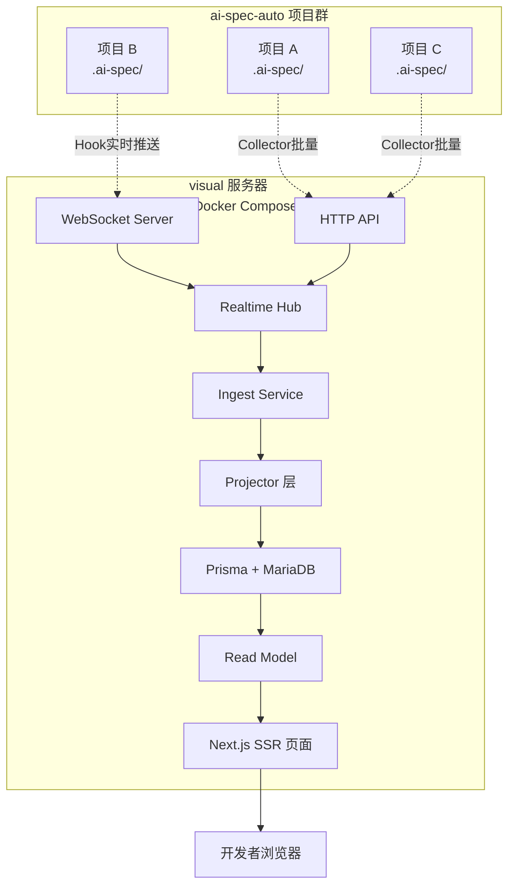

# engineered-spec-visual 需求补充说明

> 文档定位：作为 `需求说明文档.md` 的补充，完整说明 engineered-spec-visual 可视化监控平台的定位、架构、切面式集成方案和快速部署指南。

## 1. 概述与定位

### 1.1 engineered-spec-visual 是什么

`engineered-spec-visual` 是 `ai-spec-auto` 的可选增强组件，为 AI 规范驱动开发提供实时运行监控和可视化控制台能力。

补充一个关键边界：

- registry（注册表）主数据由 `skill-q-platform（Hub 平台）` 维护
- `br-ai-spec` 负责把 Hub 导出的 registry / manifest 同步到项目本地
- `engineered-spec-visual` 只消费“已同步 / 已上报”的 registry 结果

也就是说，visual 负责展示，不负责定义规则与专家。

它是一个基于 **Next.js 16 + Prisma + MariaDB + WebSocket** 的实时监控平台，用于：

- 实时追踪项目中每个 run 的执行阶段、专家流转和门禁状态
- 可视化展示变更从提案到归档的完整链路
- 提供工作区拓扑分析和历史数据回溯能力
- 为团队协作和远程审批提供统一控制面

**技术仓库位置**：`/Users/lizhenwei/workspace/vueworkspace/bairong/engineered-spec-visual`

### 1.2 为什么需要可视化监控平台

当前 `ai-spec-auto` 的运行状态主要保存在本地 `.ai-spec/` 目录中，存在以下问题：

- **可观测性不足**：开发者需要手动查看 JSON 文件才能了解当前运行状态
- **团队协作困难**：多人协作时无法实时了解其他成员的运行进度
- **历史追溯成本高**：归档后的历史 run 难以快速查询和对比
- **问题排查效率低**：当流程卡住或出错时，缺少可视化的诊断工具

`engineered-spec-visual` 通过提供 Web 控制台，让运行态"从文件中走出来"，变得可见、可查、可追溯。

### 1.3 与 ai-spec-auto 的关系定位

**核心定位**：**100% 可选的增强组件，完全解耦，零依赖**

| 维度 | 说明 |
| --- | --- |
| **依赖关系** | visual 依赖 auto 的运行数据，但 auto 不依赖 visual |
| **运行关系** | visual 服务停止时，auto 自动降级，不影响协议推进 |
| **部署关系** | visual 独立部署（Docker Compose），auto 项目无需安装任何 visual 依赖 |
| **数据关系** | visual 通过 Collector 批量采集 + Hook 实时推送获取数据，不修改 auto 数据结构 |
| **集成方式** | 切面式接入，通过 `internal/visual-hooks/` 在关键节点推送数据 |

**设计原则**：

1. **零侵入**：auto 现有代码逻辑不变，只在 3-5 个关键节点新增 hook 调用
2. **优雅降级**：visual 不可用时，hook 调用静默失败，不抛异常、不阻断流程
3. **配置驱动**：默认不启用，显式配置 `.ai-spec/visual-config.json` 后才生效
4. **独立目录**：visual 相关代码聚合在 `internal/visual-hooks/`，便于维护或移除

### 1.4 核心价值主张

对于不同角色，visual 提供不同价值：

| 角色 | 核心价值 |
| --- | --- |
| **普通开发者** | 实时看到自己的 run 推进状态，不用手动查看 JSON 文件 |
| **技术 Leader** | 在一个控制台中查看团队所有项目的运行健康度和趋势 |
| **维护者** | 快速定位卡点和异常，回溯历史 run，对比规范变更 |
| **团队评审** | 可视化展示完整的需求到归档链路，便于评审和复盘 |

---

## 2. 技术架构

### 2.1 整体架构图



### 2.2 数据流向

**数据采集流程**：

1. **批量采集模式**（优先，用于历史数据）：
   ```
   Collector CLI 扫描 .ai-spec/ 目录
   → 解析 current-run.json / repo-map.json / .agents/
   → 生成 RawIngestEvent[]
   → HTTP POST /api/internal/ingest/raw
   → Ingest Service 存入数据库
   ```

2. **实时推送模式**（增强，用于新 run）：
   ```
   auto 协议命令执行
   → 触发 visual-hooks
   → WebSocket 推送 state change event
   → Realtime Hub 分发到订阅的浏览器
   → Ingest Service 同步存入数据库
   ```

**数据查询流程**：

```
浏览器访问 /workspaces 页面
→ Next.js SSR 调用 getWorkspacesPageVm()
→ Read Model 从数据库读取投影后的视图数据
→ 返回 ViewModel 渲染页面
```

### 2.3 核心模块说明

#### 2.3.1 Collector CLI (`src/collector/cli.ts`)

**职责**：批量扫描项目 `.ai-spec/` 目录，采集历史运行数据

**核心功能**：
- 递归扫描 `.ai-spec/` 和 `.agents/` 目录
- 解析 `current-run.json`、`repo-map.json`、角色注册表等
- 生成标准化的 `RawIngestEvent` 数据结构
- 通过 HTTP 或 WebSocket 批量上报到 visual 服务

**去重机制**：基于 `checksum`（SHA-256）和 `dedupeKey` 避免重复采集

#### 2.3.2 Ingest Service (`src/lib/ingest/ingest-service.ts`)

**职责**：接收原始事件，去重后存入数据库

**核心逻辑**：
```typescript
export async function ingestRawEvents(input: {
  repository: IngestRepository;
  rawEvents: RawIngestEventDraft[];
}) {
  // 1. 去重检查
  const newEvents = await repository.filterNewEvents(rawEvents);
  
  // 2. 批量写入
  await repository.insertRawEvents(newEvents);
  
  // 3. 触发 Projector 投影
  await runProjectors(newEvents);
  
  return { inserted: newEvents.length };
}
```

#### 2.3.3 Projector 层 (`src/lib/projectors/`)

**职责**：将原始事件投影为可查询的 Read Model

**核心 Projector**：
- `runtime-state-projector`：投影运行态快照，生成 `runs` 表
- `registry-projector`：投影 `.agents/` 注册表，生成 `roles`、`skills` 表
- `omx-projector`：投影 OMX 日志（如果启用）

**投影示例**：
```typescript
// 从 runtime-state.snapshot 事件投影出 run 记录
{
  runId: "run_abc123",
  workspaceId: "my-project",
  runStatus: "pending_gate",
  currentRole: "frontend-implementer",
  pendingGate: "before-archive",
  createdAt: "2026-04-21T10:00:00Z",
  updatedAt: "2026-04-21T10:30:00Z"
}
```

#### 2.3.4 Read Model (`src/lib/services/read-model.ts`)

**职责**：为页面提供高效的查询接口

**核心方法**：
- `getWorkspaces()`：查询所有工作区及其统计信息
- `getRuns(workspaceId)`：查询工作区的所有 run 记录
- `getRunDetail(runId)`：查询单个 run 的完整详情
- `getTopology(workspaceId)`：查询工作区拓扑关系

#### 2.3.5 Realtime Hub (`src/server/realtime-hub.ts`)

**职责**：管理 WebSocket 连接，实时分发事件

**核心功能**：
- 维护 `workspaceId -> connectionIds` 映射
- 区分连接类型（browser / collector / server）
- 广播事件到订阅的浏览器连接
- 自动清理断开的连接

---

## 3. 切面式集成方案

### 3.1 集成原则

**三个不**：

1. **不修改现有逻辑**：auto 的协议编排、专家调度、状态机逻辑保持不变
2. **不阻断执行**：visual 推送失败时，自动降级，不影响 auto 正常运行
3. **不污染依赖**：auto 项目 `package.json` 不增加任何 visual 相关依赖

**三个要**：

1. **要独立目录**：visual 相关代码聚合在 `internal/visual-hooks/`
2. **要配置驱动**：通过 `.ai-spec/visual-config.json` 控制是否启用
3. **要可追踪**：hook 调用记录到日志，推送失败有明确提示

### 3.2 Hook 机制设计

#### 3.2.1 目录结构

```text
br-ai-spec/
├── internal/
│   └── visual-hooks/              # 新增：visual hook 目录
│       ├── index.js               # Hook 注册与降级入口
│       ├── config-loader.js       # 加载 .ai-spec/visual-config.json
│       ├── push-client.js         # HTTP/WebSocket 推送客户端
│       ├── hooks/
│       │   ├── on-run-start.js    # protocol-step 启动时推送
│       │   ├── on-run-state-change.js  # 运行态变更时推送
│       │   └── on-archive-complete.js  # 归档完成时推送
│       └── README.md              # Hook 机制说明文档
```

#### 3.2.2 Hook 注册与初始化

```javascript
// internal/visual-hooks/index.js

/**
 * 初始化 visual hooks
 * @returns {VisualHooks | null} hooks 对象，如果未启用则返回 null
 */
export function initVisualHooks() {
  const config = loadVisualConfig(); // 读取 .ai-spec/visual-config.json
  
  if (!config?.enabled || !config?.visual_url) {
    return null; // visual 未启用，直接返回
  }
  
  const client = createPushClient(config);
  
  return {
    onRunStart: async (runId, workspaceId, input) => {
      try {
        await client.push({
          event: 'run.started',
          runId,
          workspaceId,
          payload: input
        });
      } catch (err) {
        // 优雅降级：只记录日志，不抛异常
        console.warn('[visual-hooks] push failed:', err.message);
      }
    },
    
    onRunStateChange: async (runState) => {
      try {
        await client.push({
          event: 'run.state_changed',
          runId: runState.run_id,
          workspaceId: runState.workspace_id,
          payload: runState
        });
      } catch (err) {
        console.warn('[visual-hooks] push failed:', err.message);
      }
    },
    
    onArchiveComplete: async (archiveResult) => {
      try {
        await client.push({
          event: 'run.archived',
          runId: archiveResult.run_id,
          workspaceId: archiveResult.workspace_id,
          payload: archiveResult
        });
      } catch (err) {
        console.warn('[visual-hooks] push failed:', err.message);
      }
    }
  };
}
```

#### 3.2.3 配置加载逻辑

```javascript
// internal/visual-hooks/config-loader.js

import fs from 'node:fs';
import path from 'node:path';

/**
 * 加载 visual 配置
 * @returns {VisualConfig | null}
 */
export function loadVisualConfig() {
  const configPath = path.join(process.cwd(), '.ai-spec/visual-config.json');
  
  if (!fs.existsSync(configPath)) {
    return null; // 配置文件不存在
  }
  
  try {
    const content = fs.readFileSync(configPath, 'utf-8');
    const config = JSON.parse(content);
    
    // 校验必填字段
    if (!config.visual_url || !config.workspace_id) {
      console.warn('[visual-hooks] config invalid: missing required fields');
      return null;
    }
    
    return config;
  } catch (err) {
    console.warn('[visual-hooks] config load failed:', err.message);
    return null;
  }
}
```

#### 3.2.4 推送客户端实现

```javascript
// internal/visual-hooks/push-client.js

import https from 'node:https';
import http from 'node:http';

/**
 * 创建推送客户端
 * @param {VisualConfig} config
 */
export function createPushClient(config) {
  const { visual_url, workspace_id, push_timeout_ms = 3000 } = config;
  
  return {
    async push(event) {
      const url = new URL('/api/internal/ingest/raw', visual_url);
      const protocol = url.protocol === 'https:' ? https : http;
      
      return new Promise((resolve, reject) => {
        const timeout = setTimeout(() => {
          req.destroy();
          reject(new Error('push timeout'));
        }, push_timeout_ms);
        
        const req = protocol.request(url, {
          method: 'POST',
          headers: {
            'Content-Type': 'application/json',
            'X-Workspace-ID': workspace_id
          }
        }, (res) => {
          clearTimeout(timeout);
          if (res.statusCode >= 200 && res.statusCode < 300) {
            resolve();
          } else {
            reject(new Error(`push failed: ${res.statusCode}`));
          }
        });
        
        req.on('error', (err) => {
          clearTimeout(timeout);
          reject(err);
        });
        
        req.write(JSON.stringify({
          sourceKind: 'hook-push',
          workspaceId: workspace_id,
          rawEvents: [event]
        }));
        req.end();
      });
    }
  };
}
```

### 3.3 集成点位置

#### 3.3.1 protocol-step 入口（run 启动时）

```javascript
// bin/cli.js (现有文件，微调)

import { initVisualHooks } from '../internal/visual-hooks/index.js';

// 在 protocol-step 命令入口初始化 hooks
const visualHooks = initVisualHooks();

async function protocolStep(input) {
  // 现有逻辑：生成 runId，创建 current-run.json 等
  const runId = generateRunId();
  const workspaceId = detectWorkspaceId();
  
  // 新增：触发 onRunStart hook
  await visualHooks?.onRunStart?.(runId, workspaceId, input);
  
  // 现有逻辑：继续协议推进
  // ...
}
```

#### 3.3.2 expert-executor（状态变更时）

```javascript
// internal/runner/expert-executor.js (现有文件，微调)

import { initVisualHooks } from '../visual-hooks/index.js';

const visualHooks = initVisualHooks();

async function executeExpert(expertName, input) {
  // 现有逻辑：执行专家
  const result = await runExpert(expertName, input);
  
  // 现有逻辑：更新运行态
  const newRunState = updateCurrentRunState(result);
  
  // 新增：触发 onRunStateChange hook
  await visualHooks?.onRunStateChange?.(newRunState);
  
  return result;
}
```

#### 3.3.3 archive-change（归档完成时）

```javascript
// internal/runtime/archive-change.js (现有文件，微调)

import { initVisualHooks } from '../visual-hooks/index.js';

const visualHooks = initVisualHooks();

async function archiveChange(archiveInput) {
  // 现有逻辑：合并增量规范，写归档目录
  const archiveResult = await performArchive(archiveInput);
  
  // 新增：触发 onArchiveComplete hook
  await visualHooks?.onArchiveComplete?.(archiveResult);
  
  return archiveResult;
}
```

### 3.4 降级机制设计

**降级触发条件**：

1. 配置文件不存在或 `enabled: false`
2. `visual_url` 无效或无法访问
3. 推送超时（默认 3 秒）
4. 推送失败（网络错误、服务端错误）

**降级行为**：

- `initVisualHooks()` 返回 `null`
- hook 调用 `visualHooks?.method?.()` 直接跳过
- 只在日志中记录警告，不抛异常
- auto 协议推进完全不受影响

**日志示例**：

```text
[visual-hooks] config not found, visual disabled
[visual-hooks] push failed: ECONNREFUSED
[visual-hooks] push timeout after 3000ms
```

---

## 4. Docker Compose 一键部署方案

### 4.1 docker-compose.yml 配置

```yaml
version: '3.8'

services:
  visual:
    build:
      context: .
      dockerfile: Dockerfile
    container_name: engineered-spec-visual
    ports:
      - "${PORT:-3000}:3000"
    environment:
      - NODE_ENV=production
      - DATABASE_URL=mysql://root:${DB_PASSWORD}@db:3306/${DB_NAME}
      - NEXTAUTH_SECRET=${NEXTAUTH_SECRET}
      - NEXTAUTH_URL=${NEXTAUTH_URL:-http://localhost:3000}
    depends_on:
      db:
        condition: service_healthy
    restart: unless-stopped
    networks:
      - visual-network

  db:
    image: mariadb:11
    container_name: engineered-spec-visual-db
    environment:
      - MYSQL_ROOT_PASSWORD=${DB_PASSWORD}
      - MYSQL_DATABASE=${DB_NAME:-visual}
      - MYSQL_CHARACTER_SET_SERVER=utf8mb4
      - MYSQL_COLLATION_SERVER=utf8mb4_unicode_ci
    volumes:
      - db_data:/var/lib/mysql
    ports:
      - "3306:3306"
    healthcheck:
      test: ["CMD", "healthcheck.sh", "--connect", "--innodb_initialized"]
      interval: 10s
      timeout: 5s
      retries: 5
    restart: unless-stopped
    networks:
      - visual-network

volumes:
  db_data:
    driver: local

networks:
  visual-network:
    driver: bridge
```

### 4.2 环境变量配置（.env.example）

```env
# 服务端口
PORT=3000

# 数据库配置
DB_PASSWORD=your_secure_password_here
DB_NAME=visual

# NextAuth 配置
NEXTAUTH_SECRET=your_random_secret_here_at_least_32_chars
NEXTAUTH_URL=http://your-server-ip:3000

# 可选：日志级别
LOG_LEVEL=info
```

### 4.3 服务启动与验证

**一键启动**：

```bash
# 1. 克隆仓库
git clone https://github.com/gong-chick/engineered-spec-visual.git
cd engineered-spec-visual

# 2. 配置环境变量
cp .env.example .env
# 编辑 .env，设置 DB_PASSWORD、NEXTAUTH_SECRET、NEXTAUTH_URL

# 3. 启动服务
docker-compose up -d

# 4. 查看日志
docker-compose logs -f visual

# 5. 等待服务启动（约 30 秒）
# 看到 "Ready on http://0.0.0.0:3000" 表示启动成功
```

**健康检查**：

```bash
# 检查服务状态
docker-compose ps

# 健康检查接口
curl http://localhost:3000/api/health
# 预期返回: {"status":"ok"}

# 检查数据库连接
docker-compose exec visual npx prisma db execute --sql "SELECT 1"
```

### 4.4 健康检查脚本

```bash
#!/bin/bash
# scripts/health-check.sh

set -e

VISUAL_URL=${1:-http://localhost:3000}

echo "==> Checking visual service health..."

# 1. 检查 HTTP 接口
HTTP_STATUS=$(curl -s -o /dev/null -w "%{http_code}" "${VISUAL_URL}/api/health")
if [ "$HTTP_STATUS" -ne 200 ]; then
  echo "❌ HTTP health check failed: ${HTTP_STATUS}"
  exit 1
fi
echo "✅ HTTP health check passed"

# 2. 检查数据库连接
if ! docker-compose exec -T visual npx prisma db execute --sql "SELECT 1" &>/dev/null; then
  echo "❌ Database connection failed"
  exit 1
fi
echo "✅ Database connection passed"

# 3. 检查 WebSocket 端口
if ! nc -z localhost 3000; then
  echo "❌ WebSocket port not accessible"
  exit 1
fi
echo "✅ WebSocket port accessible"

echo ""
echo "🎉 All health checks passed!"
echo "   Visual console: ${VISUAL_URL}"
```

---

## 5. Collector 批量采集方案

### 5.1 Collector CLI 功能说明

`engineered-spec-visual-collector` 是一个命令行工具，用于批量扫描项目 `.ai-spec/` 目录并上报到 visual 服务。

**核心功能**：

- 递归扫描 `.ai-spec/` 和 `.agents/` 目录
- 解析 JSON 文件和注册表
- 生成标准化的 `RawIngestEvent` 数据结构
- 通过 HTTP 批量上报到 visual 服务
- 支持增量采集（基于 checksum 去重）

### 5.2 扫描逻辑

**扫描范围**：

```text
project-root/
├── .ai-spec/
│   ├── current-run.json         # 当前运行态
│   ├── repo-map.json            # 仓库地图
│   ├── history/                 # 历史 run 记录
│   │   └── run_xxx/
│   │       ├── runtime-state.json
│   │       └── iterations.md
│   └── superpowers.json         # superpowers 配置
└── .agents/
    ├── registry/
    │   ├── roles.json           # 角色注册表
    │   └── skills.json          # 技能注册表
    └── workflows/
        └── *.json               # 流程定义
```

**解析器**：

- `runtime-state-source.ts`：解析 `current-run.json` 生成运行态快照
- `registry-source.ts`：解析 `.agents/` 注册表生成角色和技能记录
- `omx-source.ts`：解析 `.omx/logs/*.jsonl` 日志（可选）

### 5.3 增量去重（基于 checksum）

**去重机制**：

每个采集的事件都会计算 `checksum`（SHA-256）和 `dedupeKey`：

```typescript
const checksum = hashValue(record); // SHA-256 of JSON content
const dedupeKey = hashText([
  'run-state-json',
  sourcePath,
  eventKey,
  checksum
].join('|'));
```

**去重流程**：

```
Collector 生成 RawIngestEvent
→ 提交到 Ingest Service
→ 检查 dedupeKey 是否已存在
→ 已存在：跳过
→ 不存在：插入数据库并触发投影
```

这样即使多次执行 Collector，也不会重复采集相同的数据。

### 5.4 上报协议

**HTTP 批量上报**：

```bash
POST /api/internal/ingest/raw
Content-Type: application/json
X-Workspace-ID: my-project

{
  "sourceKind": "baseline-batch",
  "workspaceId": "my-project",
  "projectRoot": "/path/to/project",
  "rawEvents": [
    {
      "sourceKind": "run-state-json",
      "sourcePath": ".ai-spec/current-run.json",
      "eventType": "runtime-state.snapshot",
      "eventKey": "run_abc:2026-04-21T10:00:00Z:checksum",
      "dedupeKey": "hash_value",
      "checksum": "sha256_hash",
      "occurredAt": "2026-04-21T10:00:00Z",
      "entityType": "run-state",
      "entityId": "run_abc",
      "payload": { /* current-run.json 内容 */ }
    }
    // ... 更多事件
  ]
}
```

### 5.5 使用示例

**基础用法**：

```bash
# 在项目根目录执行
npx engineered-spec-visual-collector \
  --workspace-id my-project \
  --project . \
  --server http://visual-server:3000
```

**高级选项**：

```bash
# 指定采集器 agent ID
npx engineered-spec-visual-collector \
  --workspace-id my-project \
  --project /path/to/project \
  --server http://visual-server:3000 \
  --agent-id collector-dev-machine \
  --capability baseline:scan \
  --capability publish:events

# 只输出 JSON，不上报
npx engineered-spec-visual-collector \
  --workspace-id my-project \
  --project . \
  --json > baseline.json
```

**输出示例**：

```json
{
  "workspace_id": "my-project",
  "agent_id": "collector-hostname",
  "run_id": "run_xyz789",
  "baseline": {
    "project_root": "/path/to/project",
    "runs_found": 5,
    "roles_found": 10,
    "skills_found": 25
  },
  "raw_event_count": 42,
  "ingest": {
    "inserted": 42,
    "skipped": 0
  }
}
```

---

## 6. 配置文件规范

### 6.1 `.ai-spec/visual-config.json` 结构定义

```json
{
  "$schema": "https://schemas.br-ai-spec.internal/visual-config.schema.json",
  "enabled": false,
  "visual_url": "http://localhost:3000",
  "workspace_id": "project-name",
  "workspace_name": "项目显示名称",
  "push_mode": "hook",
  "push_timeout_ms": 3000,
  "retry_times": 1,
  "collector_schedule": null
}
```

### 6.2 字段说明

| 字段 | 类型 | 必填 | 默认值 | 说明 |
| --- | --- | --- | --- | --- |
| `enabled` | boolean | 是 | false | 是否启用 visual 推送 |
| `visual_url` | string | 是 | - | visual 服务地址（含协议和端口） |
| `workspace_id` | string | 是 | - | 工作区唯一标识（建议用项目名） |
| `workspace_name` | string | 否 | `workspace_id` | 工作区显示名称 |
| `push_mode` | string | 否 | "hook" | 推送模式：`hook`（实时推送） 或 `collector`（仅 Collector） |
| `push_timeout_ms` | number | 否 | 3000 | 推送超时时间（毫秒） |
| `retry_times` | number | 否 | 1 | 推送失败重试次数 |
| `collector_schedule` | string | 否 | null | Collector 定时任务（cron 表达式），null 表示手动执行 |

### 6.3 配置示例

**最小配置（仅启用 Hook 推送）**：

```json
{
  "enabled": true,
  "visual_url": "http://10.0.1.100:3000",
  "workspace_id": "my-frontend-project"
}
```

**完整配置（Hook + 定时 Collector）**：

```json
{
  "enabled": true,
  "visual_url": "http://visual.internal.company.com",
  "workspace_id": "biz-platform-web",
  "workspace_name": "业务平台前端项目",
  "push_mode": "hook",
  "push_timeout_ms": 5000,
  "retry_times": 2,
  "collector_schedule": "0 */6 * * *"
}
```

**仅 Collector 模式（不启用实时推送）**：

```json
{
  "enabled": true,
  "visual_url": "http://visual.internal",
  "workspace_id": "legacy-project",
  "push_mode": "collector"
}
```

### 6.4 加载逻辑

配置文件加载优先级：

1. `.ai-spec/visual-config.json`（项目级配置，优先）
2. `~/.ai-spec/visual-config.json`（用户级配置）
3. 环境变量覆盖：
   - `AI_SPEC_VISUAL_ENABLED`
   - `AI_SPEC_VISUAL_URL`
   - `AI_SPEC_VISUAL_WORKSPACE_ID`

---

## 7. 验收标准

### 7.1 功能验收

#### 7.1.1 内网部署成功

**验收标准**：

- [ ] 在内网服务器执行 `docker-compose up -d` 成功启动
- [ ] 访问 `http://server-ip:3000/api/health` 返回 `{"status":"ok"}`
- [ ] 访问 `http://server-ip:3000/workspaces` 能正常打开控制台页面
- [ ] 数据库连接正常，能执行 `SELECT 1` 查询

**验证命令**：

```bash
docker-compose ps | grep "Up"
curl http://localhost:3000/api/health
docker-compose exec visual npx prisma db execute --sql "SELECT 1"
```

#### 7.1.2 Collector 批量采集成功

**验收标准**：

- [ ] 在目标项目执行 Collector 命令，无报错
- [ ] Collector 输出显示采集到的 run 数量 > 0
- [ ] visual 控制台能看到对应的工作区和 run 记录
- [ ] 再次执行 Collector，`skipped` 数量等于 `raw_event_count`（去重生效）

**验证命令**：

```bash
npx engineered-spec-visual-collector \
  --workspace-id test-project \
  --project /path/to/test-project \
  --server http://localhost:3000 \
  --json
```

#### 7.1.3 实时推送生效

**验收标准**：

- [ ] 目标项目配置 `visual-config.json` 并设置 `enabled: true`
- [ ] 执行 `/spec-start` 启动新 run
- [ ] visual 控制台在 5 秒内显示新 run 记录
- [ ] run 推进过程中，控制台实时更新当前角色和阶段
- [ ] 归档完成后，控制台显示归档完成状态

**验证步骤**：

```bash
# 1. 配置 visual
echo '{
  "enabled": true,
  "visual_url": "http://localhost:3000",
  "workspace_id": "test-project"
}' > .ai-spec/visual-config.json

# 2. 启动新 run
/spec-start

# 3. 在浏览器打开 http://localhost:3000/runs
# 观察是否实时出现新 run
```

#### 7.1.4 降级机制验证

**验收标准**：

- [ ] 停止 visual 服务
- [ ] 执行 `/spec-start`，auto 正常运行
- [ ] 日志中有 `[visual-hooks] push failed` 警告
- [ ] 协议推进不受影响，能正常完成归档

**验证步骤**：

```bash
# 1. 停止 visual 服务
docker-compose stop visual

# 2. 执行协议命令
/spec-start

# 3. 检查日志
tail -f ~/.ai-spec/logs/protocol.log | grep visual-hooks

# 4. 验证协议推进正常
/spec-status
```

### 7.2 性能验收

#### 7.2.1 WebSocket 推送延迟

**验收标准**：

- 从 hook 触发到浏览器收到事件，延迟 < 1 秒（90 分位）
- 并发 10 个项目实时推送，延迟 < 3 秒（90 分位）

**验证方法**：

在 hook 推送时记录时间戳，在浏览器接收时对比：

```javascript
// 浏览器端
socket.on('run.state_changed', (event) => {
  const latency = Date.now() - new Date(event.occurredAt).getTime();
  console.log('Push latency:', latency, 'ms');
});
```

#### 7.2.2 页面加载时间

**验收标准**：

- 首页（/workspaces）加载时间 < 3 秒
- 单个 run 详情页加载时间 < 2 秒
- Topology 页面加载时间 < 5 秒

**验证方法**：

使用浏览器开发者工具 Network 面板，查看 DOMContentLoaded 时间。

#### 7.2.3 并发能力

**验收标准**：

- 支持至少 20 个工作区同时接入
- 支持至少 100 个并发 run 实时推送
- 数据库查询响应时间 < 500ms（95 分位）

### 7.3 真实项目数据验收

**验收标准**：

- [ ] 在至少 2 个内部真实项目中完成接入
- [ ] Collector 采集到的历史 run 数量 > 10
- [ ] 实时推送至少覆盖 1 个完整的需求到归档链路
- [ ] 控制台能正确展示：
  - 工作区概览（项目名称、run 数量、最近更新时间）
  - run 详情（runId、状态、当前角色、门禁、时间线）
  - 拓扑关系（工作区 -> run -> 专家流转）
  - 归档历史（proposal、design、tasks、checklist、iterations）

**验证项目建议**：

- 项目 A：业务前端项目，已有 15+ 历史 run
- 项目 B：平台前端项目，启用实时推送验证新 run

---

## 8. 快速部署指南

### 8.1 部署前提条件

**硬件要求**：

- CPU: 2 核及以上
- 内存: 4GB 及以上
- 磁盘: 20GB 及以上（建议 SSD）

**软件要求**：

- Docker 20.10+
- Docker Compose 2.0+
- Git
- 网络：内网可访问，端口 3000 可开放

**前置准备**：

- 已有至少 1 个接入 ai-spec-auto 的项目
- 获取 visual 仓库访问权限

### 8.2 一键部署步骤（5 步）

#### 步骤 1：克隆仓库并配置环境

```bash
# 1.1 克隆仓库
git clone https://github.com/gong-chick/engineered-spec-visual.git
cd engineered-spec-visual

# 1.2 复制环境变量模板
cp .env.example .env

# 1.3 编辑 .env 文件
vim .env
# 设置以下变量：
# DB_PASSWORD=your_secure_password_here
# NEXTAUTH_SECRET=$(openssl rand -base64 32)
# NEXTAUTH_URL=http://your-server-ip:3000
```

#### 步骤 2：启动服务

```bash
# 2.1 启动服务（后台运行）
docker-compose up -d

# 2.2 查看启动日志
docker-compose logs -f visual

# 2.3 等待服务启动（约 30-60 秒）
# 看到 "Ready on http://0.0.0.0:3000" 表示成功
```

#### 步骤 3：验证服务状态

```bash
# 3.1 检查容器状态
docker-compose ps
# 预期：visual 和 db 都是 "Up" 状态

# 3.2 健康检查
curl http://localhost:3000/api/health
# 预期返回：{"status":"ok"}

# 3.3 执行健康检查脚本
bash scripts/health-check.sh http://localhost:3000
```

#### 步骤 4：配置目标项目

```bash
# 4.1 进入目标项目目录
cd /path/to/your/project

# 4.2 创建 visual 配置文件
cat > .ai-spec/visual-config.json <<EOF
{
  "enabled": true,
  "visual_url": "http://your-server-ip:3000",
  "workspace_id": "your-project-name",
  "workspace_name": "XX业务前端项目"
}
EOF

# 4.3 提交配置文件（可选）
git add .ai-spec/visual-config.json
git commit -m "feat: 接入 visual 监控"
```

#### 步骤 5：批量采集历史数据

```bash
# 5.1 执行 Collector 命令
npx engineered-spec-visual-collector \
  --workspace-id your-project-name \
  --project . \
  --server http://your-server-ip:3000

# 5.2 查看采集结果
# 预期输出：
# {
#   "workspace_id": "your-project-name",
#   "baseline": { "runs_found": 15, ... },
#   "raw_event_count": 120,
#   "ingest": { "inserted": 120, "skipped": 0 }
# }

# 5.3 在浏览器访问控制台
# http://your-server-ip:3000/workspaces
# 应该能看到工作区和历史 run 记录
```

### 8.3 验证清单（5 项）

完成部署后，请逐项验证：

- [ ] **服务健康**：`curl http://server-ip:3000/api/health` 返回 OK
- [ ] **控制台访问**：浏览器打开 `http://server-ip:3000/workspaces` 正常显示
- [ ] **历史数据**：控制台能看到工作区和历史 run 记录
- [ ] **实时推送**：执行 `/spec-start` 后，控制台实时显示新 run
- [ ] **降级验证**：停止 visual 服务，auto 正常运行

### 8.4 故障排查（4 类常见问题）

#### 问题 1：Collector 推送失败

**症状**：

```
Error: connect ECONNREFUSED 10.0.1.100:3000
```

**排查步骤**：

```bash
# 1. 检查 visual 服务是否启动
docker-compose ps

# 2. 检查防火墙是否开放端口 3000
sudo firewall-cmd --list-ports

# 3. 检查 visual_url 是否正确
cat .ai-spec/visual-config.json | grep visual_url

# 4. 尝试从目标机器访问 visual
curl http://10.0.1.100:3000/api/health
```

**解决方案**：

- 启动 visual 服务：`docker-compose up -d`
- 开放端口：`sudo firewall-cmd --add-port=3000/tcp --permanent`
- 修正 `visual_url` 配置

#### 问题 2：实时推送不生效

**症状**：

执行 `/spec-start` 后，控制台没有实时显示新 run

**排查步骤**：

```bash
# 1. 检查配置文件
cat .ai-spec/visual-config.json
# 确认 enabled: true

# 2. 检查日志
tail -f ~/.ai-spec/logs/protocol.log | grep visual-hooks

# 3. 检查 WebSocket 连接
# 在浏览器开发者工具 Network 面板查看 WS 连接状态
```

**解决方案**：

- 确保 `enabled: true`
- 检查 `visual_url` 可访问
- 重启 auto 项目（重新加载配置）

#### 问题 3：WebSocket 连接失败

**症状**：

浏览器控制台报错：`WebSocket connection failed`

**排查步骤**：

```bash
# 1. 检查 WebSocket 端口
nc -zv localhost 3000

# 2. 检查 Nginx 反向代理配置（如果有）
cat /etc/nginx/conf.d/visual.conf
```

**解决方案**：

如果使用 Nginx 反向代理，需要配置 WebSocket 支持：

```nginx
location / {
  proxy_pass http://localhost:3000;
  proxy_http_version 1.1;
  proxy_set_header Upgrade $http_upgrade;
  proxy_set_header Connection "upgrade";
}
```

#### 问题 4：数据库连接失败

**症状**：

```
Error: P1001: Can't reach database server at `db:3306`
```

**排查步骤**：

```bash
# 1. 检查数据库容器状态
docker-compose ps db

# 2. 检查数据库日志
docker-compose logs db

# 3. 手动连接数据库
docker-compose exec db mysql -uroot -p
```

**解决方案**：

- 等待数据库初始化完成（首次启动需要 30 秒）
- 检查 `.env` 中 `DB_PASSWORD` 是否正确
- 重启数据库：`docker-compose restart db`

---

## 9. 后续演进规划

### 9.1 短期（1-2 个月）

**目标**：完成内网部署和真实项目试点

**关键里程碑**：

- ✅ Docker Compose 一键部署方案落地
- ✅ Collector CLI 批量采集能力完善
- ✅ Hook 机制在 auto 项目中集成完成
- ✅ 在至少 2 个内部项目中完成接入和验证
- ✅ 部署文档和故障排查文档完善

**验收标准**：

- 能在 30 分钟内完成内网服务器部署
- 能在 10 分钟内完成目标项目接入
- 真实项目数据面板正常显示
- 降级机制验证通过

### 9.2 中期（3-6 个月）

**目标**：成为 OpenClaw 远程入口的统一控制面

**关键功能**：

- **多工作区权限控制**：支持团队成员管理、角色权限、数据隔离
- **远程审批能力**：在 visual 控制台中直接审批门禁（before-implementation / before-archive）
- **OpenClaw 对接**：接入 OpenClaw 远程入口，支持跨项目编排
- **更多视图**：
  - 归档历史对比
  - 规范演进趋势
  - 专家性能分析
  - 门禁通过率统计

### 9.3 中长期（6-12 个月）

**目标**：团队效能分析和资产复用追踪

**关键功能**：

- **跨项目拓扑分析**：展示规则、技能、流程在多个项目中的复用情况
- **资产复用追踪**：追踪 Hub 资产包在不同项目中的使用情况
- **团队效能看板**：
  - 平均 run 完成时间
  - 门禁阻断率和原因分布
  - 专家执行成功率
  - 归档覆盖率
- **告警和通知**：
  - run 执行超时告警
  - 门禁长时间未审批提醒
  - 系统异常通知（钉钉/企业微信）

---

## 10. 附录

### 10.1 术语表

| 术语 | 全称 | 说明 |
| --- | --- | --- |
| visual | engineered-spec-visual | 可视化监控平台 |
| auto | ai-spec-auto | AI 规范驱动开发底座 |
| Collector | Collector CLI | 批量数据采集工具 |
| Hook | Visual Hooks | 切面式数据推送机制 |
| Ingest | Ingest Service | 数据摄入服务 |
| Projector | Event Projector | 事件投影器 |
| Read Model | Read Model | 查询模型 |
| Realtime Hub | Realtime Hub | 实时事件分发中心 |

### 10.2 相关文档

- [需求说明文档（主文档）](./需求说明文档.md)
- [快速部署指南（visual 仓库）](../../engineered-spec-visual/docs/快速部署指南.md)
- [Hook 机制开发文档（auto 仓库）](../../internal/visual-hooks/README.md)
- [架构设计与治理说明](../four/架构设计与治理说明.md)

### 10.3 配置文件模板

**`.ai-spec/visual-config.json` 模板**：

```json
{
  "enabled": true,
  "visual_url": "http://visual.internal.company.com",
  "workspace_id": "your-project-name",
  "workspace_name": "项目显示名称",
  "push_mode": "hook",
  "push_timeout_ms": 3000,
  "retry_times": 1
}
```

**`docker-compose.yml` 模板**：

见第 4 章。

**`.env` 模板**：

见第 4.2 节。

---

## 结语

本文档作为 `需求说明文档.md` 的补充，完整说明了 engineered-spec-visual 的定位、架构和集成方案。

**核心要点**：

1. **visual 是 100% 可选组件**，auto 可以独立运行
2. **切面式接入**，通过 Hook 机制推送数据，不修改 auto 核心逻辑
3. **Docker Compose 一键部署**，30 分钟内完成内网部署
4. **Collector 批量采集优先**，能快速看到历史数据
5. **优雅降级机制**，visual 不可用时不影响 auto 正常运行

如有疑问或需要技术支持，请联系：

- 技术负责人：lizhenwei
- 项目仓库：
  - auto: `/Users/lizhenwei/workspace/vueworkspace/bairong/br-ai-spec`
  - visual: `/Users/lizhenwei/workspace/vueworkspace/bairong/engineered-spec-visual`
