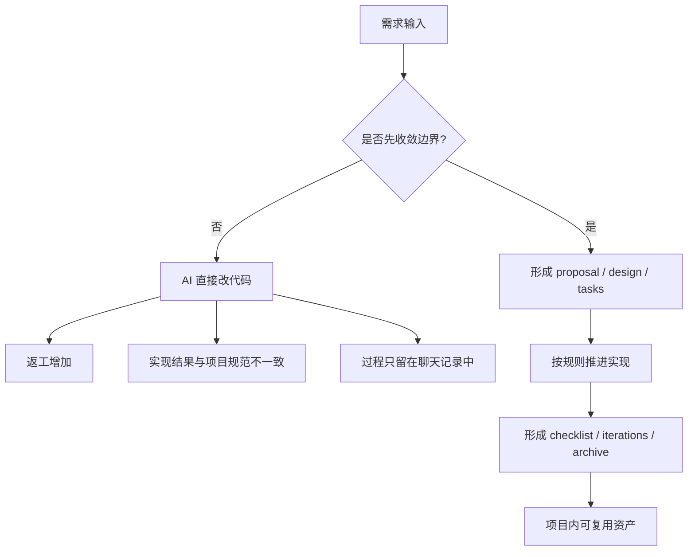
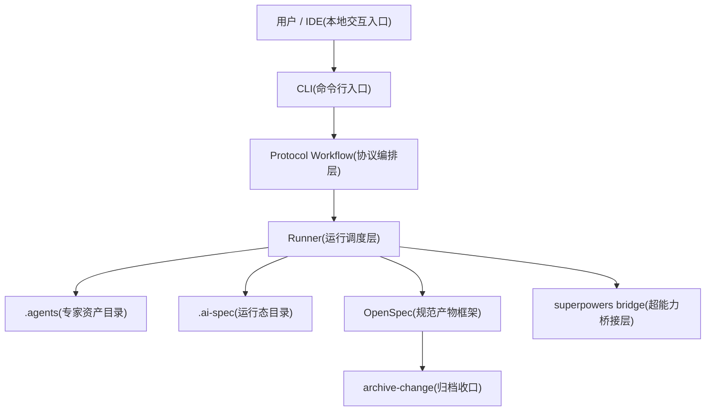
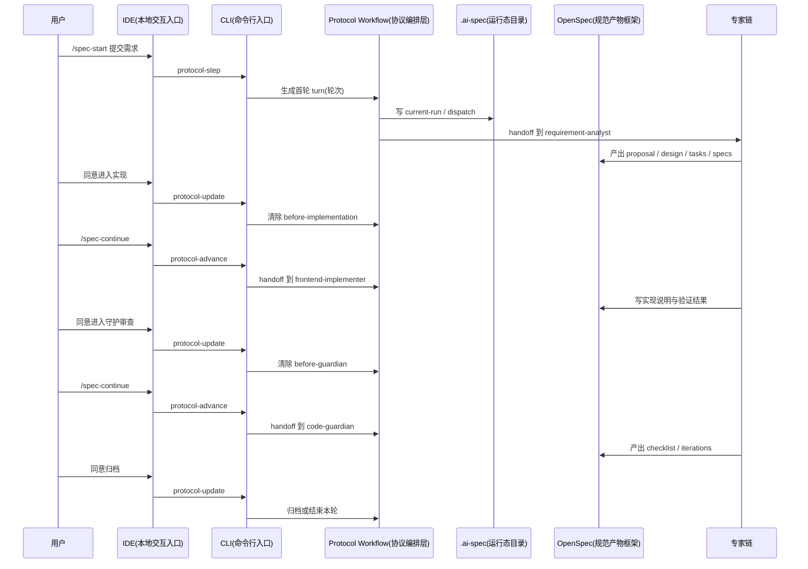
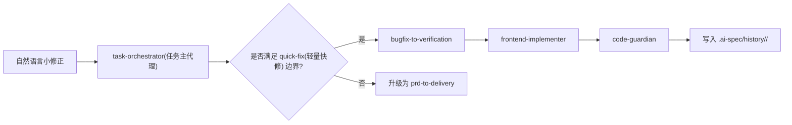

# 需求说明文档

> 文档定位：用于从产品、工程和治理三个视角，统一说明 `ai-spec-auto` 当前阶段到底要解决什么问题、交付什么能力、如何判断它是否真正可用。

## 1. 一句话定义

`ai-spec-auto` 不是“让 AI(人工智能) 多写一点代码”的工具包，而是一套把需求收敛、实现推进、规范检查、归档留痕和复盘沉淀组织进项目工程体系的本地交付底座。

如果只保留一句对外口径，建议统一成下面这句：

> 它不是单个 AI 工具的替代品，而是一套把需求、实现、检查、归档和复盘串成团队开发链路的项目级交付底座。

---

## 2. 项目背景与问题定义

当前团队在 AI Coding(AI 编程) 场景下面临的主要矛盾，不是“模型不会写代码”，而是“模型会写，但团队没法稳定接住”。

具体表现为：

- 需求还没收敛，AI 已经开始改代码，返工成本高。
- 页面虽然能跑，但目录、路由、接口、状态、样式、测试等实现方式和团队约定不一致。
- 同样的任务换一个开发者、换一个会话、换一个项目，就需要重新解释一遍背景和规范。
- 需求、设计、任务、验收和归档只存在于聊天记录中，无法沉淀为项目资产。
- 团队虽然引入了多个 AI 入口，但很难看清谁负责安装、谁负责触发、谁负责审批、谁负责归档。

可以把当前问题抽象成下面这张图：

本项目存在的意义，就是把右侧这条链真正做成团队可复用、可维护、可治理的默认工作方式。

---

## 3. 当前阶段的产品目标

当前阶段不追求把所有 AI 编码场景一次性覆盖，而是优先把“前端项目中的真实增量需求交付”跑稳。

当前目标分成 5 类：

### 3.1 入口目标

- 让普通开发者只通过少量稳定入口完成第一次真实需求交付。
- 让维护者和评审看到完整机制，但不把复杂度前置给所有用户。
- 让本地 `IDE(开发工具)`、`CLI(命令行入口)`、`Hub(资产组合平台)`、`OpenClaw(远程入口)` 的分工边界清晰。

### 3.2 交付目标

- 让一次需求从输入到归档形成结构化产物，而不是停留在对话里。
- 让完整需求和低风险小修正分别走与风险匹配的路径。
- 让实现结果可以被检查、回退、补丁修正和归档收口。

### 3.3 治理目标

- 让规则、技能、角色、流程模板变成项目资产，而不是个人提示词经验。
- 让运行状态、交付产物和资产定义三层边界清晰。
- 让维护者在出问题时能依赖文件事实定位问题，而不是依赖记忆或猜测。

### 3.4 扩展目标

- 为 `manifest(安装清单)`、`Hub` 资产管理、`OpenClaw` 远程入口、`CI/CD(持续集成与持续交付)` 校验预留统一接口。
- 让 `Cursor(Cursor 编辑器)`、`Claude Code(Claude 代码代理)`、`Codex(Codex 代码代理)` 等本地入口共享同一套协议底座。
- 支持 `superpowers(超能力桥接)` 作为方法论增强层接入，而不改写当前协议主链。

### 3.5 成本目标

- 降低项目接入成本，不要求首次试点就理解全部底层状态机。
- 降低维护成本，不需要为不同 IDE、不同项目、不同流程重复解释使用方法。
- 降低推广成本，让项目负责人可以直接用“真实需求闭环”验证价值。

---

## 4. 产品设计原则

当前需求必须同时满足下面 6 条原则：

1. **先收敛，再实现**
   需求、设计和任务先成文，再交给实现专家。

2. **规则优先于对话**
   项目规则、目录约定和资产定义必须优先于临时聊天上下文。

3. **交付物优先于口头结论**
   不能只说“做完了”，必须形成 `proposal(提案)`、`design(设计)`、`tasks(任务)`、`checklist(检查)`、`iterations(迭代)`、`archive(归档)` 等可追溯产物。

4. **状态可观察**
   当前做到哪里、卡在哪个门禁、下一步做什么，必须能从 `.ai-spec(运行态目录)` 和协议输出中看出来。

5. **路径按风险分层**
   新功能、跨模块改动、真实接口接入走完整主链；低风险小修正走轻量支链。

6. **增强不越权**
   `superpowers(超能力桥接)`、`Hub`、`OpenClaw` 等增强层只能帮助调度、提示和管理，不能绕过主协议、门禁和交付产物。

---

## 5. 目标用户与典型关注点

### 5.1 普通开发者

最关心的是：

- 怎么安装
- 第一个需求怎么开始
- 中途卡住了怎么办
- 做完后去哪里看结果

### 5.2 项目负责人

最关心的是：

- 这套方法适不适合拿来做试点
- 选什么任务作为第一轮最合适
- 怎么判断试点到底有没有价值

### 5.3 平台维护者

最关心的是：

- 安装层、协议层、运行态层、交付产物层分别负责什么
- 出问题时先查哪一层
- 多个 IDE 入口如何共用一套底层逻辑

### 5.4 技术评审与管理者

最关心的是：

- 它比单纯的 AI 编码工具多解决了什么问题
- 团队接入成本和长期维护成本是否可控
- 是否具备推广价值和后续演进空间

### 5.5 资产运营与协同平台侧

最关心的是：

- `Hub`、`manifest`、本地安装和远程入口怎样协同
- 资产如何复用、追踪和按项目落地
- 不同项目是否真的开始形成统一治理方式

---

## 6. 当前产品范围

### 6.1 当前纳入范围

- 项目级安装入口：`init`、`update`、`sync`、`check`、`uninstall`
- 开发者高频入口：`/project-init`、`/spec-start`、`/spec-update`、`/spec-continue`、`/spec-status`
- 规则、技能、角色、流程等 `.agents(专家资产目录)` 资产
- `OpenSpec(规范产物框架)` 交付产物目录与归档目录
- `.ai-spec(运行态目录)` 当前状态、轻量历史、内部 scratch(草稿) 状态
- 双流程分层：
  - `prd-to-delivery(PRD 到交付流程)`
  - `bugfix-to-verification(缺陷修复到验证流程)`
- `before-implementation(实现前门禁)`、`before-guardian(守护前门禁)`、`before-archive(归档前门禁)` 等审批点
- `superpowers bridge(超能力桥接层)`：
  - 项目级状态文件 `.ai-spec/superpowers.json`
  - `Cursor / Claude Code / Codex` 入口增强
  - 宿主增强探测与降级策略

### 6.2 当前不纳入范围

- 把 `OpenClaw` 直接做成平台核心编排器
- 让普通开发者默认接触全部 `protocol-step / protocol-update / protocol-advance(协议命令)`
- 强制所有需求都走同一条重流程
- 把 `superpowers` 做成独立运行时或独立状态机
- 用远程入口替代本地 IDE 开发体验
- 面向所有语言和所有技术栈一次性铺开

---

## 7. 当前系统结构与层次关系

当前项目可以理解为 7 层协同：

每一层职责如下：

| 层 | 负责什么 | 不负责什么 |
| --- | --- | --- |
| 用户 / IDE | 触发需求、继续推进、查看状态 | 不直接决定流程走向 |
| CLI | 承接安装、同步、协议命令和检查 | 不直接替专家写业务代码 |
| Protocol Workflow | 选择流程、交接顺序、门禁与下一轮 turn(轮次) | 不直接产出业务实现 |
| Runner | 消费当前 scratch(草稿)、推进状态、写入运行态 | 不重新定义需求边界 |
| `.agents` | 提供规则、技能、角色和流程模板 | 不保存当前运行事实 |
| `.ai-spec` | 保存当前 run(运行轮次) 做到哪里、卡在哪个门禁 | 不承载长期规范 |
| OpenSpec | 保存 proposal / design / tasks / checklist / iterations / specs 等交付物 | 不替代状态机 |

当前加入 `superpowers bridge(超能力桥接层)` 之后，系统多了一层“方法论增强”，但它仍然服从上面的分层边界：

- 它可以影响 `skill selection(技能选择)` 和 `host-enhanced hints(宿主增强提示)`
- 不能绕过 `approval gate(审批门禁)` 和 `execution contract(执行契约)`
- 不能替代 `.ai-spec` 运行态
- 不能替代 OpenSpec 交付产物

---

## 8. 当前已落地的关键能力

### 8.1 双流程分层

- 大需求、新功能、跨模块改动默认走 `prd-to-delivery`
- 低风险小修正默认走 `bugfix-to-verification`

### 8.2 上下文路由

当前系统可以区分：

- `full-change(完整变更)`
- `patch(当前变更补丁)`
- `scope-delta(范围增量修正)`
- `archive-fix(归档前修正)`
- `followup-patch(归档后补丁)`
- `quick-fix(轻量快修)`

### 8.3 协议入口统一

开发者表层入口收敛为：

- `/spec-start`
- `/spec-update`
- `/spec-continue`
- `/spec-status`

底层统一落到：

- `protocol-step`
- `protocol-update`
- `protocol-advance`
- `protocol-status`

### 8.4 运行态轻量化

默认维护最小必要事实：

- `current-run.json`
- `repo-map.json`
- 当前 dispatch / execution / runtime-action

### 8.5 归档快速收口

在 `before-archive` 门禁下，如果用户给出明确“归档 / 不归档”决定，系统允许本地快速收口，而不是强制再走一轮重型编排。

### 8.6 自动验证与最小修补回环

实现结果可以回灌为 `verification(验证结果)`，必要时回到实现专家做最小修补，而不是把失败静默吞掉。

### 8.7 Superpowers 平台增强

当前项目已经把 `superpowers` 作为一层增强能力接入：

- 安装时可开启，当前默认交互是开启
- 生成 `.ai-spec/superpowers.json`
- 支持 `Cursor`、`Claude Code`、`Codex`
- 在 `host-enhanced(宿主增强模式)` 与 `project-minimal(项目最小增强模式)` 间自动切换
- 在协议输出中提供 `superpowers_contract(超能力契约)`
- 在三位主专家技能序列里动态前置 `using-superpowers(技能调度核心规范)`

---

## 9. 一次需求当前是如何推进的

### 9.1 开发者可见的最小动作链

普通开发者只需要理解下面这条路径：

1. 安装
2. 初始化项目规范
3. 发起需求
4. 继续推进
5. 查看产物和状态

对应入口是：

- 安装：`init`
- 初始化：`/project-init`
- 发起需求：`/spec-start`
- 中途补充：`/spec-update`
- 继续推进：`/spec-continue`
- 查看状态：`/spec-status`

### 9.2 完整需求的典型时序

### 9.3 小修正的典型时序

---

## 10. 核心需求拆解

### 10.1 需求一：提供稳定、低门槛的开发者入口

系统必须为普通开发者提供一条稳定主路径，并让第一次接触的用户在不理解底层协议细节的情况下完成真实需求闭环。

实现要求：

- 安装入口和文档入口口径一致
- 高价值命令数量保持克制
- 默认入口能解释“现在到哪了、下一步做什么”
- 普通开发者不需要先理解 `.ai-spec` 或 scratch 文件

### 10.2 需求二：支持需求到归档的完整沉淀

系统必须支持把一次需求沉淀为结构化交付物，而不是只停留在对话记录里。

至少应保证：

- 需求形成 `proposal / design / tasks / specs`
- 检查形成 `checklist / iterations`
- 归档进入长期规范目录与历史目录

### 10.3 需求三：支持增量输入与上下文复用

系统必须支持同一轮需求中多次补充、修正和回退，而不是每次都强制重新开始。

至少应支持：

- 第一次发起需求
- 中途补充要求
- 当前 change(变更) 内补丁
- 归档前修正
- 已归档后的 follow-up patch(补丁)

### 10.4 需求四：完整交付与轻量修复分层

系统必须明确区分两类需求：

- 需要长期留痕和归档的大需求
- 只需要快速修复但仍需留痕的小修正

分层后不能出现两类错误：

- 所有需求都走重流程，导致效率低
- 所有小修正都不留痕，导致不可复盘

### 10.5 需求五：维护者可定位、可排障

系统必须让维护者能快速回答下面这些问题：

- 问题在入口层、协议层、状态层、资产层还是项目接入层
- 当前 run(运行轮次) 到哪一步
- 当前产物缺什么
- 当前专家和流程定义是否匹配

### 10.6 需求六：增强层不改写主链

当前已经接入 `superpowers bridge(超能力桥接层)`，因此必须明确：

- 它可以增强技能调度与宿主提示
- 它不能跳过 `approval gate(审批门禁)`
- 它不能直接替代 `execution contract(执行契约)`
- 它不能替代 OpenSpec 产物和 `.ai-spec` 运行态

### 10.7 需求七：为后续协同平台预留统一底座

系统必须让下面这些入口未来可以共用同一套底层协议：

- 本地 `IDE`
- `CLI`
- `Hub`
- `OpenClaw`
- 后续 `CI/CD`

也就是说，后续新增入口不应再造一套平行流程。

---

## 11. 关键产物与状态要求

### 11.1 交付产物

完整主链至少应形成：

- `proposal.md`
- `design.md`
- `tasks.md`
- `specs/`
- `checklist.md`
- `iterations.md`

轻量支链至少应形成：

- `bugfix.md`
- `implementation-notes.md`
- `checklist.md`
- `iterations.md`

### 11.2 运行态事实

当前至少应能从 `.ai-spec` 看到：

- 当前 `run_id`
- 当前 `run_status`
- 当前 `current_role`
- 当前 `pending_gate`
- 当前 `delivery_profile`
- 当前 `artifact_profile`
- 当前 `superpowers_mode`

### 11.3 增强态事实

当开启 `superpowers` 时，至少应形成：

- `.ai-spec/superpowers.json`
- 对应 IDE 的增强入口资产
- `AGENTS.md` 中的 `Codex` 项目级桥接区块（当启用 `codex` 时）
- 协议输出中的 `superpowers_contract`

---

## 12. 非功能需求

### 12.1 一致性

- 同一项目中的开发者应看到相同规则、技能和命令入口
- 交付产物结构、命名和门禁口径稳定
- 同一需求在不同入口触发时，底层协议语义一致

### 12.2 可维护性

- 运行态、交付产物、资产定义三层边界清晰
- 故障定位优先依赖文件事实，不依赖聊天上下文
- 不同 IDE 的入口增强不应形成不同的主链逻辑

### 12.3 可扩展性

- 可以继续增加流程、角色和技能，而不重写底座
- 可以继续接入 Hub、OpenClaw、CI/CD 和 worktree 能力
- `superpowers` 可继续增强，但不能破坏现有协议结构

### 12.4 低门槛

- 普通开发者第一次接触时，不应被协议细节淹没
- 默认入口必须稳定、可复制、可说明
- 首次试点应优先用真实但低风险需求完成闭环

### 12.5 可观测性

- 当前阶段、阻断原因、下一步建议对开发者可见
- 关键状态对维护者可读
- 增强模式和回退原因可见，而不是静默降级

---

## 13. 验收标准

### 13.1 面向开发者的验收

- 读完主入口文档后，知道如何安装和开始第一个需求
- 知道第一次只需要用哪些命令
- 知道做完后去哪里看产物
- 遇到门禁时知道该看状态和下一步提示，而不是先翻底层状态文件

### 13.2 面向维护者的验收

- 能快速区分入口层、协议层、状态层、产物层和资产层
- 能根据当前状态快速判断问题归属
- 能解释完整主链和轻量支链的区别
- 能判断 `superpowers` 当前是关闭、`project-minimal` 还是 `host-enhanced`

### 13.3 面向团队推广的验收

- 评审能看清项目定位、能力边界和演进空间
- 团队能理解接入成本不只是安装，还包括规则和流程采用成本
- 试点项目能通过真实需求闭环证明价值，而不是只停留在介绍层面

### 13.4 面向增强层的验收

当 `superpowers` 开启时，应至少满足：

- `.ai-spec/superpowers.json` 存在且状态正确
- 协议输出 `turn.summary.superpowers_mode` 可见
- `turn.guidance.superpowers_contract.enabled = true`
- 三位主专家进入执行阶段时，`role_skill_contract.primary_skills` 首位包含 `using-superpowers`

---

## 14. 成功指标

建议持续观察下面 5 组指标：

| 层次 | 指标 | 用途 |
| --- | --- | --- |
| 接入 | `init / sync / check` 执行次数、项目数、profile、IDE、是否启用 superpowers | 判断是否真正进入项目 |
| 运行 | `/spec-start / update / continue / status` 调用次数、流程选择结果、门禁阻断点 | 判断流程是否真正跑起来 |
| 交付 | 从发起到归档的完成率、耗时、失败原因 | 判断闭环是否稳定 |
| 复用 | 规则、技能、场景包、规范产物在不同项目中的复用次数 | 判断资产是否开始沉淀 |
| 增强 | `superpowers_mode` 命中率、回退原因分布、Codex / Claude 绑定情况 | 判断增强层是否真正被使用 |

---

## 15. 后续演进方向

当前这份需求说明对应的是“先把本地主链跑稳，并让多入口共用一套底座”的阶段。

后续建议继续推进：

- 继续收敛开发者入口与文档入口
- 进一步稳定轻量修复支链
- 提升门禁说明、状态提示和失败路径的可读性
- 让 `Hub` 资产组合与当前项目接入链路更顺畅
- 补齐 `OpenClaw` 远程入口对接
- 将 `worktree(工作树)`、远程审批、CI/CD 校验逐步并入同一治理底座

---

## 16. 结论

当前项目的核心需求，不是再造一个“更会写代码”的 AI 工具，而是把团队开发过程从“依赖个体提示词能力”升级为“依赖项目内规则、流程、状态和产物的稳定交付体系”。

这份需求说明的价值，不只是列出“做哪些功能”，而是统一下面这件事：

> 我们不是在做一个单轮会话里表现更好的编码助手，而是在做一条团队可以长期使用、持续维护、逐步放大的规范驱动开发链路。
