# DB_数据库设计文档

> 版本：v1.0 | engineered-spec-visual 数据库设计

---

## 1. 数据库选型

| 维度 | 选择 | 理由 |
|------|------|------|
| 数据库 | MySQL 8.0 / MariaDB 10.6+ | 成熟稳定，JSON 字段支持好 |
| ORM | Prisma 7.7 | 类型安全，迁移工具完善 |
| 适配器 | @prisma/adapter-mariadb | 官方 MariaDB 连接池支持 |
| 字符集 | utf8mb4 | 支持 Emoji 和全量 Unicode |

---

## 2. ER 图

```mermaid
erDiagram
    User ||--o{ Session : has
    User ||--o{ WorkspaceMember : belongs_to
    Workspace ||--o{ WorkspaceMember : has
    Workspace ||--o{ WorkspaceAgent : has
    Workspace ||--o{ SyncJob : has
    Workspace ||--o{ RegistryItem : has
    Workspace ||--o{ RegistryRelation : has
    Workspace ||--o{ RunState : has
    Workspace ||--o{ RunEvent : has
    Workspace ||--o{ RunRoleExecution : has
    Workspace ||--o{ ChangeDocument : has
    Workspace ||--o{ OmxSession : has
    Workspace ||--o{ OmxTurn : has
    Workspace ||--o{ Alert : has
    Workspace ||--o{ RawIngestEvent : has

    Installation ||--o{ InstallationEvent : has
    Installation ||--o{ InstallationProject : has
```



---

## 3. 表分组与详细说明

### 3.1 用户与权限

#### User

| 字段 | 类型 | 约束 | 说明 |
|------|------|------|------|
| id | String | PK, @default(cuid()) | 用户 ID |
| email | String | @unique | 邮箱 |
| name | String | 必填 | 姓名 |
| role | UserRole | @default(viewer) | 角色：admin/maintainer/viewer |
| passwordHash | String | 必填 | bcryptjs 哈希 |
| createdAt | DateTime | @default(now()) | 创建时间 |
| updatedAt | DateTime | @updatedAt | 更新时间 |

#### Session

| 字段 | 类型 | 约束 | 说明 |
|------|------|------|------|
| id | String | PK, @default(cuid()) | 会话 ID |
| token | String | @unique, varchar(512) | 会话令牌 |
| userId | String | FK → User.id | 用户 ID |
| expiresAt | DateTime | 必填 | 过期时间 |
| createdAt | DateTime | @default(now()) | 创建时间 |
| updatedAt | DateTime | @updatedAt | 更新时间 |

#### WorkspaceMember

| 字段 | 类型 | 约束 | 说明 |
|------|------|------|------|
| id | String | PK, @default(cuid()) | 成员 ID |
| workspaceId | String | FK → Workspace.id | 工作区 ID |
| userId | String | FK → User.id | 用户 ID |
| role | UserRole | 必填 | 角色 |
| createdAt | DateTime | @default(now()) | 加入时间 |
| 唯一约束 | | (workspaceId, userId) | 防止重复加入 |

### 3.2 工作区管理

#### Workspace

| 字段 | 类型 | 约束 | 说明 |
|------|------|------|------|
| id | String | PK, @default(cuid()) | 工作区 ID |
| slug | String | @unique | URL 友好标识 |
| name | String | 必填 | 工作区名称 |
| description | String? | 可选 | 描述 |
| rootPath | String? | 可选 | 项目根路径 |
| status | String | @default("active") | 状态 |
| createdAt | DateTime | @default(now()) | 创建时间 |
| updatedAt | DateTime | @updatedAt | 更新时间 |

#### WorkspaceAgent

| 字段 | 类型 | 约束 | 说明 |
|------|------|------|------|
| id | String | PK, @default(cuid()) | Agent ID |
| workspaceId | String | FK → Workspace.id | 工作区 ID |
| agentId | String | 必填 | Agent 唯一标识 |
| label | String? | 可选 | 显示标签 |
| status | AgentStatus | @default(offline) | connected/idle/offline |
| capabilities | Json? | 可选 | 能力描述 |
| lastSeenAt | DateTime? | 可选 | 最后活跃时间 |
| createdAt | DateTime | @default(now()) | 注册时间 |
| updatedAt | DateTime | @updatedAt | 更新时间 |
| 唯一约束 | | (workspaceId, agentId) | 防止重复注册 |

#### SyncJob

| 字段 | 类型 | 约束 | 说明 |
|------|------|------|------|
| id | String | PK, @default(cuid()) | 任务 ID |
| workspaceId | String | FK → Workspace.id | 工作区 ID |
| mode | String | 必填 | 同步模式 |
| status | SyncJobStatus | @default(pending) | pending/running/success/failed |
| summary | Json? | 可选 | 同步摘要 |
| error | String? | 可选 | 错误信息 |
| startedAt | DateTime | @default(now()) | 开始时间 |
| finishedAt | DateTime? | 可选 | 完成时间 |

### 3.3 运行态追踪

#### RunState

| 字段 | 类型 | 约束 | 说明 |
|------|------|------|------|
| id | String | PK, @default(cuid()) | 状态 ID |
| workspaceId | String | FK → Workspace.id | 工作区 ID |
| runKey | String | 必填 | Run 唯一标识 |
| status | String? | 可选 | 当前状态 |
| lastEventType | String | 必填 | 最后事件类型 |
| lastOccurredAt | DateTime | 必填 | 最后事件时间 |
| turnCount | Int | @default(0) | 轮次计数 |
| payload | Json? | 可选 | 扩展数据 |
| createdAt | DateTime | @default(now()) | 创建时间 |
| updatedAt | DateTime | @updatedAt | 更新时间 |
| 唯一约束 | | (workspaceId, runKey) | 每个 runKey 唯一 |

#### RunEvent

| 字段 | 类型 | 约束 | 说明 |
|------|------|------|------|
| id | String | PK, @default(cuid()) | 事件 ID |
| workspaceId | String | FK → Workspace.id | 工作区 ID |
| runKey | String | 必填 | Run 标识 |
| eventType | String | 必填 | 事件类型 |
| occurredAt | DateTime | 必填 | 发生时间 |
| payload | Json | 必填 | 事件载荷 |
| createdAt | DateTime | @default(now()) | 入库时间 |

#### RunRoleExecution

| 字段 | 类型 | 约束 | 说明 |
|------|------|------|------|
| id | String | PK, @default(cuid()) | 执行 ID |
| workspaceId | String | FK → Workspace.id | 工作区 ID |
| runKey | String | 必填 | Run 标识 |
| roleSlug | String | 必填 | 角色标识 |
| status | String | 必填 | 执行状态 |
| startedAt | DateTime? | 可选 | 开始时间 |
| endedAt | DateTime? | 可选 | 结束时间 |
| payload | Json? | 可选 | 扩展数据 |
| createdAt | DateTime | @default(now()) | 创建时间 |
| updatedAt | DateTime | @updatedAt | 更新时间 |

#### ChangeDocument

| 字段 | 类型 | 约束 | 说明 |
|------|------|------|------|
| id | String | PK, @default(cuid()) | 文档 ID |
| workspaceId | String | FK → Workspace.id | 工作区 ID |
| changeKey | String | 必填 | Change 标识 |
| docType | String | 必填 | 文档类型 |
| title | String | 必填 | 标题 |
| sourcePath | String | 必填 | 源文件路径 |
| contentHash | String | 必填 | 内容哈希 |
| status | String | 必填 | 状态 |
| archivedAt | DateTime? | 可选 | 归档时间 |
| payload | Json? | 可选 | 扩展数据 |
| createdAt | DateTime | @default(now()) | 创建时间 |
| updatedAt | DateTime | @updatedAt | 更新时间 |

#### OmxSession

| 字段 | 类型 | 约束 | 说明 |
|------|------|------|------|
| id | String | PK, @default(cuid()) | 会话 ID |
| workspaceId | String | FK → Workspace.id | 工作区 ID |
| sessionKey | String | 必填 | 会话标识 |
| nativeSessionId | String? | 可选 | 原生会话 ID |
| event | String? | 可选 | 事件类型 |
| pid | Int? | 可选 | 进程 ID |
| timestamp | DateTime | 必填 | 时间戳 |

#### OmxTurn

| 字段 | 类型 | 约束 | 说明 |
|------|------|------|------|
| id | String | PK, @default(cuid()) | Turn ID |
| workspaceId | String | FK → Workspace.id | 工作区 ID |
| sessionKey | String | 必填 | 会话标识 |
| turnKey | String | 必填 | Turn 标识 |
| type | String | 必填 | Turn 类型 |
| timestamp | DateTime | 必填 | 时间戳 |
| inputPreview | String? | 可选 | 输入预览 |
| outputPreview | String? | 可选 | 输出预览 |

### 3.4 规范资产

#### RegistryItem

| 字段 | 类型 | 约束 | 说明 |
|------|------|------|------|
| id | String | PK, @default(cuid()) | 条目 ID |
| workspaceId | String | FK → Workspace.id | 工作区 ID |
| category | String | 必填 | 分类（rules/skills/roles） |
| slug | String | 必填 | 唯一标识 |
| name | String | 必填 | 名称 |
| label | String? | 可选 | 显示标签 |
| status | String? | 可选 | 状态 |
| version | Int | @default(1) | 版本号 |
| sourcePath | String | 必填 | 源文件路径 |
| payload | Json | 必填 | 完整数据 |
| createdAt | DateTime | @default(now()) | 创建时间 |
| updatedAt | DateTime | @updatedAt | 更新时间 |
| 唯一约束 | | (workspaceId, category, slug) | 分类+标识唯一 |

#### RegistryRelation

| 字段 | 类型 | 约束 | 说明 |
|------|------|------|------|
| id | String | PK, @default(cuid()) | 关系 ID |
| workspaceId | String | FK → Workspace.id | 工作区 ID |
| sourceCategory | String | 必填 | 源分类 |
| sourceSlug | String | 必填 | 源标识 |
| relationType | String | 必填 | 关系类型 |
| targetSlug | String | 必填 | 目标标识 |
| createdAt | DateTime | @default(now()) | 创建时间 |
| 唯一约束 | | (workspaceId, sourceCategory, sourceSlug, relationType, targetSlug) | 复合唯一 |

### 3.5 遥测统计

#### Installation

| 字段 | 类型 | 约束 | 说明 |
|------|------|------|------|
| id | String | PK, @default(cuid()) | 记录 ID |
| installationId | String | @unique | 安装实例 ID |
| hostname | String? | 可选 | 主机名 |
| username | String? | 可选 | 用户名 |
| platform | String? | 可选 | 平台（darwin/linux/win32） |
| arch | String? | 可选 | 架构（arm64/x64） |
| osRelease | String? | 可选 | 系统版本 |
| nodeVersion | String? | 可选 | Node.js 版本 |
| firstSeenAt | DateTime | @default(now()) | 首次发现 |
| lastSeenAt | DateTime | @default(now()) | 最后活跃 |
| lastCommand | String? | 可选 | 最后执行的命令 |
| lastCliVersion | String? | 可选 | CLI 版本 |
| totalEvents | Int | @default(0) | 事件总数 |
| 索引 | | lastSeenAt | 按活跃时间查询 |

#### InstallationEvent

| 字段 | 类型 | 约束 | 说明 |
|------|------|------|------|
| id | String | PK, @default(cuid()) | 事件 ID |
| installationId | String | FK → Installation.installationId | 安装实例 |
| command | String | 必填 | 命令名称 |
| status | String | 必填 | 状态 |
| cliVersion | String? | 可选 | CLI 版本 |
| profile | String? | 可选 | Profile（vue/react） |
| ides | Json? | 可选 | IDE 列表 |
| level | String? | 可选 | 安装层级（L1/L2/L3） |
| projectHash | String? | 可选 | 项目哈希 |
| projectName | String? | 可选 | 项目名称 |
| durationMs | Int? | 可选 | 执行耗时 |
| errorMessage | String? | Text | 错误信息 |
| occurredAt | DateTime | @default(now()) | 发生时间 |
| 索引 | | (installationId, occurredAt), (command, occurredAt), (occurredAt) | 多维度查询 |

#### InstallationProject

| 字段 | 类型 | 约束 | 说明 |
|------|------|------|------|
| id | String | PK, @default(cuid()) | 项目 ID |
| installationId | String | FK → Installation.installationId | 安装实例 |
| projectHash | String | 必填 | 项目哈希 |
| projectName | String? | 可选 | 项目名称 |
| profile | String? | 可选 | Profile |
| firstSeenAt | DateTime | @default(now()) | 首次发现 |
| lastSeenAt | DateTime | @default(now()) | 最后活跃 |
| eventCount | Int | @default(0) | 事件计数 |
| 唯一约束 | | (installationId, projectHash) | 实例+项目唯一 |
| 索引 | | firstSeenAt | 按发现时间查询 |

### 3.6 控制面

#### Alert

| 字段 | 类型 | 约束 | 说明 |
|------|------|------|------|
| id | String | PK, @default(cuid()) | 告警 ID |
| workspaceId | String | FK → Workspace.id | 工作区 ID |
| level | AlertLevel | 必填 | info/warning/critical |
| title | String | 必填 | 告警标题 |
| message | String | 必填 | 告警内容 |
| status | AlertStatus | 必填 | open/resolved |
| payload | Json? | 可选 | 扩展数据 |
| resolvedAt | DateTime? | 可选 | 解决时间 |
| createdAt | DateTime | @default(now()) | 创建时间 |
| updatedAt | DateTime | @updatedAt | 更新时间 |

#### RawIngestEvent

| 字段 | 类型 | 约束 | 说明 |
|------|------|------|------|
| id | String | PK, @default(cuid()) | 记录 ID |
| workspaceId | String | FK → Workspace.id | 工作区 ID |
| eventId | String | 必填 | 事件 ID |
| idempotencyKey | String | @unique | 幂等键 |
| sourceType | String | 必填 | 来源类型 |
| eventType | String | 必填 | 事件类型 |
| occurredAt | DateTime | 必填 | 发生时间 |
| sourcePath | String | 必填 | 源路径 |
| contentHash | String | 必填 | 内容哈希 |
| payload | Json | 必填 | 事件载荷 |
| createdAt | DateTime | @default(now()) | 入库时间 |
| 唯一约束 | | (workspaceId, eventId) | 工作区内事件唯一 |

#### ControlOutbox

| 字段 | 类型 | 约束 | 说明 |
|------|------|------|------|
| id | String | PK, @default(cuid()) | 指令 ID |
| workspaceId | String | 必填 | 工作区 ID |
| runKey | String | 必填 | Run 标识 |
| command | String | 必填 | 命令名称 |
| payload | Json | 必填 | 命令载荷 |
| signature | String | varchar(128) | HMAC 签名 |
| status | ControlOutboxStatus | @default(pending) | pending/delivered/applied/conflict/rejected/expired |
| actorId | String? | 可选 | 操作者 ID |
| reason | String? | Text | 原因 |
| appliedSnapshot | Json? | 可选 | 应用快照 |
| createdAt | DateTime | @default(now()) | 创建时间 |
| deliveredAt | DateTime? | 可选 | 送达时间 |
| appliedAt | DateTime? | 可选 | 应用时间 |
| expiresAt | DateTime? | 可选 | 过期时间 |
| 索引 | | (workspaceId, status, createdAt), (runKey, status) | 按状态和 Run 查询 |

---

## 4. JSON 字段说明

| 表 | 字段 | 存储内容 |
|------|------|----------|
| WorkspaceAgent | capabilities | Agent 能力描述（如 {rules: true, skills: true}） |
| SyncJob | summary | 同步摘要（如 {added: 5, updated: 3, failed: 0}） |
| RegistryItem | payload | 完整规范数据（规则内容、技能步骤等） |
| RunState | payload | Run 扩展状态（当前角色、任务等） |
| RunEvent | payload | 事件详细数据 |
| RunRoleExecution | payload | 角色执行详情 |
| ChangeDocument | payload | 变更文档元数据 |
| Alert | payload | 告警上下文 |
| RawIngestEvent | payload | 原始事件载荷 |
| ControlOutbox | payload | 控制指令载荷 |
| ControlOutbox | appliedSnapshot | 应用后的状态快照 |
| InstallationEvent | ides | IDE 列表（如 ["cursor", "claude"]） |

---

## 5. 索引设计

| 表 | 索引 | 用途 |
|------|------|------|
| User | email (unique) | 登录查询 |
| Session | token (unique) | 会话验证 |
| Workspace | slug (unique) | URL 路由 |
| WorkspaceMember | (workspaceId, userId) (unique) | 成员去重 |
| WorkspaceAgent | (workspaceId, agentId) (unique) | Agent 去重 |
| RegistryItem | (workspaceId, category, slug) (unique) | 资产去重 |
| RunState | (workspaceId, runKey) (unique) | Run 去重 |
| RawIngestEvent | idempotencyKey (unique) | 幂等去重 |
| RawIngestEvent | (workspaceId, eventId) (unique) | 事件去重 |
| ControlOutbox | (workspaceId, status, createdAt) | 按状态查询待处理指令 |
| ControlOutbox | (runKey, status) | 按 Run 查询指令状态 |
| Installation | installationId (unique) | 实例去重 |
| Installation | lastSeenAt | 按活跃时间排序 |
| InstallationEvent | (installationId, occurredAt) | 按实例+时间查询 |
| InstallationEvent | (command, occurredAt) | 按命令统计 |
| InstallationEvent | occurredAt | 按时间范围查询 |
| InstallationProject | (installationId, projectHash) (unique) | 项目去重 |
| InstallationProject | firstSeenAt | 按发现时间查询 |

---

## 6. 数据迁移策略

### 6.1 迁移工具

- **Prisma Migrate**：用于开发环境的 schema 变更
- **Prisma Push**：用于快速原型，直接同步 schema 到数据库
- **SQL 脚本**：用于生产环境的手动迁移

### 6.2 迁移流程

```bash
# 开发环境
npx prisma migrate dev --name add_new_table

# 生产环境
npx prisma migrate deploy
```

### 6.3 回滚策略

- Prisma Migrate 自动生成回滚脚本
- 生产环境迁移前备份数据库
- 关键表（User、Workspace）变更前创建快照

### 6.4 数据初始化

```bash
# 生成 Prisma Client
npx prisma generate

# 推送 schema 到数据库
npx prisma db push

# 执行 seed 脚本
npx tsx prisma/seed.ts
```
