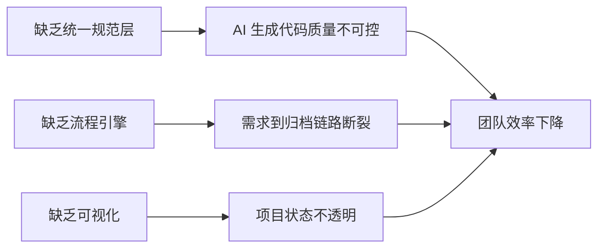
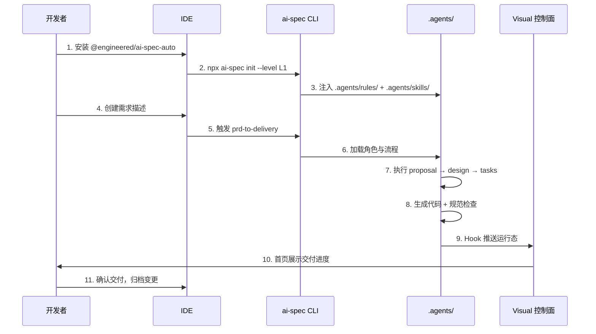
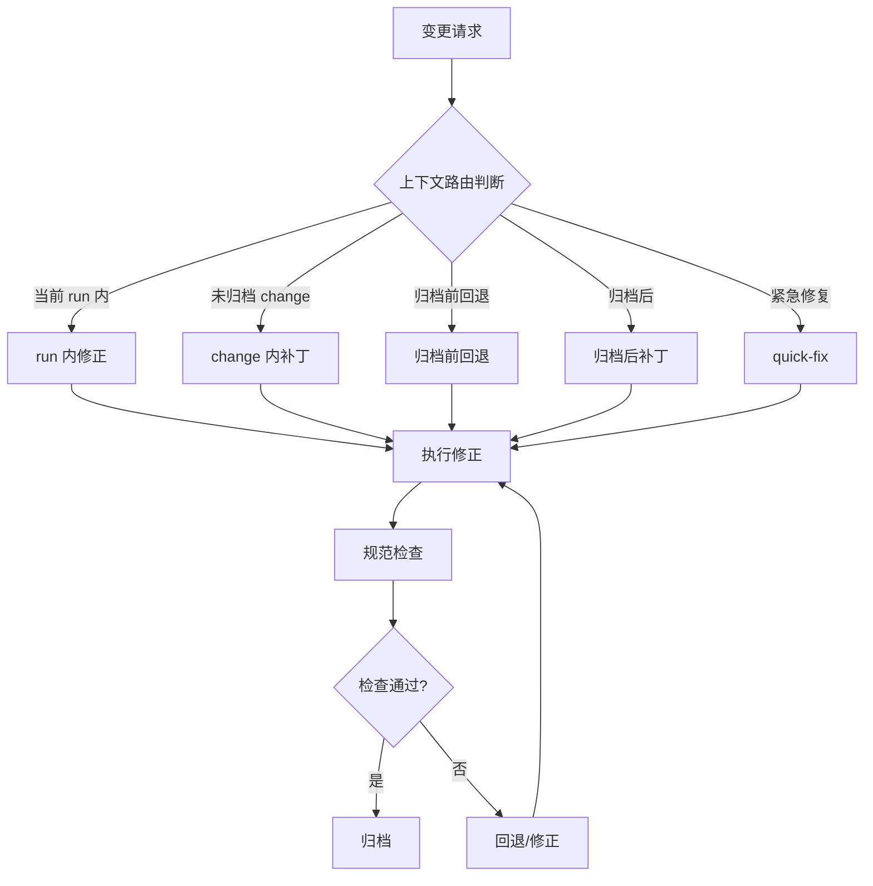
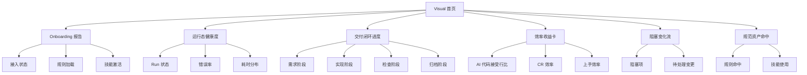
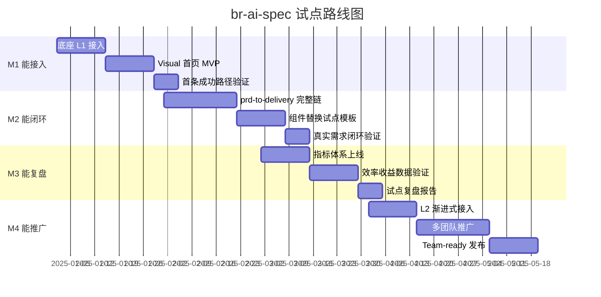

# PRD_产品需求文档

> **br-ai-spec — AI 规范驱动开发底座**
>
> 版本：v1.0 | 状态：内部试点版 / Demo-first，Team-ready

---

## 1. 产品定义

### 1.1 一句话定义

br-ai-spec 是一套面向前端团队的 **AI 规范驱动开发底座 + 可视化控制面**，把需求、实现、检查、归档串成一条完整的团队开发链路。

### 1.2 产品分层

| 层级 | 产品 | 定位 |
|------|------|------|
| **底座层** | br-ai-spec（`@engineered/ai-spec-auto`） | AI 规范驱动开发底座，负责规则注入、流程落地、运行态沉淀 |
| **控制面层** | engineered-spec-visual | 团队可视化与控制面，负责数据聚合、运行态监控、拓扑展示 |

### 1.3 首版定位

**内部试点版 / Demo-first，Team-ready**

- 面向内部试点团队，验证核心闭环能力
- 以 Demo 场景驱动，确保开发者能快速上手并完成第一个真实需求闭环
- 为后续 Team-ready 版本积累数据和经验

---

## 2. 背景与痛点

### 2.1 行业背景

AI 辅助编程工具（Cursor、Claude、Copilot 等）已广泛普及，但团队级 AI 开发仍面临以下系统性问题：

### 2.2 核心痛点

| # | 痛点 | 影响 | 严重程度 |
|---|------|------|----------|
| P1 | **AI 生成代码不遵循团队目录结构** | 每个项目、每个开发者生成的代码结构不一致，合并冲突频发 | 🔴 高 |
| P2 | **命名风格不统一** | 组件命名、文件命名缺乏统一约束，代码可读性差 | 🔴 高 |
| P3 | **换项目/换人后规范"失忆"** | 规范无法跨项目、跨人延续，每次新人都要重新学习 | 🟠 中高 |
| P4 | **提示词能力无法规模化复制** | 优秀实践停留在个人层面，无法形成团队资产 | 🟠 中高 |
| P5 | **Code Review 反复指出相同问题** | 缺乏自动化规范检查，CR 效率低、体验差 | 🟠 中高 |
| P6 | **缺乏从需求到归档的闭环** | 需求→实现→检查→归档链路断裂，项目状态不透明 | 🔴 高 |
| P7 | **AI 输出缺乏质量控制** | 生成代码质量参差不齐，缺乏自动化检查机制 | 🔴 高 |

### 2.3 根因分析



---

## 3. 产品目标

### 3.1 业务目标

| 目标 | 衡量标准 |
|------|----------|
| 提升 AI 辅助开发效率 | AI 代码接受行比 ≥ 70% |
| 降低 Code Review 成本 | CR 轮次减少 50% |
| 缩短新人上手周期 | 新人从入职到独立交付 ≤ 1 周 |
| 沉淀团队规范资产 | 规范模板库覆盖 80%+ 常见场景 |

### 3.2 用户目标

| 用户角色 | 目标 |
|----------|------|
| 前端开发者 | 快速上手 AI 辅助开发，高效完成需求交付 |
| Tech Lead | 掌控项目全局，确保代码质量与规范一致性 |
| 团队管理者 | 通过数据看板了解团队效率与交付进度 |

### 3.3 成功标准

| 指标 | 目标值 |
|------|--------|
| 首条成功路径完成率 | ≥ 80% |
| AI 代码采纳率 | ≥ 70% |
| 规范检查覆盖率 | ≥ 90% |
| 试点团队满意度 | ≥ 4/5 |

---

## 4. 目标用户与角色

### 4.1 目标用户

| 用户类型 | 描述 | 规模 |
|----------|------|------|
| 前端开发团队 | 使用 AI 辅助开发的前端团队 | 试点期 1-3 个团队 |
| Tech Lead | 负责代码质量与规范的技术负责人 | 每团队 1-2 人 |

### 4.2 系统角色

| 角色 | 职责 | 权限 |
|------|------|------|
| **task-orchestrator** | 任务编排与流程调度 | 最高调度权限 |
| **requirement-analyst** | 需求分析与拆解 | 需求定义权 |
| **frontend-implementer** | 前端代码实现 | 代码生成权 |
| **code-guardian** | 代码规范检查与质量保障 | 检查/拦截权 |
| **archive-change** | 变更归档与版本管理 | 归档/回退权 |

> 完整角色注册表包含 32 个角色，首版激活 10 个核心角色。

---

## 5. 产品原则

| 原则 | 说明 |
|------|------|
| **规范先行** | 所有 AI 生成代码必须遵循预设规范，规范定义在代码之前 |
| **流程驱动** | 通过流程引擎驱动需求→实现→检查→归档的完整链路 |
| **数据证明** | 所有价值主张必须通过数据指标验证，拒绝主观判断 |
| **渐进式接入** | L1 → L2 → L3 渐进式接入，降低 adoption 门槛 |
| **非侵入性** | 不修改项目源码，仅通过 `.agents/` 目录注入 |
| **单源多链接** | 规范定义单一来源，多端点链接引用，避免冗余 |

---

## 6. 首版范围

### 6.1 In Scope（首版包含）

| 模块 | 功能 | 优先级 |
|------|------|--------|
| 底座接入 | L1 渐进式接入（仅 .agents 目录注入） | P0 |
| 规则注入 | `.agents/rules/` 团队规范注入 | P0 |
| IDE 接入 | Cursor IDE 命令接入 | P0 |
| 流程引擎 | prd-to-delivery 完整交付链 | P0 |
| 运行态沉淀 | `.ai-spec/` 运行态数据（current-run.json、repo-map.json） | P0 |
| Visual 首页 | Onboarding 报告、运行态健康度、交付闭环进度 | P0 |
| Workspace 管理 | 多项目纳管、成员权限、连接令牌 | P0 |
| 数据采集 | Hook 推送（实时）+ Collector CLI | P0 |
| 组件替换模板 | 组件替换类需求试点模板 | P0 |

### 6.2 Out of Scope（首版不包含）

| 模块 | 说明 | 计划版本 |
|------|------|----------|
| L3 完整 OpenSpec | 完整 OpenSpec 流程落地 | v1.1+ |
| 多 IDE 支持 | Claude、VS Code、Trae 等 IDE 接入 | v1.1+ |
| bugfix-to-verification | 轻量修复链 | v1.1+ |
| 拓扑可视化 | 项目拓扑图展示 | v1.2+ |
| 团队协作 | 多成员协作与权限管理 | v1.2+ |
| 开放平台 | 第三方插件与扩展 | v2.0+ |

---

## 7. 核心能力设计

### 7.1 开发者首条成功路径



**路径说明：** 开发者从安装到完成第一个需求闭环，预计 ≤ 30 分钟。

### 7.2 变更分流决策器



### 7.3 首页 Onboarding 报告

| 模块 | 内容 | 数据来源 |
|------|------|----------|
| Onboarding 报告 | 接入状态、规则加载情况、技能激活情况 | `.ai-spec/current-run.json` |
| 运行态健康度 | 当前 run 状态、错误率、耗时分布 | Hook 推送 + Collector |
| 交付闭环进度 | 需求→实现→检查→归档各阶段完成率 | 流程引擎 |
| 效率收益卡 | AI 代码接受行比、CR 效率、上手效率 | 指标计算 |
| 阻塞变化流 | 当前阻塞项、待处理变更 | 流程引擎 |
| 规范资产命中 | 规则命中次数、技能使用频次 | 运行态统计 |

### 7.4 组件替换试点模板

**试点场景：** 组件替换类需求

| 步骤 | 操作 | 角色 |
|------|------|------|
| 1 | 定义替换需求（旧组件 → 新组件） | requirement-analyst |
| 2 | 生成替换方案（影响范围、迁移步骤） | task-orchestrator |
| 3 | 执行替换（代码生成 + 规范检查） | frontend-implementer |
| 4 | 质量检查（命名、结构、依赖） | code-guardian |
| 5 | 归档变更 | archive-change |

---

## 8. 首页原型结构

### 8.1 信息架构



### 8.2 模块设计

| 模块 | 类型 | 文案 | 数据更新频率 |
|------|------|------|--------------|
| Onboarding 报告 | 卡片 | "你的项目已接入 br-ai-spec，3 条规则已加载，5 个技能已激活" | 实时 |
| 运行态健康度 | 仪表盘 | "当前 2 个 Run 运行中，错误率 0%，平均耗时 3.2min" | 实时（WS） |
| 交付闭环进度 | 进度条 | "需求→实现→检查→归档：80% 完成" | 实时 |
| 效率收益卡 | 指标卡 | "AI 代码接受行比 72%，CR 轮次减少 45%" | 每小时 |
| 阻塞变化流 | 列表 | "1 个变更待处理：组件替换 #123" | 实时 |
| 规范资产命中 | 图表 | "规则命中 Top3：命名规范(128)、目录结构(96)、组件规范(64)" | 每小时 |

### 8.3 首页文案

```
┌─────────────────────────────────────────────────────┐
│  🏠 项目首页                    [项目选择 ▼]         │
├─────────────────────────────────────────────────────┤
│                                                     │
│  📋 Onboarding 报告                                 │
│  ✅ 已接入 br-ai-spec v0.1.11                       │
│  ✅ 3 条规则已加载 · 5 个技能已激活                  │
│  ⏳ 1 个规则待配置                                   │
│                                                     │
│  📊 运行态健康度                                     │
│  🟢 2 个 Run 运行中 · 错误率 0% · 平均 3.2min        │
│                                                     │
│  🔄 交付闭环进度                                     │
│  需求 ████████░░ 80% → 实现 ██████░░░░ 60%          │
│  检查 ████░░░░░░ 40% → 归档 ██░░░░░░░░ 20%          │
│                                                     │
│  ⚡ 效率收益卡                                       │
│  AI 接受行比 72%  ↑15%    CR 轮次 -45%  ↓2.3轮      │
│                                                     │
│  🚧 阻塞变化流                                       │
│  ⚠️ 组件替换 #123 — 等待 code-guardian 检查          │
│                                                     │
│  📐 规范资产命中                                     │
│  命名规范 128次  目录结构 96次  组件规范 64次         │
│                                                     │
└─────────────────────────────────────────────────────┘
```

---

## 9. 页面清单

| 页面 | 路径 | 功能 | 优先级 |
|------|------|------|--------|
| 首页 | `/` | 项目概览、Onboarding 报告、运行态健康度 | P0 |
| Workspace 管理 | `/workspace` | 多项目纳管、成员权限、连接令牌 | P0 |
| Runs 列表 | `/runs` | 运行记录列表、详情、状态筛选 | P0 |
| Changes 列表 | `/changes` | 变更记录列表、详情、状态筛选 | P0 |
| 拓扑可视化 | `/topology` | 项目拓扑图展示 | P1 |
| 规范管理 | `/rules` | 规则模板管理、规则配置 | P1 |
| 技能管理 | `/skills` | 技能模板管理、技能配置 | P1 |
| 指标看板 | `/metrics` | 效率指标、质量指标、趋势分析 | P1 |
| 设置 | `/settings` | 账号设置、Workspace 设置 | P2 |

---

## 10. 指标体系

### 10.1 核心指标

| 指标 | 定义 | 计算方式 | 目标值 |
|------|------|----------|--------|
| **AI 代码接受行比** | AI 生成代码中被开发者保留的行数占比 | `接受行数 / AI 生成总行数 × 100%` | ≥ 70% |
| **代码采纳率** | AI 生成的代码最终进入主干的比例 | `进入主干行数 / AI 生成总行数 × 100%` | ≥ 60% |
| **Code Review 效率** | 平均 CR 轮次与耗时 | `总 CR 轮次 / 需求数`、`总 CR 耗时 / 需求数` | 轮次 ≤ 2、耗时 ≤ 30min |
| **新人上手效率** | 新人从入职到独立交付的时间 | `独立交付时间 - 入职时间` | ≤ 1 周 |
| **沟通成本** | 需求讨论与澄清的沟通次数 | `需求相关沟通次数 / 需求数` | ≤ 3 次/需求 |

### 10.2 辅助指标

| 指标 | 定义 | 目标值 |
|------|------|--------|
| 首条成功路径完成率 | 首次使用到完成闭环的比例 | ≥ 80% |
| 规范检查覆盖率 | 被规范检查覆盖的代码比例 | ≥ 90% |
| 流程完成率 | 完整走完 prd-to-delivery 流程的比例 | ≥ 75% |
| 规则命中率 | 规则被触发的频率 | 持续优化 |
| 技能使用率 | 技能被激活的频率 | 持续优化 |

---

## 11. 试点路线图

### 11.1 四阶段里程碑



### 11.2 里程碑详情

| 里程碑 | 目标 | 交付物 | 成功标准 |
|--------|------|--------|----------|
| **M1 能接入** | 开发者能完成 L1 接入并看到 Visual 首页 | 底座 L1 + Visual 首页 MVP | 首条成功路径完成率 ≥ 80% |
| **M2 能闭环** | 真实需求能从需求到归档完整闭环 | prd-to-delivery + 组件替换模板 | 至少 3 个真实需求完成闭环 |
| **M3 能复盘** | 通过数据证明价值，产出复盘报告 | 指标体系 + 复盘报告 | AI 代码接受行比 ≥ 70% |
| **M4 能推广** | 推广到更多团队，发布 Team-ready 版本 | L2 接入 + 推广文档 | 3+ 团队接入，满意度 ≥ 4/5 |

---

## 12. 优先级

### 12.1 P0（必须完成）

| 功能 | 原因 |
|------|------|
| L1 渐进式接入 | 降低 adoption 门槛，确保开发者能快速上手 |
| `.agents/rules/` 规则注入 | 核心能力，确保 AI 生成代码遵循规范 |
| IDE 命令接入（Cursor） | 开发者主要交互入口 |
| prd-to-delivery 流程 | 核心交付链路 |
| `.ai-spec/` 运行态沉淀 | 数据基础，支撑 Visual 首页 |
| Visual 首页（6 大模块） | 价值体现，数据证明 |
| Workspace 管理 | 多项目纳管基础 |
| Hook 推送 | 实时数据采集通道 |
| 组件替换试点模板 | 试点场景，验证闭环 |

### 12.2 P1（应该完成）

| 功能 | 原因 |
|------|------|
| 拓扑可视化 | 提升项目可观测性 |
| 规范/技能管理 | 规范资产管理能力 |
| 指标看板 | 数据证明价值 |
| Collector CLI | 批量数据采集 |

### 12.3 P2（可以延后）

| 功能 | 原因 |
|------|------|
| 多 IDE 支持 | L2 阶段完成 |
| bugfix-to-verification | 轻量修复链，非首版核心 |
| 设置页面 | 基础功能，可延后 |

---

## 13. 风险与应对

| 风险 | 影响 | 概率 | 应对措施 |
|------|------|------|----------|
| **AI 生成代码质量不稳定** | 开发者不信任 AI 输出，采纳率低 | 中 | code-guardian 角色强制检查 + 规范模板持续优化 |
| **规范过于严格影响开发效率** | 开发者抵触，拒绝使用 | 中 | Profile 分层（L1/L2/L3）渐进式接入 + 规范可配置 |
| **Visual 首页数据不准确** | 失去信任，产品价值无法体现 | 低 | 多通道数据校验 + 数据一致性保障 |
| **试点团队配合度不足** | 无法完成闭环验证 | 中 | 选择高意愿团队 + 提供专项支持 |
| **IDE 兼容性问题** | 部分 IDE 无法正常使用 | 低 | 优先 Cursor + 后续扩展多 IDE |
| **性能问题** | 大规模项目下 CLI 运行慢 | 低 | 增量分析 + 缓存机制 + 性能监控 |

---

*本文档定义 br-ai-spec 首版产品需求，详细技术架构请参考 [TECH_技术架构文档.md](./TECH_技术架构文档.md)。*
