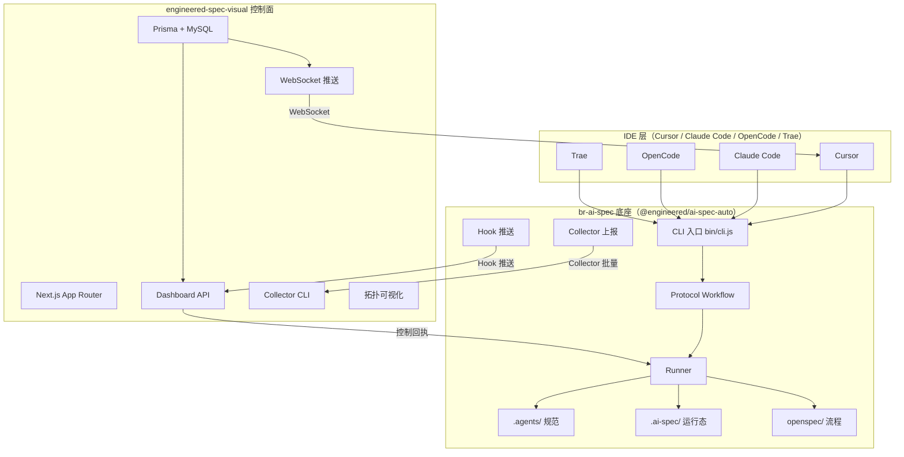
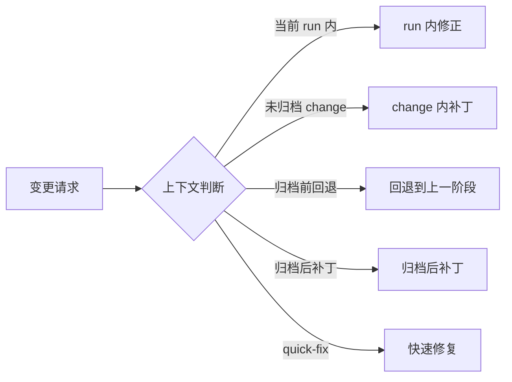
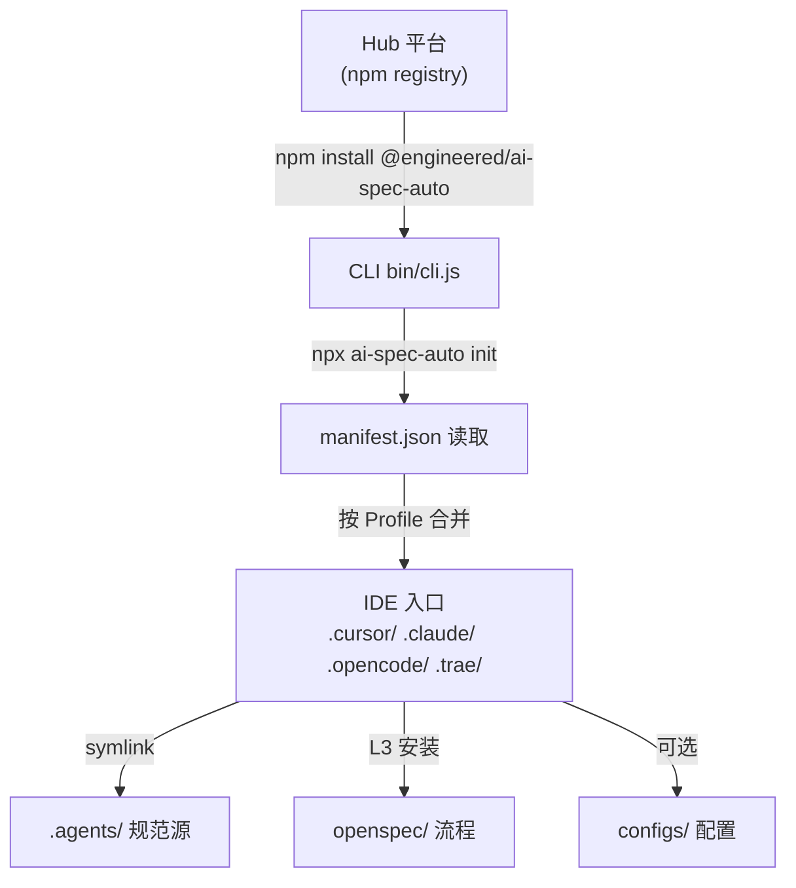
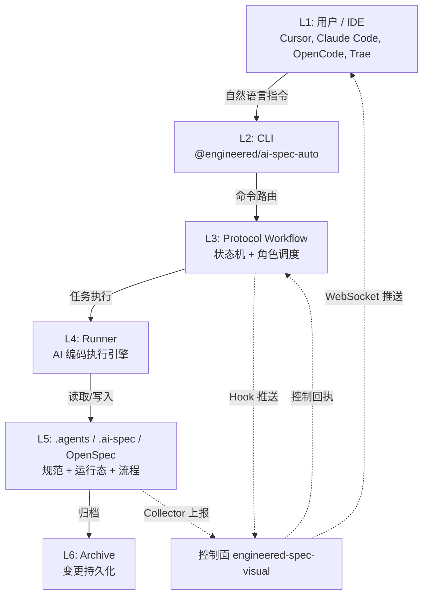
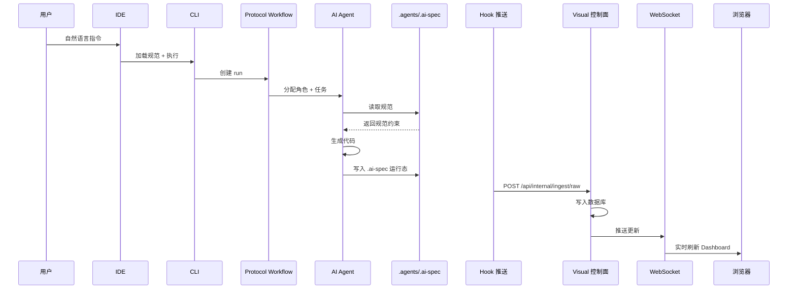

# TECH_技术架构文档

> 版本：v1.0 | br-ai-spec + engineered-spec-visual 联合架构

---

## 1. 整体架构

br-ai-spec 与 engineered-spec-visual 构成 **底座 + 控制面** 的双核架构。底座负责规范注入与流程执行，控制面负责数据聚合与可视化。两者通过四条通信通道协同工作。



### 四条通信通道

| 通道 | 方向 | 协议 | 用途 | 可靠性 |
|------|------|------|------|--------|
| Hook 推送 | 底座 → 控制面 | HTTP POST | 实时事件上报 | 失败重试 3 次 |
| Collector 批量 | 底座 → 控制面 | HTTP POST | 批量历史数据上报 | 断点续传 |
| 控制回执 | 控制面 → 底座 | HTTP POST | 反向指令下发 | HMAC 签名校验 |
| WebSocket 实时 | 控制面 → 浏览器 | ws | 实时数据推送 | 心跳保活 |

---

## 2. br-ai-spec 技术栈

### 2.1 Node CLI 架构

```
@engineered/ai-spec-auto@0.1.11
├── bin/cli.js              # CLI 入口（Commander 命令路由）
├── internal/               # 内部模块
│   ├── hooks/              # Hook 推送模块
│   ├── runtime/            # 运行时引擎
│   ├── protocol/           # Protocol Workflow
│   └── collector/          # Collector 上报模块
├── .agents/                # 规范源（单源多链接）
│   ├── rules/              # 声明式规范（13 条 Rules）
│   └── skills/             # 过程式技能（25 个 Skills）
├── openspec/               # OpenSpec 流程（L3）
│   ├── config.yaml         # 与 .agents 桥接配置
│   └── changes/            # 变更提案目录
├── configs/                # ESLint / Prettier / Stylelint 配置
├── scripts/                # 安装/同步脚本
└── tests/                  # 测试套件
```

### 2.2 ESM 模块设计

- 采用 ES Modules（`"type": "module"`）
- 动态导入（`import()`）实现按需加载
- 通过 `exports` 字段定义公共 API

### 2.3 OpenSpec 规范产物框架

OpenSpec 提供标准化的需求治理流程：

```
proposal → design → tasks → checklist → specs → archive
```

- **proposal**：需求提案（包含背景、目标、范围）
- **design**：设计方案（包含技术选型、接口定义）
- **tasks**：任务拆分（可执行的原子任务列表）
- **checklist**：验收清单（每个任务的验收标准）
- **specs**：规范产物（最终归档的规范文档）
- **archive**：归档（变更完成后的持久化存储）

### 2.4 .ai-spec 运行态

运行态数据沉淀在 `.ai-spec/` 目录下：

```json
// .ai-spec/current-run.json
{
  "runKey": "run-20260423-001",
  "status": "executing",
  "currentRole": "frontend-implementer",
  "currentTask": "TASK-003",
  "turnCount": 12,
  "startedAt": "2026-04-23T10:00:00Z",
  "lastEvent": "task.completed"
}
```

```json
// .ai-spec/repo-map.json
{
  "projectRoot": "/path/to/project",
  "profile": "vue",
  "installedLevel": "L3",
  "rulesCount": 13,
  "skillsCount": 25,
  "rolesCount": 10,
  "lastSyncAt": "2026-04-23T10:00:00Z"
}
```

### 2.5 双流程分层

| 流程 | 触发条件 | 阶段 | 适用场景 |
|------|----------|------|----------|
| prd-to-delivery | 新需求 / 功能开发 | proposal → design → tasks → checklist → specs → archive | 组件替换、新功能开发 |
| bugfix-to-verification | Bug 修复 / 热修复 | identify → fix → verify → archive | 线上 Bug、紧急修复 |

### 2.6 上下文路由



### 2.7 角色注册表

- **32 个角色**：覆盖需求分析、设计、开发、测试、归档全流程
- **10 个激活角色**：task-orchestrator、requirement-analyst、frontend-implementer、code-guardian、archive-change、design-analyst、test-engineer、ui-reviewer、security-auditor、performance-analyst
- **25 个技能**：create-proposal、design-analysis、execute-task、ui-verification 等
- **2 个激活流程**：prd-to-delivery、bugfix-to-verification

---

## 3. engineered-spec-visual 技术栈

### 3.1 前端技术栈

| 技术 | 版本 | 用途 |
|------|------|------|
| Next.js | 16.2.4 | React 全栈框架（App Router） |
| React | 19.2.4 | UI 库 |
| TypeScript | 5.x | 类型安全 |
| Tailwind CSS | 4.x | 原子化 CSS |
| lucide-react | 1.8.0 | 图标库 |
| @xyflow/react | 12.10.2 | 拓扑图可视化 |
| framer-motion | 12.38.0 | 动画库 |
| zod | 4.3.6 | 运行时校验 |
| date-fns | 4.1.0 | 日期处理 |
| nanoid | 5.1.9 | ID 生成 |

### 3.2 后端技术栈

| 技术 | 版本 | 用途 |
|------|------|------|
| Next.js API Routes | 16.2.4 | 服务端 API |
| Prisma | 7.7.0 | ORM |
| MySQL/MariaDB | - | 数据库 |
| @prisma/adapter-mariadb | 7.7.0 | MariaDB 适配器 |
| bcryptjs | 3.0.3 | 密码哈希 |
| ws | 8.20.0 | WebSocket |
| Commander | 14.0.3 | CLI 框架（Collector） |
| chokidar | 5.0.0 | 文件监听 |
| glob | 13.0.6 | 文件匹配 |
| tsx | 4.21.0 | TypeScript 执行器 |

### 3.3 开发工具

| 工具 | 版本 | 用途 |
|------|------|------|
| ESLint | 9.x | 代码检查 |
| Vitest | 4.1.4 | 单元测试 |
| @testing-library/react | 16.3.2 | React 测试 |
| @testing-library/jest-dom | 6.9.1 | DOM 断言 |

---

## 4. 分层架构

### 4.1 Hub 平台 → CLI → IDE 入口



### 4.2 渐进式接入层级

| 层级 | 内容 | 安装命令 | 适合场景 |
|------|------|----------|----------|
| L1 | 仅 .agents | `npx ai-spec-auto init --level L1` | 个人试用 |
| L2 | .agents + IDE + MCP | `npx ai-spec-auto init --level L2` | 团队编码规范 |
| L3 | L2 + OpenSpec | `npx ai-spec-auto init`（默认） | 团队完整闭环 |

---

## 5. 6 层协同架构



### 各层职责

| 层级 | 组件 | 职责 |
|------|------|------|
| L1 | IDE | 用户交互入口，加载 .agents 规范 |
| L2 | CLI | 命令解析、参数校验、流程调度 |
| L3 | Protocol Workflow | 状态机管理、角色路由、流程控制 |
| L4 | Runner | AI 编码执行、代码生成、文件操作 |
| L5 | .agents/.ai-spec/OpenSpec | 规范存储、运行态记录、流程定义 |
| L6 | Archive | 变更归档、版本管理、历史追溯 |

---

## 6. 通信协议

### 6.1 Hook 推送（实时）

- **触发时机**：每个 run 阶段变更时
- **数据格式**：

```json
{
  "sourceKind": "br-ai-spec",
  "sourcePath": "/path/to/project",
  "eventType": "run.status_changed",
  "eventKey": "run-20260423-001",
  "dedupeKey": "hash-xxx",
  "checksum": "sha256-xxx",
  "occurredAt": "2026-04-23T10:00:00Z",
  "entityType": "run",
  "entityId": "run-20260423-001",
  "payload": {
    "status": "executing",
    "currentRole": "frontend-implementer",
    "currentTask": "TASK-003"
  }
}
```

- **可靠性**：失败重试 3 次，指数退避
- **端点**：`POST /api/internal/ingest/raw`

### 6.2 Collector 批量上报

- **触发时机**：定时扫描（默认 5 分钟）或手动触发
- **数据格式**：批量 raw_event 数组
- **可靠性**：断点续传，已上报事件不重复
- **CLI 命令**：`npx engineered-spec-visual collector sync --workspace /path/to/project`

### 6.3 控制回执（反向）

- **方向**：控制面 → 底座
- **用途**：反向指令下发（如暂停 run、强制归档）
- **安全**：HMAC 签名校验
- **数据格式**：

```json
{
  "runKey": "run-20260423-001",
  "command": "pause",
  "payload": {
    "reason": "manual intervention"
  },
  "signature": "hmac-sha256-xxx",
  "actorId": "user-xxx"
}
```

### 6.4 WebSocket 实时推送

- **协议**：ws（与 HTTP 同端口）
- **用途**：向浏览器推送实时数据
- **心跳**：30 秒 ping/pong
- **消息格式**：

```json
{
  "type": "run_update",
  "workspaceId": "ws-xxx",
  "runKey": "run-20260423-001",
  "data": {
    "status": "completed",
    "turnCount": 15
  },
  "timestamp": "2026-04-23T10:05:00Z"
}
```

---

## 7. 数据流设计



---

## 8. 安全设计

### 8.1 HMAC 校验

- 控制回执使用 HMAC-SHA256 签名
- 密钥通过环境变量 `CONTROL_SECRET` 配置
- 签名验证失败返回 401

### 8.2 会话管理

- Cookie-based Session
- bcryptjs 密码哈希（cost factor 12）
- Session 表存储 token + expiresAt
- Token 长度 512 字符（nanoid 生成）

### 8.3 权限模型

| 角色 | 权限 |
|------|------|
| admin | 全部操作（管理成员、删除 Workspace、查看所有数据） |
| maintainer | 查看 + 编辑（修改配置、触发同步） |
| viewer | 仅查看（Dashboard 只读） |

---

## 9. 技术选型理由

| 技术 | 选型理由 |
|------|----------|
| Node CLI | 与前端生态无缝集成，npm 分发便捷 |
| ESM | 现代 JavaScript 模块标准，tree-shaking 友好 |
| OpenSpec | 结构化需求治理，与 .agents 可桥接 |
| Next.js 16 | App Router + API Routes 一体化，SSR/SSG 灵活 |
| Prisma 7.7 | 类型安全 ORM，MariaDB 适配器成熟 |
| Tailwind CSS 4 | 原子化 CSS，与 Next.js 集成最佳 |
| @xyflow/react | 拓扑图可视化首选，支持自定义节点 |
| ws | 轻量 WebSocket，与 HTTP 同端口部署简单 |
| Zod 4 | 运行时校验，与 TypeScript 类型同步 |

---

## 10. 约束与规范

### 10.1 版本约束

- Node.js >= 18
- npm >= 9
- TypeScript >= 5.0
- MySQL >= 8.0 或 MariaDB >= 10.6

### 10.2 编码规范

- ESM 模块，禁止 CommonJS
- TypeScript strict mode
- ESLint 9 flat config
- 文件名 kebab-case，组件名 PascalCase

### 10.3 命名约定

- runKey: `run-{YYYYMMDD}-{序号}`
- changeKey: `change-{YYYYMMDD}-{序号}`
- sessionKey: `session-{nanoid}`
- eventId: `evt-{nanoid}`

### 10.4 API 规范

- RESTful 风格
- 统一响应格式：`{success, data, error}`
- 错误码：HTTP 状态码 + 业务错误码
- 认证：Cookie-based Session
