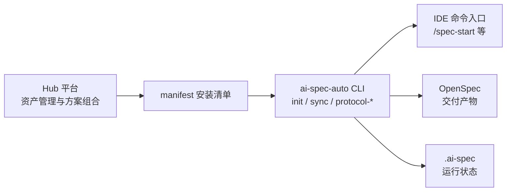
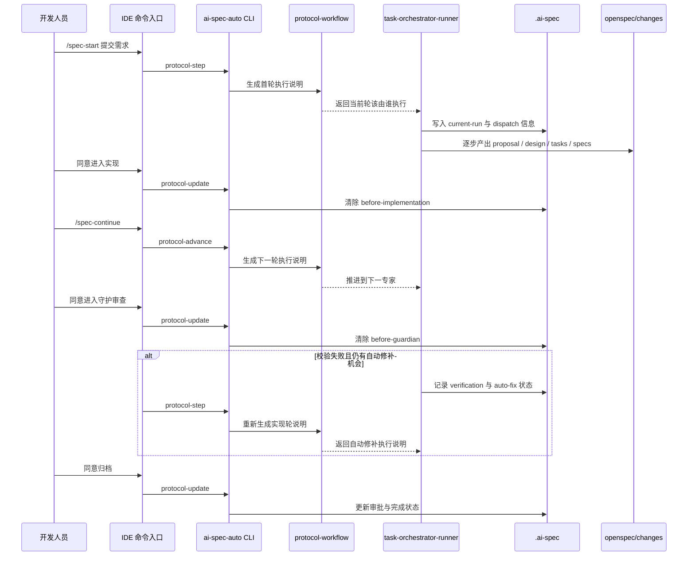

# 架构设计与治理说明

> 适用对象：框架维护者、技术评审、方案设计人员、推广与治理负责人

这份文档用于回答四个问题：

1. 当前方案试图解决什么问题。
2. 它与其他常见路线相比，选择了怎样的治理重心。
3. 系统内部的协议、状态、专家调度和归档链路如何协同。
4. 当流程出问题时，应当先到哪里定位、由谁处理。

## 1. 产品是什么

`ai-spec-auto` 是一套面向前端项目的 AI 规范驱动开发工具。它把项目规则、专家体系、IDE 命令入口、OpenSpec 交付产物和运行状态放进同一个项目中，让开发任务不只是“对话里做完”，而是能够以文件、流程和归档的方式稳定沉淀。

如果要用一句更直接的话来定义它：

> 它不是单个 AI 工具的替代品，而是一套把需求、实现、检查、归档串成团队开发链路的项目级交付底座。

## 2. 背景与问题定义

当前团队在引入 AI 开发方式时，最容易遇到的并不是“模型不会写代码”，而是以下三类治理问题：

- 需求尚未稳定，AI 已经开始改动代码，后续返工成本高。
- 功能虽然可运行，但实现结果与项目目录、路由、接口、样式、测试等约定不一致。
- 经验停留在聊天记录中，无法在换人、换会话或跨项目协作时稳定延续。

因此，当前方案的设计重点不是继续放大“单轮生成能力”，而是把需求分析、实现交付、规范检查、归档沉淀组织成一条可复用、可定位、可治理的链路。

## 3. 竞品 / 对标分析

当前方案吸收了外部路线中的有效机制，但没有照搬其完整产品形态。

下面的“团队接入成本”采用相对表达，重点看三件事：安装复杂度、团队需要补多少约定、是否需要自己再搭额外治理链路。

| 路线 | 代表功能 | 团队接入成本 | 不足之处 | 当前可借鉴部分 | 当前方案的取向 |
| --- | --- | --- | --- | --- | --- |
| `LangGraph` | 自定义工作流、长任务状态持久化、人机协同审批、多专家编排、流式执行 | 高：需要工程团队自己搭建流程、状态持久化、接入方式和团队治理规则 | 更偏流程编排框架，本身不直接回答团队规范落盘、项目接入和长期资产沉淀问题 | 状态机、门禁、checkpoint / restore | 将运行状态显式落盘，支持可恢复的协议推进 |
| `Aider` | 终端结对编程、直接编辑本地 Git 仓库、对话命令、仓库地图、测试与 lint 修复 | 低到中：个人安装快，但团队统一规范、审批门禁和交付沉淀仍需要额外补齐 | 更适合个人或小范围高频改码场景，对团队级交接、审批门禁和归档治理支撑较弱 | 仓库地图、最小改动、验证回灌 | 将实现结果约束在项目规则和交付产物之内 |
| `spec-driven` 路线 | 先写 `proposal / design / tasks / specs`，再进入实现 | 中：产物思路清晰，但仍需要团队自己补协议推进、状态治理和项目接入方式 | 更强调产物先行，但对运行态治理、专家协同和项目级安装接入覆盖不够完整 | `proposal / design / tasks / specs` 先行 | 用 OpenSpec 承载交付产物，避免流程只依赖对话 |
| `ai-spec-auto` 当前方案 | 安装规则与技能、提供 IDE 入口、沉淀 OpenSpec 产物、维护运行状态、支持归档收口 | 中：项目接入成本可控，但要持续打磨入口体验、远程协同和维护者排障心智 | 入口体验、远程协同、自动化控制面和维护者排障心智仍需继续打磨 | 组合上述机制，强调团队复用 | 面向项目接入与长期维护，而不是单次编码效率 |

这一路线的核心判断是：团队长期收益不来自单次对话表现，而来自产物、规则、状态和交接方式的标准化。

## 4. 方案设计

### 4.1 总体关系

当前体系可以理解为“资产管理、项目接入、协议运行、交付沉淀”四个层次的协同。

### 4.2 各层职责

| 层次 | 主要职责 | 当前关键对象 |
| --- | --- | --- |
| Hub 平台 | 管理规则、技能、专家、流程与场景方案 | `manifest` 的上游来源 |
| manifest | 描述本次项目要启用的能力组合 | 安装清单、版本与来源信息 |
| CLI | 承担安装、同步、协议推进和归档入口 | `init`、`sync`、`protocol-step`、`protocol-advance`、`protocol-update` |
| IDE 入口 | 面向开发者提供低门槛交互方式 | `/spec-start`、`/spec-update`、`/spec-continue`、`/spec-status` |
| OpenSpec | 承载一次需求的交付产物与归档结果 | `proposal`、`design`、`tasks`、`checklist`、`iterations`、`specs` |
| `.ai-spec` | 记录运行时事实状态 | `current-run.json`、`repo-map.json`、内部 dispatch / execution / runtime-action |

### 4.3 当前落地的主链

当前已激活两条流程：

- `prd-to-delivery`：面向需求、设计和需要 OpenSpec 沉淀的完整交付链
- `bugfix-to-verification`：面向全新低风险小修正的轻量修复链

已确认的当前底盘信息如下：

- 包版本：`0.0.59`
- 技能文档：`25` 个
- 注册专家：`32` 个
- 活跃专家：`5` 个
- 注册流程：`2` 条
- 活跃流程：`2` 条

当前真正参与主链的活跃专家是：

- `task-orchestrator`
- `requirement-analyst`
- `frontend-implementer`
- `code-guardian`
- `archive-change`

其中，大需求默认走 `task-orchestrator -> requirement-analyst -> frontend-implementer -> code-guardian -> archive-change`，小需求则允许直接走 `task-orchestrator -> frontend-implementer -> code-guardian`，并把轻量记录写入 `.ai-spec/history/<run-id>/`。

## 5. 协议与运行机制

### 5.1 协议入口的职责划分

当前最核心的三个协议命令如下：

| 命令 | 作用 |
| --- | --- |
| `protocol-step` | 启动第一轮，或在需要时重新获取当前轮执行说明；支持 `--mode`、`--review-policy`、`--flow` |
| `protocol-advance` | 在当前轮完成后推进到下一轮 |
| `protocol-update` | 记录补充输入、审批意见与归档确认，并处理适用的快速收口 |

这三个命令共同回答的不是“如何写代码”，而是“当前轮该交给谁、允许读写什么、下一步应当如何推进”。

### 5.1.1 `mode（运行模式）` 与 `review_policy（审核策略）`

当前需要明确区分两个概念：

| 字段 | 作用 | 当前可选值 |
| --- | --- | --- |
| `mode（运行模式）` | 决定主代理如何起步 | `auto（自动）`、`suggest（建议）`、`manual（手动）` |
| `review_policy（审核策略）` | 决定主流程在哪些节点必须停下等待人工审核 | `none（无阻塞审核）`、`main-flow-blocking（主流程阻塞审核）` |

当前内测默认值为：

- `mode = auto（自动）`
- `review_policy = main-flow-blocking（主流程阻塞审核）`

这意味着默认会自动选流程，但主流程三位核心专家完成后会在关键节点停下来等待人工审核。

其中：

- `auto（自动）`：主代理按仓库上下文自动选 `flow（流程模板）`
- `suggest（建议）`：先生成 `run-plan（运行计划）`，停在 `start-review（启动确认门禁）`
- `manual（手动）`：必须显式传入 `--flow <flow-id>`，只允许手动锁定流程模板

### 5.2 运行主链

当前默认主链可概括为：

`task-orchestrator -> requirement-analyst -> before-implementation -> frontend-implementer -> before-guardian -> code-guardian -> before-archive -> archive-change`

若以 `suggest（建议）` 模式启动，则在第一位专家之前还会先出现 `start-review（启动确认门禁）`。

其门禁重点包括：

- `before-implementation`
- `before-guardian`
- `before-archive`

其中：

- `before-implementation（实现前门禁）`：阻止需求未收敛时直接进入实现
- `before-guardian（守护前门禁）`：阻止实现结果未经人工确认就直接进入守护审查
- `before-archive（归档前门禁）`：在归档前显式确认交付结论

### 5.3 运行时序

### 5.4 产物与状态如何协同

OpenSpec 和 `.ai-spec` 分别承担不同职责：

- OpenSpec 负责承载“交付结果是什么”。
- `.ai-spec` 负责承载“流程现在走到哪里”。

其中 `current-run.json` 当前会显式保存：

- `mode（运行模式）`
- `review_policy（审核策略）`
- `pending_gate（当前待审批点）`
- `gate_context（当前门禁上下文）`

这一区分使系统具备两个重要特征：

- 交付产物可以独立沉淀和归档，不依赖单轮对话存在。
- 运行状态可以被显式观察和恢复，不需要依赖操作者记忆流程位置。

## 6. 故障定位与可维护性

这是当前体系最需要讲清楚的部分。系统是否可维护，不取决于它是否“功能很多”，而取决于出问题时能否迅速判断问题位于哪一层。

### 6.1 常见故障定位表

| 现象 | 优先判断层 | 先看什么 |
| --- | --- | --- |
| IDE 中命令不可用或模板异常 | 入口层 | `.cursor/`、`.claude/`、命令模板是否已安装 |
| `/spec-start` 触发后无有效推进 | 协议层 | `bin/cli.js`、`internal/ai-protocol-workflow.js` |
| 当前轮专家、门禁或状态异常 | 运行时状态层 | `.ai-spec/current-run.json`、`.ai-spec/internal/` |
| 产物缺失或交接不完整 | 交付产物层 | `openspec/changes/<change-id>/` 中是否缺少关键文件 |
| 同步结果与预期资产不一致 | 安装 / 清单层 | `.ai-spec/manifest.json`、`.ai-spec/lock.json`、`.ai-spec/sources.json` |
| 规则、专家或流程行为不符合预期 | 资产定义层 | `.agents/registry/roles.json`、`.agents/registry/flows.json`、相关 rule / skill / role 文件 |

### 6.2 建议的排障顺序

建议维护者按下面顺序处理问题：

1. 先判断问题属于入口、协议、状态、资产还是项目适配。
2. 再确认 `.ai-spec/current-run.json` 与 `openspec/changes/<change-id>/` 是否一致。
3. 再检查专家注册表、流程注册表以及当前项目规则是否匹配。
4. 最后才进入具体脚本或底层实现排查。

这种排障顺序的目的，是避免开发者一上来就被迫理解整套底层实现。

### 6.3 谁来修

为了降低团队心理门槛，建议在维护责任上做明确分工：

| 问题类型 | 建议责任方 |
| --- | --- |
| IDE 命令入口、安装适配问题 | 项目接入维护者 |
| 协议生成、状态推进、门禁逻辑问题 | 平台维护者 |
| 规则、技能、专家、流程定义问题 | 资产维护者 |
| 单项目落点判断、目录映射、集成约定问题 | 项目负责人或项目接入人 |

这类责任划分并不是为了增加流程，而是为了让普通开发者知道：问题出现后不需要自己先读透整个框架，先把问题归类即可。

## 7. 推广统计

推广统计的目标，不应停留在“装了多少次工具”，而应回答“这套方法是否形成了稳定闭环”。

建议按四个层次持续观察：

| 层次 | 关注点 | 说明 |
| --- | --- | --- |
| 接入 | 有多少项目通过 `init / sync / manifest` 接入 | 判断是否真正进入项目，而不是停留在介绍阶段 |
| 闭环 | 从 `/spec-start` 到归档的完成率、`before-implementation / before-guardian / before-archive` 的阻断点、归档成功率 | 判断流程是否跑完整 |
| 复用 | 场景方案、专家、规则、技能在不同项目中的复用次数 | 判断资产是否开始沉淀为团队能力 |
| 回传 | 归档结果、失败原因、阻断原因是否回到平台侧 | 判断治理闭环是否开始形成 |

对管理视角而言，更值得跟踪的不是单一数量，而是三个趋势：

- 同类需求是否越来越少依赖个人记忆。
- 常见任务是否越来越多通过统一资产完成。
- 一次交付结束后，结果是否能够反馈回规则、流程和方案设计。

## 8. 后续规划

后续规划建议分三段推进，而不是并行拉开过多战线。

### 8.1 短期：跑稳主链与接入

- 继续把 `prd-to-delivery` 主链打磨稳定。
- 降低安装、同步、首次试点的接入摩擦。
- 让开发者入口聚焦“可上手”，不把底层细节前置给普通使用者。

### 8.2 中期：入口插件化，能力包化

- 让 Hub 负责资产管理与场景组合。
- 让 `manifest` 成为能力组合的稳定描述。
- 让 IDE 或插件入口承担更轻量的交互与状态提示。
- 补齐 `git worktree` 支持，把“一需求一工作目录”收口成标准能力，支撑同一项目下的多需求并行开发。
- 让当前工作目录天然对应当前需求，避免多个需求共用同一份运行态、规格产物和本地改动。
- 在 CLI、Hub 和 IDE 入口中补充 `worktree` 的创建、切换与回收能力，降低并行开发时的切换成本。

### 8.3 中长期：补齐 OpenClaw 对接，走向 AI 规范驱动自动开发

- 将 `OpenClaw` 明确定位为远程入口与团队协同控制面，而不是替代本地 IDE 或直接承担平台核心编排。
- 让 `OpenClaw` 与本地 IDE 共用同一套协议层、专家体系、流程模板与运行状态，统一通过 `task-orchestrator` 触发执行。
- 让远程任务触发、审批放行、状态查询、结果回传都围绕 `.ai-spec` 与 OpenSpec 产物展开，避免形成新的远程黑盒流程。
- 在安全边界清晰的前提下，把群内或远程入口收到的自然语言需求稳定转成规范化执行链，逐步实现面向团队的 AI 规范驱动自动开发目标。
- 在多需求场景下，将 `OpenClaw` 与 `git worktree` 结合，支持远程入口分配独立工作空间并并行推进多个任务。

### 8.4 长期：形成平台化治理闭环

- 将归档结果、门禁阻断、常见失败原因回传到平台侧。
- 将规则、技能、专家、流程逐步沉淀为可版本化能力包。
- 在条件成熟后，把 CI/CD 校验纳入统一治理链，形成从本地开发到持续交付的一体化约束。

最终目标不是把系统讲得越来越复杂，而是在更多任务场景中，让团队仍然能够使用同一套方法协作、交接和持续优化。
