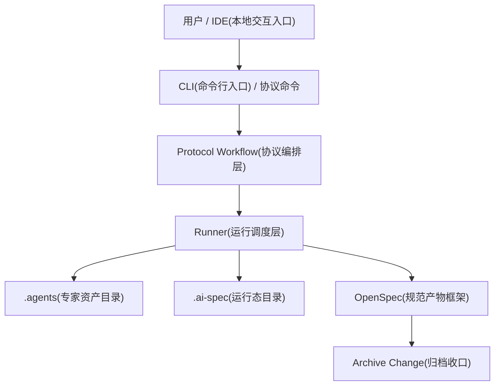
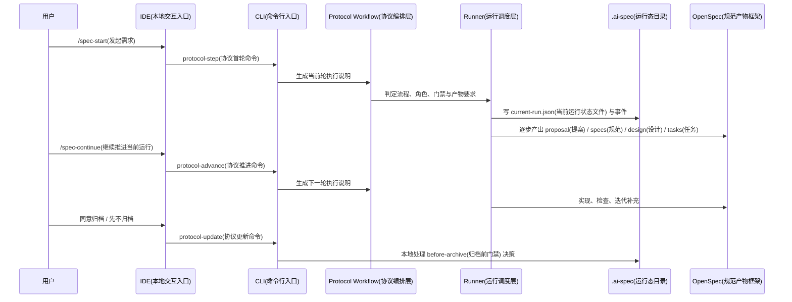

# 项目介绍与运行机制说明

> 文档定位：用于统一当前项目总览、运行机制、双流程分层和治理价值

## 1. 一句话先讲清楚这是什么

`ai-spec-auto` 不是“让 AI 自由发挥写代码”的工具集合，而是一套把需求、实现、检查、归档和复盘收进工程体系的本地协作底座。

如果只保留一句对外口径，建议统一成下面这句：

> `OpenSpec(规范产物框架)` 管变更产物，`.agents(专家资产目录)` 管规则和专家，`protocol-step(协议首轮命令)` / `protocol-update(协议更新命令)` / `protocol-advance(协议推进命令)` 管流程推进，`.ai-spec(运行态目录)` 管当前事实状态。

和第三阶段版本相比，当前项目已经不是只有一条“需求分析 -> 实现 -> 守护 -> 归档”的直线主链，而是形成了“完整交付主链 + 轻量修复支链 + 上下文路由 + 归档快速收口”的更完整运行体系。

## 2. 当前版本新增了哪些关键能力

这部分是本次文档重写最重要的补充点。

| 新增能力 | 当前已经落地的意义 |
| --- | --- |
| 双流程分层 | 大需求默认走 `prd-to-delivery(PRD 到交付流程)`，低风险小修默认走 `bugfix-to-verification(缺陷修复到验证流程)`，不再所有事情都压到一条重流程里。 |
| 上下文路由 | 当前 run(运行轮次) 内修正、未归档 change(变更) 内补丁、归档前回退修正、归档后补丁修正、全新 quick-fix(轻量快修) 已经可以区分处理。 |
| 协议入口统一 | 开发者表层入口收敛为 `/spec-start`、`/spec-update`、`/spec-continue`、`/spec-status`，底层统一落到 `protocol-step(协议首轮命令)`、`protocol-update(协议更新命令)`、`protocol-advance(协议推进命令)`。 |
| 运行态轻量化 | 默认只维护 `current-run.json(当前运行状态文件)`、`repo-map.json(仓库地图文件)` 和必要事件，不默认把每一步都写成重快照。 |
| 可选 checkpoint(关键快照) / restore(状态恢复) | 需要恢复或调试时，可通过 `AI_SPEC_PERSIST_CHECKPOINTS=1` 开启关键迁移快照，并支持按快照恢复。 |
| before-archive(归档前门禁) fast-path(本地快速路径) | 用户明确说“同意归档”或“先不归档”时，系统本地完成收口，不再额外走一轮重型模型编排。 |
| 自动验证与 auto-fix(自动修补) 回环 | 实现结果可回灌 `verification(验证结果)`，必要时回到实现专家做最小修补，而不是直接把失败静默吞掉。 |
| 小修留痕目录 | 低风险小修不强行进入 `openspec/changes(规范变更目录)`，而是写入 `.ai-spec/history(轻量历史目录)`，兼顾效率和可追溯。 |

如果从管理角度理解，上面这些变化解决的是同一个问题：  
不是“让流程变复杂”，而是“让不同复杂度的需求，走与自身风险匹配的路径”。

## 3. 当前仓库的真实基线

基于当前仓库状态，可以把底盘概括为下面这些事实：

- 角色注册表共 32 个，当前激活角色 10 个
- 技能注册表共 25 个
- 当前激活流程 2 条
- 默认规范骨架使用 `expert-delivery(专家交付骨架)`
- 默认安装已经收敛为完整安装，不再把 `L1/L2/L3(旧分层参数)` 作为主路径概念

同时，下一阶段已经明确的两个方向是：

- 继续补齐 `OpenClaw(远程协同入口)` 对接
- 逐步引入 `git worktree`，支撑同一项目下的多需求并行开发

当前真正支撑交付闭环的核心角色是：

- `task-orchestrator(任务编排主代理)`
- `requirement-analyst(需求解析专家)`
- `frontend-implementer(前端实现专家)`
- `code-guardian(规范守护专家)`
- `archive-change(归档专家)`

其中，完整需求主链默认按下面的顺序运行：

`task-orchestrator(任务编排主代理) -> requirement-analyst(需求解析专家) -> frontend-implementer(前端实现专家) -> code-guardian(规范守护专家) -> before-archive(归档前门禁) -> archive-change(归档专家，可选)`

低风险小修则默认走：

`task-orchestrator(任务编排主代理) -> frontend-implementer(前端实现专家) -> code-guardian(规范守护专家)`

## 4. 现在这套机制到底是怎么分层工作的

当前比较稳定的理解方式，是把系统看成 6 层协同：



分层职责建议这样理解：

| 层 | 负责什么 | 不负责什么 |
| --- | --- | --- |
| IDE(本地交互入口) / CLI(命令行入口) | 接住开发者动作和命令触发 | 不决定最终该走哪条流程 |
| `Protocol Workflow(协议编排层)` | 判断当前轮应该给谁执行、需要什么输入、是否要卡门禁 | 不直接写业务代码 |
| `.agents(专家资产目录)` | 提供规则、技能、角色、流程等可复用资产 | 不保存当前运行事实 |
| `.ai-spec(运行态目录)` | 记录当前 run(运行轮次) 做到哪里、卡在哪个门禁、最近发生过什么 | 不承载长期需求规范 |
| `OpenSpec(规范产物框架)` | 保存 proposal(提案)、specs(规范)、design(设计)、tasks(任务)、checklist(检查)、iterations(迭代) 等交付产物 | 不替代运行状态机 |
| `archive-change(归档专家)` | 合并增量规范、写归档目录、结束本轮运行 | 不负责重新发明一套新流程 |

一句话概括：

> `OpenSpec(规范产物框架)` 回答“交付结果是什么”，`.ai-spec(运行态目录)` 回答“流程现在走到哪里”，`.agents(专家资产目录)` 回答“应该按什么规则和方法去做”。

### 4.1 项目目录与关键文件

先记住这几个位置，当前项目的大多数问题都绕不开它们：

```text
project-root/
├── bin/                              # CLI 命令入口，想看安装、同步、协议命令从哪进先看这里
│   ├── cli.js                        # 命令总入口
│   ├── install-workflow.js           # init / update / check / uninstall 主链
│   ├── sync.js                       # manifest、Hub 补充下载与资产同步
│   ├── protocol-workflow.js          # protocol-step / update / advance 主入口
│   ├── runtime-state.js              # 运行态读写、checkpoint / restore
│   └── archive-change.js             # 归档收口与增量规范合并
├── internal/
│   └── ai-protocol-workflow.js       # 协议编排的内部实现
├── .agents/                          # 专家资产目录，团队规则、技能、专家、流程都在这里
│   ├── rules/                        # 规则约束
│   ├── skills/                       # 技能与常用做法
│   ├── roles/                        # 专家定义与分工
│   ├── flows/                        # 流程模板
│   ├── registry/                     # 角色、技能、规则、流程注册表
│   └── commands/common/              # IDE 最常用的命令模板
│       ├── spec-start.md             # 第一次发起需求时会读这个模板
│       └── spec-continue.md          # 继续推进、审批确认、归档确认时会读这个模板
├── openspec/
│   ├── config.yaml                   # 当前项目接了哪套规范骨架与边界约束
│   ├── changes/<change-id>/          # 这次需求沉淀下来的产物
│   │   ├── proposal.md               # 目标、范围、默认假设、风险，以及变更入口/设计链接/组件复用约束
│   │   ├── design.md                 # 方案落点、关键决策、复用策略和验收路径
│   │   ├── tasks.md                  # 可执行任务清单，按目标/输入/输出/验证点组织
│   │   ├── checklist.md              # 交付检查结论与本地/浏览器验证摘要
│   │   ├── iterations.md             # 问题、修正动作、残留风险和交接提醒
│   │   └── specs/                    # 本次需求对应的增量规范
│   └── specs/                        # 已归档、可长期复用的规范
├── .ai-spec/
│   ├── manifest.json                 # 当前项目装了哪些规则、技能、专家和流程
│   ├── current-run.json              # 这轮任务现在走到哪一步了
│   ├── repo-map.json                 # 当前仓库关键目录映射，帮助流程判断页面、路由、mock、接口落点
│   ├── history/                      # 低风险小修的轻量留痕目录
│   ├── checkpoints/                  # 仅在开启 checkpoint 持久化时写入，便于回看和恢复
│   └── internal/
│       ├── current-dispatch.json     # 当前轮该谁接手
│       ├── current-execution.json    # 当前专家刚做了什么
│       └── current-runtime-action.json # 下一步交给谁，或卡在什么确认点
├── configs/                          # 会同步到目标项目的通用配置模板
├── scripts/                          # Hub 同步、发版后验证等辅助脚本
├── tests/                            # registry、runtime、脚本行为相关验证用例
└── docs/                             # 面向开发者、维护者、评审和推广的文档体系
```

如果只记一条排查原则，可以先这样看：

- 看运行状态，优先查 `.ai-spec/current-run.json` 和其中的 `events`
- 看当前轮交接，优先查 `.ai-spec/internal/current-dispatch.json`
- 看交付产物，优先查 `openspec/changes/<change-id>/`
- 看安装与同步，优先查 `bin/install-workflow.js` 和 `bin/sync.js`
- 看协议推进，优先查 `bin/protocol-workflow.js` 和 `internal/ai-protocol-workflow.js`
- 看专家和流程定义，优先查 `.agents/registry/roles.json`、`.agents/registry/flows.json`

如果只是第一次接手这个项目，不需要一开始把所有目录都翻完，建议先看下面这些文件：

- `package.json`：确认当前包版本、命令入口和脚本
- `bin/cli.js`：看 CLI 总入口如何分发到安装、同步、协议和运行时命令
- `bin/install-workflow.js`：看 `init / update / check / uninstall` 的安装主链
- `bin/sync.js`：看 `manifest`、Hub 补充下载和资产同步逻辑
- `bin/protocol-workflow.js`：看协议首轮、更新、推进、状态查询的主入口
- `.agents/registry/roles.json`、`.agents/registry/flows.json`：看当前启用了哪些专家和流程
- `docs/four/架构设计与治理说明.md`：看当前对外统一的架构与治理口径

## 5. 当前最重要的新增点：不是一条链，而是两条主路径

### 5.1 完整交付主链

适用场景：

- 新功能
- 跨模块改动
- 需要长期留痕、评审、归档
- 涉及真实 API(接口)、路由、全局状态、权限或验收口径变化

默认流程：

`prd-to-delivery(PRD 到交付流程)`

默认产物：

- `proposal.md(提案文件)`
- `specs(规范目录)`
- `design.md(设计文件)`
- `tasks.md(任务文件)`
- `checklist.md(检查文件)`
- `iterations.md(迭代记录文件)`

这些产物当前采用“顶层章节稳定、章节内补结构化提示”的模板策略：

- `proposal.md(提案文件)` 会补充业务目标、工程目标、变更入口、设计链接和组件复用约束
- `design.md(设计文件)` 会补充仓库落点、信息结构、状态管理、组件复用策略和关键验收路径
- `tasks.md(任务文件)` 会要求每个子任务写清目标、输入、输出、验证点和依赖
- `checklist.md(检查文件)` 会补充本地验证、浏览器验证、范围一致性和组件复用检查摘要
- `iterations.md(迭代记录文件)` 会补充问题来源、风险说明和交接提醒

默认门禁：

- `before-implementation(实现前门禁)`
- `before-archive(归档前门禁)`

### 5.2 轻量修复支链

适用场景：

- 单点小修
- 文案、样式、小交互修正
- 不新增真实 API(接口)、路由、全局状态
- 风险低，不要求长期以完整 change(变更) 归档

默认流程：

`bugfix-to-verification(缺陷修复到验证流程)`

默认留痕：

- `.ai-spec/history/<run-id>/bugfix.md(缺陷记录文件)`
- `.ai-spec/history/<run-id>/implementation-notes.md(实现说明文件)`
- `.ai-spec/history/<run-id>/checklist.md(检查文件)`
- `.ai-spec/history/<run-id>/iterations.md(迭代记录文件)`

这个能力的价值在于：  
团队终于不需要再在“所有事情都走重流程”和“所有小事都不留痕”之间二选一。

## 6. 用户输入后，系统如何决定走哪条路

这是当前版本最容易被忽略、但实际最重要的新增能力。

系统不再只问“需求大不大”，而是先判断当前上下文：

- 当前是否已有 `active run(活跃运行轮次)`
- 当前是否已有未归档 `change(变更)`
- 当前输入是补丁、范围变化、归档前修正，还是归档后补修
- 当前任务是否符合 quick-fix(轻量快修) 的风险边界

可以把当前决策理解成下面这张表：

| 当前上下文 | 默认路由 | 结果 |
| --- | --- | --- |
| 新功能、跨模块改动、要长期归档 | `full-change(完整变更)` | 进入 `prd-to-delivery(PRD 到交付流程)` |
| 当前 run(运行轮次) 内的小修正 | `patch(当前变更补丁)` | 复用当前 run(运行轮次) 和当前 change(变更) |
| 当前 `open change(未归档活跃变更)` 内的范围变化 | `scope-delta(范围增量修正)` | 回到 `requirement-analyst(需求解析专家)` 更新需求与设计 |
| 归档前发现实现不对 | `archive-fix(归档前修正)` | 回退到正确专家修正，不进入归档快速收口 |
| 已归档内容补一个修正 | `followup-patch(归档后补丁)` | 新开 patch change(补丁变更)，保留父变更关系 |
| 没有可复用 change(变更) 且确实是低风险小修 | `quick-fix(轻量快修)` | 进入 `bugfix-to-verification(缺陷修复到验证流程)` |

这套分流机制的核心意义，是把“上下文是否可复用”提升为第一判断条件，而不再只凭一句“这是小需求”做粗暴判断。

## 7. 一次运行现在是怎样推进的

### 7.1 面向开发者可见的表层入口

普通开发者日常只需要记住下面 4 个入口：

- `/spec-start(发起需求)`
- `/spec-update(补充或修正需求)`
- `/spec-continue(继续推进当前运行)`
- `/spec-status(查看当前状态)`

这 4 个入口在底层分别落到：

| 表层入口 | 底层命令 | 作用 |
| --- | --- | --- |
| `/spec-start(发起需求)` | `protocol-step(协议首轮命令)` | 启动第一轮，或重新拿到当前轮执行说明 |
| `/spec-update(补充或修正需求)` | `protocol-update(协议更新命令)` | 写入补充输入、审批意见、归档确认或回退修正 |
| `/spec-continue(继续推进当前运行)` | `protocol-advance(协议推进命令)` | 在当前轮完成后推进到下一轮 |
| `/spec-status(查看当前状态)` | 运行态查询 | 查看当前阶段、门禁和下一步动作 |

### 7.2 一个完整需求的典型时序



### 7.3 为什么 before-archive(归档前门禁) fast-path(本地快速路径) 很重要

以前最容易浪费成本的地方，是“用户已经明确说同意归档了，系统还要再走一轮大模型编排”。

当前实现已经把这类确定性动作本地化：

- 用户明确说“同意归档”时，本地进入归档收口
- 用户明确说“先不归档”时，本地结束当前运行
- 只有用户提出新的修正意见时，才重新回到专家链

这意味着系统开始具备一个更成熟的工程特征：  
**确定性、低风险、可验证的动作，优先本地完成，而不是继续消耗模型轮次。**

## 8. 当前运行态都记在哪里

这是维护者最需要清楚、开发者不必第一天就深入的部分。

### 8.1 核心运行态文件

| 文件 | 作用 |
| --- | --- |
| `.ai-spec/current-run.json(当前运行状态文件)` | 当前 run(运行轮次) 的事实来源，记录状态、当前角色、门禁、产物、验证结果等 |
| `.ai-spec/repo-map.json(仓库地图文件)` | 轻量仓库结构摘要，帮助专家先理解目录与落点 |
| `.ai-spec/internal/current-dispatch.json(当前分发文件)` | 当前轮派发给专家的任务说明 |
| `.ai-spec/internal/current-execution.json(当前执行结果文件)` | 当前轮执行结果摘要 |
| `.ai-spec/internal/current-runtime-action.json(当前运行动作文件)` | 当前运行时动作记录 |

### 8.2 可选运行态文件

| 文件 | 什么时候出现 | 作用 |
| --- | --- | --- |
| `.ai-spec/checkpoints/<run-id>/*.json(关键快照文件)` | 开启 `AI_SPEC_PERSIST_CHECKPOINTS=1` 后出现 | 保存关键迁移快照，便于调试和恢复 |
| `.ai-spec/history/<run-id>/*(轻量历史目录)` | 走 `quick-fix(轻量快修)` 或轻量修复流程时出现 | 保存不进入完整 change(变更) 的小修留痕 |

### 8.3 当前状态机已经具备的关键能力

- `checkpoint(关键快照)`：关键迁移可落快照
- `restore(状态恢复)`：可从快照恢复到指定运行状态
- `verification(验证结果)`：记录自动验证结果
- `auto-fix(自动修补)`：验证失败时按最小修补原则回到正确专家
- `gate-blocked(门禁阻塞)`：明确记录为什么被卡住、用户下一步该做什么

这说明当前 `.ai-spec(运行态目录)` 已经不是简单日志目录，而是完整的协议状态事实层。

## 9. 交付产物现在怎么沉淀

当前产物沉淀分两类：

### 9.1 完整 change(变更) 产物

目录：

- `openspec/changes/<change-id>(当前变更目录)`
- `openspec/changes/archive/<date>-<change-id>(归档目录)`
- `openspec/specs(长期规范目录)`

意义：

- 当前需求的 proposal(提案)、design(设计)、tasks(任务) 和 specs(规范) 在变更期间持续完善
- 归档时由 `archive-change(归档专家)` 合并到长期规范目录
- 归档目录保留完整过程记录，便于复盘与审计

### 9.2 轻量修复产物

目录：

- `.ai-spec/history/<run-id>(轻量历史目录)`

意义：

- 不强制制造一个完整 `change(变更)`
- 但仍保留 bugfix(缺陷)、实现说明、检查结论和迭代记录
- 适合低风险快修，不适合需要长期需求治理的变更

因此，当前项目真正做到的不是“只有规范”或者“只有效率”，而是让规范沉淀和交付效率按风险分层。

## 10. 这套机制对管理层真正有价值的地方

如果从业务治理视角总结，当前能力的价值主要集中在 4 点：

### 10.1 交付路径更可控

- 高风险需求默认进入完整流程
- 低风险小修允许走轻量流程
- 归档前必须有明确人工确认

### 10.2 团队经验更可复制

- 规则、技能、角色、流程都沉淀在仓库里
- 新项目接入时，不需要从零口头传授
- 同类需求可以复用同一套专家资产

### 10.3 过程更可追溯

- 能看见当前 run(运行轮次) 卡在哪里
- 能区分是流程阻塞、规则阻塞还是产物缺失
- 必要时能从 `checkpoint(关键快照)` 恢复

### 10.4 推广更可持续

- 第四阶段文档负责主入口和使用路径
- 第五阶段文档负责专题方案和优化建议沉淀
- 第三阶段旧稿保留为历史资料，不再承担默认入口职责

## 11. 推荐怎么使用这篇文档

这篇文档更适合作为“项目总览 + 运行机制说明”的统一入口，推荐阅读顺序如下：

1. 先看 [第四阶段文档入口](./README.md)
2. 再看 [开发最佳实践指南](./开发最佳实践指南.md)
3. 需要整体理解当前底盘时，再读本文
4. 需要专题优化建议时，继续看 [第五阶段专题入口](../five/README.md)
5. 需要深入底层实现时，再看 [第三阶段底层实现说明](../paser_three/当前项目底层实现、架构设计与执行调用流程说明.md)

## 12. 结论

当前 `ai-spec-auto` 最值得强调的，不是又新增了多少命令，而是终于把下面三件事拉到了同一套工程方法里：

- 完整需求有完整链路
- 小修正有轻量链路
- 两类链路都能留下可读、可查、可复盘的工程痕迹

因此，当前对外更合适的表达不再是“我们有很多 AI 能力”，而是：

> 我们已经把不同风险等级的 AI 开发任务，收进同一套可治理、可审计、可扩展的运行机制里。
