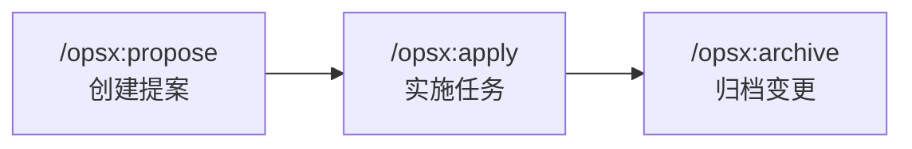

# OpenSpec 集成使用指南

> ai-spec-auto v2.0 | 适用于需要需求治理与变更归档的团队

---

## 一、OpenSpec 是什么

OpenSpec 是一个**规范驱动开发（Spec-Driven Development）**框架，通过结构化的**提案 → 实施 → 归档**流程管理代码变更。它与 ai-spec-auto  的关系是：

| 组件 | 管理范围 | 目录 |
|------|----------|------|
| **ai-spec-auto ** | 编码规范 + 实践技能 | `.agents/rules/` + `.agents/skills/` |
| **OpenSpec** | 需求流程（提案 → 实施 → 归档） | `openspec/` |

两者通过 `openspec/config.yaml` 桥接 — OpenSpec 在执行流程时自动引用 ai-spec-auto  的规范和技能。

```
需求 → /opsx:propose（创建提案、拆解任务）
             ↓
       /opsx:apply（按 ai-spec-auto  规范执行任务）
             ↓
       /opsx:archive（归档变更、合并规范）
```

### 适用场景

| 场景 | 是否需要 OpenSpec |
|------|------------------|
| 新功能开发（如"新增用户管理模块"） | 推荐使用 |
| 跨模块变更（如"重构权限体系"） | 推荐使用 |
| 需要团队评审的变更提案 | 推荐使用 |
| 已在 open change 内的小修正 | 继续复用当前 change，按 `patch / scope-delta` 增量处理 |
| 已归档内容的补丁修正 | 不直接改 archive，改走 `followup-patch` 新开补丁 change |
| 全新、低风险、单点小修正 | 可不进入 OpenSpec change，默认走 `bugfix-to-verification` 轻量留痕 |
| 样式微调、文案修改但明确要求归档 / 评审 / spec | 仍建议进入 OpenSpec 主流程 |

### 小需求分层策略

ai-spec-auto 不再把“小需求”简单等同于“直接开发即可”，而是先判断它属于哪一层：

| 当前上下文 | 默认路由 | 留痕位置 |
| --- | --- | --- |
| 当前有 active run | `patch / scope-delta / archive-fix` | 原 run + 原 change |
| 当前有未归档 change | `patch / scope-delta` | 原 `openspec/changes/<change-id>/` |
| 当前是已归档内容补修 | `followup-patch` | 新 patch change + `parent_change_id` |
| 当前没有可复用 change，且是低风险小修正 | `bugfix-to-verification` | `.ai-spec/history/<run-id>/` |
| 当前没有可复用 change，但需要长期追溯或风险更高 | `prd-to-delivery` | `openspec/changes/<change-id>/` |

---

## 二、安装

### 2.1 npx 安装（推荐）

```bash
cd /path/to/your-project
npx @engineered/ai-spec-auto@latest init . --profile vue
```

默认安装已经包含 OpenSpec。`--level L1/L2/L3` 现在只保留为兼容参数；只有你明确需要兼容旧安装模型时才再显式传入。

### 2.2 手动安装

```bash
git clone http://git.100credit.cn/zhenwei.li/ai-spec-auto.git ai-spec-auto
cd ai-spec-auto 
bash install.sh init /path/to/your-project --profile vue
```

### 2.3 安装后的目录结构

默认完整安装完成后，项目中会多出以下内容：

```
your-project/
├── .agents/                  # ai-spec-auto  规范与技能（L1 已有）
│   ├── rules/
│   └── skills/
├── .cursor/                  # IDE 适配（L2 已有）
│   ├── rules -> ../.agents/rules
│   ├── skills/
│   │   ├── create-component/ -> ../../.agents/skills/create-component
│   │   ├── ...
│   │   ├── openspec-propose/        ← OpenSpec 生成
│   │   └── openspec-apply-change/   ← OpenSpec 生成
│   └── mcp.json
├── .claude/                  # Claude Code 适配（L2 已有）
│   ├── rules -> ../.agents/rules
│   └── skills/
│
├── openspec/                 ← L3 新增
│   ├── config.yaml           # OpenSpec 配置（含 ai-spec-auto  上下文）
│   ├── AGENTS.md             # OpenSpec 命令说明
│   ├── specs/                # 已归档的规范（随项目积累）
│   └── changes/              # 进行中 + 已归档的变更
│       ├── add-user-module/  # 进行中的变更（示例）
│       └── archive/          # 已归档的变更
│
└── configs/                  # lint/format 配置
```

### 2.4 验证安装

```bash
npx @engineered/ai-spec-auto@latest check
```

检查项中应看到：

```
✔ .agents/ 存在
✔ .cursor/ 链接就绪
✔ openspec/ 存在
✔   config.yaml 存在
✔   specs/ 存在
✔   changes/ 存在
```

---

## 三、核心工作流

OpenSpec 默认使用 `core` 模式，提供三个核心命令：



### 3.1 /opsx:propose — 创建提案

在 AI IDE 中输入 `/opsx:propose`，描述你要做的变更：

```
你：/opsx:propose

AI：你想要创建什么变更？

你：新增一个用户管理模块，包含用户列表、用户详情、用户编辑三个页面，
    需要对接后端 /api/users 相关接口

AI：创建变更 add-user-management...
    ✓ openspec/changes/add-user-management/proposal.md
    ✓ openspec/changes/add-user-management/specs/
    ✓ openspec/changes/add-user-management/design.md
    ✓ openspec/changes/add-user-management/tasks.md
    变更提案已创建，准备好后可以执行 /opsx:apply
```

**propose 阶段产出的文件：**

| 文件 | 内容 |
|------|------|
| `proposal.md` | 变更概述：目标、背景、范围、影响 |
| `specs/` | 功能规范：每个 capability 的详细定义、验收场景 |
| `design.md` | 技术设计：方案选型、数据结构、组件拆分 |
| `tasks.md` | 任务清单：可逐项勾选的实施步骤 |

**与 ai-spec-auto  的联动：**

- AI 会自动读取 `openspec/config.yaml` 中的 `context` 字段，了解项目使用 ai-spec-auto  规范体系
- 创建的技术设计会遵循 `.agents/rules/` 中的架构约束
- 任务拆分由 OpenSpec 根据 `config.yaml` 中的 rules 自动生成，ai-spec-auto  通过 rules 注入规范约束而不干预产物生成

### 3.2 /opsx:apply — 实施任务

提案确认后，执行 `/opsx:apply` 开始逐项实施：

```
你：/opsx:apply

AI：开始实施 add-user-management...
    读取 .agents/rules/12-Superpowers执行规范.md
    按 tasks.md 逐项执行...

    任务 1: 创建用户列表页面
    → 按 .agents/rules/04-组件规范.md 创建组件
    → 按 .agents/rules/06-路由规范.md 注册路由
    → 按 .agents/rules/09-样式规范.md 使用主题变量
    ✓ 任务 1 完成

    任务 2: 对接用户列表接口
    → 按 .agents/rules/05-API规范.md 创建请求封装
    ✓ 任务 2 完成

    ... 继续执行 ...
```

**apply 阶段的规范保证：**

- 每个任务执行前会读取 `.agents/rules/12-Superpowers执行规范.md`
- 按 `.agents/skills/execute-task/SKILL.md` 的四步循环执行（头脑风暴 → TDD → 实现 → 审查）
- 涉及组件、接口、路由等操作时自动引用对应的 ai-spec-auto  规范和技能
- 每完成一个任务，自动在 `tasks.md` 中勾选

### 3.3 /opsx:archive — 归档变更

所有任务完成后，归档变更：

```
你：/opsx:archive

AI：归档 add-user-management...

    检查状态：
    ✓ proposal.md 存在
    ✓ specs/ 存在
    ✓ design.md 存在
    ✓ tasks.md 存在（8/8 任务完成）

    ✓ 规范已同步到 openspec/specs/
    ✓ 变更已归档到 openspec/changes/archive/2026-03-23-add-user-management/

    归档完成！
```

归档后的目录变化：

```
openspec/
├── specs/
│   └── user-management/         ← 新增：合并后的功能规范
│       └── spec.md
└── changes/
    └── archive/
        └── 2026-03-23-add-user-management/  ← 归档：完整变更记录
            ├── proposal.md
            ├── specs/
            ├── design.md
            └── tasks.md
```

---

## 四、config.yaml 详解

`openspec/config.yaml` 是 ai-spec-auto 与 OpenSpec 的桥梁。当前 L3 实施方案会同步一个项目级自定义 schema：`openspec/schemas/expert-delivery/`，并将 `config.yaml` 默认 schema 指向它。

```yaml
# OpenSpec 项目配置（由 ai-spec-auto 提供的增强版模板）
schema: expert-delivery

context: |
  本项目接入 ai-spec-auto 专家协同平台：
  - rules: .agents/rules/
  - skills: .agents/skills/
  - roles: .agents/roles/
  - flows: .agents/flows/
  - runtime: .ai-spec/

rules:
  proposal:
    - "先收敛目标、范围、非目标项、默认假设和风险，再进入实现。"
  specs:
    - "需求必须落为可测试的增量规范和场景。"
  tasks:
    - "任务必须可执行、可验证、可交接。"
  design:
    - "技术方案必须对齐项目目录、路由、API、状态、样式和测试约定。"
  checklist:
    - "必须明确通过项、未通过项、阻断项和是否建议放行。"
  iterations:
    - "必须记录问题、修正动作、残留风险和下轮提醒。"
```

### 各字段作用

| 字段 | 作用 |
|------|------|
| `schema` | 默认工作流 schema；当前推荐使用 `expert-delivery` |
| `context` | 项目上下文，告诉 OpenSpec 当前项目使用的规则、技能、角色和运行态入口 |
| `rules.proposal` | 约束提案如何收敛范围、假设与风险 |
| `rules.specs` | 约束增量规范如何表达需求和验收场景 |
| `rules.tasks` | 约束任务拆分必须可执行、可验证、可交接 |
| `rules.design` | 约束技术方案必须对齐仓库落点与项目规范 |
| `rules.checklist` | 约束守护阶段如何输出放行结论 |
| `rules.iterations` | 约束反馈阶段如何记录问题与残留风险 |

### 自定义 config.yaml

可以在 `config.yaml` 中追加项目特有的规则：

```yaml
rules:
  tasks:
    # ... 已有规则 ...
    - "数据库变更须先写 migration 脚本"
    - "新增页面须同步更新导航菜单配置"
  proposal:
    # ... 已有规则 ...
    - "涉及权限变更须在提案中说明影响范围"
```

---

## 五、进阶用法

### 5.1 /opsx:explore — 探索模式

需求不清晰时，先探索再提案：

```
你：/opsx:explore

AI：你想探索什么？

你：我们的列表页性能很差，加载 1000 条数据要 3 秒，
    不确定是前端渲染还是接口问题

AI：让我分析一下...
    [检查组件代码、接口响应、渲染逻辑]

    发现三个瓶颈：
    1. 未使用虚拟列表，DOM 节点过多
    2. 每行都有独立的格式化计算
    3. 接口未分页，一次返回全部数据

    建议拆为两个独立变更：
    1. 前端：引入虚拟列表 + 计算缓存
    2. 后端：接口改为分页

你：好，先处理前端部分

你：/opsx:propose

AI：基于探索结果创建提案...
```

### 5.2 并行变更

同时处理多个变更：

```
你：/opsx:propose
    → 创建 add-dark-mode 变更

你：/opsx:apply
    → 开始实施 add-dark-mode（进行到一半）

你：临时需要修一个紧急 bug

你：/opsx:propose
    → 创建 fix-login-redirect 变更

你：/opsx:apply fix-login-redirect
    → 切换到修 bug

你：/opsx:archive
    → 归档 fix-login-redirect

你：/opsx:apply add-dark-mode
    → 继续 dark-mode，从上次中断的任务继续
```

每个变更的文件在 `openspec/changes/<name>/` 下独立管理，互不干扰。

### 5.3 结合设计稿的完整流程

当需求包含设计稿时的推荐流程：

```
1. 触发 create-proposal 技能（前置分析）
   → 确认需求条件：设计稿、接口、交付形态
      ↓
2. 使用 design-analysis 技能分析设计稿
   → 产出 docs/样式还原/<名称>-UI分析清单.md
      ↓
3. /opsx:propose（OpenSpec 生成提案，自动读取 config.yaml 中的 ai-spec-auto  规则）
   → openspec/changes/<name>/ 下生成 proposal.md / specs/ / design.md / tasks.md
      ↓
4. 后置检查：确认 tasks.md 包含 UI 验收任务
      ↓
5. /opsx:apply（按分析清单逐项实施）
      ↓
6. 使用 ui-verification 技能验收 UI 还原
      ↓
7. /opsx:archive（归档）
```

---

## 六、团队协作

### 6.1 提案评审

`openspec/changes/<name>/proposal.md` 可以作为团队评审材料：

1. 开发者用 `/opsx:propose` 创建提案
2. 将 `proposal.md` 和 `tasks.md` 发给团队评审
3. 评审通过后执行 `/opsx:apply`
4. 完成后 `/opsx:archive` 归档

### 6.2 知识积累

归档的变更记录是团队的知识资产：

```
openspec/
├── specs/                       # 项目功能规范全景
│   ├── user-management/
│   ├── auth/
│   └── dashboard/
└── changes/archive/             # 变更历史
    ├── 2026-03-01-add-auth/
    ├── 2026-03-10-add-dashboard/
    └── 2026-03-23-add-user-management/
```

- `specs/` 累积形成项目的**功能全景文档**，新成员可快速了解系统
- `changes/archive/` 记录了每个功能的**决策过程**（为什么这样设计、考虑了哪些方案）

### 6.3 角色分工

| 角色 | 职责 |
|------|------|
| **规范 Owner** | 维护 `.agents/rules/` 的更新，定期同步最新规范 |
| **技能 Owner** | 维护高频技能（如 create-component）的准确度 |
| **流程 Owner** | 维护 `openspec/config.yaml` 配置、变更归档节奏、培训 |
| **开发者** | 使用 `/opsx:propose` → `/opsx:apply` → `/opsx:archive` 日常开发 |

---

## 七、命令完整参考

### 7.1 核心斜杠命令（core 模式，默认）

默认安装使用 `core` 模式，包含以下四个命令：

#### `/opsx:propose`

创建变更并一步生成全部规划产物（proposal、specs、design、tasks）。

```
语法：/opsx:propose [change-name-or-description]
```

| 参数 | 必填 | 说明 |
|------|------|------|
| `change-name-or-description` | 否 | kebab-case 名称或自然语言描述，不提供时 AI 会提示输入 |

- 创建 `openspec/changes/<name>/` 目录及所有规划产物
- 生成完毕后可直接执行 `/opsx:apply`
- 适合需求明确、可以一次性描述清楚的场景

#### `/opsx:explore`

探索和调研模式，用于需求不明确时的自由讨论，不创建任何产物文件。

```
语法：/opsx:explore [topic]
```

| 参数 | 必填 | 说明 |
|------|------|------|
| `topic` | 否 | 想要探索的主题或问题 |

- 可以调查代码库、比较技术方案、画图梳理思路
- 探索结束后可自然过渡到 `/opsx:propose` 创建正式变更
- 适合性能优化、架构决策、不确定范围的需求

#### `/opsx:apply`

按 `tasks.md` 逐项实施任务，写代码并勾选已完成项。

```
语法：/opsx:apply [change-name]
```

| 参数 | 必填 | 说明 |
|------|------|------|
| `change-name` | 否 | 指定要实施的变更名称，不提供时从上下文推断 |

- 读取 `tasks.md` 中未完成的任务，逐项执行
- 支持中断后恢复，从上次未完成的任务继续
- 并行变更时通过变更名称切换：`/opsx:apply add-dark-mode`

#### `/opsx:archive`

归档已完成的变更，将增量规范合并到主规范目录。

```
语法：/opsx:archive [change-name]
```

| 参数 | 必填 | 说明 |
|------|------|------|
| `change-name` | 否 | 指定要归档的变更名称，不提供时从上下文推断 |

- 检查产物完整性和任务完成状态
- 提示将增量规范同步到 `openspec/specs/`
- 将变更移动到 `openspec/changes/archive/YYYY-MM-DD-<name>/`
- 任务未全部完成时会警告但不阻止归档

### 7.2 扩展斜杠命令（需手动启用）

如需更细粒度的控制，可启用扩展模式：

```bash
openspec config profile    # 选择要启用的扩展命令
openspec update            # 应用配置
```

#### `/opsx:new`

创建变更骨架（仅目录和元数据），不生成规划产物文件。

```
语法：/opsx:new [change-name] [--schema <schema-name>]
```

| 参数 | 必填 | 说明 |
|------|------|------|
| `change-name` | 否 | 变更文件夹名称，不提供时提示输入 |
| `--schema` | 否 | 使用的工作流 schema（默认从 config.yaml 或 `spec-driven`） |

- 创建 `openspec/changes/<name>/` 目录和 `.openspec.yaml` 元数据
- 后续用 `/opsx:continue` 逐步创建产物，或 `/opsx:ff` 一次性生成
- 命名建议：`add-feature`、`fix-bug`、`refactor-module`，避免 `update`、`wip` 等模糊名称

#### `/opsx:continue`

按依赖链创建下一个产物，每次只创建一个，适合需要逐步审查的场景。

```
语法：/opsx:continue [change-name]
```

| 参数 | 必填 | 说明 |
|------|------|------|
| `change-name` | 否 | 指定变更名称，不提供时从上下文推断 |

- 查询产物依赖图，显示哪些已完成、哪些可创建、哪些被阻塞
- 每次创建一个就绪的产物，创建前自动读取依赖产物作为上下文
- 适合复杂变更、想在每一步审查后再继续的场景

#### `/opsx:ff`

快速前进（Fast-Forward），一次性生成全部规划产物。

```
语法：/opsx:ff [change-name]
```

| 参数 | 必填 | 说明 |
|------|------|------|
| `change-name` | 否 | 指定变更名称，不提供时从上下文推断 |

- 按依赖顺序创建所有产物（proposal → specs → design → tasks）
- 比 `/opsx:continue` 更快，适合需求清晰的中小型变更
- 生成完毕后可直接执行 `/opsx:apply`

#### `/opsx:verify`

验证实现与规范是否一致，从三个维度检查实现质量。

```
语法：/opsx:verify [change-name]
```

| 参数 | 必填 | 说明 |
|------|------|------|
| `change-name` | 否 | 指定变更名称，不提供时从上下文推断 |

验证维度：

| 维度 | 检查内容 |
|------|----------|
| **完整性**（Completeness） | 所有任务完成、所有需求已实现、场景已覆盖 |
| **正确性**（Correctness） | 实现匹配规范意图、边界情况已处理 |
| **一致性**（Coherence） | 设计决策体现在代码中、模式保持一致 |

- 问题分为 CRITICAL、WARNING、SUGGESTION 三个级别
- 不阻止归档，但建议在 `/opsx:archive` 前运行
- 适合审查 AI 产出质量

#### `/opsx:sync`

将变更的增量规范合并到主规范目录（`openspec/specs/`），但不归档变更。

```
语法：/opsx:sync [change-name]
```

| 参数 | 必填 | 说明 |
|------|------|------|
| `change-name` | 否 | 指定变更名称，不提供时从上下文推断 |

- 解析增量规范中的 ADDED / MODIFIED / REMOVED / RENAMED 部分
- 将变更合并到主规范，保留未涉及的内容
- 变更仍保持活跃状态（不归档）
- 通常不需要手动调用 — `/opsx:archive` 会自动提示同步

#### `/opsx:bulk-archive`

批量归档多个已完成的变更，自动处理规范冲突。

```
语法：/opsx:bulk-archive [change-names...]
```

| 参数 | 必填 | 说明 |
|------|------|------|
| `change-names` | 否 | 指定要归档的变更名称列表，不提供时提示选择 |

- 列出所有已完成的变更，检测规范冲突
- 按创建时间顺序归档，冲突时检查代码库实际状态来解决
- 适合并行开发后的批量收尾

#### `/opsx:onboard`

引导式交互教程，使用真实代码库演示完整的 OpenSpec 工作流。

```
语法：/opsx:onboard
```

- 扫描代码库寻找可改进的点，创建一个真实的小变更
- 按步骤引导：分析 → 创建变更 → 写提案 → 创建规范 → 设计 → 任务 → 实施 → 验证 → 归档
- 全程约 15-30 分钟，适合新用户学习工作流
- 创建的变更是真实的，可以保留也可以丢弃

### 7.3 CLI 终端命令

除了在 AI IDE 中使用斜杠命令外，OpenSpec 还提供 CLI 命令用于项目管理和调试：

#### 项目管理

| 命令 | 说明 |
|------|------|
| `openspec init` | 初始化项目，交互式选择工具和配置 |
| `openspec init --tools cursor,claude` | 非交互式初始化，指定工具 |
| `openspec init --force` | 跳过确认提示，适用于 CI 环境 |
| `openspec update` | 刷新 AI 指令文件（升级 OpenSpec 后运行） |
| `openspec config profile` | 配置工作流模式（core / 自定义选择扩展命令） |

#### 变更查看与验证

| 命令 | 说明 |
|------|------|
| `openspec list` | 列出所有活跃变更 |
| `openspec show <change>` | 查看变更详情 |
| `openspec validate <change>` | 验证规范格式是否正确 |
| `openspec view` | 打开交互式仪表盘 |
| `openspec status --change <change>` | 查看变更状态（产物完成情况、阻塞项） |

#### Schema 管理

| 命令 | 说明 |
|------|------|
| `openspec schemas` | 列出所有可用 schema |
| `openspec schema init <name>` | 从头创建自定义 schema |
| `openspec schema fork <source> <name>` | 基于已有 schema 创建副本并自定义 |
| `openspec schema validate <name>` | 验证自定义 schema 的语法和依赖 |
| `openspec schema which <name>` | 查看 schema 的来源路径 |
| `openspec schema which --all` | 列出所有 schema 的来源 |

#### 调试与诊断

| 命令 | 说明 |
|------|------|
| `openspec instructions <artifact> --change <change>` | 查看某个产物的 AI 指令（含注入的 context 和 rules） |
| `openspec --version` | 查看当前安装版本 |

### 7.4 不同 AI 工具的命令语法

不同的 AI 编码工具使用略有差异的命令语法，功能相同：

| 工具 | 语法示例 | 说明 |
|------|----------|------|
| Claude Code | `/opsx:propose`、`/opsx:apply` | 冒号分隔 |
| Cursor | `/opsx-propose`、`/opsx-apply` | 连字符分隔 |
| Windsurf | `/opsx-propose`、`/opsx-apply` | 连字符分隔 |
| Copilot (IDE) | `/opsx-propose`、`/opsx-apply` | 连字符分隔，仅 IDE 扩展支持 |
| Trae | `/openspec-propose`、`/openspec-apply` | 技能调用方式，无 `opsx-*` 命令文件 |

说明：
- Cursor 的 `/opsx-*` 连字符命令由 ai-spec-auto 安装时直接同步到 `.cursor/commands/`
- 不依赖 OpenSpec 额外“碰巧生成”这些命令文件

> **注意**：GitHub Copilot 的 prompt 文件仅在 IDE 扩展（VS Code、JetBrains、Visual Studio）中可用，Copilot CLI 暂不支持。

### 7.4.1 `ai-spec-auto` 协议命令补充

如果项目安装了 `ai-spec-auto` 的协议命令模板，除了 `opsx（OpenSpec 斜杠命令）` 之外，还会拿到一组项目级协议入口。需要人工审核时，推荐使用：

#### `/spec-start-review`

默认用 `main-flow-blocking（主流程阻塞审核）` 启动完整需求主流程，并允许在命令尾部追加 `CLI flags（命令行标志位）`。

```text
语法：/spec-start-review [--mode <auto|suggest|manual>] [--flow <flow-id>] [--review-policy <policy>] <需求描述>
```

| 参数 | 必填 | 说明 |
|------|------|------|
| `--mode` | 否 | `auto（自动） / suggest（建议） / manual（手动）`，默认 `auto（自动）` |
| `--flow` | 否 | 仅在 `manual（手动）` 时需要，手动锁定 `flow（流程模板）` |
| `--review-policy` | 否 | 默认 `main-flow-blocking（主流程阻塞审核）`，如显式传入则按传入值执行 |
| `需求描述` | 是 | 除 `flags（标志位）` 之外的剩余文本，全部作为 `--user-input` 透传 |

常见示例：

```text
/spec-start-review 创建订单列表 mock 页面
/spec-start-review --mode suggest 创建订单列表 mock 页面
/spec-start-review --mode manual --flow prd-to-delivery 创建订单列表 mock 页面
```

跨 IDE（开发工具）使用时，命令名保持一致，但底层模板来源不同：

| 工具 | 命令路径 | 说明 |
|------|----------|------|
| Cursor（开发工具） | `.cursor/commands/spec-start-review.md` | 由提示词解析命令尾部参数 |
| Claude Code（代码代理） | `.claude/commands/spec-start-review.md` | 使用 `$ARGUMENTS（全部参数占位符）` 承接整段参数 |
| Codex（代码代理） | `.codex/commands/spec-start-review.md` | 使用 `$ARGUMENTS（全部参数占位符）` 承接整段参数 |

如果项目安装时间较早，还没有同步到这个命令，可执行：

```bash
npx @engineered/ai-spec-auto@latest update . --update-commands
```

### 7.5 旧版命令迁移对照

如果你之前使用的是旧版 OpenSpec 命令，以下是与新版 OPSX 命令的对应关系：

| 旧版命令 | 新版 OPSX 等效命令 | 说明 |
|----------|-------------------|------|
| `/openspec:proposal` | `/opsx:propose`（core）或 `/opsx:new` + `/opsx:ff`（扩展） | 旧版一次性创建全部产物 |
| `/openspec:apply` | `/opsx:apply` | 功能一致 |
| `/openspec:archive` | `/opsx:archive` | 功能一致 |

- 旧版命令仍然可用，但推荐迁移到 OPSX 命令
- 旧版变更可以无缝使用 OPSX 命令继续操作，产物结构完全兼容
- 完整迁移指南参见 [迁移指南](https://github.com/Fission-AI/OpenSpec/blob/main/docs/migration-guide.md)

---

## 八、常见问题

**Q：L2 能否后续升级到 L3？**

可以。在已安装 L2 的项目中运行：

```bash
npx @engineered/ai-spec-auto@latest init --level L3
```

脚本会检测到 `.agents/` 已存在，只补充 OpenSpec 部分。

**Q：openspec init 执行失败怎么办？**

手动安装 OpenSpec CLI 后重新运行：

```bash
npm install -g @fission-ai/openspec@latest
npx openspec init --tools cursor,claude
```

**Q：config.yaml 被覆盖了怎么办？**

运行 `npx @engineered/ai-spec-auto@latest update --level L3`，脚本会检测 `config.yaml` 中是否已有 `context:` 字段，没有才追加，不会覆盖已有配置。

**Q：不是所有需求都需要走 OpenSpec 吧？**

对。OpenSpec 适合**需要规划和评审的中大型变更**，但小修改也不再是“完全无流程”。

当前推荐按分层留痕处理：

- 如果它已经在当前 open change 里，就继续走 `patch / scope-delta / archive-fix`
- 如果它是在已归档内容上补修，就走 `followup-patch`
- 如果它是全新、低风险、单点的小修正，就走 `bugfix-to-verification`，记录在 `.ai-spec/history/<run-id>/`
- 如果它虽然小，但你明确需要 `留痕 / 归档 / 评审 / spec`，仍建议走完整 OpenSpec 主流程

**Q：openspec/ 下的文件需要提交到 Git 吗？**

推荐提交。`specs/` 是项目功能规范的积累，`changes/archive/` 是变更决策记录，都是有价值的团队资产。`changes/` 下进行中的变更可以根据团队习惯决定是否提交。

**Q：如何查看当前进行中的变更？**

查看 `openspec/changes/` 目录，排除 `archive/` 子目录，剩下的就是进行中的变更。

---

## 九、从 L2 到 L3 的决策参考

| 维度 | L2（标准接入） | L3（含 OpenSpec） |
|------|---------------|------------------|
| 规范 + 技能 | ✓ | ✓ |
| IDE 适配 | ✓ | ✓ |
| MCP 模板 | ✓ | ✓ |
| 需求提案流程 | ✗ | ✓ |
| 变更任务管理 | ✗ | ✓ |
| 功能规范积累 | ✗ | ✓ |
| 变更历史归档 | ✗ | ✓ |
| 额外依赖 | 无 | `@fission-ai/openspec` |
| 适合团队 | 快速接入规范 | 需要需求治理的成熟团队 |

**建议**：团队先用 L2 跑 1-2 周熟悉规范体系，确认规范有效后再升级 L3 引入需求流程。

---

## 十、OpenSpec 官方文档导航

以下是 OpenSpec 官方文档的完整索引，点击中文名称可跳转到对应的 GitHub 文档页面：

| 文档 | 说明 |
|------|------|
| [快速入门](https://github.com/Fission-AI/OpenSpec/blob/main/docs/getting-started.md) | 安装后的第一步，了解基本工作流和产物结构 |
| [工作流模式](https://github.com/Fission-AI/OpenSpec/blob/main/docs/workflows.md) | 常见工作流组合模式：快速特性、探索式、并行变更、完成变更等 |
| [斜杠命令参考](https://github.com/Fission-AI/OpenSpec/blob/main/docs/commands.md) | 所有斜杠命令（`/opsx:*`）的完整参考，含语法、参数和示例 |
| [CLI 终端命令](https://github.com/Fission-AI/OpenSpec/blob/main/docs/cli.md) | `openspec` 终端命令的完整参考（init、update、list、show 等） |
| [核心概念](https://github.com/Fission-AI/OpenSpec/blob/main/docs/concepts.md) | 规范（Specs）、产物（Artifacts）、增量规范（Delta Specs）、Schema 等核心概念详解 |
| [自定义配置](https://github.com/Fission-AI/OpenSpec/blob/main/docs/customization.md) | 项目配置（config.yaml）、自定义 Schema、模板定制 |
| [OPSX 工作流详解](https://github.com/Fission-AI/OpenSpec/blob/main/docs/opsx.md) | OPSX 新工作流的设计理念、与旧版的区别、完整参考 |
| [支持的工具](https://github.com/Fission-AI/OpenSpec/blob/main/docs/supported-tools.md) | 20+ AI 编码工具的集成方式、文件路径和配置说明 |
| [多语言支持](https://github.com/Fission-AI/OpenSpec/blob/main/docs/multi-language.md) | 配置 OpenSpec 以中文、日文、西班牙文等非英语语言生成产物 |
| [安装指南](https://github.com/Fission-AI/OpenSpec/blob/main/docs/installation.md) | npm / pnpm / yarn / bun / nix 等多种安装方式 |
| [迁移指南](https://github.com/Fission-AI/OpenSpec/blob/main/docs/migration-guide.md) | 从旧版 OpenSpec 迁移到 OPSX 的完整指南 |
| [GitHub 仓库主页](https://github.com/Fission-AI/OpenSpec) | OpenSpec 项目主页、README、Star 和 Issue |
