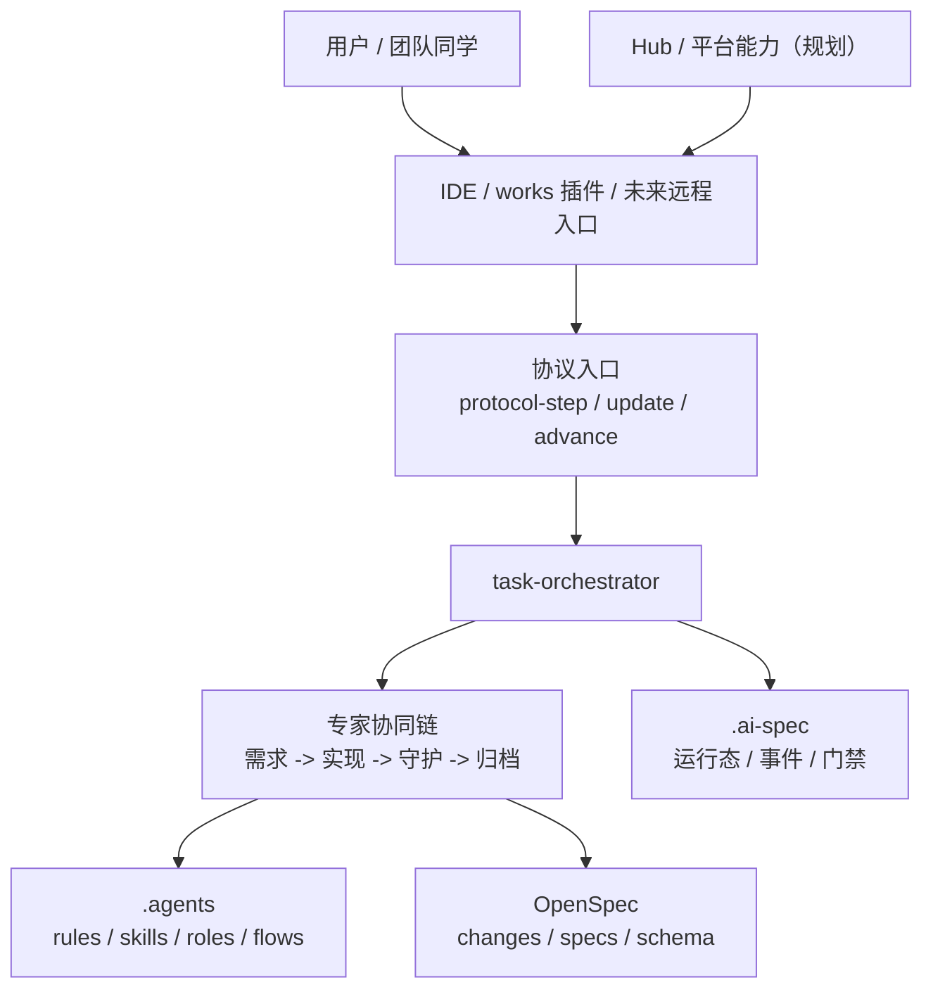
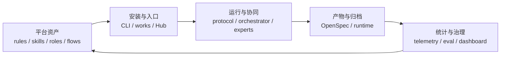

# AI 规范开发平台背景、竞品与推广规划

> 适用对象：项目负责人、平台负责人、团队管理者、方案设计同学  
> 文档定位：用于统一项目背景、对标思路、方案设计、推广口径和后续规划

## 1. 背景

### 1.1 为什么现在要做这件事

AI Coding 已经从“辅助写代码”进入“辅助完成需求到交付”的阶段。团队真正遇到的问题，已经不再是 AI 会不会写代码，而是下面这些更现实的问题：

- AI 能写，但不理解项目上下文
- AI 能产出结果，但不一定遵守团队规范
- 不同同学各自积累了一些 prompt、skill、经验，但无法稳定复用
- 一次任务做完后，只留下代码，不留下结构化的需求、设计、任务和检查结果
- 换一个 IDE、换一个模型、换一个会话，上一次的做法很难延续

这意味着团队需要的不是“再多一个 AI 工具”，而是一套能把 AI 研发活动纳入工程体系的底座。

### 1.2 当前项目要解决什么

`ai-spec-auto` 当前阶段要解决的是：

> 基于 `OpenSpec` 搭建一套可跨 IDE 复用、可按团队规范执行、可记录运行状态、可形成归档资产的 AI 规范开发底座。

它不是单点的 prompt 集合，也不是只服务某一个 IDE 的插件功能，而是围绕下面四件事搭建底层能力：

- 用 `OpenSpec` 承接变更产物
- 用 `.agents` 承接团队规则、技能、角色和流程
- 用 `task-orchestrator` 承接流程推进和门禁
- 用 `.ai-spec` 承接运行状态和事件事实

### 1.3 当前项目已经具备的基础

基于当前仓库现状，可以确认这些事实：

- 当前版本：`0.0.37`
- 已支持前端双 Profile：`Vue`、`React`
- 已支持多 IDE：`Cursor`、`Claude Code`、`OpenCode`、`Trae`，并复用 OpenSpec 支持的更多工具生态
- 已有 `21` 条规则文档
- 已有 `149` 份技能文档
- 已注册 `32` 个角色，其中 `5` 个为当前 active 角色
- 已有 `1` 条 active 主流程：`prd-to-delivery`
- 已有 `expert-delivery` 自定义 schema
- 已有 `8` 个 runtime 侧测试文件

当前 active 主链已经能够闭环：

`requirement-analyst -> frontend-implementer -> code-guardian -> before-archive -> archive-change`

这说明当前项目已经不是“纯概念设计”，而是进入了“底层主链可运行、可验证、可归档”的阶段。

### 1.4 当前阶段的明确边界

为了避免把规划说成已完成，需要明确：

- 当前主入口仍以 `CLI + IDE` 协作方式为主
- works 插件、Hub 平台、OpenClaw 远程入口还处于后续规划阶段
- 当前强项是“规范驱动 + 专家协同 + 运行态闭环”，不是“完全自治代理”
- 当前重点是把一个真实闭环跑稳，而不是同时做完整平台化产品

一句话总结当前阶段：

> 先把底层闭环跑通，再把平台入口、分发能力和统计能力逐步做起来。

---

## 2. 竞品分析

这里的“竞品”更准确地说，是当前市场和开源社区里几条与我们可对标、可借鉴的技术路线。

### 2.1 对标对象一：OpenSpec 原生方案

`OpenSpec` 的核心价值，是把 AI 编码从“聊天上下文驱动”拉回到“规范产物驱动”。

它强调：

- 先 proposal，再 apply，再 archive
- 用 `openspec/changes/` 管理进行中的变更
- 用 `openspec/specs/` 管理长期有效的规范
- 通过 schema 和 artifact 把流程结构化

它的优势是：

- 开源、轻量、容易接入
- 非常适合做规范驱动开发的底层骨架
- 对 brownfield 项目友好，适合已有项目持续演进

它的不足是：

- 它更像“通用规范工作流底座”，不是团队级规则治理平台
- 它不直接解决团队 rules / skills / roles / runtime 的组织问题
- 它不直接替团队定义项目级专家协同链

对我们的启发是：

> 不应该绕开 OpenSpec 重造规范流程，而应该把团队增强层挂在 OpenSpec 之上。

### 2.2 对标对象二：Cursor 路线

Cursor 近阶段的重点能力，已经从 IDE 内同步对话，扩展到：

- `Background Agents`
- `Bugbot`
- 插件 / Marketplace
- 自动化与远程 Agent 运行能力

它的优势是：

- 交互体验强，入口自然
- 对异步远程代理、PR Review、自动化场景支持较快
- 在“AI 帮你执行任务”这一层很强

它的不足是：

- 更偏产品级 AI 执行体验，不等于团队级规范治理
- 强依赖其自身产品能力和远程环境
- 如果团队没有把规则、流程、产物、运行态固化，本质上仍容易停留在“工具很强、团队方法不稳定”

对我们的启发是：

> 插件体验和异步代理很重要，但前提仍然是要先有一套团队可复用的规范底座。

### 2.3 对标对象三：GitHub Copilot Coding Agent 路线

GitHub Copilot Coding Agent 的特点是：

- 可以在后台完成任务并发起 PR
- 更深地融入 GitHub 仓库、Issue、PR、Actions 工作流
- 支持通过 MCP、Custom Agents、Hooks、Firewall 等机制做扩展与治理

它的优势是：

- 跟 GitHub 工作流结合得非常深
- 审核、分支、PR、日志和安全控制天然接近企业级协作
- 适合“把 AI Agent 融入已有 GitHub 研发流程”

它的不足是：

- 更依赖 GitHub 平台生态
- 更偏“平台托管的编码代理”，不直接等于本地项目内的规范资产体系
- 如果团队自己的 rules / skills / schema / runtime 没有沉淀，仍然会缺少项目级、团队级复用底座

对我们的启发是：

> 后续要考虑仓库平台协同和安全治理，但底层项目内规范资产仍然必须掌握在团队自己手里。

### 2.4 我们当前路线的差异化

和上面几条路线相比，`ai-spec-auto` 当前最有价值的差异点是：

1. 不是只做“AI 更会写代码”，而是做“AI 参与研发时如何按团队规范工作”
2. 不是只依赖某一个 IDE，而是做跨 IDE 可复用的底座
3. 不是只做产物管理，而是把 `rules + skills + roles + flows + runtime` 组织成一个整体
4. 不是只做未来平台规划，而是已经先把一条真实主链跑通了

所以更准确的定位不是“和 Cursor、Copilot 正面替代”，而是：

> 在团队内部建设一套可以承接不同 IDE、不同模型、不同入口的 AI 规范开发底层引擎。

### 2.5 对标结论

| 路线 | 强项 | 短板 | 我们应吸收什么 |
| --- | --- | --- | --- |
| OpenSpec 原生 | 轻量、规范驱动、brownfield 友好 | 缺团队增强层 | 用它做变更产物和 schema 底座 |
| Cursor 路线 | 交互体验强、远程异步代理能力强 | 团队规范治理不是核心 | 借鉴插件入口、异步代理、Review 体验 |
| GitHub Copilot Agent 路线 | GitHub 工作流深度融合、安全治理强 | 平台依赖强 | 借鉴 PR/Agent/治理/指标体系 |
| `ai-spec-auto` 当前路线 | 团队规范、专家协同、运行态闭环一体化 | 产品入口和统计仍在建设中 | 持续把底层做稳，再放大到插件和平台层 |

---

## 3. 方案设计

这一部分不只讲“我们做什么工具”，还要讲“团队现在应该怎么落地”。

### 3.1 方案一：人工推进版

这是最容易起步、但扩展性最弱的做法。

核心做法是：

- 由团队人工维护规范文档
- 由同学在聊天中口头告诉 AI 项目约定
- 用人工方式检查 proposal、设计、代码、测试和归档
- 通过群聊、评审、口头提醒维持一致性

优点：

- 启动成本低
- 不需要先建完整工具链
- 适合前期摸索规则边界

缺点：

- 很依赖个人经验
- 换人、换会话、换 IDE 后稳定性差
- 难以规模化推广
- 很难统计真实效果

适合场景：

- 小范围试点
- 规则仍在探索期
- 团队还没准备好一次性接入完整工具链

### 3.2 方案二：工具加速版

这是当前项目推荐的主方案。

核心思路是：

- 用 `OpenSpec` 统一提案、实现、归档产物
- 用 `.agents/rules/` 固化团队约束
- 用 `.agents/skills/` 固化高频操作做法
- 用 `.agents/roles/` 和 `.agents/flows/` 定义专家协同链
- 用 `.ai-spec` 记录运行状态
- 用 `CLI` 作为当前阶段的安装与执行引擎

优点：

- 团队规范可以沉淀成仓库资产
- 产物、流程、状态都可追溯
- 便于后续接入 works 插件、Hub、OpenClaw、CI/CD
- 具备可验证、可推广、可统计的基础

缺点：

- 初期需要整理规则、技能、流程
- 团队需要建立统一使用习惯
- 入口体验还需要后续用插件页面进一步优化

适合场景：

- 已经进入团队推广阶段
- 需要跨项目、跨成员稳定复用
- 希望后续做插件化和平台化

### 3.3 当前推荐策略：人工先定规则，工具承接执行

从实施节奏上，不建议走两个极端：

- 不是只靠人工长期维持
- 也不是一开始就追求完全自动化平台

当前更合理的方案是：

1. 先通过人工方式明确团队规则和高频场景
2. 再把这些规则和场景固化到 `.agents` 和 `OpenSpec`
3. 先用 `CLI + IDE` 跑通一条最小主链
4. 再把入口、统计、平台分发做成产品能力

也就是说：

> 人工负责沉淀方法，工具负责放大方法。

### 3.4 当前项目的目标方案结构

### 3.5 方案设计结论

从当前阶段看，最推荐的落地路径是：

- 短期：以工具加速版为主，但保留人工校准和关键节点确认
- 中期：通过 works 插件降低使用门槛，让团队更自然地进入规范开发流程
- 长期：形成“平台资产 + 插件入口 + 运行引擎 + 统计治理”的完整闭环

---

## 4. 推广统计

这里分成两部分来看：当前项目资产盘点，以及后续建议统计口径。

### 4.1 当前项目资产盘点

当前仓库已经具备的可推广资产包括：

| 维度 | 当前现状 |
| --- | --- |
| 版本 | `0.0.37` |
| 支持 Profile | `Vue`、`React` |
| 支持入口 | `Cursor`、`Claude Code`、`OpenCode`、`Trae`，以及 OpenSpec 支持的更多工具 |
| 规则文档 | `21` |
| 技能文档 | `149` |
| 已注册角色 | `32` |
| Active 角色 | `5` |
| Active 流程 | `1` |
| 自定义 schema | `expert-delivery` |
| runtime 测试文件 | `8` |

这部分数据说明当前项目已经具备“可试点、可讲解、可扩展”的基本条件。

### 4.2 推广统计应该看什么

后续推广时，不建议只统计：

- 安装次数
- skill 数量
- 文档数量

这些只能说明“资产存在”，不能说明“团队是否真正用起来了”。

更建议统计下面几类指标：

#### 一类：接入指标

- 已接入项目数
- 已启用 Profile 数
- 已接入 IDE 类型分布
- L1 / L2 / L3 各层级使用占比

#### 二类：使用指标

- 每周活跃流程数
- `protocol-step` 发起次数
- `proposal -> archive` 闭环完成次数
- 活跃专家调用次数
- `before-implementation` / `before-archive` 门禁触发次数

#### 三类：质量指标

- `checklist` 通过率
- `current-run.json` 成功率
- 归档一致率
- 人工返工率
- 规范类 Review 意见数变化

#### 四类：推广指标

- 试点团队数
- 试点项目闭环率
- 团队培训覆盖率
- 新人完成第一次规范开发闭环所需时间
- 团队复用同一规则 / 技能 / 流程的次数

### 4.3 当前可以先采用的统计口径

基于仓库现状和已有文档，建议先采用下面这套统计模型：

| 阶段 | 建议关注指标 | 说明 |
| --- | --- | --- |
| 试点期 | 接入项目数、闭环完成率、归档成功率 | 先证明能跑通 |
| 扩展期 | 活跃流程数、活跃专家数、复用率 | 先证明能复用 |
| 平台期 | 覆盖率、效率提升、返工率、观测链路覆盖率 | 再证明能规模化 |

### 4.4 当前可参考的效率预期

这部分不是现网统计结果，而是当前项目需求文档里的预期口径，适合作为后续试点的对照基线：

- AI 代码接受行比：从约 `30%` 提升到约 `70%+`
- 代码采纳率：从约 `40%` 提升到约 `80%+`
- Code Review 耗时：减少约 `50%+`
- 新人上手时间：缩短约 `70%+`
- 规范沟通频次：减少约 `80%+`

这组指标更适合作为“试点前后对照目标”，而不是当前已经验证完成的对外宣传数据。

### 4.5 推广统计的核心原则

推广统计要避免两个误区：

1. 只统计资产数量，不统计实际闭环效果
2. 只统计工具安装，不统计团队是否真正形成使用习惯

更合理的原则是：

> 先证明能闭环，再证明能复用，最后证明能提效。

---

## 5. 后续规划

### 5.1 短期规划：把底层主链做稳

短期重点不是继续扩概念，而是把当前主链打磨到可以稳定推广：

- 稳定 `requirement-analyst -> frontend-implementer -> code-guardian -> archive-change`
- 继续完善 `config.yaml + schema + rules + skills` 的协同
- 通过最小示例、真实试点、归档闭环证明底层可靠
- 把团队培训、最佳实践文档、测试说明补齐

短期成功标准：

- 至少能稳定支撑 1 到 2 个项目试点
- 团队成员能够理解并跑通一次完整闭环
- 文档、流程、运行态、归档口径一致

### 5.2 中期规划：把入口和能力包做出来

中期重点是降低团队使用门槛、提升按需接入能力：

- works 插件作为更自然的团队入口
- 按技术栈、能力域、流程包做能力选择
- 从 5 个 active 角色逐步扩到更多可启用专家
- 补齐安装选择、能力展示、推荐阅读和操作引导
- 建立基础 telemetry 和推广统计链路

中期成功标准：

- 团队不再只能通过 CLI 理解能力
- 同一个底座能服务多个项目、多个场景
- 推广不再依赖少数核心同学口头带教

### 5.3 长期规划：形成平台化闭环

长期目标是把当前项目升级为更完整的 AI 规范开发平台：

- Hub 负责能力管理与分发
- works 插件负责页面化入口和体验承载
- OpenClaw 负责远程触发和状态回传
- CI/CD 负责校验、回归、规范合规性
- 度量平台负责安装、使用、质量、提效统计

长期目标不是单纯“功能更多”，而是形成下面的闭环：

### 5.4 当前不建议过早做的事情

为了保证节奏，不建议当前阶段同时追求：

- 完整自治代理
- 完整插件产品
- 完整平台管理后台
- 完整可观测与商业化指标体系

当前阶段更重要的是：

> 先把一个真实团队能用的规范开发闭环做实，再逐步放大为平台。

---

## 6. 结论

从当前项目和未来规划来看，`ai-spec-auto` 最适合的定位不是“单点 AI 工具”，而是：

> 一个以 `OpenSpec` 为规范产物底座、以 `.agents` 为团队治理层、以 `task-orchestrator` 为协同引擎、以 `.ai-spec` 为运行事实来源的 AI 规范开发平台底层。

如果从方案设计角度给出结论，建议统一成下面三点：

1. 短期不追求“什么都自动化”，而是先把底层闭环跑稳
2. 中期通过 works 插件和能力包化设计降低团队接入门槛
3. 长期形成“平台资产 + 入口产品 + 运行引擎 + 度量治理”的完整体系

换句话说，这个项目真正要做成的，不是一个更会写代码的 AI，而是一套让团队可以持续、稳定、可治理地使用 AI 的研发基础设施。

---

## 7. 参考资料

- [OpenSpec 官方仓库](https://github.com/Fission-AI/OpenSpec)
- [OpenSpec 官网](https://openspec.dev/)
- [Cursor Background Agents 文档](https://docs.cursor.com/background-agents/overview)
- [Cursor Bugbot 文档](https://docs.cursor.com/bugbot)
- [Cursor Changelog](https://cursor.com/changelog/)
- [GitHub Copilot Coding Agent 官方文档](https://docs.github.com/copilot/concepts/coding-agent)
  - 当前仓库内文档：
  - `docs/four/项目介绍与运行机制说明.md`
  - `docs/paser_three/团队同学AI规范开发最佳实践.md`
  - `docs/paser_three/OpenSpec配置与协作深入版.md`
  - `docs/paser_two/规范驱动开发平台-渐进式实施与内部推广方案.md`
  - `docs/paser_two/AI驱动前端自动化流水线平台-领导汇报版.md`
  - `docs/项目需求说明.md`
