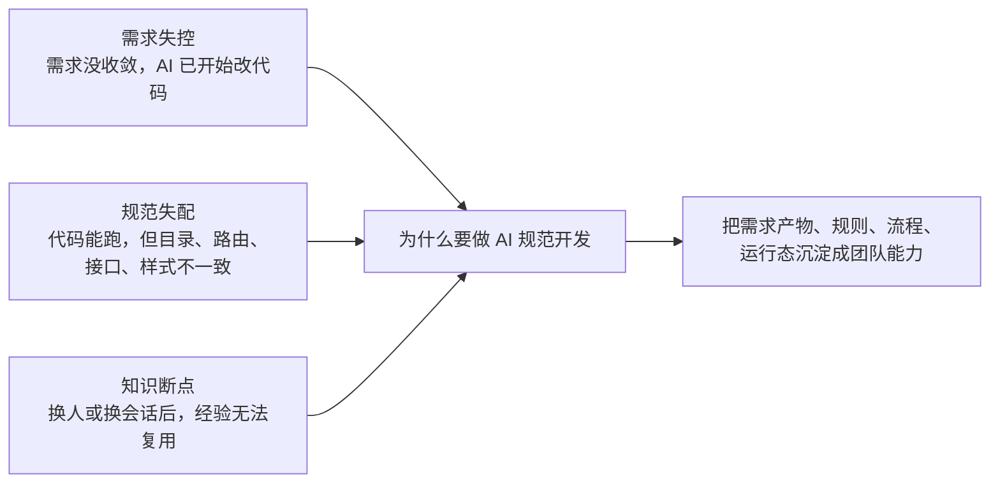
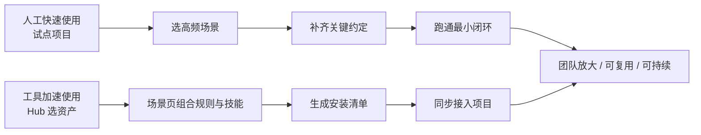
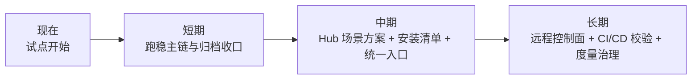

# 开发人员 AI 规范开发最佳实践

这篇文档只回答两件事：为什么 AI 开发不能再停留在“谁更会写 prompt”，以及今天怎么开始用规范化的方法做开发。  
**AI Coding 下半场，重点不是让 AI 更快写，而是让 AI 按团队方法稳定地做。**

## 背景

**本章判断：现在真正缺的，不是更会写 prompt，而是让 AI 能稳定接入日常开发流程。**



- 场景 1：需求刚说了半句，AI 已经开始改代码。最后功能做出来了，但不是大家真正想要的，返工还是回到团队自己身上。
- 场景 2：代码功能没问题，但目录、路由、接口、样式、测试约定不一致。上线能过，交接很难，维护成本越来越高。
- 场景 3：一次会话里做得不错，换一个开发人员、换一个会话就接不上。经验停留在聊天记录里，没有沉淀成 `proposal / design / tasks / checklist / archive` 这些可复用资产。

今天真正拉开差距的，不是“谁更会用 AI”，而是“谁能把 AI 稳定纳入软件工程体系”。

## 竞品分析

**本章判断：外部路线值得吸收，但我们的重点不是做理论最全，而是做团队今天能落地的实操路线。**

| 路线 | 更偏解决什么问题 | 最值得吸收什么 | 我们还要补什么 |
| --- | --- | --- | --- |
| `spec-kit` | 让需求先沉淀成规范产物，再进入实现 | artifact-first、spec-driven | 团队规则、流程状态和归档收口 |
| `superpowers` | 把高频做法和执行纪律沉淀成工作流 | methodology-as-code、workflow-driven | 项目接入方式和团队资产管理 |
| `harness engineering` | 让上下文、约束和反馈组成稳定系统 | system-driven、先设计系统再用模型 | 面向开发人员的落地路径 |
| 我们当前路线 | 把需求产物、团队规则和流程状态放进同一套机制里 | 偏实操、偏项目接入、偏团队复用 | 入口体验和平台化能力仍在持续建设 |

- `spec-kit` 提醒我们先有产物，再进入实现。
- `superpowers` 提醒我们先有方法，再让 AI 执行。
- `harness engineering` 提醒我们先把系统设计好，不要只迷信模型。

我们当前的取法更直接：把需求产物、团队规则和流程状态放进同一套机制里，让开发人员不只是“会用 AI”，而是“按统一方法把事情做完”。`Cursor / Copilot` 当然重要，但它们更像入口和执行体验层，不是团队规范资产本身。

## 方案设计

**本章判断：先用人工路径把最小闭环跑通，再用工具路径把方法放大。**



### 人工快速使用

先不要一上来全团队铺开，先找 1 个试点项目、1 个高频场景，把最小闭环跑通。

1. 在试点项目完成接入。Vue 项目可以直接执行：

```bash
npx @engineered/ai-spec-auto@latest init . --profile vue --level L3
```

React 项目只需要把 `--profile vue` 换成 `--profile react`。

2. 选 1 个高频场景，建议从 mock 页、列表页改版、设计稿还原这类低风险任务开始。

3. 在 IDE 发起任务。例如：

```text
/spec-start 创建一个商品详情 mock 页面，只做演示版，数据本地 mock
```

4. 按流程推进与确认。常见交互是：

```text
/spec-continue
同意归档
```

5. 复盘并回补规则、技能和文档。重点不是“这次做完了”，而是“下次同类任务更容易做好”。

当前已经稳定下来的最小主链可以理解成：需求分析 -> 开发实现 -> 规范检查 -> 归档收口，对应系统里的角色依次是 `requirement-analyst -> frontend-implementer -> code-guardian -> archive-change`。

### 工具加速使用

当试点已经证明这套方法有效，下一步就不是继续靠人记住流程，而是把流程变成可安装、可复制、可推广的资产。

1. 在 [Hub 平台](/Users/lizhenwei/workspace/vueworkspace/bairong/skill-q-platform/README.md) 选择技能包、规则包和场景方案。
2. 在场景页组合角色、技能和规则，生成安装清单（manifest）。
3. 在目标项目执行同步：

```bash
npx @engineered/ai-spec-auto@latest sync . --manifest ./manifest.json
```

4. 让团队在统一资产上继续运行和复用，而不是每个项目重新从零搭一遍。

可以把这条链理解成四句话：Hub 负责“选资产”，安装清单负责“描述要装什么”，`@engineered/ai-spec-auto` 负责“解析并安装”，目标项目负责“承接并运行”。如果要看安装清单的详细结构，再继续看 [Manifest安装清单规范.md](../paser_two/Manifest安装清单规范.md)。

**一句话收口：人工方案解决“先开始”，工具方案解决“可复制、可扩展、可持续”。**

## 推广统计

**本章判断：推广不是看装了多少次工具，而是看有没有形成闭环、复用和提效。**

| 层次 | 重点看什么 | 团队能感知到什么 |
| --- | --- | --- |
| 接入层 | 有多少项目开始用，接入深度如何，主要通过 IDE 还是 Hub / 安装清单接入 | 试点是否真的启动，而不是停留在讨论里 |
| 过程层 | 有没有形成从需求产物到归档收口的完整闭环，关键门禁是否真正被触发，活跃流程和活跃角色是否持续使用 | 团队是不是在按统一方法推进，而不是各做各的 |
| 结果层 | Review 里的规范问题是否减少，返工率是否下降，规则 / 技能 / 安装清单 / 场景包是否被复用 | 同类任务是否越来越少靠个人记忆，越来越多靠团队资产 |

当前已经确认的资产底盘是：`v0.0.37`、`21` 条规则、`25` 个技能、`32` 个角色、`5` 个活跃角色、`1` 条活跃流程。

真正值得团队关注的，不只是资产数量，而是两个信号：一次任务完成后，别人是不是更容易接着做；同类任务下次是不是不用重新摸索一遍。

## 后续规划

**本章判断：这件事不是一步到位，但路径已经明确，可以从试点闭环逐步走向平台化协同。**



- 现在：先把试点项目跑起来，让团队知道这套方法不是纸上方案。
- 短期：把当前主链、归档收口和团队文档打磨稳定，让试点项目持续出结果。
- 中期：把 Hub 场景方案、安装清单、统一入口和流程模板矩阵做出来，让更多开发人员按场景接入，而不是先学一堆命令。
- 长期：把平台资产、远程控制面、CI/CD 校验和度量治理连成一体，逐步形成统一的团队协同底座。

对开发人员来说，最终想看到的变化其实很简单：今天还是少数人会用 AI，未来会变成团队按统一方法使用 AI；今天主要靠本地 IDE，未来会变成 IDE、Hub 和远程控制面共享同一套底座。
