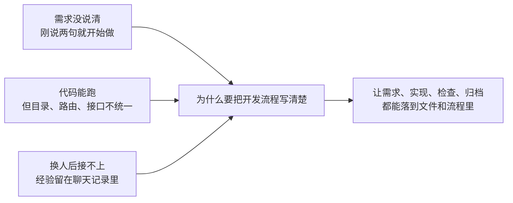
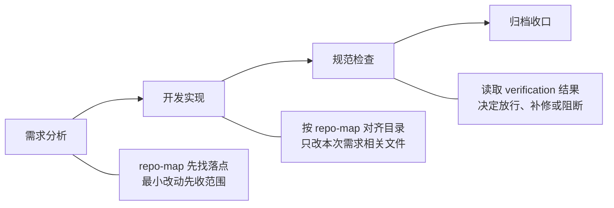
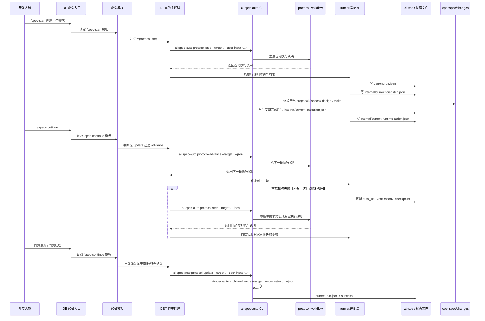
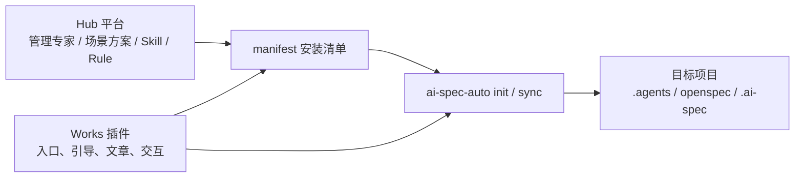
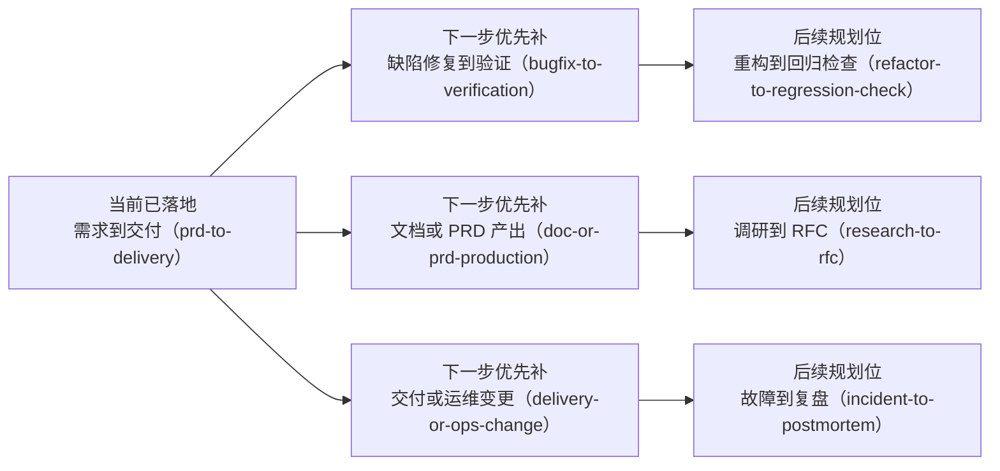
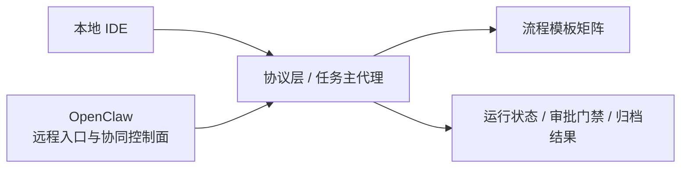
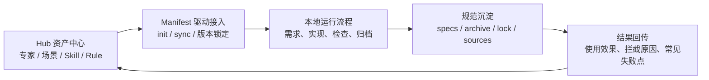

# 开发人员规范化开发实践：为什么值得学，怎么开始用

> 建议阅读时长：6 到 8 分钟

这篇文档只回答两件事：为什么 AI 开发不能再停留在“谁更会写 prompt”，以及今天怎么开始用规范化的方法做开发。  
重点不在让 AI 更快写，而在让它按团队方法稳定地做。下面就围绕这两件事展开：为什么值得学、第一次接项目先看什么、输入 `/spec-start` 后项目里会发生什么。

## 背景

现在最麻烦的，早就不是“写不写得出来”，而是“写出来之后接不接得住”。需求刚说两句代码就开始改，功能虽然做完了但不符合项目约定，这次能交，下次别人却接不上手。真正拖慢团队的，往往不是不会写，而是每次都要重新对齐、重新返工、重新补洞。



- 需求还没收敛，代码已经动起来了，返工还是算在开发上。
- 功能虽然做出来了，但目录、路由、接口、样式不按项目约定走，后面改起来比重写还累。
- 一次会话里做得不错，换个人或换个时间点就接不上，因为真正能复用的东西没有落到项目里。

说到底，问题不在“会不会用 AI”，而在“这套做法能不能稳定复用，不靠个人记忆”。

## 竞品分析

如果只比“谁能写代码、谁能改文件”，很容易把这章写浅。对我们来说，更有价值的比较方式是看三件事：抽象层级怎么选、协作靠什么传递、状态靠什么治理。

### 格局定位

| 维度 | `LangGraph`（状态驱动型） | `Aider`（极客工具型） | `ai-spec-auto`（规范驱动型） |
| --- | --- | --- | --- |
| 核心哲学 | 用图和状态机控制长任务 | 用代码地图和精确编辑解决单点修改 | 用 OpenSpec、专家分工和运行状态把需求到归档串成稳定流程 |
| 适用场景 | 复杂流程、循环节点、多步长任务 | 个人开发者快速修改、重构、定位代码 | 团队协作、规范落盘、多人接力、长期维护 |
| 协作方式 | 节点和状态边驱动 | 以当前会话和代码编辑为中心 | 以产物文件、专家说明、运行状态为中心 |
| 治理重点 | 状态转换、回环控制、可恢复 | 修改精度、仓库感知、反馈快 | 规范约束、交接一致性、变更可追踪 |

放在一起看，`LangGraph` 更像流程控制框架，`Aider` 更像高效率编码工具，而 `ai-spec-auto` 更像把规范、流程、产物和专家协作串起来的协议层。

### 关键技术路径

| 对比点 | 常见做法 | `ai-spec-auto` 当前做法 |
| --- | --- | --- |
| 上下文治理 | 依赖聊天记录或启发式片段注入，越到后面越容易变重 | 按专家裁剪上下文，只给当前专家必要的规则、产物快照和读写边界 |
| 协作交接 | 经常把整段对话历史往后传，噪声多 | 交接主要靠 `proposal / specs / design / tasks / checklist / iterations` 和 `.ai-spec` 状态文件 |
| 状态治理 | 流程状态混在会话里，容易漂 | 默认用 `current-run.json` 的 `events` 管状态；需要恢复快照时再显式开启 `checkpoints/` |
| 确认机制 | 很多时候还是靠口头确认 | 把 `before-implementation`、`before-archive` 做成显式门禁，配合 `protocol-update` 和验证结果推进 |

真正的差异不在“能不能写代码”，而在“怎么把上下文、交接和状态治理成一套能长期复用的开发流程”。

### 借鉴边界

放回当前项目里看，可以把对这两个方向的借鉴记成一句话：

- 对 `LangGraph`，我们借的是状态机、门禁、checkpoint / restore 和有限回环这些思路。
- 对 `Aider`，我们借的是代码地图、验证结果回灌、最小改动和一次自动修补这些思路。

但我们没有照搬它们的完整产品形态。当前阶段更重要的是先把开发人员日常最常见的需求、实现、检查、归档这条链跑稳。

## 方案设计

这一章重点讲三件事：项目里先看哪些目录、第一次怎么开始、输入 `/spec-start` 后到底发生了什么。

### 项目目录与关键文件

先记住这几个位置，开发阶段大多数问题都绕不开它们：

```text
project-root/
├── bin/                         # CLI 命令入口，想看命令从哪进先看这里
│   ├── cli.js                   # 命令总入口
│   ├── protocol-workflow.js     # 协议入口：开第一轮、推进下一轮、记录补充输入和审批结果
│   ├── task-orchestrator-runner.js # 应用本轮结果、写状态、决定是否切到下一专家
│   └── sync.js                  # 按安装清单同步项目
├── internal/                    # 协议和流程实现，想看命令背后的逻辑再看这里
│   └── ai-protocol-workflow.js  # 生成本轮执行说明，决定下一步该调哪个协议命令
├── .agents/                     # 团队约定和常用做法，新接项目先看这里
│   ├── rules/                   # 规则约束
│   ├── skills/                  # 常用做法
│   ├── roles/                   # 专家分工
│   ├── flows/                   # 流程模板
│   └── commands/common/         # IDE 里最常用的命令模板
│       ├── spec-start.md        # 第一次发起需求时会读这个模板
│       └── spec-continue.md     # 继续推进、审批确认、归档确认时会读这个模板
├── openspec/
│   ├── config.yaml             # 这条流程接了哪些规范，边界是什么
│   ├── changes/<change-id>/    # 这次需求沉淀下来的产物
│   │   ├── proposal.md         # 目标、范围、默认假设、风险
│   │   ├── design.md           # 方案落点和关键约束
│   │   ├── tasks.md            # 可执行任务清单
│   │   ├── checklist.md        # 交付检查结论
│   │   ├── iterations.md       # 问题、修正动作、残留风险
│   │   └── specs/              # 本次需求对应的增量规范
│   └── specs/                  # 已归档、可长期复用的规范
└── .ai-spec/
    ├── manifest.json           # 当前项目装了哪些规则、技能、专家和流程
    ├── current-run.json        # 这轮任务现在走到哪一步了
    ├── checkpoints/            # 仅在 AI_SPEC_PERSIST_CHECKPOINTS=1 时写入，便于回看和恢复
    │   └── <run-id>/           # 例如 001-bootstrap.json、002-handoff.json
    ├── repo-map.json           # 当前仓库关键目录映射，帮助流程判断页面、路由、mock、接口落点
    └── internal/
        ├── tmp/
        │   ├── task-orchestrator-reply.md   # 主代理当前回复草稿
        │   ├── task-orchestrator-turn.json  # 本轮执行说明草稿
        │   ├── current-dispatch.json        # 当前轮派发草稿
        │   ├── current-execution.json       # 当前专家执行草稿
        │   └── current-runtime-action.json  # 下一步动作草稿
        ├── current-dispatch.json            # 当前轮该谁接手
        ├── current-execution.json           # 当前专家刚做了什么
        └── current-runtime-action.json      # 下一步交给谁，或卡在什么确认点
```

看状态优先查 `current-run.json` 和其中的 `events`；看产物优先查 `openspec/changes/<change-id>/`；看命令入口查 `bin/` 和 `internal/`；如果显式开启了 checkpoint，再去看 `.ai-spec/checkpoints/`。

### 人工快速使用

如果是第一次接，最稳的办法不是一下子铺开，而是先拿一个低风险场景跑通，比如 mock 页、列表页改版、设计稿还原。

```bash
# 在试点项目完成接入（Vue 项目）
npx @engineered/ai-spec-auto@latest init . --profile vue --level L3

# 如果是 React 项目，把 profile 换成 react
npx @engineered/ai-spec-auto@latest init . --profile react --level L3
```

```text
# 在 IDE 里发起一个低风险需求
/spec-start 创建一个商品详情 mock 页面，只做演示版，数据本地 mock

# 按流程继续推进
/spec-continue

# 遇到归档确认时输入
同意归档
```

任务做完后，不要只看“这次完成了没有”，还要把踩坑点补回规则和文档里。当前最小链可以先理解成四步：需求分析、开发实现、规范检查、归档收口。

如果把流程里几个容易忽略、但很实用的点单独拎出来，可以先记成下面这张图：



- `repo-map` 负责先把页面、路由、mock、接口这些落点找出来，减少“这个文件到底该放哪”的来回确认。
- `verification` 负责把 `build / lint / test` 的结果接回流程里，后面的规范检查不是凭感觉判断，而是直接看结果。
- `最小改动` 负责把范围收住，避免一边做一边扩，或者修一个问题顺手改一大片。

### 从 `/spec-start` 到归档，命令和文件怎么串起来的

下面这张图说的就是：你在 IDE 里打一条命令后，项目里到底会发生什么。



这条链可以这么理解：

- `/spec-start` 会先读取 `.agents/commands/common/spec-start.md`，再由 IDE 里的主代理执行第一条命令：`protocol-step`。
- `protocol-workflow.js` 可以先记成一个协议入口。里面最常用的 3 个命令分别负责不同事情：
  - `protocol-step`：开第一轮，或者在需要时重新拿一份最新的执行说明。
  - `protocol-advance`：当前一轮做完后，推进到下一轮。
  - `protocol-update`：记录补充输入、审批意见和归档决定；在 `before-archive` 这类场景下，它还可以直接走快速收口，不必再额外空跑一次推进。
- `protocol-step` 会返回一份“本轮执行说明”，里面会告诉主代理：当前轮是谁来做、允许读哪些文件、允许写哪些文件、下一步该调用什么命令。内部字段名还是 `turn`，但这篇里统一叫“本轮执行说明”。
- 主代理不是被 CLI 主动通知的，而是主代理自己去调用 `protocol-step / protocol-advance / protocol-update`，再根据返回的执行说明继续往下做。
- 如果当前输入本身是审批、放行、归档确认，主代理会优先走 `protocol-update`，而不是先空跑 `protocol-advance`。
- 这条链已经不只是“开一轮、推一轮”了。前端实现阶段如果校验失败，失败步骤会写进 `current-run.json`，在还有次数时回到前端实现专家做一次自动修补；如果修补后还是失败，再交给规范守护者按阻断项处理。
- 需求分析阶段会产出 `proposal / specs / design / tasks`，检查阶段会补 `checklist.md / iterations.md`，最后归档会把可复用内容并进 `openspec/specs/`。
- 运行过程中的关键变化默认会追加到 `current-run.json.events`；如果显式开启 checkpoint，则还会写进 `.ai-spec/checkpoints/<run-id>/`；`.ai-spec/repo-map.json` 会记录页面、路由、mock、接口这些落点信息。

如果你平时只看到 `/spec-start` 这一个入口，这张图就是它背后真正串起来的命令和文件流。

### 和 Hub 平台、Works 插件怎么接

如果往“团队更容易用起来”这条线再往前走，`IDE` 不会是唯一入口。现在已经比较清楚的一条链，是 `Hub 平台 -> manifest 安装清单 -> ai-spec-auto init/sync -> 目标项目`；后面再把 `Works` 插件接进来，入口会更自然。



这一段不用记太多，先抓住 3 件事：

- `Hub 平台` 已经不只是“存资料”。它现在已经能存专家、场景方案、Skill、Rule，并且能把这些选择组合成一份 `manifest`，相当于先把“这次项目准备启用哪些能力”说清楚。
- `@engineered/ai-spec-auto` 负责把这份清单真正装进项目。现在既能本地读取清单，也能通过 `sync --manifest <url>` 拉远程清单，同步后项目里会落下 `.agents`、`openspec`、`.ai-spec/manifest.json`、`.ai-spec/lock.json`、`.ai-spec/sources.json`。
- `Works` 插件适合做入口层。它更像把今天需要记住的 CLI 命令收成 IDE 里的可视化操作，比如按场景选方案、触发同步、看当前进度和状态提示，而不是重新发明一套底层协议。

如果再往前走一步，后面最有价值的增强会是“能力包化管理”：

- 比如把一组规则、技能、专家和流程打成 `API 治理包`、`测试覆盖包`、`页面交付包` 这类方案。
- 开发人员不需要逐个记专家和技能名，只需要按任务类型启用一组已经整理好的能力包。
- Hub 管的是“能力资产”，Works 管的是“入口体验”，`manifest + ai-spec-auto` 继续负责“把这组能力稳定装进项目”。

## 推广统计

推广有没有效果，不用一开始就上很重的报表。放回当前这条主线里，先看 4 个问题就够了：项目有没有接进来，流程有没有跑完整，能力有没有被复用，结果有没有回到平台。

| 关注点 | 先看什么 | 说明什么 |
| --- | --- | --- |
| 接入 | 有多少项目是通过 `init / sync / manifest` 真正接进来的 | 说明这套做法不是停留在文档里，而是开始进入项目 |
| 闭环 | 从 `/spec-start` 到归档的完成率、门禁拦截点、归档成功率 | 说明流程不是半路断掉，而是真的跑完了 |
| 复用 | 同一个场景方案、能力包、规则、技能被复用了多少次 | 说明 Hub 里的资产不是一次性配置，而是开始复用 |
| 回传 | 归档结果、失败原因、拦截原因有没有回到 Hub / 后续插件入口 | 说明这套链不只是“本地跑完”，而是开始形成治理闭环 |

当前已经确认的底盘数据是：`v0.0.41`、`21` 条规则、`25` 个技能、`32` 个专家、`5` 个活跃专家、`1` 条活跃流程。

如果后面把 `Works` 和 `OpenClaw` 逐步接进来，这一节最值得继续补的就会是两类数据：

- 入口数据：本地 IDE、Hub 方案页、Works 插件、远程入口各自带来了多少任务和接入项目。
- 治理数据：哪些门禁最常拦住任务、哪些能力包最常被复用、哪些规则最容易触发修改。

真正值得关注的，不只是数量本身，而是三个变化：同类任务是不是越来越少靠个人记忆，常见场景是不是越来越容易复用，一次任务做完后结果能不能回到平台继续优化下一轮。

## 后续规划

现在已经有一条最小流程跑起来了，但后面不可能只靠这一条模板覆盖所有事。



从宏观看，后面不只是流程模板会变多，入口和控制面也会升级。现在任务大多还是从本地 IDE 发起；再往后，会逐步把 `OpenClaw` 接进来，作为远程发起、审批放行、状态查询和结果回传的统一入口。



后面的规划可以先看成三步，而不是很多散点：

### 短期：把 Manifest 驱动的接入跑稳

- 继续把 `prd-to-delivery` 跑稳，保证从需求到归档这条最小链稳定可复用。
- 让 `Hub -> manifest -> ai-spec-auto sync/init -> 项目` 这条链更顺，减少项目间接入差异。
- 先把当前活跃专家和高频场景固化成一套“标准起步包”，让试点项目接入更快。

### 中期：把入口插件化，把能力包化

- `Works` 插件化：把今天偏命令行的动作收成 IDE 里的可视化入口，比如选方案、触发同步、看当前流程走到哪一步。
- 能力包化管理：支持按需启用 `API 治理包`、`测试覆盖包`、`页面交付包` 这类组合方案，而不是逐个记专家、规则、技能。
- 运行结果回到平台：把归档结果、门禁拦截原因、常见失败点这类信息回传，用来反过来优化规则和方案。

### 长期：形成全场景协同

- `Hub` 不只是资产库，而是团队间可共享的专家、技能、规则、流程模板分发中心。
- `OpenClaw` 作为远程控制面，负责远程触发、审批放行、状态回传，把流程从“本地开发动作”扩到“团队协同链路”。
- 再往后可以把 CI/CD 接进来，让没有经过规范验证、或者违反清单约束的变更在流水线里直接被拦住。

再往后看，目标会形成一个闭环：



以后参与协作的专家也不会只停在当前这几个：除了需求分析、开发实现、规范检查、归档收口，还会逐步扩到文档整理、验证复查、测试补强、发布交付、故障复盘等分工。

这件事的重点，不是把系统讲得越来越大，而是让开发人员在不同任务里都能更快找到入口，让团队在更多场景下还能保持同一套做法。
