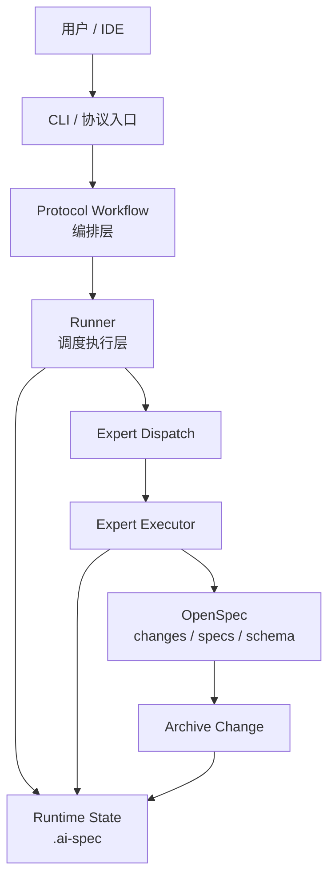
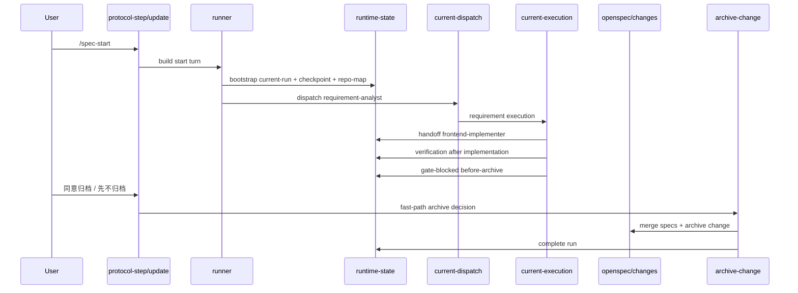

# 当前项目底层实现、架构设计与执行调用流程说明

## 1. 文档目标

这份文档只回答 3 个问题：

1. 当前项目的底层实现是什么
2. 当前项目的架构是怎么分层的
3. 从用户发起需求到最终归档，系统内部是怎么执行和调用的

这里不讨论后续的 Hub、插件平台、OpenClaw、可观测平台等扩展方向，只描述当前仓库已经落地并可运行的主实现。

---

## 2. 一句话定义当前项目

当前项目可以定义为：

> 一个以 OpenSpec 为交付产物底座、以 rules/skills/roles/flows 为专家执行协议、以 `task-orchestrator` 为编排中枢、以 `.ai-spec` 为运行时状态机的本地 AI 规范驱动开发引擎。

它不是“几个提示词文件”的集合，也不是“一个新的配置平台”。

它当前最核心的闭环是：

`task-orchestrator -> requirement-analyst -> frontend-implementer -> code-guardian -> archive-change`

---

## 3. 当前项目的 5 层架构



### 3.1 OpenSpec 产物层

职责：

- 定义变更产物结构
- 承载每次需求的 proposal、specs、design、tasks、checklist、iterations
- 承载最终的规范归档

关键文件：

- [`openspec/config.yaml.template`](../../openspec/config.yaml.template)
- [`openspec/schemas/expert-delivery/schema.yaml`](../../openspec/schemas/expert-delivery/schema.yaml)

当前默认 schema 已经固定为 `expert-delivery`，不再使用 OpenSpec 默认的通用流程直接承载专家协同交付。

### 3.2 协议资产层

职责：

- 定义角色
- 定义技能
- 定义规则
- 定义流程
- 用注册表把这些资产变成运行时可消费的元数据

关键目录：

- [`/.agents/rules`](../../.agents/rules)
- [`/.agents/skills`](../../.agents/skills)
- [`/.agents/roles`](../../.agents/roles)
- [`/.agents/flows`](../../.agents/flows)
- [`/.agents/registry/roles.json`](../../.agents/registry/roles.json)
- [`/.agents/registry/flows.json`](../../.agents/registry/flows.json)

当前运行时是“注册表优先”，不是“目录扫描优先”。

### 3.3 协议编排层

职责：

- 读取当前状态
- 读取仓库事实
- 读取规则、技能、流程
- 生成当前应该执行的 turn

核心文件：

- [`internal/ai-protocol-workflow.js`](../../internal/ai-protocol-workflow.js)

这层的本质不是执行代码，而是把“当前轮应该给谁做、读什么、写什么、怎么推进”表达清楚。

### 3.4 运行时状态机层

职责：

- 管理当前运行状态
- 管理审批门禁
- 管理 checkpoint
- 管理 restore
- 管理当前 dispatch / execution / runtime-action

核心文件：

- [`bin/runtime-state.js`](../../bin/runtime-state.js)
- [`bin/task-orchestrator-runner.js`](../../bin/task-orchestrator-runner.js)
- [`bin/runtime-paths.js`](../../bin/runtime-paths.js)

当前 `.ai-spec/` 的关键内容已经固定为：

- `.ai-spec/current-run.json`
- `.ai-spec/checkpoints/<run-id>/`（仅在 `AI_SPEC_PERSIST_CHECKPOINTS=1` 时写入）
- `.ai-spec/repo-map.json`
- `.ai-spec/internal/current-dispatch.json`
- `.ai-spec/internal/current-execution.json`
- `.ai-spec/internal/current-runtime-action.json`

### 3.5 专家执行层

职责：

- 接收当前专家的 dispatch
- 校验本角色必须满足的 OpenSpec 输入和输出
- 写 execution 结果
- 自动推动下一步 runtime transition

核心文件：

- [`bin/expert-dispatch.js`](../../bin/expert-dispatch.js)
- [`bin/expert-executor.js`](../../bin/expert-executor.js)
- [`bin/execution-semantics.js`](../../bin/execution-semantics.js)
- [`bin/archive-change.js`](../../bin/archive-change.js)

---

## 4. 当前项目的底层实现思路

### 4.1 不是 Prompt 驱动，而是“文件事实驱动”

当前主实现不是依赖聊天上下文记忆流程，而是依赖 3 类文件事实：

- OpenSpec 产物
- Runtime 状态文件
- Registry 资产定义

也就是说，系统判断“当前该做什么”，不是靠一次对话临时推理，而是靠：

- 当前有没有 `proposal/specs/design/tasks/checklist/iterations`
- 当前 `.ai-spec/current-run.json` 在什么状态
- 当前角色在 `roles.json` 里定义了什么 `required_inputs / required_outputs / runtime_transition`

### 4.2 编排和执行是分开的

当前项目把这两件事分得很清楚：

- 编排：由 `task-orchestrator` 和 `protocol workflow` 决定
- 执行：由各专家完成

这意味着：

- `task-orchestrator` 不直接替代专家实现
- `frontend-implementer` 不自己决定整个流程怎么走
- `code-guardian` 不直接跳过归档确认

### 4.3 运行时状态机是“当前真实来源”

当前所有推进都围绕 [`current-run.json`](../../.ai-spec/current-run.json) 语义展开。

这个文件当前至少承载这些关键字段：

- `run_id`
- `status`
- `current_role`
- `pending_gate`
- `gate_context`
- `artifacts`
- `verification`
- `checkpoint_count`（默认 0，开启 checkpoint 后递增）
- `last_checkpoint`（默认 `null`，开启 checkpoint 后记录最近快照）

它已经不只是“一个状态标记文件”，而是整条协议链的事实来源。

### 4.4 checkpoint / restore 已经进入底层

当前项目已经吸收了最小 LangGraph 风格能力：

- 每次关键迁移落 checkpoint
- 可以从 checkpoint restore
- gate 有统一字段

关键能力位置：

- [`writeRunState`](../../bin/runtime-state.js#L1021)
- [`handoffRunState`](../../bin/runtime-state.js#L1171)
- [`approveRunState`](../../bin/runtime-state.js#L1239)
- [`restoreRunState`](../../bin/runtime-state.js#L1376)
- [`gateBlockedRunState`](../../bin/runtime-state.js#L1483)
- [`completeRunState`](../../bin/runtime-state.js#L1548)

### 4.5 最小 Aider 风格能力也已经吸收

当前只吸收了 3 个最小能力：

- 轻量仓库地图 `repo-map`
- 最小改动原则
- 自动验证回灌 `verification`

关键位置：

- [`bin/repo-map.js`](../../bin/repo-map.js)
- [`runVerificationSuite`](../../bin/expert-executor.js#L174)
- [`attachVerificationIfNeeded`](../../bin/expert-executor.js#L507)

这里仍然是“最小吸收”，不是完整复刻 Aider。

---

## 5. 当前项目的核心模块职责

## 5.1 CLI 总入口

核心文件：

- [`bin/cli.js`](../../bin/cli.js)

职责：

- 接收外部命令
- 路由到对应内部模块

当前最重要的命令入口有：

- `runtime-state`
- `protocol-step`
- `protocol-advance`
- `protocol-update`
- `expert-executor`
- `archive-change`
- `demo-runtime-smoke`

### 5.2 Protocol Workflow

核心文件：

- [`internal/ai-protocol-workflow.js`](../../internal/ai-protocol-workflow.js)

职责：

- 生成 start turn
- 生成 expert turn
- 生成 approval gate turn
- 生成 update-review turn
- 处理 before-archive fast-path

关键函数：

- [`buildProtocolTurn`](../../internal/ai-protocol-workflow.js#L2709)
- [`advanceProtocolStep`](../../internal/ai-protocol-workflow.js#L2782)
- [`updateProtocolInput`](../../internal/ai-protocol-workflow.js#L2870)
- [`tryApplyBeforeArchiveFastPath`](../../internal/ai-protocol-workflow.js#L2805)

### 5.3 Runner

核心文件：

- [`bin/task-orchestrator-runner.js`](../../bin/task-orchestrator-runner.js)

职责：

- 看当前 inbox 里谁有输入
- 判断当前下一步该等谁
- 消费 task-orchestrator turn / current-dispatch / current-execution / current-runtime-action
- 调 runtime-state、expert-dispatch、expert-executor

关键函数：

- [`loadCurrentArtifacts`](../../bin/task-orchestrator-runner.js#L326)
- [`buildNextExpected`](../../bin/task-orchestrator-runner.js#L336)
- [`buildStatus`](../../bin/task-orchestrator-runner.js#L402)
- [`applyRuntimeMutation`](../../bin/task-orchestrator-runner.js#L530)
- [`advanceRunner`](../../bin/task-orchestrator-runner.js#L745)

### 5.4 Runtime State

核心文件：

- [`bin/runtime-state.js`](../../bin/runtime-state.js)

职责：

- 创建 run-state
- 更新用户输入
- handoff / approve / resume / restore / gate-blocked / complete / fail / cancel
- 写 checkpoint
- 写 repo-map

这里是当前主实现里最接近“状态机内核”的部分。

### 5.5 Expert Dispatch

核心文件：

- [`bin/expert-dispatch.js`](../../bin/expert-dispatch.js)

职责：

- 把当前专家轮次写入 dispatch
- 把当前角色、任务、flow、execution contract 固定下来

关键函数：

- [`applyDispatch`](../../bin/expert-dispatch.js#L203)
- [`applyDispatchData`](../../bin/expert-dispatch.js#L229)

### 5.6 Expert Executor

核心文件：

- [`bin/expert-executor.js`](../../bin/expert-executor.js)

职责：

- 校验当前角色的 OpenSpec 输入输出
- 写 execution
- 自动生成 runtime action
- 对前端实现自动跑最小验证

关键函数：

- [`applyExecution`](../../bin/expert-executor.js#L766)
- [`applyExecutionData`](../../bin/expert-executor.js#L823)
- [`applyRuntimeActionData`](../../bin/expert-executor.js#L916)
- [`runVerificationSuite`](../../bin/expert-executor.js#L174)

### 5.7 Archive Change

核心文件：

- [`bin/archive-change.js`](../../bin/archive-change.js)

职责：

- 合并 `openspec/changes/<change-id>/specs/` 到 `openspec/specs/`
- 把当前 change 目录迁移到 `openspec/changes/archive/YYYY-MM-DD-<change-id>/`
- 可以直接完成当前 run 收尾

关键函数：

- [`archiveChange`](../../bin/archive-change.js#L313)
- [`completeRunAfterArchive`](../../bin/archive-change.js#L269)

---

## 6. 当前项目真实执行调用流程

下面用一条真实主链来描述：

`/spec-start -> requirement-analyst -> frontend-implementer -> code-guardian -> before-archive -> archive-change`

### 第 1 步：用户发起需求

用户在 IDE 或 CLI 发起需求，例如：

```text
/spec-start 创建一个订单列表 mock 页面，只做演示版，数据本地 mock
```

CLI 会进入 [`protocol-step`](../../bin/cli.js#L39)。

### 第 2 步：Protocol Workflow 生成首轮 turn

[`buildProtocolTurn`](../../internal/ai-protocol-workflow.js#L2709) 会生成 start turn。

这一轮会做几件事：

- 探测项目 profile
- 扫描仓库结构
- 推断 risk / delivery_profile / artifact_profile
- 生成给 `task-orchestrator` 的第一轮执行上下文

相关函数：

- [`collectRepoConventions`](../../internal/ai-protocol-workflow.js#L607)
- [`buildProjectContextGuidance`](../../internal/ai-protocol-workflow.js#L644)

### 第 3 步：task-orchestrator 产出 run-plan

`task-orchestrator` 的职责不是写代码，而是产出 run-plan / bootstrap payload。

之后 runner 消费 bootstrap，调用 [`writeRunState`](../../bin/runtime-state.js#L1021)：

- 建立 `.ai-spec/current-run.json`
- 落第一个 checkpoint
- 生成 `.ai-spec/repo-map.json`

### 第 4 步：runner 派发 requirement-analyst

runner 通过 [`buildNextExpected`](../../bin/task-orchestrator-runner.js#L336) 判断当前下一步需要专家 execution，于是写 `current-dispatch`。

`requirement-analyst` 当前必须产出：

- `proposal.md`
- `specs/`
- `design.md`
- `tasks.md`

这个约束来自：

- [`roles.json`](../../.agents/registry/roles.json#L43)

### 第 5 步：requirement-analyst 完成后 handoff 到 frontend-implementer

`expert-executor` 会校验 requirement 阶段产物是否齐全，然后根据 [`execution-semantics.js`](../../bin/execution-semantics.js) 自动产出 runtime action：

- action = `handoff`
- to_role = `frontend-implementer`

然后 runtime-state 执行 [`handoffRunState`](../../bin/runtime-state.js#L1171)。

### 第 6 步：frontend-implementer 完成实现并自动验证

`frontend-implementer` 的职责是：

- 基于 proposal/specs/design/tasks 做实现
- 遵守最小改动原则
- 不顺手扩 scope

实现结束后，`expert-executor` 会触发 [`runVerificationSuite`](../../bin/expert-executor.js#L174)：

- 如果有 `build`，先跑 `build`
- 如果有 `lint`，再跑 `lint`
- 如果有 `test`，再跑 `test`

然后把结果写进 `verification`，并把它放进当前 run-state，供下一位 `code-guardian` 使用。

### 第 7 步：code-guardian 审查并卡住 before-archive

`code-guardian` 会读取：

- proposal
- specs
- design
- tasks
- verification
- repo-map
- repo conventions

然后产出：

- `checklist.md`
- `iterations.md`

之后不会直接 `success`，而是自动进入 `before-archive` 门禁，对应 [`gateBlockedRunState`](../../bin/runtime-state.js#L1483)。

此时 `current-run.json` 里会有：

- `pending_gate = before-archive`
- `gate_context.gate_id`
- `gate_context.blocked_by_role`
- `gate_context.resume_to_role`
- `gate_context.required_user_action`
- `gate_context.blocked_reason`

### 第 8 步：用户决定是否归档

用户这时可以输入：

- `同意归档`
- `先不归档`

这一步走 [`protocol-update`](../../bin/cli.js#L49)。

`before-archive` 有本地 fast-path，逻辑在：

- [`tryApplyBeforeArchiveFastPath`](../../internal/ai-protocol-workflow.js#L2805)

也就是：

- 归档确认不再额外走一轮大模型推理
- 只用本地协议判断直接推进

### 第 9 步：archive-change 合并并归档

如果用户同意归档，系统调用 [`archiveChange`](../../bin/archive-change.js#L313)：

- 合并 `openspec/changes/<change-id>/specs/` 到 `openspec/specs/`
- 归档到 `openspec/changes/archive/YYYY-MM-DD-<change-id>/`
- 更新 current-run 中的 artifact 路径
- 完成运行收尾

### 第 10 步：运行进入 success

最后 [`completeRunState`](../../bin/runtime-state.js#L1548) 会把当前 run 写成终态：

- `status = success`
- `current_role = archive-change`
- `pending_gate = null`
- `last_checkpoint = complete`（仅在开启 checkpoint 持久化时）

这时流程真正结束。

---

## 7. 当前运行时文件是怎么流转的

### 7.1 关键文件

| 文件 | 作用 |
| --- | --- |
| `.ai-spec/current-run.json` | 当前运行事实来源 |
| `.ai-spec/checkpoints/<run-id>/*.json` | 可选的关键状态迁移快照，用于恢复/调试 |
| `.ai-spec/repo-map.json` | 轻量仓库地图 |
| `.ai-spec/internal/current-dispatch.json` | 当前专家轮次输入 |
| `.ai-spec/internal/current-execution.json` | 当前专家结果 |
| `.ai-spec/internal/current-runtime-action.json` | 当前 runtime 动作 |
| `openspec/changes/<change-id>/...` | 本轮变更产物 |
| `openspec/specs/...` | 主规范库 |

### 7.2 简化流转图



---

## 8. 当前设计的边界

当前这套实现刻意守住了几个边界：

- 不做新的配置器层
- 不做运行时依赖 Hub
- 不做复杂图编排 DSL
- 不做并行子图
- 不做全量代码索引平台
- 不做自动修复回环

这很重要，因为当前阶段的目标不是“平台功能越多越好”，而是：

> 先把 OpenSpec 专家协同底座做稳、做清楚、做可恢复。

---

## 9. 当前项目最重要的实现成果

如果只总结当前项目已经真正做成的能力，可以归纳成 8 点：

1. 已经有固定专家主链，不再是一个代理包办全部
2. 已经有自定义 OpenSpec schema，不再依赖通用默认结构硬凑
3. 已经有 registry 驱动，不再靠目录硬编码
4. 已经有 current-run 事实状态源
5. 已经有 checkpoint / restore
6. 已经有 before-archive gate 和 fast-path
7. 已经有 repo-map 和 verification 回灌
8. 已经有归档后的主规范库合并闭环

---

## 10. 推荐阅读顺序

如果要继续深入看代码，建议按这个顺序读：

1. [`bin/cli.js`](../../bin/cli.js)
2. [`internal/ai-protocol-workflow.js`](../../internal/ai-protocol-workflow.js)
3. [`bin/task-orchestrator-runner.js`](../../bin/task-orchestrator-runner.js)
4. [`bin/runtime-state.js`](../../bin/runtime-state.js)
5. [`bin/expert-executor.js`](../../bin/expert-executor.js)
6. [`bin/archive-change.js`](../../bin/archive-change.js)
7. [`/.agents/registry/roles.json`](../../.agents/registry/roles.json)
8. [`/.agents/registry/flows.json`](../../.agents/registry/flows.json)

如果想看面向非开发者的说明，优先看：

- [`项目介绍与运行机制说明.md`](../four/项目介绍与运行机制说明.md)
- [`最小示例运行说明.md`](最小示例运行说明.md)
