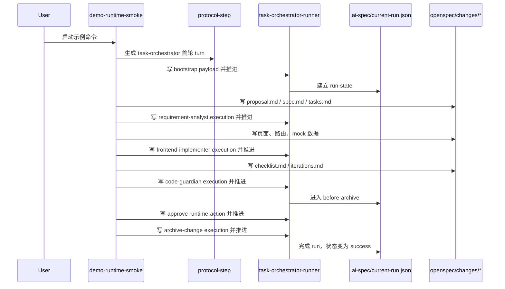

# 最小示例运行说明

## 1. 这份示例解决什么问题

当前阶段最重要的不是继续扩架构，而是先证明这条主链已经能跑：

`requirement-analyst -> frontend-implementer -> code-guardian -> before-archive -> archive-change`

这个最小示例做的事情很简单：

- 创建一个最小 Vue 目标项目
- 同步 `expert-delivery` schema 和 `openspec/config.yaml`
- 启动一条 `protocol-step -> advance -> advance -> advance -> approve -> advance` 的确定性 replay
- 最终让 `.ai-spec/current-run.json.status = success`，并完成一次真实归档
- 默认写出 `.ai-spec/current-run.json` 与 `.ai-spec/repo-map.json`
- 如果设置 `AI_SPEC_PERSIST_CHECKPOINTS=1`，还会额外写出 `.ai-spec/checkpoints/`

它的目标是验证当前底座是通的，不是替代真实 AI IDE 轮次。

---

## 2. 怎么运行

在当前仓库根目录执行：

```bash
npm run demo:runtime
```

或者显式指定目标目录：

```bash
node ./bin/cli.js demo-runtime-smoke --target /absolute/path/to/runtime-smoke-demo
```

如果你想改演示需求文案，也可以：

```bash
node ./bin/cli.js demo-runtime-smoke \
  --target /absolute/path/to/runtime-smoke-demo \
  --user-input "新增一个商品 mock 页面"
```

注意：

- 目标目录必须为空目录，命令不会覆盖已有内容
- 这个示例会写出真实的 `openspec/changes/` 产物和 `.ai-spec/current-run.json`
- 这个示例使用的是**确定性 replay**，不是实时调用大模型生成专家输出

---

## 3. 跑完后你会看到什么

核心输出包括：

- `.ai-spec/current-run.json`
- `.ai-spec/repo-map.json`
- `openspec/config.yaml`
- `openspec/schemas/expert-delivery/schema.yaml`
- `openspec/specs/ui/spec.md`
- `openspec/specs/api/spec.md`
- `openspec/changes/archive/YYYY-MM-DD-runtime-smoke-demo/`

开启 `AI_SPEC_PERSIST_CHECKPOINTS=1` 时，还会看到 `.ai-spec/checkpoints/<run-id>/`。
- `src/views/products/mock/index.vue`
- `src/router/modules/products.ts`
- `src/mock/products.ts`

也就是说，示例会同时证明两件事：

- OpenSpec 产物链已经能落盘并完成归档
- 专家协同主链已经能推进到 `success`
- runtime checkpoint、repo-map 和最小 verification 结果已经可被后续专家消费

---

## 4. 这条示例链是怎么执行的



---

## 5. 为什么当前阶段先做这个

因为这是最小闭环验证。

如果这个示例都跑不通，后面去接：

- Hub 资产平台
- 插件层
- 页面化安装
- OpenClaw 流水线

都没有意义。

当前阶段必须先证明：

- schema 是通的
- runtime 是通的
- 专家切换是通的
- OpenSpec 产物是通的

---

## 6. 它的边界是什么

这个最小示例**故意不做**这些事：

- 不接真实 AI IDE
- 不接真实审批流
- 不接真实 API
- 不接 Hub / OpenClaw
- 不引入新的配置器层

它只是一个底层 smoke demo。

只要这条链稳定，下一步才值得继续做：

- 更真实的目标项目接入
- 更真实的业务页面例子
- 更真实的专家执行输入输出

---

## 7. 当前推荐阅读顺序

1. [项目介绍与运行机制说明](../four/项目介绍与运行机制说明.md)
2. 本文
3. 再去看当前仓库中的 `bin/`、`internal/`、`.agents/registry/`
