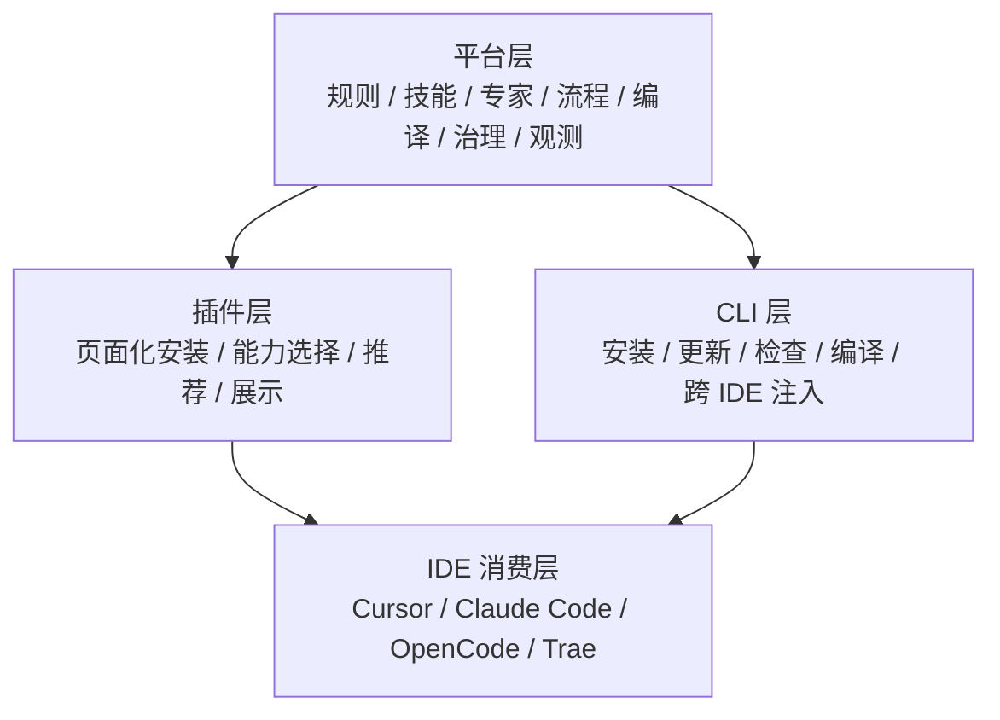
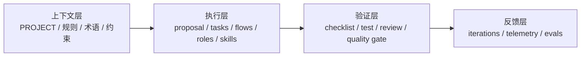
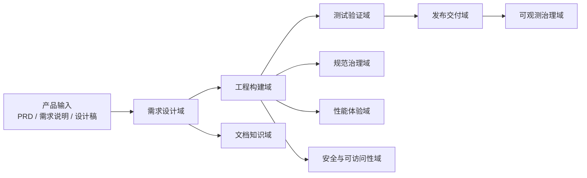
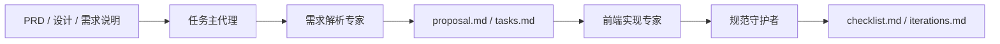

# AI 规范驱动开发平台：综合蓝图

## 1. 文档定位

这份文档用于把当前项目已有的几条线统一起来：

- AI 工程方法论
- 规范驱动开发平台
- 专家协同与流程编排
- 平台 / 插件 / CLI 三层架构
- 专家定义与 skill 组织方式
- 团队内部推广路径
- 面向管理层的汇报口径

它的目标不是再增加一个抽象概念，而是形成一份可以长期迭代的**总方案文档**。

## 2. 统一定位

建议统一使用下面这句作为项目总定位：

> 我们正在建设的是一个可按需安装、可验证、可观测、可跨 IDE 复用的 AI 规范驱动开发平台。当前以 CLI 作为底层实现，后续以插件页面作为主入口，并逐步演化为 AI 驱动的自动化研发流水线平台。

这里有三个关键点：

- `平台` 是长期定位
- `CLI` 是当前最现实的底层能力形态
- `插件` 是后续主入口和规模化推广形态

## 3. 核心判断

### 3.1 它不是 skill 仓库

如果只按“做了多少个 skill”来建设和汇报，项目会陷入两个问题：

- 对内看起来像工具集合，不像平台
- 对外难以体现流程、专家和组织级价值

因此当前项目的核心表达不应该是：

```text
skill -> skill -> skill
```

而应该是：

```text
规则 / 上下文 -> 流程 -> 专家 -> 技能
```

### 3.2 `spec` 不是全部，但仍然是中心件

`spec` 很重要，但它不是完整答案。

更准确的理解应该是：

```text
AI 工程
  = 上下文工程
  + 执行工程
  + 验证工程
  + 反馈工程
```

对应到当前项目：

- 上下文：项目背景、规则、术语、稳定约束
- 执行：proposal、tasks、flows、roles、skills
- 验证：checklist、tests、review、质量闸门
- 反馈：iterations、telemetry、evals

### 3.3 当前最重要的不是“完全自动化”

当前阶段最重要的是：

- 先做成一个可推广的规范驱动开发平台
- 先把最小专家协同闭环跑通
- 再逐步补齐主代理、可观测、流程分发和插件主入口

## 4. 平台 / 插件 / CLI 三层架构



### 4.1 平台层

平台层负责维护统一能力源：

- `.agents/rules/`
- `.agents/skills/`
- `.agents/roles/`
- `.agents/flows/`
- `openspec/`
- 后续的 `hooks / evals / telemetry`

### 4.2 插件层

插件层是未来主入口，适合承载：

- 能力域选择
- 专家包启用
- 流程包安装
- 当前项目能力展示
- 使用推荐和结果展示

### 4.3 CLI 层

CLI 是当前阶段最务实的执行底座：

- 负责安装、更新、检查和目标项目注入
- 保证没有插件页面时平台仍然可用
- 后续即使插件成为主入口，CLI 仍然可作为执行引擎存在

## 5. 两套分层模型

这个项目有两套分层模型，它们不是冲突关系，而是分别服务“展示”和“执行”。

### 5.1 展示层模型

用于插件页面、能力地图、汇报表达：

```text
能力域 -> 专家 -> 技能
```

### 5.2 执行层模型

用于真实运行和协同：

```text
规则 / 上下文 -> 任务主代理 -> 流程 -> 专家 -> 技能
```

## 6. AI 工程方法论落地模型



### 6.1 上下文层

当前主要包括：

- `context/PROJECT.md`
- `.agents/rules/`

### 6.2 执行层

当前主要包括：

- `openspec/changes/<change-id>/proposal.md`
- `openspec/changes/<change-id>/tasks.md`
- `.agents/flows/`
- `.agents/roles/`
- `.agents/skills/`

### 6.3 验证层

当前主要包括：

- `openspec/changes/<change-id>/checklist.md`
- 测试规范
- 规则检查
- review 闸门

### 6.4 反馈层

当前主要包括：

- `openspec/changes/<change-id>/iterations.md`

后续逐步补齐：

- telemetry
- evals
- hooks

## 7. 当前项目的真实现状

### 7.1 已经具备的能力

- 多 IDE 基础接入能力
- L1 / L2 / L3 渐进安装层级
- `rules + skills + openspec` 主体骨架
- 4 个 MVP 专家：
  - `task-orchestrator`
  - `requirement-analyst`
  - `frontend-implementer`
  - `code-guardian`
- 27 个候选专家模板
- 9 个能力域目录
- 角色展示索引：
  - [.agents/roles/INDEX.md](../../.agents/roles/INDEX.md#L1)

### 7.2 当前还没有完全实现的部分

- 插件页面还未成为主入口
- `roles / flows / domains` 还未完整接入安装脚本
- 主代理的流程路由仍处于骨架阶段
- 观测、评估、hooks 还未形成完整闭环
- 专家模板多数仍处于 `planned` 状态

因此当前阶段更准确的说法是：

> 平台骨架已经形成，专家协同雏形已经可见，正在从“规范驱动开发工具”升级为“规范驱动开发平台”。

## 8. 能力域全景

建议统一采用下面这组能力域命名：

1. `需求设计域`
2. `规范治理域`
3. `工程构建域`
4. `测试验证域`
5. `发布交付域`
6. `文档知识域`
7. `性能体验域`
8. `可观测治理域`
9. `安全与可访问性域`

另外保留一个内部层：

- `任务编排层`



## 9. 专家定义原则

这是当前项目后续可扩展的关键。

### 9.1 专家定义不是人设，而是职责契约

一个合格的专家文件，至少要说明：

- 它负责什么
- 它不负责什么
- 它读什么
- 它写什么
- 它交给谁
- 什么情况下停止或要求人工确认

### 9.2 当前推荐的专家定义结构

```md
---
id:
name:
status:
domains:
description:
triggers:
preferred_skills:
reads:
writes:
handoff_to:
---

# 中文展示名

## 角色定位
## 工作原则
## 必做步骤
## 输出标准
## 禁止事项
## 交接
```

### 9.3 当前启用专家与候选专家的关系

- `common/`：当前真正启用的 MVP 专家
- `domains/`：各能力域下的候选专家模板
- `INDEX.md`：展示层索引文件

也就是说，当前项目不是要一次性“用完所有专家”，而是先把骨架搭稳，再逐步把 `planned` 角色升级为 `active`。

## 10. skill 组织原则

### 10.1 结论

不建议按专家名组织 skill，而建议按“复用范围 + 技术栈 + 能力域”组织。

### 10.2 推荐结构

```text
.agents/skills/
├── common/
├── profiles/react/
├── profiles/vue/
└── domains/        # 预留，按需启用
```

### 10.3 组织逻辑

- `common/`：技术栈无关、多个专家都能复用
- `profiles/react/`、`profiles/vue/`：与框架强绑定
- `domains/`：明显属于某个能力域，并且会被多个专家复用

### 10.4 为什么不按专家拆 skill

因为 expert 和 skill 是多对多关系：

- 一个专家会调用多个 skill
- 一个 skill 也会被多个专家复用

如果用 `skills/<expert-name>/`，后续必然出现：

- 重复
- 耦合
- 迁移成本高

## 11. 当前推荐的最小闭环

当前最适合团队推广和内部分享的闭环仍然应该保持小而稳：



当前最值得团队先跑通的是：

- 1 条默认流程：`prd-to-delivery`
- 4 个启用专家
- 1 套上下文闭环：
  - `PROJECT.md`
  - `proposal.md`
  - `tasks.md`
  - `checklist.md`
  - `iterations.md`

## 12. 渐进式实施路线

### Phase 0：平台骨架

已完成或基本完成：

- 规则层
- 技能层
- OpenSpec 变更层
- 角色层
- 流程层
- 能力域索引

### Phase 1：团队可推广 MVP

下一步重点：

- `roles + flows` 接入安装脚本
- 跑通默认流程
- 沉淀演示案例和培训脚本

### Phase 2：能力域扩展

下一步重点：

- 按域安装
- 按流程安装
- 从 4 个 `active` 专家扩到 8 到 10 个

建议优先升级的角色：

- `design-collaborator`
- `api-contract-specialist`
- `unit-test-specialist`
- `verification-reviewer`
- `performance-auditor`
- `security-reviewer`

### Phase 3：编排与验证闭环

下一步重点：

- 强化 `task-orchestrator`
- 增加 hooks / evals
- 建立人工确认点和阻断点

### Phase 4：插件化与可观测

下一步重点：

- 插件页面主入口
- 观测指标
- 专家使用率和流程通过率分析

## 13. 当前阶段的团队推广建议

团队内部推广时，不建议一上来讲“大平台”“全自动代理”，而建议按下面顺序展开：

1. 为什么不能只做 prompt / skill
2. 为什么需要规范驱动开发平台
3. 当前最小闭环是什么
4. 专家协同和方法论如何结合
5. 后续如何渐进扩展

当前适合重点推广的内容：

- `proposal / tasks / checklist / iterations`
- 4 个核心专家
- 1 条默认流程
- “能力域 -> 专家 -> 技能”的展示方式

## 14. 面向管理层的表达建议

管理层关心的不是“写了多少模板”，而是：

- 这是不是平台，不是单点工具
- 能不能推广
- 能不能复用
- 能不能量化价值

建议统一口径：

> 我们当前正在把已有的 AI 规范工具，升级为一个可按需安装、可验证、可观测、可跨 IDE 复用的 AI 规范驱动开发平台。短期先做规范驱动开发平台和专家协同骨架，中期做按域安装和插件主入口，长期形成真正可推广的 AI 驱动自动化研发流水线平台。

## 15. 这套方案为什么可实施

因为它没有走“先画最大平台，再等全部做完”的路线，而是采用了：

- 先骨架
- 再 MVP
- 再分域扩展
- 再编排
- 再观测

这种路线的好处是：

- 当前就能用于内部分享
- 当前就能支撑试点项目
- 后续目录和结构不需要推翻
- 规划和现实边界清晰

## 16. 最终结论

当前项目最合理的建设路径，不是把“AI 驱动自动化流水线平台”一次做完，而是：

> 先把“AI 规范驱动开发平台”做成团队可推广、可试点、可复用的现实版本，再逐步补齐能力域专家、流程包、主代理、验证闭环、可观测和插件主入口。

这是当前阶段最现实、最稳、也最有说服力的路径。
