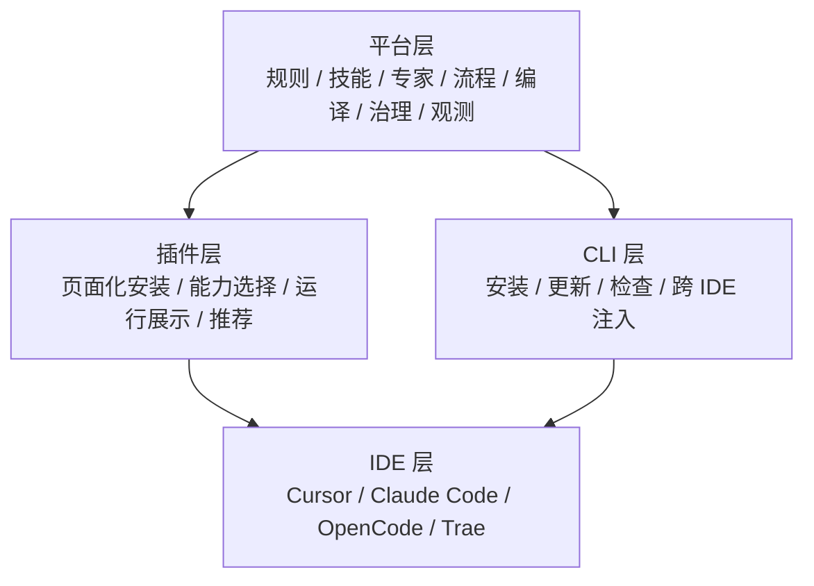
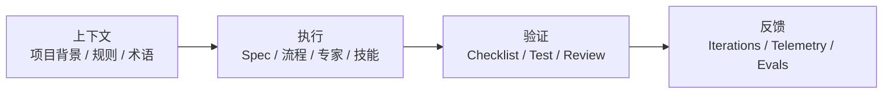
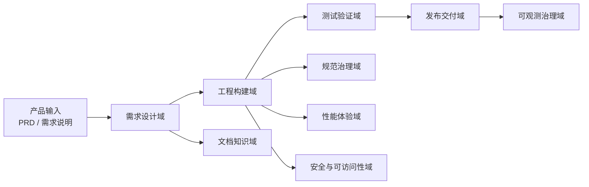

# AI 驱动前端自动化流水线平台：领导汇报版

## 1. 一句话定位

> 我们正在建设的，不是一个单点 `CLI` 工具，也不是零散的 `skill` 仓库，而是一个**可按需安装、可观测、可验证、可跨 IDE 复用的 AI 驱动前端自动化流水线平台**。

这个平台当前以**前端研发链路**为核心落地，同时覆盖上游需求设计、下游测试验证、文档沉淀和交付治理，后续通过插件页面、流程编排和观测体系，逐步升级为可推广的研发基础设施。

## 2. 为什么值得做

当前团队在使用 AI 编码时，普遍存在 5 类问题：

1. 会写代码，但不理解项目背景
2. 能生成结果，但不遵守团队规范
3. 有零散 prompt 和 skill，但不能形成可复用流程
4. 不知道哪些能力真正被用过、效果如何
5. 换一个 IDE，能力就要重新组织

这意味着团队当前面对的不是“AI 能不能写代码”的问题，而是：

> 如何把 AI 变成一个可治理、可复用、可演进的研发协作系统。

## 3. 我们在做的是什么

我们把当前项目升级定义为：

> **AI 驱动前端自动化流水线平台**

它有三个关键词：

- **按需安装**：不同项目、不同团队、不同阶段，不必全量安装全部能力
- **可验证**：不是只生成代码，而是有规则、检查、验收、回归和质量闸门
- **可观测**：后续可以知道哪些流程、专家和能力真正创造了价值

它还有两个明确边界：

- 当前以前端交付链路为核心
- 但不只做“写页面”，而是覆盖需求、实现、验证、文档、交付的完整链路

## 4. 不是空中楼阁，而是有现实基础

当前项目已经具备平台雏形：

- 已支持多 IDE 接入：`Cursor / Claude Code / OpenCode / Trae`
- 已有分层安装机制：`L1 / L2 / L3`
- 已有规则层、技能层、OpenSpec 流程层
- 已有 4 个 MVP 级核心专家
- 已有 27 个候选专家模板
- 已建立角色展示索引，便于后续插件页面读取

也就是说，当前不是从零开始想象“未来平台”，而是在已有工具化基础上，继续做平台化升级。

## 5. 平台 / 插件 / CLI 三层架构

### 5.1 平台层

这是长期核心资产层，负责维护：

- 规则
- 技能
- 专家
- 流程
- 安装编译
- 验证机制
- 观测能力

### 5.2 插件层

这是未来主入口，负责：

- 页面化选择安装内容
- 显示能力域和专家包
- 降低团队上手成本
- 成为“平台产品”的主要可见形态

### 5.3 CLI 层

这是当前最务实的底层能力实现：

- 先把安装、更新、检查、兼容跑通
- 在插件未完成前承担主要接入职责
- 后续作为插件背后的执行引擎继续存在

## 6. 这套平台的技术表达为什么成立

从方法论上，它不是 prompt 工程，而是 AI 工程。

这意味着：

- 平台可以解释“为什么这样做”
- 平台可以控制“能做什么、不能做什么”
- 平台可以验证“做得对不对”
- 平台可以积累“下次怎么做得更好”

## 7. 为什么要强调“专家协同”，而不是“堆很多 skill”

对管理层来说，一个项目的核心竞争力，不是“做了 50 个 skill”，而是：

- 能否沉淀出成体系的研发能力
- 能否形成标准化可复用流程
- 能否让 AI 参与到更完整的交付链路

因此我们的表达方式从“技能数量”升级为：

- 有多少能力域
- 有多少可协同专家
- 有多少自动化流程
- 有多少能力真正被安装、使用、验证

这也是为什么当前项目已经建立了：

- `4` 个启用专家
- `27` 个候选专家模板
- `9` 个能力域

## 8. 平台覆盖的不是单点编码，而是完整研发链路

这意味着平台当前虽然以“前端”命名，但实质覆盖的是前端完整交付链路，并向产品文档、测试验证和交付治理扩展。

## 9. 当前阶段和未来阶段怎么区分

为了避免规划和现实混淆，建议统一成下面这套口径。

### 9.1 当前阶段

当前我们正在做的是：

- 规范驱动开发平台的可推广版本
- 专家协同和流程平台的骨架阶段
- 以 CLI 为底层实现，以插件为后续主入口

这阶段最重要的不是“完全自动化”，而是：

- 让平台先能跑
- 让流程先闭环
- 让团队先能用

### 9.2 后续阶段

后续逐步补齐：

- 按需安装
- 页面化插件入口
- 专家协同编排
- 流程路由和主代理
- 观测和验证闭环

最终演化为：

> 一个真正可跨 IDE 复用的 AI 驱动自动化流水线平台。

## 10. 实施路径

### 阶段一：平台骨架和团队试点

目标：

- 先在团队内部形成统一认知和最小可运行闭环

主要交付：

- 规则 + 技能 + OpenSpec + 角色 + 流程骨架
- 4 个核心专家跑通默认流程
- 试点项目落地

### 阶段二：能力包和专家扩展

目标：

- 从“单一演示闭环”升级为“按域选择的能力包”

主要交付：

- 能力域安装
- 流程包安装
- 新专家逐步从 `planned` 升级为 `active`

### 阶段三：插件化和观测化

目标：

- 从工具能力升级为平台产品

主要交付：

- 插件页面主入口
- 安装和使用观测
- 流程评估和能力推荐

## 11. 平台价值不只是提效，更是治理升级

### 11.1 对团队的价值

- 降低 AI 使用门槛
- 提高输出一致性
- 把零散经验沉淀成组织资产
- 减少重复沟通和重复返工

### 11.2 对技术体系的价值

- 从“人靠经验带人”转向“平台沉淀经验”
- 从“AI 辅助写代码”转向“AI 参与研发流程”
- 从“单 IDE 工具”升级为“跨 IDE 能力层”

### 11.3 对组织层的价值

- 有利于跨团队推广
- 有利于形成统一规范和研发资产
- 有利于后续量化平台使用效果

## 12. 建议汇报的指标

建议后续不要只汇报“做了多少 skill”，而是汇报：

- 已接入项目数
- 已启用专家数
- 已启用流程数
- 试点项目闭环完成率
- 规范校验通过率
- 返工率变化
- 观测链路覆盖率
- 跨 IDE 复用次数

这样更能体现平台价值，而不是单点工具价值。

## 13. 风险与边界

为了避免过度承诺，需要明确下面几点：

- 当前不是完全自治代理平台
- 当前插件页面还不是主交付形态
- 当前可观测闭环还在建设中
- 当前仍然需要人工承担价值判断和关键风险兜底

这不是缺点，而是平台建设的正常阶段划分。

## 14. 最终建议汇报口径

建议对管理层统一这样表达：

> 我们当前正在把已有的 AI 规范工具，升级为一个可按需安装、可验证、可观测、可跨 IDE 复用的 AI 驱动前端自动化流水线平台。短期先做规范驱动开发平台和专家协同骨架，中期做按域安装和插件入口，长期形成真正可推广的研发基础设施。

这句话同时具备：

- 方向感
- 技术性
- 前瞻性
- 可实施性

并且不会把“规划中的能力”误说成“已经完成的产品”。
