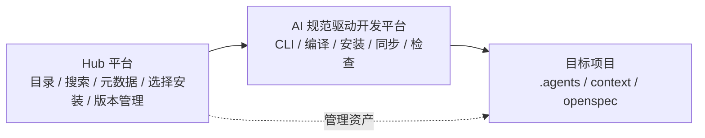
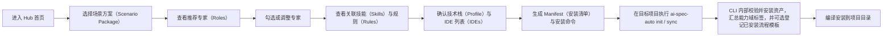
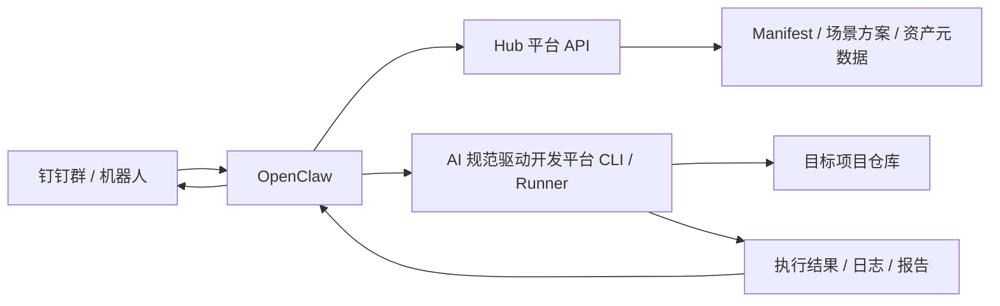

# Hub 平台融合与 OpenClaw 对接方案

## 1. 这份文档解决什么问题

这份文档聚焦 4 个现实问题：

1. Hub 平台和当前 `AI 规范驱动开发平台` 项目，应该怎么融合
2. 用户应该如何从 Hub 选择 `skill / rule`，并安装到自己的开发项目
3. 顶层分类到底该用“能力域”还是“行业类型”
4. OpenClaw + 钉钉机器人如何接入，并且不把系统做成高风险的远程执行黑盒

它强调两点：

- 要能落地
- 要给未来的平台化留空间

## 2. 核心判断

### 2.1 Hub 不应该替代当前项目

Hub 平台和当前项目不是替代关系，而应该是：

```text
Hub 平台 = 资产目录 + 元数据管理 + 选择安装入口
当前项目 = 编译器 + 安装器 + 本地运行时结构
```

也就是说：

- `Hub` 负责管理和分发
- `AI 规范驱动开发平台` 负责安装、编译、落地到目标项目

这样分层后，两个项目的边界才会稳定。

### 2.2 当前项目的目录结构不要被推翻

目标项目里，仍然建议保留现有结构：

```text
.agents/
  rules/
  skills/
  roles/
  flows/
context/
openspec/
```

区别不是结构变了，而是：

- 内容来源不再全靠本地仓库维护
- 一部分内容可以由 Hub 平台下发、同步或下载

也就是：

> 当前项目保留“消费结构”，Hub 平台承接“资产管理结构”。

### 2.3 不建议把“能力域”直接替换成“行业类型”

这是最关键的一点。

我不建议把顶部的 `能力域` 直接换成 `行业类型`，因为这两者解决的问题完全不同：

- `能力域` 解决的是：这个资产属于需求、规范、工程、测试、性能还是安全
- `行业类型` 解决的是：这个资产适合互联网、金融、教育、设计、运营还是办公效率

如果你直接把顶层从“能力域”改成“行业”，会带来 3 个问题：

- 同一个 skill / rule 会在多个行业重复出现
- 平台内部结构会越来越像内容站，而不是工程平台
- 专家、流程、规则之间的依赖关系会被打散

### 2.4 更好的做法：双层分类

建议改成：

```text
展示入口层：场景方案 / 行业标签
平台结构层：能力域 -> 专家 -> skill / rule
```

也就是说：

- 面向用户选内容时，先按“场景方案”选整套能力，再用“行业标签”做筛选
- 真正进入平台内部和项目安装时，还是按“能力域 / 专家 / 技能规则”组织

我更推荐用的名字不是“行业类型”，而是：

- `场景方案`
- `业务场景`
- `行业标签`

如果只能选一个，我建议：

> 对外入口叫 **场景方案**  
> 对内结构继续叫 **能力域**

## 3. 两个项目如何融合

### 3.1 推荐的角色分工



### 3.2 Hub 平台负责什么

- skill / rule 的上传、审核、搜索、展示
- 能力域、场景方案、行业标签等元数据管理
- 版本信息和依赖关系管理
- 生成安装命令、同步命令、项目清单

### 3.3 当前项目负责什么

- 解析 Hub 返回的安装清单
- 将资产编译到目标项目结构
- 保留现有 `.agents / context / openspec` 目录布局
- 执行更新、检查、回滚和版本锁定

### 3.4 目标项目负责什么

- 保存最终消费结构
- 保存项目自己的 `manifest` 和 `lock`
- 被 IDE、OpenSpec、角色、流程直接消费

## 4. 用户应该如何安装和使用

你现在想的“在 Hub 找到 skill / rule，然后复制一条命令到项目所在 IDE 执行”这个方向是对的。

但我建议把它再收敛一下：

> **Hub 负责“生成命令和安装清单”，CLI 负责“真正执行安装”**  
> 不建议把“让 IDE 里的 AI 自由理解后帮用户安装”作为主路径。

因为后者会有 3 个问题：

- 不可重复
- 不可审计
- 不可版本化

### 4.1 推荐的 3 种安装方式

#### 方式 A：项目初始化安装

适合新项目。

用户在 Hub 上：

1. 选择技术栈
2. 选择 IDE 列表
3. 选择场景方案，并按需微调专家
4. 点击“复制安装命令”

示例命令：

```bash
npx @engineered/ai-spec-auto@latest init . \
  --profile vue \
  --ide default \
  --manifest https://hub.example.com/manifests/vue-frontend-basic.json
```

#### 方式 B：增量安装 skill / rule

适合已有项目。

用户在 Hub 上勾选若干内容后，Hub 生成：

```bash
npx @engineered/ai-spec-auto@latest sync . \
  --manifest https://hub.example.com/manifests/project-abc-20260326.json
```

或者：

```bash
npx @engineered/ai-spec-auto@latest add . \
  --skills create-proposal,design-analysis \
  --rules api-standard,route-standard
```

#### 方式 C：下载到本地锁定

适合企业团队、受控项目、需要审计的环境。

流程：

1. Hub 导出 `manifest`
2. 项目本地执行 `sync`
3. 生成 `lock` 文件，固定版本

## 5. 推荐新增的项目清单文件

为了让 Hub 和当前项目真正对接，而不破坏现有结构，建议在目标项目里新增一个轻量目录：

```text
.ai-spec/
├── manifest.json
├── lock.json
└── sources.json
```

### 5.1 `manifest.json`

记录“用户想装什么”：

- profile
- ides
- scenario packages
- selected roles
- selected skills
- selected rules

可选地也可以补充：

- entry role
- tags
- notes

### 5.2 `lock.json`

记录“实际装了什么版本”：

- 资源版本
- 下载来源
- hash
- 安装时间
- aggregated domains（聚合能力域标签）
- installed flows（已安装流程模板）

### 5.3 `sources.json`

记录“来自哪个 Hub / 仓库 / 镜像源”。

这样做的好处是：

- 保持目标项目结构不变
- 安装行为可审计
- 后续 `update / sync / rollback` 有依据

## 6. Hub 平台信息架构建议

### 6.1 顶层导航建议

我建议 Hub 平台顶部不要只做 `Skill / Rule` 两个入口，而是拆成“场景方案”和“资产库”两个视图：

```text
首页
场景方案
资产库
项目接入
```

### 6.2 推荐的浏览维度

这里不建议再把“场景方案”和“能力域”硬并列成同层维度。

更准确的做法是：

- `场景方案` 作为面向用户的组合视图
- `资产库` 作为面向资产的分类视图

#### 视图一：场景方案

例如：

- 需求到交付
- 设计到代码
- Bug 修复与验证
- 企业文档与 PRD
- 自动化交付
- 质量治理增强

这些内容的特点是：

- 面向结果和任务场景
- 一次组合多种资产
- 适合平台首页、推荐位和一键安装

更进一步地说，当前 Hub 面向用户的主操作链，建议收敛成：

> `场景方案（Scenario Packages） -> 专家（Roles） -> 技能（Skills）`

其中：

- `场景方案（Scenario Packages）` 负责组合一组推荐能力
- `专家（Roles）` 负责承接具体职责
- `技能（Skills）` 负责承载专家的具体做法
- `规则（Rules）` 更适合作为专家和技能的附带约束展示，而不是强行再做一层主浏览维度

#### 视图二：资产库

在资产库里，建议使用下面 3 个浏览维度。

第一维：能力域

例如：

- 需求设计域
- 规范治理域
- 工程构建域
- 测试验证域
- 文档知识域
- 性能体验域
- 可观测治理域
- 安全与可访问性域

第二维：资产类型

- `skill（技能）`
- `rule（规则）`
- `flow（流程模板）`
- `role（专家角色）`

第三维：技术栈 / 标签

例如：

- `vue`
- `react`
- `openspec`
- `前端`
- `文档`
- `金融`
- `教育`
- `办公效率`

### 6.3 行业该放在哪里

行业不是顶层结构，而更适合做：

- 筛选条件
- 推荐标签
- 场景方案标签

例如：

- 金融
- 教育
- 设计
- 办公效率
- 自媒体
- 数据分析

也就是说：

> 行业更像“适用标签”，不是“资产主结构”。

### 6.4 推荐的用户操作流程

如果站在 Hub 平台用户视角，推荐的操作路径如下：



这条链路里有一个关键点：

- Hub 不需要让用户显式选择 `flows（流程模板）`
- CLI 只负责把当前项目内置的 `flows（流程模板）` 文件装进项目
- 如果需要审计或状态展示，CLI 可以在 `.ai-spec/lock.json` 里额外记录 `installed_flows（已安装流程模板）`
- 具体任务本次要走哪条 `flow（流程模板）`，由 `run（运行编排）` 阶段的 `task-orchestrator（任务主代理）` 动态决定

这样更符合你现在的产品分工。

## 7. Hub 和当前项目的对接协议建议

### 7.1 Hub 输出什么

Hub 最好输出结构化安装清单，而不是只输出一段说明文字。

完整规范建议见：

- [Manifest安装清单规范.md](Manifest安装清单规范.md)

推荐最小格式：

```json
{
  "profile": "vue",
  "ides": ["cursor", "claude"],
  "scenario_packages": ["frontend-basic"],
  "roles": ["task-orchestrator", "requirement-analyst"],
  "skills": ["create-proposal", "design-analysis"],
  "rules": ["api-standard", "route-standard"],
  "entry_role": "task-orchestrator"
}
```

### 7.2 CLI 如何处理

CLI 读取这份清单后：

1. 解析依赖
2. 根据 `场景方案（Scenario Packages） / 专家（Roles） / 技能（Skills） / 规则（Rules）` 做本地求解
3. 在内部汇总 `domains（能力域）` 标签，并按当前项目内置清单安装 `flows（流程模板）` 文件；如需审计，可在 `lock（锁定清单）` 中记录 `installed_flows（已安装流程模板）`
4. 拉取资源
5. 编译到目标项目目录
6. 生成 `.ai-spec/lock.json`
7. 输出安装结果和缺失项

这里要特别区分两件事：

- `sync（同步）`
  - 负责安装 `flow（流程模板）` 文件，并可选登记 `installed_flows（已安装流程模板）`
- `run（运行编排）`
  - 负责当前具体任务到底选哪条 `flow（流程模板）`

如果需要实现侧的详细输入输出定义，建议配套阅读：

- [ai-spec-auto-sync输入输出契约-03-27-17-09.md](ai-spec-sync输入输出契约-03-27-17-09.md)

### 7.3 为什么不要只“复制 prompt 给 IDE”

因为平台化安装不是聊天行为，而是：

- 配置行为
- 版本行为
- 审计行为

这应该由 CLI / 插件执行，不应该完全交给模型自由理解。

## 8. OpenClaw 如何结合

这部分方向是成立的，而且我确认过 OpenClaw 官方和社区方向，确实强调：

- 本地运行
- 聊天应用作为交互入口
- 文件 / 终端 / 自动化工作流能力
- 可通过聊天渠道触发真实工作

同时社区里也确实有钉钉方向的连接器和插件项目。

参考：

- [OpenClaw 官网](https://open-claw.org/)
- [OpenClaw DingTalk Channel 插件](https://github.com/soimy/openclaw-channel-dingtalk)
- [DingTalk OpenClaw Connector](https://github.com/DingTalk-Real-AI/dingtalk-openclaw-connector)

### 8.1 我建议怎么结合

不要把 OpenClaw 当成“平台本身”，而应该把它当成：

> **远程交互层 / 自动化入口层**

关系应该是：



### 8.2 OpenClaw 最适合承担的角色

- 群聊命令入口
- 远程任务调度
- 状态查询
- 安装触发
- 结果回传
- 日报 / 周报 / 执行汇总

### 8.3 不建议 OpenClaw 直接做什么

- 不建议默认直接开放任意 shell 执行
- 不建议默认让群成员直接改生产项目
- 不建议把“远端办公”做成一个没有审批的万能机器人

## 9. OpenClaw + 钉钉的落地分阶段建议

### Phase 1：只做查询和触发

允许的操作：

- 查询某个项目已安装的 profile / rule / skill
- 查询某个项目是否需要更新
- 生成一条安装命令
- 触发一次只读检查

特点：

- 风险最低
- 最容易先落地

### Phase 2：带审批的执行

允许的操作：

- 触发 `sync`
- 安装某个场景方案包
- 触发默认流程
- 生成 proposal / checklist / report

但要加：

- 白名单项目
- 白名单命令
- 操作审批
- 执行日志

### Phase 3：远程工作流

允许的操作：

- 在钉钉里安排任务
- OpenClaw 路由到对应项目
- 调用 Hub 获取清单
- 调用 CLI / 流程执行器处理
- 回传执行结果、报告、待审批项

这时才接近你说的“真正远端办公”。

## 10. 安全边界必须先定

如果要接入 OpenClaw + 钉钉，安全边界必须比“本地 CLI”更严格。

至少需要：

- 项目白名单
- 命令白名单
- 用户身份绑定
- 审批机制
- 执行日志
- 安装来源校验
- 回滚能力

我建议默认策略是：

```text
查询默认开放
安装需要审批
写入仓库需要审批
执行高风险命令默认禁止
```

## 11. 对你当前产品方向的最终建议

### 11.1 先不要把 Hub 做成“大而全内容站”

你现在最该做的不是继续加很多分类页，而是先把下面这条链路跑通：

```text
Hub 选择内容
  -> 生成 manifest / 命令
  -> 当前项目 CLI 安装
  -> 编译到目标项目
  -> 生成 lock
  -> IDE / OpenSpec / 角色消费
```

### 11.2 分类上采用“双层结构”

- 对外入口：`场景方案`
- 对内结构：`能力域 -> 专家 -> 资产`
- 行业：`标签和筛选条件`

### 11.3 OpenClaw 先做“远程入口”，不要直接做“平台核心”

平台核心仍然应该是：

- Hub 资产管理
- CLI / 编译安装
- 项目消费结构

OpenClaw 是很强的放大器，但不应该先当系统中心。

## 12. 当前最务实的下一步

如果你现在要继续推进，我建议按这个顺序：

1. 先确定 Hub 输出的 `manifest` 结构
2. 再给当前项目 CLI 增加 `--manifest` / `sync` 这种能力
3. 再做 Hub 的“复制安装命令”入口
4. 最后再做 OpenClaw / 钉钉接入

原因很简单：

- 没有 manifest，Hub 和项目无法稳定对接
- 没有 CLI sync，平台就只是展示站
- 没有审批和白名单，OpenClaw 接入风险过高

## 13. 一句话收束

> Hub 平台应该做“资产管理和安装入口”，当前项目应该做“编译安装和项目落地”，OpenClaw 应该做“远程交互和流程触发”。场景方案适合作为对外的组合入口，能力域适合作为内部资产分类，行业适合作为标签，不适合替代能力域。先打通 manifest -> CLI sync -> 项目落地，再做远程自动化，路径最稳。
