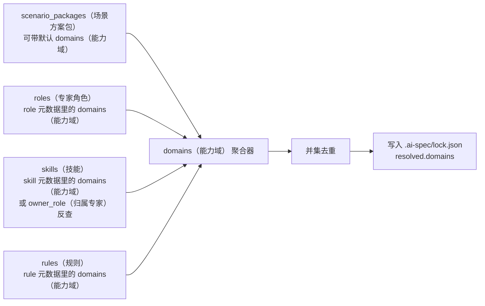

# Manifest（安装清单）规范

本文档定义 Hub 平台输出给当前项目的 `manifest（安装清单）` 结构。

目标是统一三端口径：

- Hub 平台负责生成 `manifest（安装清单）`
- CLI（命令行工具）负责解析和安装
- 插件 / OpenClaw 负责传递或触发，不自行发明安装结构

补充边界：

- Hub 负责维护 registry 主数据（角色、规则、技能、场景）
- manifest 负责把“本次安装要什么”传给 CLI
- CLI 在安装 / 同步时把 registry snapshot 展开为项目本地 `.agents/registry`
- Visual 只消费 CLI 已同步、已上报的结果

这份规范当前只定义：

- 最小可用字段
- 推荐扩展字段
- 校验规则
- CLI 的最小处理约定

配套状态文件规范见：

- [lock与sources结构规范-03-27-17-17.md](lock与sources结构规范-03-27-17-17.md)

不在本阶段定义：

- 完整依赖求解器
- 在线注册中心协议
- 资产签名与权限系统

## 1. 设计目标

`manifest（安装清单）` 的作用不是“展示内容”，而是“驱动安装”。

因此它必须满足 4 个要求：

1. 可解析
2. 可审计
3. 可复现
4. 可渐进扩展

一句话：

> `manifest（安装清单）` 是 Hub 和当前项目之间的最小安装契约。

## 2. 适用范围

当前建议这份规范用于两类场景：

### 2.1 Hub 导出的远程安装清单

例如：

- Hub 平台上勾选“场景方案（Scenario Packages）”
- Hub 生成 URL 或 JSON 文件
- CLI 通过 `--manifest（安装清单）` 读取并执行

### 2.2 项目本地保存的当前启用清单

例如：

- 安装完成后写入 `.ai-spec/manifest.json`
- 用于后续 `sync（同步） / update（更新） / rollback（回滚）`

说明：

- 远程清单和本地清单可以共用同一结构
- 本地清单允许在 CLI 落盘时补充来源信息和安装时间等元数据
- 当前代码实现已先支持“本地 JSON 文件清单”，远程 URL（链接） 清单保留为下一阶段扩展

## 3. 最小结构

当前阶段建议最小 `manifest（安装清单）` 结构如下：

```json
{
  "schema_version": 1,
  "manifest_type": "hub-install",
  "profile": "vue",
  "ides": ["cursor", "claude"],
  "scenario_packages": ["frontend-basic"],
  "roles": ["task-orchestrator", "requirement-analyst"],
  "skills": ["create-proposal", "design-analysis"],
  "rules": ["api-standard", "route-standard"],
  "entry_role": "task-orchestrator"
}
```

这份最小结构代表的是：

- Hub 侧“用户选了什么”
- 不直接表达 CLI 最终“解析出了什么”

因此当前阶段建议：

- `scenario_packages（场景方案包）` 保留
- `roles（专家角色）`、`skills（技能）`、`rules（规则）` 保留
- `flows（流程模板）`、`domains（能力域）` 不作为 Hub 远程清单的必备字段

原因是：

- `flows（流程模板）` 由当前项目内置维护并安装到目标项目，具体任务使用哪条 `flow（流程模板）` 由 `run（运行编排）` 阶段决定
- `domains（能力域）` 更适合作为资产分类和检索元数据，不一定是用户安装时必须显式选择的字段

## 4. 字段定义

### 4.1 必填字段

| 字段 | 类型 | 说明 |
| --- | --- | --- |
| `schema_version（结构版本）` | number | 当前固定为 `1` |
| `manifest_type（清单类型）` | string | 当前建议固定为 `hub-install` |
| `profile（技术栈）` | string | 当前项目安装的技术栈，如 `vue`、`react` |
| `ides（IDE 列表）` | string[] | 当前目标 IDE 列表，默认建议为 `["cursor", "claude"]` |
| `scenario_packages（场景方案包）` | string[] | 用户选择的场景方案集合 |
| `roles（专家角色）` | string[] | 本次启用的专家角色 ID 集合 |
| `skills（技能）` | string[] | 本次启用的技能 ID 集合 |
| `rules（规则）` | string[] | 本次启用的规则 ID 集合 |

### 4.2 可选字段

| 字段 | 类型 | 说明 |
| --- | --- | --- |
| `name（清单名称）` | string | 人类可读名称 |
| `description（清单描述）` | string | 人类可读说明 |
| `version（清单版本）` | string | Hub 侧发布版本，如 `2026.03.27` |
| `tags（标签）` | string[] | 行业或主题标签 |
| `sources（来源）` | object[] | 记录资产来源仓库或平台 |
| `entry_role（默认入口角色）` | string | 推荐默认入口角色，通常为 `task-orchestrator` |
| `domains（能力域）` | string[] | 可选元数据，供检索、统计或本地落盘使用 |
| `flows（流程模板）` | string[] | 可选安装提示字段；当前更建议由当前项目内置维护，不要求 Hub 显式输出 |
| `constraints（约束）` | object | 技术栈、IDE、版本限制 |
| `notes（备注）` | string[] | 给 CLI 或插件的非阻断说明 |

### 4.3 与 registry（注册表）的关系

manifest 不等于 registry，但两者必须协同：

- `manifest（安装清单）` 解决“本次安装选了哪些角色 / 规则 / 技能 / 场景”
- `registry snapshot（注册表快照）` 解决“这些资产的来源路径、profile 维度和运行时补充元数据是什么”

如果 Hub 侧有 profile（技术栈）差异，推荐在 registry snapshot 中显式输出：

- `sourceByProfile`
- `rule_ids_by_profile`
- `skill_priority_by_profile`

CLI 消费时按“通用字段 + profile 字段”合并，不要只看通用字段。

### 4.3 当前阶段的字段边界

当前建议把字段分成两层理解：

#### Hub 输出的“请求层”

用于表达用户在 Hub 上明确选择的内容：

- `profile（技术栈）`
- `ides（IDE 列表）`
- `scenario_packages（场景方案包）`
- `roles（专家角色）`
- `skills（技能）`
- `rules（规则）`

#### CLI 解析的“结果层”

用于表达当前驱动在本地解析出来的内容：

- `domains（能力域）`
- 最终依赖展开结果

这里的 `domains（能力域）` 更准确地说是**本地聚合标签**，不是要求仓库目录必须存在 `domains/`。

当前阶段更推荐的求解方式是：

- 从 `roles（专家角色） / skills（技能） / rules（规则） / scenario_packages（场景方案包）` 的元数据里读取 `domains（能力域）`
- 在 `sync（同步）` 时做并集聚合
- 作为本地检索、统计、安装结果展示的辅助信息写入 `lock（锁定清单）`

也就是说：

> `domains（能力域）` 应由本地元数据聚合得到，而不是要求 Hub 显式给出，也不是要求目录名直接等于能力域。

如果项目后续坚持采用 `.agents/skills/<expert-id>/` 的组织方式，也可以成立，但需要补充一层稳定映射：

- 要么在 `skill（技能）` 元数据里直接声明 `domains（能力域）`
- 要么在 `role（专家角色）` 元数据里声明 `domains（能力域）`，再由 `skill.owner（技能归属专家）` 反查得到

#### `domains（能力域）` 聚合示意图

可以把 `domains（能力域）` 理解成“这次安装资产覆盖了哪些能力方向”的标签集合。



这张图表达的不是“按目录推断能力域”，而是：

- 先从各类资产的元数据读取 `domains（能力域）`
- 再做一次并集去重
- 最后把结果作为安装态标签写入 `lock（锁定清单）`

一个最小例子如下：

- `requirement-analyst（需求解析专家）` -> `demand-design（需求设计域）`
- `frontend-implementer（前端实现专家）` -> `engineering（工程构建域）`
- `code-guardian（规范守护者）` -> `governance（规范治理域）`
- `create-proposal（创建提案）` -> `demand-design（需求设计域）`
- `api-standard（接口规范）` -> `governance（规范治理域）`

最终聚合后：

```json
{
  "domains": [
    "demand-design",
    "engineering",
    "governance"
  ]
}
```

所以在当前阶段更推荐的设计是：

> Hub 负责“用户选什么”，CLI 负责“系统最终怎么装”。

## 5. 推荐扩展结构

如果你希望这份清单未来同时服务 Hub、CLI 和插件页面，建议使用下面这版“推荐结构”：

```json
{
  "schema_version": 1,
  "manifest_type": "hub-install",
  "name": "Vue 前端规范驱动基础包",
  "description": "面向 Vue 项目的规范驱动开发基础能力组合",
  "version": "2026.03.27",
  "profile": "vue",
  "ides": ["cursor", "claude"],
  "scenario_packages": ["frontend-basic", "design-to-code"],
  "roles": ["task-orchestrator", "requirement-analyst", "frontend-implementer", "code-guardian"],
  "skills": ["create-proposal", "design-analysis", "execute-task"],
  "rules": ["api-standard", "route-standard", "style-standard"],
  "entry_role": "task-orchestrator",
  "tags": ["vue", "前端", "金融"],
  "constraints": {
    "min_cli_version": "0.1.0",
    "supported_ides": ["cursor", "claude"],
    "supported_profiles": ["vue"]
  },
  "sources": [
    {
      "type": "hub",
      "name": "ai-spec-auto-hub",
      "url": "https://hub.example.com/manifests/vue-frontend-basic.json"
    }
  ],
  "notes": [
    "默认包含需求到交付流程",
    "适合从 PRD 或设计稿启动"
  ]
}
```

## 6. 字段约束

### 6.1 数组字段

以下字段即使为空，也建议输出为空数组，而不是省略：

- `ides（IDE 列表）`
- `scenario_packages（场景方案包）`
- `roles（专家角色）`
- `skills（技能）`
- `rules（规则）`

这样可以降低解析复杂度。

### 6.2 ID 规范

所有资产 ID 建议统一使用英文 `kebab-case（短横线命名）`：

- `frontend-basic`
- `demand-design`
- `create-proposal`
- `prd-to-delivery`
- `task-orchestrator`

### 6.3 `profile（技术栈）`

当前建议允许值：

- `vue`
- `react`
- `common`

### 6.4 `ides（IDE 列表）`

当前建议允许值：

- `cursor`
- `claude`
- `trae`

默认建议值：

- `["cursor", "claude"]`

原因：

- 当前 CLI 的 `default（默认）` 模式就是 `cursor（Cursor） + claude（Claude）`
- Hub 侧如果也默认给出这两个 IDE，会和当前 CLI 口径保持一致

兼容建议：

- 如果旧版清单仍使用 `ide（IDE 类型）` 单字段，CLI 可先做兼容解析，再归一化为 `ides（IDE 列表）`

### 6.5 `manifest_type（清单类型）`

当前建议允许值：

- `hub-install`
- `local-installed`

其中：

- `hub-install` 用于 Hub 导出的远程清单
- `local-installed` 用于项目本地安装后的落盘清单

## 7. 校验规则

CLI 读取 `manifest（安装清单）` 后，建议按下面顺序做校验：

1. JSON 是否可解析
2. `schema_version（结构版本）` 是否支持
3. 必填字段是否存在
4. `profile（技术栈）` 和 `ides（IDE 列表）` 是否有效
5. `roles（专家角色）` 是否存在于角色索引
6. `rules（规则）`、`skills（技能）` 是否可解析到真实资产
7. `scenario_packages（场景方案包）` 是否可映射到预置组合
8. `entry_role（默认入口角色）` 是否与启用资产一致

如果 CLI 在本地还需要补充：

- `domains（能力域）`

则这一步应在安装求解阶段完成，而不是要求 Hub 远程清单显式给出。

## 8. CLI 的最小处理约定

当前阶段，CLI 读取 `manifest（安装清单）` 后，建议只做这 5 件事：

1. 解析清单
2. 校验清单
3. 从 `scenario_packages（场景方案包） / roles（专家角色） / skills（技能） / rules（规则）` 解析依赖关系
4. 编译或拷贝资产到目标项目
5. 写入本地 `.ai-spec/manifest.json / lock.json / sources.json`

其中：

- `.ai-spec/manifest.json`
  - 保存当前项目“目标启用清单”
- `.ai-spec/lock.json`
  - 保存本次实际安装版本和解析结果
- `.ai-spec/sources.json`
  - 保存资源来源

## 9. Hub 与 CLI 的分工

### Hub 平台负责

- 选择场景方案
- 选择专家
- 选择技能
- 补充或覆盖规则
- 生成 `manifest（安装清单）`
- 生成安装命令

### CLI 负责

- 读取 `manifest（安装清单）`
- 校验和求解
- 汇总本地 `domains（能力域）` 标签（来自 `role / skill / rule / scenario` 元数据，而不是目录名）
- 安装当前项目内置的 `flows（流程模板）`
- 如需审计或展示，可在 `lock（锁定清单）` 中记录 `installed_flows（已安装流程模板）`
- 真实安装到项目
- 生成本地状态文件

重要说明：

> Hub 不负责直接改用户项目，CLI 才是最终执行器。

## 10. 推荐命令形式

`sync（同步）` 的输入输出契约详见：

- [ai-spec-auto-sync输入输出契约-03-27-17-09.md](ai-spec-sync输入输出契约-03-27-17-09.md)

### 10.1 初始化安装

```bash
npx @engineered/ai-spec-auto@latest init . \
  --profile vue \
  --ide default \
  --manifest https://hub.example.com/manifests/vue-frontend-basic.json
```

### 10.2 增量同步

```bash
npx @engineered/ai-spec-auto@latest sync . \
  --manifest https://hub.example.com/manifests/project-abc-20260327.json
```

### 10.3 本地文件清单

```bash
npx @engineered/ai-spec-auto@latest sync . \
  --manifest ./ai-spec.manifest.json
```

## 11. 当前阶段建议

当前阶段不要把 `manifest（安装清单）` 做成复杂编排协议。

最稳的做法是：

- 先把“用户选择清单”定义稳定
- 先支持 `scenario_packages（场景方案包） + roles（专家角色） + skills（技能） + rules（规则）`
- 先让 CLI 能稳定读写和落盘

后续如果真的需要，再扩展：

- `domains（能力域）`
- `flows（流程模板）`
- 依赖声明
- 版本约束
- 权限策略
- 签名和校验摘要

## 12. 一句话收束

> `manifest（安装清单）` 是 Hub 到项目安装链路里的结构化桥梁。它不负责展示，也不直接执行，它负责把“用户选了什么”稳定传递给 CLI，让安装过程变得可审计、可复现、可扩展。
