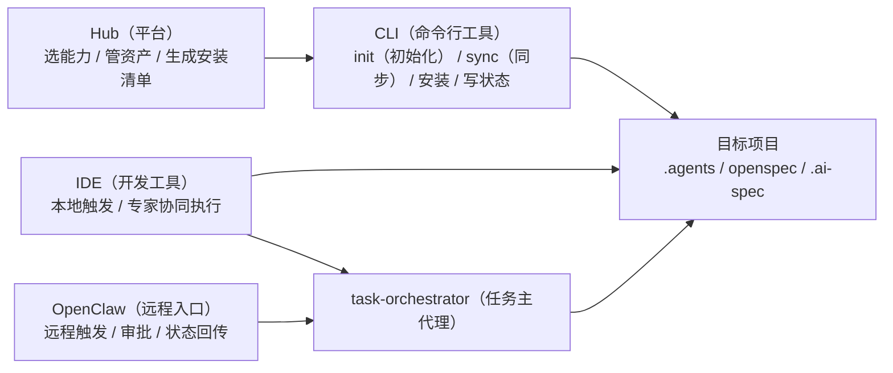
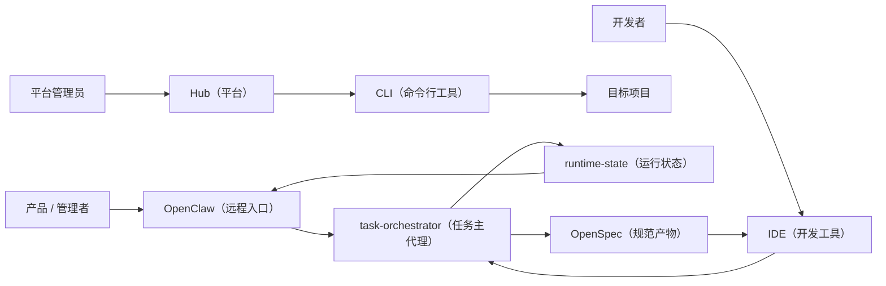

# OpenClaw 团队协同控制面定位与价值说明

## 1. 文档目的

这份文档专门回答一个问题：

> 在 `AI 规范驱动开发平台` 里，`OpenClaw（远程入口）` 到底扮演什么角色，为什么它值得被单独强调。

这份文档不讲钉钉（协同工具）接入细节，不讲机器人实现细节，而是聚焦 4 件事：

1. `OpenClaw（远程入口）` 的平台定位
2. 它和 `Hub（平台） / CLI（命令行工具） / IDE（开发工具）` 的边界关系
3. 它对大领导、团队管理者、研发协同链路的价值
4. 当前阶段能做什么，后续应该如何逐步增强

---

## 2. 一句话定位

建议对内对外统一表述为：

> `OpenClaw（远程入口）` 是 `AI 规范驱动开发平台` 的团队协同控制面，负责远程任务触发、审批放行、状态回传与协同治理。

这句话里有 4 个关键点：

- `团队协同`
  - 说明它不是个人本地工具，而是服务多人协作
- `控制面`
  - 说明它不是单纯聊天机器人，而是流程控制入口
- `远程任务触发`
  - 说明任务可以不从 `IDE（开发工具）` 发起
- `审批与状态回传`
  - 说明它具备管理能力，而不仅是执行能力

---

## 3. 为什么 OpenClaw 需要被单独强调

如果没有 `OpenClaw（远程入口）`，当前平台更像：

- 一套本地安装能力
- 一套 `IDE（开发工具）` 内部的专家协同能力
- 一套偏开发者视角的工具链

加入 `OpenClaw（远程入口）` 后，平台会发生 3 个层级的变化：

### 3.1 从“个人 AI 编码助手”升级为“团队协同系统”

没有 `OpenClaw（远程入口）` 时：

- 任务主要在本地 `IDE（开发工具）` 中发起
- 任务状态主要被开发者本人看到
- 审批和沟通仍依赖外部口头同步

有了 `OpenClaw（远程入口）` 后：

- 任务可以在群里直接发起
- 审批和阻断可以在群里直接处理
- 运行状态可以回传给团队

### 3.2 从“执行工具”升级为“管理可见系统”

大领导通常不会只关心“能不能写代码”，更关心：

- 有没有流程可见性
- 有没有审批点
- 有没有风险控制
- 能不能追踪和复盘

`OpenClaw（远程入口）` 恰好对应这几个点：

- `status（状态）`
- `gate-blocked（阻断）`
- `approve（审批）`
- `resume（恢复）`
- `complete（完成）`
- `fail（失败）`
- `cancel（取消）`

### 3.3 从“本地交互”升级为“远程办公入口”

这对组织视角很重要。

产品、测试、管理者不需要都进入 `IDE（开发工具）`，也不需要理解本地命令，只要在远程协同入口中完成：

- 发起任务
- 补充输入
- 审批继续
- 查询状态
- 接收结果

---

## 4. OpenClaw 在整个平台中的角色边界

### 4.1 推荐边界



### 4.2 各层职责

#### `Hub（平台）`

- 负责资产管理和选择
- 负责生成 `manifest（安装清单）`
- 不负责本地执行

#### `CLI（命令行工具）`

- 负责 `init（初始化） / sync（同步）`
- 负责把资产安装到目标项目
- 不负责远程协同消息本身

#### `IDE（开发工具）`

- 负责本地开发触发
- 负责承接 `task-orchestrator（任务主代理）`
- 负责本地 AI（智能体）上下文执行

#### `OpenClaw（远程入口）`

- 负责远程任务入口
- 负责审批入口
- 负责运行态查询和回传
- 不直接替代主代理做路由判断

#### `task-orchestrator（任务主代理）`

- 负责分析任务
- 负责生成 `run-plan（运行计划）`
- 负责选择专家和动作
- 负责和 `runtime-state（运行状态）` 链接

一句话：

> `OpenClaw（远程入口）` 负责“把任务送进来、把状态带出去”，`task-orchestrator（任务主代理）` 负责“真正做编排”。

---

## 5. 最适合强调的 4 个价值场景

### 5.1 场景一：远程发起任务

适合表述为：

> 任务不一定从 `IDE（开发工具）` 发起，也可以从团队协同入口直接发起。

示例：

```text
产品经理：创建一个商品卡片组件
OpenClaw：已创建任务，进入主代理分析
OpenClaw：识别为组件开发，建议走 prd-to-delivery（需求到交付）
```

这个场景强调的是：

- 跨角色协同
- 远程办公
- 任务统一入口

### 5.2 场景二：审批与阻断处理

这是最适合领导视角的场景。

示例：

```text
OpenClaw：当前任务缺少设计稿，已进入 gate-blocked（阻断） 状态
负责人：审批通过，先按现有样式实现
OpenClaw：已写入 approve（审批），恢复执行并交接 frontend-implementer（前端实现专家）
```

这个场景强调的是：

- 风险控制
- 流程治理
- 人机协同审批

### 5.3 场景三：运行态查询与团队可见

示例：

```text
负责人：查看当前任务状态
OpenClaw：当前专家为 code-guardian（规范守护者），状态为 running（运行中），当前无待审批点
```

这个场景强调的是：

- 任务可见
- 流程可见
- 研发过程可追踪

### 5.4 场景四：交付结果回传

示例：

```text
OpenClaw：任务已完成，已更新 run-state（运行状态）
OpenClaw：产出 proposal（提案）、tasks（任务清单）、checklist（检查清单），并完成当前阶段代码修改
```

这个场景强调的是：

- 结果闭环
- 可审计
- 可回放

---

## 6. 推荐的系统叙事

### 6.1 对团队内部的叙事

可以这样说：

> `Hub（平台）` 负责选能力，`CLI（命令行工具）` 负责装能力，`IDE（开发工具）` 负责本地执行，`OpenClaw（远程入口）` 负责团队远程触发、审批放行和状态回传。

### 6.2 对大领导的叙事

建议这样说：

> 我们做的不是单点 AI 编码工具，而是一套可按需安装、可验证、可观测、可跨 IDE（开发工具）复用的 AI 规范驱动开发平台。  
> `OpenClaw（远程入口）` 在里面不是附属机器人，而是团队协同控制面，负责把研发任务从“个人 IDE（开发工具） 行为”提升为“团队可见、可审批、可治理的运行链路”。

### 6.3 不建议的表述

不建议重点讲：

- `OpenClaw（远程入口）` 可以直接写代码
- `OpenClaw（远程入口）` 可以代替 IDE（开发工具）
- `OpenClaw（远程入口）` 可以完全自主研发

因为这样会显得边界失控。

更稳的说法是：

- `OpenClaw（远程入口）` 是远程协同控制入口
- 真正编排仍由 `task-orchestrator（任务主代理）` 负责
- 真正资产安装仍由 `CLI（命令行工具）` 负责

---

## 7. 当前阶段已经具备什么

结合当前项目现状，可以如实表述为：

### 已经具备

- `runtime-state（运行状态）` 的最小落盘链
- `bootstrap（首轮桥接） / handoff（交接） / approve（审批） / resume（恢复） / status（状态） / complete（完成） / fail（失败） / cancel（取消）`
- `task-orchestrator-adapter（主代理自动执行适配层）`
- `task-orchestrator-extractor（主代理输出抽取器）`
- `IDE（开发工具）` 内 `/spec-start`、`/spec-continue`、`/spec-orchestrate` 的真实触发链

### 已具备的 OpenClaw 价值承接点

从架构上，`OpenClaw（远程入口）` 已经可以自然承接下面这些动作：

- 远程创建任务
- 远程查看任务状态
- 远程审批继续
- 远程取消任务
- 远程接收完成/失败通知

### 还没有完全落地的部分

- `OpenClaw（远程入口）` 对自然语言回复的真实接线细节
- 多轮消息编排中的自动抽取和回写
- 多动作批处理
- 更完整的审计视图和报表视图

---

## 8. 推荐的近阶段建设顺序

如果要强化 `OpenClaw（远程入口）`，建议优先级如下：

### 第一阶段：控制面优先

优先支持：

- `status（状态）`
- `approve（审批）`
- `resume（恢复）`
- `cancel（取消）`

原因：

- 最贴近管理诉求
- 风险最低
- 最能体现治理能力

### 第二阶段：任务入口增强

再支持：

- 新任务创建
- 缺失输入补充
- `gate-blocked（阻断）` 回传

原因：

- 让群入口真正具备任务入口属性
- 让产品、测试、负责人都能参与

### 第三阶段：结果广播与协同沉淀

进一步支持：

- 完成摘要
- 失败摘要
- 运行态回放
- 审计与统计

原因：

- 更适合平台化治理
- 更适合向领导展示“可观测”

---

## 9. 一个适合汇报的总图



这张图最适合讲 3 件事：

1. `Hub（平台）` 管资产
2. `IDE（开发工具）` 和 `OpenClaw（远程入口）` 都能触发同一个主代理
3. 运行态和规范产物能回流到团队协同入口

---

## 10. 结论

`OpenClaw（远程入口）` 最有价值的地方，不是“也能调一下 AI（智能体）”，而是：

> 它把 `AI 规范驱动开发平台` 从“个人 IDE（开发工具） 内部工具”，提升成“团队可触发、可审批、可追踪、可治理的研发协同系统”。

对平台来说：

- `Hub（平台）` 负责能力资产管理
- `CLI（命令行工具）` 负责安装和同步
- `IDE（开发工具）` 负责本地执行
- `OpenClaw（远程入口）` 负责团队协同控制面

对组织来说：

- 它让研发任务不再只发生在个人工作台里
- 它让 AI 协同过程具备管理可见性
- 它让规范驱动开发具备远程办公和团队协同价值

因此，`OpenClaw（远程入口）` 应该被作为这套平台的重要组成部分来讲，而不是作为附属能力一笔带过。
