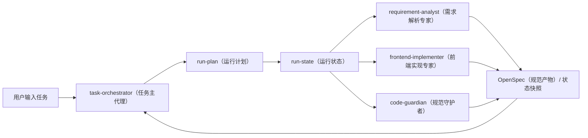
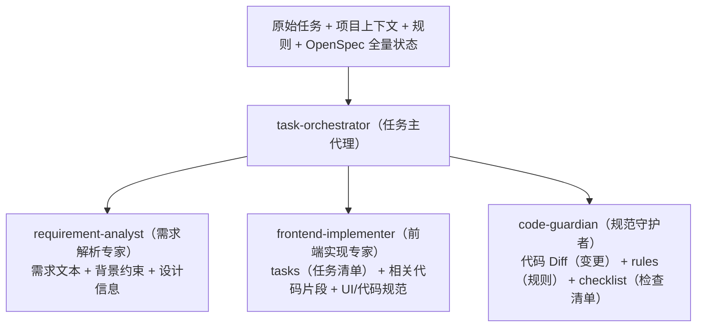

# 专家协同的轻量化治理与上下文压缩方案

## 1. 文档目的

本文档用于吸收前面对“实现成本重”和“多专家协同通信损耗”的讨论结果，只保留当前项目可落地、可渐进演进的部分。

目标不是一次性把平台做成重型 `Agent OS（智能体操作系统）`，而是先把下面 4 件事做稳：

- 小项目可接入，不被一套重规范劝退
- 多专家协同时，尽量不传整段聊天记录
- `run（运行编排）` 能够稳定落盘、恢复和审计
- 后续扩专家时，不因为 `Context Window（上下文窗口）` 爆炸而失控

## 2. 核心判断

针对当前项目，我建议吸收的不是那些“大词”，而是 5 个真正有工程价值的点：

1. `Progressive Enhancement（渐进式增强）`
2. `Blackboard / Snapshot（黑板模式 / 状态快照）`
3. `Need-to-Know Injection（最小知情注入）`
4. `JIT Documentation（即时文档生成）`
5. `Lightweight Contract Enforcement（轻量强契约）`

不建议当前直接采用的内容：

- 把项目正式定位成 `Harness Engineering（线束工程）`
- 把平台描述成 `AI-Native R&D OS（AI 原生研发操作系统）`
- 一上来就实现完整 `Saga（补偿事务）`、完整 `DAG（有向无环图）` 状态机和复杂回滚引擎

## 3. 当前问题拆解

### 3.1 接入和维护偏重

当前体系包含：

- `.agents/`
- `context/`
- `openspec/`
- `.ai-spec/`

这些结构对于中大型项目是合理的，但对小项目而言，容易产生两个感受：

- 上来就要配很多东西
- 还没开始做任务，先被结构压住

### 3.2 多专家协同会产生上下文损耗

如果未来专家越来越多，最容易出现的问题不是“不会写代码”，而是：

- 每个专家都吃全量历史，`Token（上下文消耗）` 很快失控
- 上下游像“传声筒”一样越传越偏
- 后面的专家不知道哪些是原始意图，哪些只是中间讨论噪声

## 4. 轻量化治理总方案

### 4.1 总体思路

总体原则是：

> 对外轻接入，对内强约束；少传对话，多传状态；少传全文，多传快照。

推荐的运行模型如下：



这张图表达的是：

- 专家之间不直接传大段对话
- 专家主要读写 `OpenSpec（规范产物）` 和 `run-state（运行状态）`
- `task-orchestrator（任务主代理）` 负责收敛、裁剪和再次分发

## 5. 可直接吸收的 4 个设计

### 5.1 渐进式增强

#### 建议

把项目能力拆成两层：

- `基础层`
  - `init（初始化） / sync（同步）`
  - `rules（规则） / skills（技能） / roles（专家角色） / flows（流程模板）`
- `增强层`
  - `openspec（规范目录）`
  - `run-state（运行状态）`
  - `task-orchestrator（任务主代理）` 动态编排

#### 设计原则

- 小项目先只接 `基础层`
- 当用户开始跑真实任务时，再逐步固化 `OpenSpec（规范产物）` 和运行态
- 不要求用户一开始手写完整 `PROJECT.md / proposal.md / tasks.md`

#### 当前项目的落地方式

- `sync（同步）` 保持轻量，只负责安装
- `run（运行编排）` 第一次触发时，再创建：
  - `.ai-spec/current-run.json`
  - `.ai-spec/runs/<run-id>.json`
  - 必要时生成最小 `proposal（提案） / tasks（任务清单）`

### 5.2 黑板模式与状态快照

#### 建议

把下面这些文件当成专家协同的“公共黑板”：

- `openspec/changes/<change-id>/proposal.md`
- `openspec/changes/<change-id>/tasks.md`
- `openspec/changes/<change-id>/checklist.md`
- `openspec/changes/<change-id>/iterations.md`
- `.ai-spec/current-run.json`
- `.ai-spec/runs/<run-id>.json`

#### 原则

- 专家之间不透传全量聊天记录
- 只传结构化状态和必要摘要
- 由主代理负责把上游输出压缩成“下游可消费快照”

#### 价值

- 降低 `Context Window（上下文窗口）` 占用
- 提高审计和回放能力
- 减少专家之间的提示词漂移

### 5.3 最小知情注入

#### 建议

每个专家只看到完成自己职责所必需的信息。

示意如下：



#### 最小规则

- `requirement-analyst（需求解析专家）`
  - 不需要全量代码库历史
- `frontend-implementer（前端实现专家）`
  - 不需要完整聊天记录
- `code-guardian（规范守护者）`
  - 不需要长篇需求讨论，只需要规则、差异和验收目标

#### 价值

- 降低 `Token（上下文消耗）`
- 提升专家聚焦度
- 降低“前面讨论污染后面执行”的风险

### 5.4 即时文档生成

#### 建议

不要要求用户先把 `spec（规范文档）` 写完整再运行，而是：

1. 用户先触发任务
2. 主代理先生成最小 `run-plan（运行计划）`
3. 需求解析专家按需补出 `proposal（提案） / tasks（任务清单）`
4. 真正确认要执行后，再把结果固化到 `OpenSpec（规范目录）`

#### 示例

用户输入：

```text
@task-orchestrator（任务主代理） 创建一个商品组件
```

系统先做：

- 识别任务类型
- 生成最小 `run-plan（运行计划）`
- 补问缺失信息
- 信息足够后，再生成 `proposal（提案）` 和 `tasks（任务清单）`

而不是要求用户先手工创建一堆文件。

## 6. 针对通信损耗的具体方案

### 6.1 不传 Chat History（聊天历史），只传 Snapshot（快照）

这是最重要的一条。

当前建议专家之间只传下面 3 类内容：

- `task-anchor（任务锚点）`
  - 原始任务目标
- `state-snapshot（状态快照）`
  - 当前最关键的结构化状态
- `role-brief（角色简报）`
  - 当前专家应该做什么、不能做什么

禁止直接透传：

- 多轮完整聊天记录
- 上一位专家的大段解释性废话
- 与当前步骤无关的历史分析

### 6.2 每一轮都注入任务锚点

每次调用专家时，主代理都应重新注入：

- 原始任务目标
- 当前约束规则
- 本轮目标产物

建议的注入结构：

```text
任务锚点：
- 原始目标：创建一个商品组件
- 当前阶段：前端实现
- 必须遵守：组件规范、样式规范、路由规范
- 当前输入：tasks.md 第 1、2 项
- 当前输出：商品组件代码 + 文件清单
```

这一步的目的不是重复，而是“防漂移”。

### 6.3 角色间只传结构化输出

每个专家的输出都尽量变成结构化产物，而不是长段 prose（自由文本）：

- `requirement-analyst（需求解析专家）`
  - 输出：`proposal（提案） / tasks（任务清单） / 风险项`
- `frontend-implementer（前端实现专家）`
  - 输出：`modified_files（修改文件） / 代码变更说明 / 待确认问题`
- `code-guardian（规范守护者）`
  - 输出：`checklist（检查清单） / 问题清单 / 结论`

### 6.4 控制单次注入预算

可以先定一个很务实的预算：

- 单专家单轮注入，尽量控制在“任务锚点 + 当前快照 + 少量相关代码片段”
- 不主动注入全量 `OpenSpec（规范目录）`
- 不主动注入无关目录树

简化原则：

- 先传结论
- 再传约束
- 最后再传少量必要上下文

## 7. 轻量强契约

当前不建议一上来做重型状态机，但建议先做 3 个轻量校验：

### 7.1 `run-plan（运行计划）` 校验

至少校验：

- `selected_flow（选择的流程模板）`
- `selected_roles（本次激活专家）`
- `missing_inputs（缺失输入）`
- `next_action（下一动作）`

### 7.2 `run-state（运行状态）` 校验

至少校验：

- `run_id（运行 ID）`
- `status（状态）`
- `entry（入口）`
- `current_role（当前专家）`
- `artifacts（产物引用）`

### 7.3 专家输出最小校验

例如：

- `frontend-implementer（前端实现专家）` 至少要给出 `modified_files（修改文件）`
- `code-guardian（规范守护者）` 至少要给出 `issues（问题）` 或 `passed（通过）`

这样就算不做重型引擎，也能先挡住最常见的漂移。

## 8. 当前项目的实施建议

### Phase 1（第一阶段）

只做 4 件事：

1. `run-state（运行状态）` 落盘
2. `task-orchestrator（任务主代理）` 首轮 `run-plan（运行计划）`
3. 专家之间优先传 `OpenSpec（规范产物）` 和 `run-state（运行状态）`
4. 每轮执行强制注入 `task-anchor（任务锚点）`

### Phase 2（第二阶段）

补下面 4 件事：

1. 按专家类型做 `Need-to-Know Injection（最小知情注入）`
2. 对 `run-plan（运行计划） / run-state（运行状态） / 专家输出` 做轻量校验
3. 引入最小 `Summary（摘要）` 机制
4. 对长链路任务增加关键检查点

### Phase 3（第三阶段）

再考虑下面这些更重的能力：

1. 更细粒度的 `Context Compaction（上下文压缩）`
2. 更强的 `Role Routing（专家路由）`
3. 回退和重试策略
4. 插件和 OpenClaw（远程入口）统一运行态协议

## 9. 当前最不建议做的事

以下内容当前阶段不建议优先投入：

- 不要先做完整 `Saga（补偿事务）`
- 不要先做复杂 `DAG（有向无环图）` 调度引擎
- 不要让每个专家都吃全量上下文
- 不要把所有结构都设计成强依赖 AI（智能体）推理
- 不要把“轻量接入”讲成“已经零配置”

## 10. 一句话结论

当前项目最值得吸收的优化方向不是“更大的概念”，而是更轻、更稳的运行方法：

> 用 `OpenSpec（规范产物） + run-state（运行状态）` 代替长对话透传，用 `task-orchestrator（任务主代理）` 做最小知情注入和任务锚点重注，让专家协同从“聊天链路”逐步变成“状态驱动链路”。

