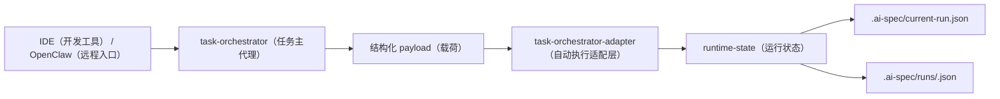

# 主代理自动执行适配层

## 1. 目的

这层适配器用于解决一个现实问题：

- `task-orchestrator（任务主代理）` 已经能产出结构化 `run-plan（运行计划）`
- `runtime-state（运行状态）` 也已经有完整的最小命令集
- 但如果还要让运行环境手工拼：
  - `bootstrap（首轮桥接）`
  - `handoff（交接）`
  - `gate-blocked（阻断）`
  - `approve（审批）`
  - `resume（恢复）`
  - `complete（完成）`
  - `fail（失败）`
  - `cancel（取消）`

那么链路仍然太碎。

因此新增：

```bash
ai-spec-auto task-orchestrator-adapter apply --payload <file>
```

由它统一把主代理结构化输出翻译成运行态落盘更新。

## 2. 当前边界

当前适配层已经实现：

- 消费首轮桥接 payload（载荷）
- 消费运行态动作 payload（载荷）
- 自动调用对应的 `runtime-state（运行状态）` 函数
- 自动回写 `.ai-spec/current-run.json`
- 自动回写 `.ai-spec/runs/<run-id>.json`

当前还没有实现：

- 真正从 AI（智能体）聊天输出中自动抽取 JSON（结构化数据）
- 真正的 `Runner（运行器）` 循环
- 由本地脚本替 `AI（智能体）` 自动生成每一轮 payload（载荷）

当前已经补上的最小 Runner 能力是：

```text
宿主层 / IDE 集成层调用内部模块：
- task-orchestrator-runner.buildStatus(target)
- task-orchestrator-runner.advanceRunner({ target })
```

它适合做：

- 在 `AI（智能体）` 环境中消费 `.ai-spec/tmp/` 里的当前输入
- 按固定 inbox（收件箱） 顺序推进运行态闭环
- 归档已消费输入，并给出 `next_expected（下一份应由谁产出什么）`

当前 `replay（回放）` 仍然保留，但定位仅是：

- 测试夹具回放
- 本地 smoke（冒烟） 验证
- 不作为生产 Runner 主入口

所以当前定位是：

> 当前 Runner 已经能在 `AI（智能体）` 环境里按 inbox（收件箱） 推进闭环，但仍然不会替 `AI（智能体）` 生成派发、执行或动作语义。

## 3. 命令

### 3.1 从文件读取

```bash
ai-spec-auto task-orchestrator-adapter apply \
  --payload ./.ai-spec/tmp/task-orchestrator-first-response.json
```

### 3.2 从标准输入读取

```bash
cat ./.ai-spec/tmp/runtime-action.json | ai-spec-auto task-orchestrator-adapter apply --stdin
```

## 4. 支持的 payload（载荷） 类型

### 4.1 首轮桥接

支持：

- `task-orchestrator-bootstrap（主代理首轮桥接载荷）`

它会自动映射为：

- `runtime-state bootstrap（首轮桥接）`

### 4.2 运行态动作

支持：

- `task-orchestrator-runtime-action（主代理运行动作载荷）`
- `task-orchestrator-runtime-event（主代理运行事件载荷）`

它会自动映射为：

- `handoff（交接）`
- `gate-blocked（阻断）`
- `approve（审批）`
- `resume（恢复）`
- `status（状态）`
- `complete（完成）`
- `fail（失败）`
- `cancel（取消）`

## 5. 推荐链路



## 6. 价值

这一层落下后，运行链从：

- 主代理说“下一步该调用什么命令”

变成：

- 主代理输出结构化动作
- 适配层自动执行对应运行态更新

也就是把“协议层”推进到了“最小实现层”。
