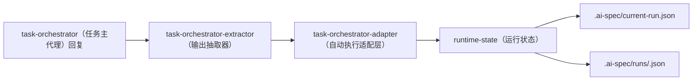

# 主代理输出抽取器

## 1. 目的

`task-orchestrator（任务主代理）` 在真实 `IDE（开发工具）` 里，通常不会只回纯 `JSON（结构化数据）`。

它更可能输出：

- 解释说明
- 缺失输入提示
- 风险判断
- 一段 `json` 代码块

因此需要一个最小抽取器，把这类回复转成系统可执行 payload（载荷）。

## 2. 当前命令

### 2.1 只抽取

```bash
ai-spec-auto task-orchestrator-extractor extract --payload ./.ai-spec/tmp/task-orchestrator-reply.md
```

### 2.2 抽取并直接执行

```bash
ai-spec-auto task-orchestrator-extractor apply --payload ./.ai-spec/tmp/task-orchestrator-reply.md
```

## 3. 当前最小能力

当前只支持：

- 整段内容本身就是纯 `JSON（结构化数据）`
- Markdown（标记文本） 中的第一个合法 ```json 代码块```

并且要求该 JSON 必须属于系统已支持的 payload（载荷）：

- `task-orchestrator-bootstrap（主代理首轮桥接载荷）`
- `task-orchestrator-runtime-action（主代理运行动作载荷）`
- `task-orchestrator-runtime-event（主代理运行事件载荷）`

## 4. 推荐链路



## 5. 价值

这层落下后，系统可以同时满足两件事：

- 对人：回复仍然可读
- 对机器：动作仍然可执行

所以它是：

> 从“AI 说得清楚”到“系统跑得起来”的关键桥接层。

## 6. 当前边界

当前抽取器还不做：

- 多个动作的批处理抽取
- 从自然语言散文里猜字段
- 复杂语义推断

也就是说，当前最佳实践仍然是：

> 主代理把系统动作明确放进 `json` 代码块，再交给抽取器处理。
