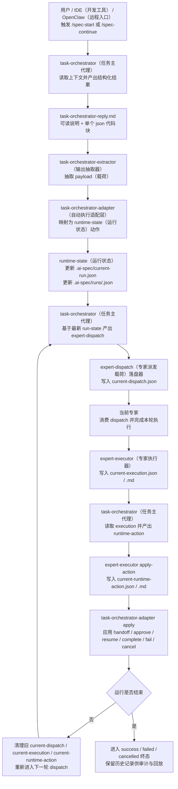

# 完整运行路径单页图

## 1. 目的

这份单页图用于把当前已经固定下来的运行链压缩成一张图，便于：

- 给团队快速讲清楚真实执行路径
- 给管理层说明职责边界和状态落盘点
- 给后续 `Runner（运行器）` 或插件页面实现提供统一接线图

## 2. 单页图

## 3. 这张图要表达的三件事

1. 决策权在 `task-orchestrator（任务主代理）`
   - 负责选择 `flow（流程模板）`、当前 `role（专家角色）`、推荐 `skill（技能）`，并产出 `expert-dispatch（专家派发载荷）` 与 `runtime-action（运行动作）`
2. 执行权在 `当前专家`
   - 负责消费 `current-dispatch（当前专家派发载荷）`，完成本轮任务，并产出 `expert-execution（专家执行载荷）`
3. 本地命令只负责机器侧动作
   - 负责抽取、校验、落盘、状态应用，不替 `task-orchestrator（任务主代理）` 做角色推理、技能选择和下一步动作推理

## 4. 当前边界

这张图表达的是“最小真实闭环”，不是“完整自动运行器”。

当前已经具备：

- `IDE（开发工具）` 命令入口
- `task-orchestrator-extractor（输出抽取器）`
- `task-orchestrator-adapter（自动执行适配层）`
- `runtime-state（运行状态）`
- `expert-dispatch（专家派发载荷）` / `expert-executor（专家执行器）` 落盘能力

当前还未完全具备：

- 自动递归推进整条专家链的真正 `Runner（运行器）`
- 自动生成每一轮 `expert-dispatch（专家派发载荷）` / `expert-execution（专家执行载荷）` / `runtime-action（运行动作）` 的本地 AI 替代逻辑

所以这张图既是当前闭环图，也是下一步 `Runner（运行器）` 的实现蓝图。
