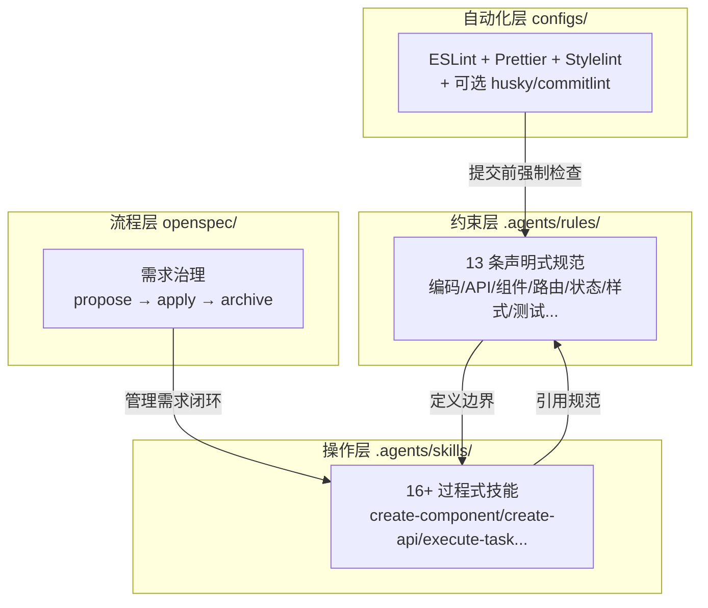

# 规范驱动开发团队内部培训手册

> ai-spec-auto v2.0 | AI Coding 团队规范驱动开发 CLI（**前端**：Vue 3 / React Profile）

---

## 第一章：背景与动机

### 1.1 AI 编码的现状问题

随着 Cursor、Claude Code、Trae 等 AI 编码助手在团队中广泛使用，我们观察到以下反复出现的问题：

| 问题 | 典型表现 |
|------|----------|
| **目录随意** | AI 在 `src/` 下随意创建 `helpers/`、`services/`、`shared/` 等非标准目录 |
| **命名不统一** | 同一项目中出现 `fetchUser`、`getUserApi`、`loadUserData` 三种风格 |
| **样式硬编码** | AI 直接写 `color: #333` 而非使用主题变量 `var(--color-text-primary)` |
| **组件无结构** | 所有组件平铺在 `components/` 下，没有通用/页面级的分层 |
| **规范失忆** | 换一个对话窗口，AI 就"忘记"之前约定的规则 |
| **提示词属人** | 只有少数人能写出高质量提示词，其他人无法复制 |

这些问题的根源在于：**AI 只知道写"能跑的代码"，不知道写"团队认可的代码"**。

### 1.2 核心理念：规范即资产

ai-spec-auto  的核心理念是：

> **把"提示词能力"改造成"项目内资产"**

不再依赖个人记忆和口头约定，而是将团队的编码规范、工作流程、最佳实践沉淀为结构化的文件，让 AI 自动遵循。

```
传统方式：口头约定 → 个人记忆 → 反复提醒 → 仍然犯错
规范驱动：规范文件 → AI 自动读取 → 每次生成都遵循 → 持续沉淀
```

**与 OpenSpec 一体**：**L3** 在项目中落地 **`openspec/`**（需求提案 → 实施 → 归档），通过 **`openspec/config.yaml`** 引用 `.agents` 中的规则与技能上下文——**流程层与编码规范层在同一安装流程中配合**，才是规范驱动开发的完整闭环（小改动仍可不走提案）。

### 1.3 适用团队与场景

- 使用 AI IDE（Cursor / Claude Code / OpenCode / Trae）进行日常开发的 **前端团队**
- **Vue 3 或 React** 技术栈（本库当前仅提供这两套 Profile）
- 希望提高 AI 代码采纳率、减少 Code Review 反复修改的团队

---

## 第二章：核心概念

### 2.1 四层架构

ai-spec-auto 通过约束、操作、自动化与流程四层协同工作；其中 **流程层 `openspec/` 仅在 L3 安装后存在**，并与 `.agents` 通过 **`openspec/config.yaml`** 桥接。



| 层次 | 目录 | 职责 | 类比 |
|------|------|------|------|
| **约束层** | `.agents/rules/` | 告诉 AI 什么能做、什么不能做 | 法律法规 |
| **操作层** | `.agents/skills/` | 告诉 AI 具体怎么做（步骤 + 示例） | 操作手册 |
| **自动化层** | `configs/` | 提交前自动检查代码风格 | 质检流水线 |
| **流程层** | `openspec/`（L3） | 管理需求到归档；`config.yaml` 注入 ai-spec-auto 上下文 | 项目管理 |

### 2.2 Rules — 声明式规范

Rules 是按模块拆分的 Markdown 文件，每个文件定义一个方面的规范约束。

**特点**：
- 按需加载（`alwaysApply: false`），AI 在相关场景时自动引用
- 包含正例/反例代码
- 标注 `NON-NEGOTIABLE` 的条目为强制约束，不可违反

**示例** — API 接口命名规范：

```markdown
## 接口函数命名（NON-NEGOTIABLE）

| 操作 | 命名规则 | 示例 |
|------|----------|------|
| 获取列表 | getXxxListApi | getOrderListApi |
| 获取详情 | getXxxDetailApi | getOrderDetailApi |
| 创建 | createXxxApi | createOrderApi |
| 更新 | updateXxxApi | updateOrderApi |
| 删除 | deleteXxxApi | deleteOrderApi |
```

### 2.3 Skills — 过程式技能

Skills 是步骤化的操作指令，包含触发条件、执行步骤、代码示例和检查清单。

**特点**：
- 按需触发（当 AI 识别到匹配场景时自动读取）
- 包含完整的工作流步骤
- 引用对应的 Rules 作为约束

**示例** — `create-component` 技能工作流：

```
1. 确定组件放置位置（通用 or 页面级）
2. 在 types.ts 中定义 Props/Emits 类型
3. 编写 SFC 组件（<script setup lang="ts">）
4. 使用 style.module.scss 编写样式（引用主题变量）
5. 在 src/components/index.ts 中集中导出（通用组件时）
```

### 2.4 Configs — 自动化工具链

提交前自动执行的代码检查，确保基础风格一致。**说明**：Prettier / ESLint / Stylelint 在勾选 lint/format 时即可下发；**husky、lint-staged、commitlint** 仅在 init 时选择安装提交校验（或 `--husky`）后才会部署到项目并注册 hooks。

| 工具 | 职责 | 触发时机 |
|------|------|----------|
| **Prettier** | 格式化（缩进、引号、分号） | 保存 / pre-commit（若启用 husky） |
| **ESLint** | 代码质量与风格检查 | 保存 / pre-commit（若启用 husky） |
| **Stylelint** | CSS/SCSS 样式检查 | 保存 / pre-commit（若启用 husky） |
| **commitlint** | Git 提交信息格式校验 | commit-msg（需 husky） |
| **husky** | Git hooks 管理器 | 可选安装 |
| **lint-staged** | 只检查暂存文件 | pre-commit（需 husky） |

### 2.5 OpenSpec — 需求治理（L3）

OpenSpec 管理需求从提出到归档的闭环流程：

```
propose（提案）→ apply（实施）→ archive（归档）
```

适用于新功能开发、跨模块变更等较大需求。Bug fix 和小修改可跳过。

**与 ai-spec-auto 的衔接**：安装 **L3** 时生成的 **`openspec/config.yaml`** 会配置 `context` / `rules`，使 **`/opsx:*` 流程**自动读取 **`.agents`** 中的规范与技能；提案产物位于 **`openspec/changes/`**（及 `specs/` 等），与仓库内其他目录共同构成一体能力。

### 2.6 Profile 与安装层级

**技术栈 Profile**：

| Profile | 技术栈 | 规范数 | 技能数 |
|---------|--------|--------|--------|
| **vue** | Vue 3 + TS + Vite + Pinia + Vue Router + CSS Modules | 13 | 16 |
| **react** | React + TS + Vite + Zustand + Ant Design + SCSS Modules | 13 | 17 |

**安装层级**：

| 层级 | 内容 | 适合场景 |
|------|------|----------|
| **L1** | 仅 `.agents`（规范 + 技能） | 个人试用 |
| **L2** | `.agents` + IDE 适配 + MCP 模板 | 团队编码规范 + 外部上下文（**不含** OpenSpec，需显式 `--level L2`） |
| **L3** | L2 + OpenSpec（`openspec/`、OPSX） | **默认安装层级、团队主推**：需求治理与归档，与 `.agents` 经 `config.yaml` 一体联动 |

---

## 第三章：安装与配置

### 3.1 安装流程

**推荐**：在**目标前端项目根目录**使用 **npx**（无需先克隆规范库；私有源见仓库 README `~/.npmrc`）：

```bash
npx @engineered/ai-spec-auto@latest init
npx @engineered/ai-spec-auto@latest init --profile vue              # 默认 L3（含 OpenSpec）
npx @engineered/ai-spec-auto@latest init --profile vue --level L2   # 不要 OpenSpec 时
npx @engineered/ai-spec-auto@latest init --profile react            # 默认 L3
```

**备选**：克隆规范库后使用脚本：

```bash
git clone http://git.100credit.cn/zhenwei.li/ai-spec-auto.git ai-spec-auto
cd ai-spec-auto

bash install.sh init /path/to/your-project
bash install.sh init /path/to/your-project --profile vue --level L2   # 不要 OpenSpec 时
```

Windows PowerShell：

```powershell
git clone http://git.100credit.cn/zhenwei.li/ai-spec-auto.git ai-spec-auto
cd ai-spec-auto
.\install.ps1 init C:\path\to\your-project --profile vue --level L3
```

### 3.2 安装脚本命令

| 命令 | 说明 |
|------|------|
| `install.sh init [dir]` | 首次安装：选择 Profile → 复制规范 → 创建链接 → 检查工具 |
| `install.sh update [dir]` | 更新通用规范（不覆盖项目特有规则 01/03 和 lint 配置） |
| `install.sh check [dir]` | 检查安装状态、链接有效性、工具环境 |
| `install.sh uninstall [dir]` | 卸载规范库 |

等价命令：在项目根目录执行 `npx @engineered/ai-spec-auto@latest init`、`npx @engineered/ai-spec-auto@latest update`、`npx @engineered/ai-spec-auto@latest check`、`npx @engineered/ai-spec-auto@latest uninstall`。

### 3.3 安装后必做事项

**事项一：填写项目信息**

编辑以下两个文件（或在 AI IDE 中输入"初始化项目规范"让 AI 自动生成）：

- `.agents/rules/01-项目概述.md` — 项目定位和技术栈
- `.agents/rules/03-项目结构.md` — 项目目录结构
- 若安装时把 `04/05/06/07/09` 设为“根据项目自定义”，且这些规则文件仍缺失，`project-init` 也会一并补生成

**事项二：配置 MCP（L2/L3）**

修改 `.cursor/mcp.json` 中的占位符：

```json
{
  "project-id": "你的ApiFox项目ID",
  "access-token": "你的ApiFox访问令牌"
}
```

**事项三：OpenSpec（默认安装为 L3 时已包含）**

确认已生成 **`openspec/`**（含 `config.yaml`），并阅读仓库 [docs/openspec-guide.md](../openspec-guide.md)。**`create-proposal` 委托的 `/opsx:propose`** 及 **`openspec/changes/`** 下提案产物 **仅在 L3 可用**；若显式选用 **L1/L2**，可日常开发，但不具备完整 OPSX 流程目录。

### 3.4 IDE 适配原理

安装脚本通过软链接让多个 IDE 共享同一份规范：

```
.agents/          ← 唯一规范源
  ├── rules/
  └── skills/

.cursor/rules  → ../.agents/rules   (symlink)
.cursor/skills → ../.agents/skills  (symlink)
.claude/rules  → ../.agents/rules   (symlink)
.claude/skills → ../.agents/skills  (symlink)
```

修改 `.agents/` 下的文件，所有 IDE 同步生效。

### 3.5 MCP 集成

| 服务 | 用途 | 配置要求 |
|------|------|----------|
| ApiFox | 接口文档 | 需替换 project-id 和 access-token |
| Figma | 设计稿 | 使用 Figma MCP 官方服务 |
| Context7 | 文档检索 | 无需额外配置 |
| Playwright | 页面自动化 | 无需额外配置 |

---

## 第四章：规范体系详解

### 4.1 通用规范（7 条）

#### 02-编码规范

**TypeScript 要求**：

```typescript
// ✅ 正确：完整类型定义
interface UserInfo {
  id: string
  name: string
  roles: string[]
}

const userInfo = ref<UserInfo | null>(null)

// ❌ 错误：使用 any
const userInfo = ref<any>(null)
```

**命名规范**：

| 类型 | 规则 | 示例 |
|------|------|------|
| 路由/目录 | kebab-case | `user-profile` |
| 变量/函数 | camelCase | `userList`、`fetchData` |
| 布尔值 | is/has/can/should 前缀 | `isLoading`、`hasPermission` |
| 常量 | UPPER_CASE | `API_TIMEOUT` |
| 接口/类 | PascalCase | `UserInfo`、`BaseResponse` |
| 组件 | PascalCase | `UserProfile`、`AppHeader` |
| 组合式函数 | use 前缀 | `useUserStore`、`useAuth` |

**业务函数命名**：

```typescript
// 回调属性（Props / Emits）使用 onXxx
defineEmits<{ onSubmit: [data: FormData] }>()

// 本地处理函数使用 handleXxx
function handleSubmit(data: FormData) {
  // ...
}
```

#### 05-API 规范

**目录结构**：

```
src/
├── api/                    # 接口请求函数
│   ├── user.ts
│   ├── order.ts
│   └── types/              # 请求/响应类型定义
│       ├── user.ts
│       └── order.ts
└── config/
    └── requestConfig.ts    # 请求全局配置
```

**命名规范（NON-NEGOTIABLE）**：

```typescript
// ✅ 正确：统一 Api 后缀
export function getUserListApi(params: GetUserListParams): Promise<GetUserListResult> {
  return request({ url: '/api/user/page', method: 'post', data: params })
}

export function createUserApi(data: CreateUserData): Promise<void> {
  return request({ url: '/api/user/create', method: 'post', data })
}

// ❌ 错误：使用 fetch 前缀或缺少 Api 后缀
export function fetchUserList() { /* ... */ }
export function getUsers() { /* ... */ }
```

**错误处理**：接口错误由 `requestConfig` 统一处理，业务代码禁止重复添加 `message.error`。

#### 08-通用约束

核心约束要点：

- **语言**：文档和注释用中文，代码命名用英文
- **安全**：禁止硬编码敏感信息，使用 `.env` + `.gitignore`
- **依赖**：锁定 pnpm，禁止 `*` / `latest` 版本
- **调试**：提交前删除 `debugger`、大段注释代码
- **Git**：遵循 Conventional Commits 格式
- **占位**：图标/图片未定时使用占位 class 或骨架屏，禁止自画临时图标

#### 10-文档规范

```typescript
// ✅ 正确：JSDoc 说明语义，不重复类型
/**
 * 将时间戳格式化为可读日期
 * @param timestamp - Unix 毫秒时间戳
 * @example formatDate(1700000000000) // '2023-11-15'
 */
export function formatDate(timestamp: number): string { /* ... */ }

// ✅ 正确：实现注释解释"为什么"
// 此处使用 Math.floor 而非 Math.round，避免跨天边界时日期偏移
const days = Math.floor(diff / DAY_MS)

// ❌ 错误：注释重复代码含义
// 获取用户列表
const userList = getUserListApi()
```

#### 11-测试规范

- **框架**：Vitest + `@vue/test-utils`（Vue）/ `@testing-library/react`（React）
- **文件位置**：与源文件同目录，命名 `<name>.test.ts`
- **必须测试**：工具函数、Store 逻辑、复杂业务计算
- **编写规范**：AAA 模式（Arrange-Act-Assert），描述用中文

```typescript
describe('formatDate', () => {
  it('应将时间戳转换为 YYYY-MM-DD 格式', () => {
    expect(formatDate(1700000000000)).toBe('2023-11-15')
  })

  it('传入无效值时应返回空字符串', () => {
    expect(formatDate(null)).toBe('')
  })
})
```

#### 12-Superpowers 执行规范

进入实现阶段时的强制执行模式：

| 关卡 | 名称 | 核心要求 |
|------|------|----------|
| 1 | 头脑风暴 | 思考边界、错误处理、对现有代码的影响；有歧义必须提问 |
| 2 | TDD 驱动 | RED → GREEN → REFACTOR |
| 3 | 双重审查 | 设计对齐 + 质量门禁 |

**核心约束**：禁止未经思考直接输出大量业务代码；每条 Task 的头脑风暴结论需用户确认后才可编码。

#### 13-代码格式化与检查

| 工具 | 核心配置 |
|------|----------|
| Prettier | 分号、单引号、2 空格、100 字符、trailing comma |
| ESLint | 继承 `@koi-design/eslint-config` |
| Stylelint | `stylelint-config-standard`，Vue 项目支持 SFC |
| commitlint | Conventional Commits：`<type>(<scope>): <subject>` |

提交信息格式：

```
feat(user): 新增用户列表筛选功能
fix(order): 修复订单金额计算精度问题
docs(readme): 更新安装说明
```

### 4.2 Vue 技术栈规范（6 条）

#### 01-项目概述

| 领域 | 技术 |
|------|------|
| UI 框架 | Vue ^3.5，强制 Composition API + `<script setup>` |
| 类型系统 | TypeScript 5.x |
| 构建工具 | Vite 6.x |
| 路由 | Vue Router ^4.5 |
| 状态管理 | Pinia ^3.0 |
| 组件库 | Element Plus ^2.9 |
| HTTP | axios ^1.7 |
| 工具库 | VueUse ^12.0、lodash-es、dayjs |

#### 03-项目结构（NON-NEGOTIABLE）

```
src/
├── api/           # 接口封装
├── assets/        # 静态资源
├── components/    # 可复用 UI 组件
├── composables/   # 组合式函数 useXxx
├── config/        # 配置文件
├── constants/     # 业务常量
├── directives/    # 自定义指令
├── layouts/       # 布局组件
├── libs/          # 独立封装模块
├── mock/          # Mock 数据
├── router/        # 路由配置
├── store/         # Pinia store
├── styles/        # 全局样式
├── types/         # 全局类型
├── utils/         # 工具函数
├── views/         # 页面视图
├── App.vue
└── main.ts
```

**禁止在 `src/` 下新建非标准目录**。

#### 04-组件规范

```
src/components/<ComponentName>/
  ├─ index.vue             # 组件实现
  ├─ types.ts              # Props、Emits、Slots 类型
  └─ style.module.scss     # 样式
```

```vue
<!-- ✅ 正确：使用 <script setup lang="ts"> -->
<script setup lang="ts">
import type { UserCardProps } from './types'

defineProps<UserCardProps>()
defineEmits<{ update: [id: string] }>()
</script>

<template>
  <div :class="$style.card">
    <slot />
  </div>
</template>

<style module lang="scss">
.card {
  background: var(--color-bg-container);
  border: 1px solid var(--color-border);
  border-radius: 8px;
}
</style>
```

**放置规则**：多处复用 → `src/components/`；单页使用 → `src/views/<page>/components/`。

#### 06-路由规范（NON-NEGOTIABLE）

```typescript
// src/router/modules/dashboard.ts
export default {
  path: '/dashboard',
  name: 'Dashboard',
  component: () => import('@/views/dashboard/index.vue'),  // 必须懒加载
  meta: { title: '仪表盘', requiresAuth: true },
}
```

- 路由集中在 `src/router/modules/` 管理
- 页面路由必须使用 `() => import()` 懒加载
- 鉴权在全局守卫中处理

#### 07-状态管理（NON-NEGOTIABLE）

```typescript
// src/store/modules/user/index.ts — Setup Store 语法
import { ref, computed } from 'vue'
import { defineStore } from 'pinia'
import type { UserInfo } from './type'

export const useUserStore = defineStore('user', () => {
  const userInfo = ref<UserInfo | null>(null)
  const isLoggedIn = computed(() => !!userInfo.value)

  async function fetchUser() {
    userInfo.value = await getUserInfoApi()
  }

  return { userInfo, isLoggedIn, fetchUser }
})
```

- 必须使用 Pinia，禁止 Vuex
- Setup Store（组合式）语法，暴露 `useXxxStore`
- 解构响应式状态用 `storeToRefs`
- 单 store 不超过 200 行

#### 09-样式规范（NON-NEGOTIABLE）

```scss
// ✅ 正确：使用主题 CSS 变量
.card {
  color: var(--color-text-primary);
  background-color: var(--color-bg-container);
  border: 1px solid var(--color-border);
}

// ❌ 错误：硬编码颜色
.card {
  color: #333;
  background-color: #fff;
}
```

主题切换通过根元素 `data-theme` 属性：

```scss
:root {
  --color-primary: #1890ff;
  --color-text-primary: #333;
}

[data-theme="dark"] {
  --color-primary: #177ddc;
  --color-text-primary: #e0e0e0;
}
```

---

## 第五章：技能体系详解

### 5.1 通用技能

| 技能 | 触发方式 | 工作流 |
|------|----------|--------|
| **using-superpowers** | 每次对话自动触发 | 检查是否有适用技能，流程类优先 |
| **create-proposal** | "创建提案"、"新增需求" | 需求前置分析 → 设计分析（可选）→ 委托 `/opsx:propose` 生成提案 → 后置检查（**需 L3**：依赖 `openspec/` 与 OpenSpec CLI，否则无 OPSX 产物） |
| **execute-task** | 执行 tasks.md | 头脑风暴 → TDD → 双重审查 → 状态更新 |
| **design-analysis** | "分析设计稿" | 布局 Map → 区域提取 → 样式汇总 → 输出 UI 分析清单 |
| **ui-verification** | "UI 验收" | 打开浏览器 → 截图对比 → 输出问题清单 → 修复 → 反思 |
| **create-test** | "写测试" | 确定目标 → 创建测试文件 → AAA 模式 → 覆盖边界异常 |
| **project-init** | "初始化项目规范" | 读取项目信息 → 生成 01/03，并在自定义规则缺失时补生成 04/05/06/07/09 |
| **find-skills** | "搜索技能" | `npx skills find` 搜索 → `npx skills add` 安装 |
| **skill-creator** | "创建技能" | 规划 → 初始化 → 编写 SKILL.md → 打包 |
| **web-design-guidelines** | "审查 UI" | 拉取规范 → 逐文件检查 → 输出不合规项 |

### 5.2 Vue Profile 技能

| 技能 | 触发方式 | 产出 |
|------|----------|------|
| **create-component** | "创建组件" | `index.vue` + `types.ts` + `style.module.scss` |
| **create-view** | "新增页面" | `views/<name>/index.vue` + 路由配置 |
| **create-store** | "创建 store" | `store/modules/<name>/index.ts` + `type.ts` |
| **create-api** | "对接接口" | `api/<name>.ts` + `api/types/<name>.ts` |
| **theme-variables** | 编写样式时自动参考 | 确保使用主题 CSS 变量 |
| **vue-best-practices** | 所有 Vue 任务 | Composition API + SFC 最佳实践检查 |

### 5.3 技能调度机制

`using-superpowers` 技能在每次对话开始时自动检查适用技能：

```
1. 流程类技能优先：create-proposal（前置分析 + 委托 /opsx:propose）→ execute-task
2. 实现类技能其次：create-component → create-api → create-store → create-view
3. 验收类技能最后：ui-verification → web-design-guidelines
```

---

## 第六章：工作流实战

### 6.1 场景：新增用户列表页

以下演示从需求提案到实现验收的完整闭环。**前置条件：项目已按 L3 安装**，存在 **`openspec/`** 且可使用 **`/opsx:propose`** 等命令。

#### Step 1：创建提案

对 AI 说：**"帮我创建一个用户管理列表页的提案"**

AI 会触发 `create-proposal` 技能进行前置分析，然后委托 **`/opsx:propose`** 在 **`openspec/changes/`**（等）下生成提案：

1. 确认需求条件（有无设计稿、有无接口、交付形态）
2. 若有设计稿，调用 `design-analysis` 产出 UI 分析清单
3. 规划组件结构和目录
4. 定义接口对接方案
5. 输出三个文档：`proposal.md`、`tasks.md`、`spec.md`

**产出示例**：

```
tasks.md:
- [ ] 创建页面目录 src/views/user-manage/
- [ ] 创建页面组件 index.vue
- [ ] 创建搜索栏组件 components/SearchBar/
- [ ] 创建用户表格组件 components/UserTable/
- [ ] 对接接口 src/api/user.ts
- [ ] 定义类型 src/api/types/user.ts
- [ ] 配置路由 src/router/modules/user-manage.ts
- [ ] 创建 store src/store/modules/user/
```

#### Step 2：执行任务

对 AI 说：**"按 tasks.md 开始执行"**

AI 会触发 `execute-task` 技能，按 Superpowers Loop 逐条执行：

```
Task 1: 创建页面目录
  ├─ 头脑风暴：确认放在 src/views/user-manage/，kebab-case
  ├─ 用户确认 ✓
  ├─ 编码：创建目录和文件
  └─ 审查：检查目录结构是否符合 03-项目结构

Task 2: 创建搜索栏组件
  ├─ 头脑风暴：页面专用 → 放在 views/user-manage/components/SearchBar/
  ├─ 用户确认 ✓
  ├─ 编码：index.vue + types.ts + style.module.scss
  └─ 审查：检查组件是否符合 04-组件规范

...依次执行每条 Task
```

#### Step 3：验证结果

执行完成后，观察以下关键点：

| 检查项 | 期望结果 |
|--------|----------|
| 目录结构 | `src/views/user-manage/index.vue` |
| 组件放置 | 页面组件在 `views/user-manage/components/` |
| API 命名 | `getUserListApi`、`deleteUserApi` |
| 路由配置 | `() => import('@/views/user-manage/index.vue')` |
| 样式变量 | 使用 `var(--color-text-primary)` |
| Store | `useUserStore` + Setup Store 语法 |

#### Step 4：UI 验收（可选）

若有设计稿，对 AI 说：**"进行 UI 还原验收"**

AI 会触发 `ui-verification` 技能，打开浏览器截图与设计稿对比，输出问题清单。

### 6.2 日常高频场景速查

| 场景 | 对 AI 说 | 触发技能 |
|------|----------|----------|
| 新建组件 | "创建一个用户卡片组件" | create-component |
| 新增页面 | "新增订单详情页" | create-view |
| 对接接口 | "对接用户列表接口" | create-api |
| 创建 Store | "创建订单 store" | create-store |
| 分析设计稿 | "分析这个 Figma 设计稿" | design-analysis |
| 创建提案（L3） | "帮我创建一个变更提案" | create-proposal（→ `/opsx:propose`，依赖 `openspec/`） |
| 写测试 | "给 formatDate 写测试" | create-test |
| 初始化规范 | "初始化项目规范" | project-init |

---

## 第七章：团队推广路径

### 7.1 三阶段推广

| 阶段 | 目标 | 时长 | 关键动作 |
|------|------|------|----------|
| **试点** | 1 个团队、1 个项目验证 | 2 周 | 安装规范库、跑通核心场景、收集反馈 |
| **扩展** | 2-3 个项目，区分通用/项目级规范 | 1-2 月 | 提炼通用规范、定制项目专有规则 |
| **平台化** | 团队模板、统一培训、验收指标 | 持续 | 建立规范治理机制、定期更新 |

### 7.2 角色分工

| 角色 | 职责 |
|------|------|
| **规范 Owner** | 维护 `.agents/rules/` 的稳定性与更新节奏 |
| **技能 Owner** | 维护高频技能的准确度与示例 |
| **流程 Owner** | 维护 OpenSpec 流程、命令、归档与培训 |
| **试点开发者** | 使用规范库进行日常开发，反馈不实用的规则和技能 |

### 7.3 8 个必须回答的决策点

团队在接入前需要确认以下决策：

1. **目录分层**：`components/views` 还是 `modules/pages`？
2. **UI 体系**：Element Plus、Antd、Naive UI、自研？
3. **样式方案**：SCSS Modules、UnoCSS、Tailwind？
4. **数据访问**：`api/`、`services/`、`http/`？
5. **状态管理**：Pinia、Zustand、Redux？
6. **路由约定**：文件路由、手写路由？
7. **测试门禁**：单测、E2E、覆盖率要求？
8. **文档习惯**：JSDoc、ADR、API 文档？

### 7.4 常见阻力与应对

| 阻力 | 应对 |
|------|------|
| "写规则太麻烦" | 规则不是额外成本，是把反复口头解释的成本一次性沉淀 |
| "AI 已经会写代码了" | AI 会写"通用代码"，Skill 是让它写"团队认可的代码" |
| "OpenSpec 太重" | 只在新功能、跨模块变更时走 `/opsx:*`；bug fix 可跳过；团队完整闭环建议以 **L3** 为目标 |
| "规范太多记不住" | AI 自动读取规范，开发者只需要说自然语言 |

### 7.5 改造顺序

1. 先改 Rule 标题与模块边界
2. 再改"非协商约束"（目录禁令、命名规范等）
3. 把高频操作步骤抽成 Skill
4. 最后接工具配置（IDE 适配、MCP、OpenSpec）

---

## 附录

### 附录 A：命名规范速查表

| 对象 | 规则 | 示例 |
|------|------|------|
| 路由/页面目录 | kebab-case | `user-profile` |
| 组件目录 | PascalCase | `UserProfile` |
| 变量/函数 | camelCase | `userList` |
| 布尔值 | is/has/can/should | `isLoading` |
| 常量 | UPPER_CASE | `API_TIMEOUT` |
| 接口/类型 | PascalCase | `UserInfo` |
| 组合式函数 | use 前缀 | `useUserStore` |
| API 函数 | 动词 + Xxx + Api | `getUserListApi` |
| 回调属性 | onXxx | `onSubmit` |
| 本地处理函数 | handleXxx | `handleDelete` |
| 提交信息 | type(scope): subject | `feat(user): 新增列表` |

### 附录 B：Vue 项目目录结构速查

```
src/
├── api/           → 接口封装（getXxxApi 命名）
├── api/types/     → 请求/响应类型
├── assets/        → 静态资源（按模块分子目录）
├── components/    → 通用组件（PascalCase 目录）
├── composables/   → 组合式函数（useXxx.ts）
├── config/        → 配置文件
├── constants/     → 业务常量
├── directives/    → 自定义指令（vXxx.ts）
├── layouts/       → 布局组件
├── libs/          → 独立封装模块
├── mock/          → Mock 数据
├── router/        → 路由配置
│   └── modules/   → 按模块拆分
├── store/         → Pinia store
│   └── modules/   → 按模块拆分（index.ts + type.ts）
├── styles/        → 全局样式、变量
├── types/         → 全局类型
├── utils/         → 工具函数
└── views/         → 页面视图（kebab-case 目录）
```

### 附录 C：FAQ

**Q: 安装后 AI 没有遵循规范？**
A: 运行 `npx @engineered/ai-spec-auto@latest check` 或 `install.sh check` 确认链接有效。部分 IDE 需要重启才能识别新的规则文件。

**Q: 如何在 React 和 Vue 之间切换？**
A: 运行 `install.sh init --profile vue` 重新安装。会覆盖技术栈相关的规则文件，但不覆盖项目特有规则（01/03）。

**Q: update 会覆盖我修改过的文件吗？**
A: 不会覆盖 `01-项目概述.md` 和 `03-项目结构.md`，也不会覆盖已有的 lint 配置。通用规范和技能会全量更新。

**Q: 如何添加自定义规范？**
A: 在 `.agents/rules/` 下新增文件，建议使用数字前缀保持排序（如 `14-自定义规范.md`）。

**Q: 支持 Monorepo 吗？**
A: 支持。在 Monorepo 根目录运行安装脚本，所有子项目共享同一套规范。

**Q: OpenSpec 是必须的吗？**
A: **安装层级上可选**：L1/L2 不包含 `openspec/` 与 OPSX 工作流。若团队要做 **规范驱动的前端交付闭环**（提案、拆分、实施、归档），建议采用 **L3**，与 ai-spec-auto **同一安装流程**落地，经 `config.yaml` 与 `.agents` 联动；日常小改仍可直接对话开发。

### 附录 D：主题 CSS 变量速查

| 用途 | 变量名 |
|------|--------|
| 主色 | `--color-primary` |
| 主要文字 | `--color-text-primary` |
| 次要文字 | `--color-text-secondary` |
| 容器背景 | `--color-bg-container` |
| 页面背景 | `--color-bg-page` |
| 边框 | `--color-border` |
| 成功 | `--color-success` |
| 警告 | `--color-warning` |
| 错误 | `--color-error` |
