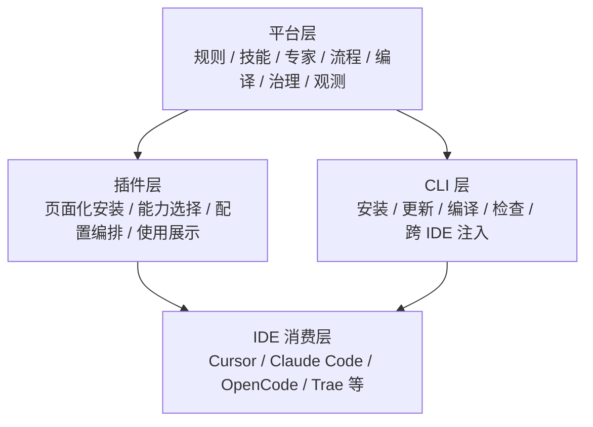
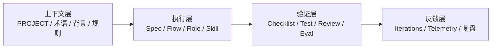
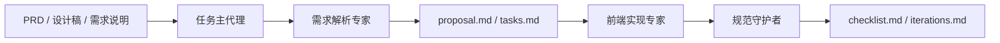
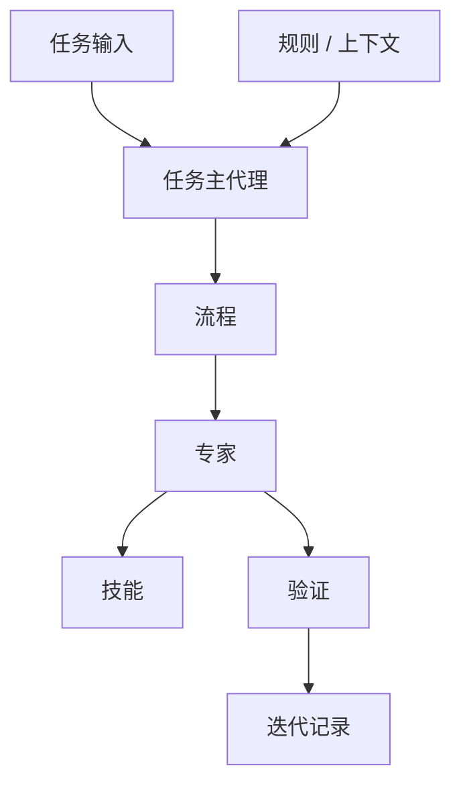

# 规范驱动开发平台：渐进式实施与内部推广方案

## 1. 文档目的

这份文档服务两个目标：

1. 统一团队对当前项目后续拓展方向的理解
2. 给内部分享、试点落地和后续平台化建设提供一份可执行路线图

这份方案强调三点：

- 先做实，再做大
- 先可用，再自动化
- 先形成平台骨架，再逐步补齐专家、流程和主代理能力

## 2. 当前统一定位

建议统一对内对外口径：

> 当前项目的产品定位是“AI 规范驱动开发平台”；当前交付形态以 `CLI` 为底层实现，后续以 `Cursor IDE` 插件页面作为主入口，并保持可跨 IDE 复用。

更具体地说：

- `平台` 是能力源、治理层和长期产品定位
- `插件` 是未来团队主用入口和页面化配置入口
- `CLI` 是当前最现实的底层实现和跨 IDE 兼容层

因此它不是三条独立产品线，而是一套平台能力的三层表达。

## 3. 平台 / 插件 / CLI 三层架构



### 3.1 平台层职责

- 维护统一的规则、技能、专家、流程源资产
- 负责多 IDE 适配、安装编译、能力分发
- 提供可验证、可观测、可演进的治理底座

### 3.2 插件层职责

- 页面化展示“能力域 -> 专家 -> 技能”
- 提供按需安装、按域选择、按流程启用的交互入口
- 显示当前项目已安装内容、启用状态和推荐能力

### 3.3 CLI 层职责

- 作为当前阶段最可实施的底层执行层
- 负责安装、更新、检查、编译和目标项目注入
- 保证即使没有插件页面，也能落地平台能力

## 4. AI 工程方法论如何落到当前项目

当前项目不应该只被理解成“规则库”或“prompt 集合”，而应该落在下面这套 AI 工程四层模型上：



对应到当前项目：

- 上下文层：`context/PROJECT.md`、`.agents/rules/`
- 执行层：`openspec/changes/`、`.agents/flows/`、`.agents/roles/`、`.agents/skills/`
- 验证层：`checklist.md`、测试规范、规则检查
- 反馈层：`iterations.md`、后续 telemetry / eval / hooks

## 5. 当前项目已经具备什么

截至当前阶段，项目里已经有一批可以直接作为平台骨架使用的资产：

### 5.1 已有基础能力

- 多 IDE 接入基础：`Cursor / Claude Code / OpenCode / Trae`
- 渐进安装层级：`L1 / L2 / L3`
- `.agents/rules/` 规则层
- `.agents/skills/` 技能层
- `openspec/` 变更流程层
- `context/PROJECT.md` 稳定背景层

### 5.2 已有专家协同骨架

- 当前启用角色：4 个
  - `task-orchestrator`
  - `requirement-analyst`
  - `frontend-implementer`
  - `code-guardian`
- 已规划候选角色：27 个
- 已建立能力域目录与展示索引：
  - [.agents/roles/INDEX.md](../../.agents/roles/INDEX.md#L1)

### 5.3 当前阶段的现实边界

当前还**没有**完全做完的内容也必须明确：

- 插件页面还未成为主入口
- `roles / flows` 还未完全接入安装脚本
- 可观测闭环还未正式落地
- `hooks / evals / telemetry` 还没有形成完整生产闭环
- “主代理自动路由全部流程”仍处于骨架阶段，不是完整自治代理

这意味着当前阶段对内最合理的表达是：

> 我们已经完成了平台骨架和专家协同雏形，正在从规范驱动开发工具，升级为可按需安装、可验证、可观测、可跨 IDE 复用的平台。

## 6. 当前团队最值得做的事

当前不应该同时追求：

- 完整插件产品
- 完整自治代理
- 所有专家全部启用
- 完整可观测平台

最合理的策略是：

> 先把“规范驱动开发平台”的可推广最小版本做出来，再逐步补齐专家、流程、主代理、观测和页面入口。

## 7. 渐进式实施路线

### Phase 0：平台骨架阶段（当前）

目标：

- 把规则、技能、OpenSpec、角色、流程、能力域索引统一到一个源仓库

当前交付：

- `.agents/rules/`
- `.agents/skills/`
- `.agents/roles/common/`
- `.agents/roles/domains/`
- `.agents/flows/common/`
- `.agents/roles/INDEX.md`
- `context/PROJECT.md`
- `openspec/changes/<change-id>/`

本阶段价值：

- 结构已定
- 口径已统一
- 可以用于内部分享和项目试点

非目标：

- 不追求所有专家真实可执行
- 不追求页面化平台全部完成

### Phase 1：团队推广最小平台阶段

目标：

- 做成“团队能试、能讲、能复用”的规范驱动开发平台 MVP

建议交付：

- `install.sh / install.ps1` 最小接入 `roles + flows`
- 提供 1 条默认流程：`prd-to-delivery`
- 把 4 个 `active` 专家稳定跑通
- 提供 1 套演示案例：`PRD/设计 -> proposal -> tasks -> 实现 -> checklist -> iterations`
- 输出一套团队培训材料和演示脚本

推荐演示链路：



本阶段成功信号：

- 至少 1 到 2 个项目愿意试点
- 团队能看懂“为什么不是只做 skill”
- 分享时能展示完整闭环，而不是零散能力

### Phase 2：专家扩展与场景分包阶段

目标：

- 从 4 个 `active` 专家，扩展到“可按需启用的能力域专家包”

建议优先启用的下一批专家：

- `design-collaborator`
- `api-contract-specialist`
- `unit-test-specialist`
- `verification-reviewer`
- `performance-auditor`
- `security-reviewer`

建议引入的安装粒度：

- 按技术栈：`react / vue`
- 按能力域：`demand-design / governance / testing / performance ...`
- 按流程包：`prd-to-delivery / bugfix-to-verification / quality-gate`

目标形态：

```text
ai-spec-auto init \
  --profile vue \
  --level L3 \
  --domains demand-design,governance,testing \
  --flows prd-to-delivery
```

本阶段成功信号：

- 安装内容不再是全量复制，而是按需组合
- 团队可以按项目复杂度选能力包

### Phase 3：主代理与流程编排阶段

目标：

- 把“专家集合”升级成“可编排的专家协同系统”

建议交付：

- `task-orchestrator` 真正接入流程路由
- 支持根据任务输入选择流程
- 支持专家之间的结构化交接
- 补充 `hooks / evals`
- 建立人工确认点和阻断点

目标执行模型：



本阶段成功信号：

- 同类任务开始走固定流程
- 专家不再只是展示卡片，而是真正参与协作
- 人工从“逐步告诉 AI 怎么做”变成“选择流程 + 确认关键节点”

### Phase 4：平台化与可观测阶段

目标：

- 从“团队可用工具”升级为“可推广的平台”

建议交付：

- 插件页面作为主入口
- 按需安装、按域选择、按流程启用
- 安装和使用 telemetry
- 流程使用率、专家调用率、结果质量指标
- `eval` 和回归验证机制

建议观测指标：

- 安装率
- 试点项目覆盖率
- 活跃流程数
- 活跃专家数
- `proposal -> code` 闭环完成率
- `checklist` 通过率
- 人工返工率

## 8. 为什么它不是“只有前端”

虽然当前平台以**前端交付**为核心落地对象，但它的能力边界不应该只停留在“写页面”：

### 8.1 上游

- 产品需求整理
- PRD 结构化
- 设计稿分析
- API 契约收敛

### 8.2 中游

- 页面 / 组件 / 路由 / API / 状态实现
- 规范治理
- 工程化配置

### 8.3 下游

- 测试验证
- 文档沉淀
- 性能治理
- 可观测治理
- 发布交付

这也是为什么平台一级表达更适合用“能力域”，而不是只叫“开发阶段”。

## 9. 当前推荐的目录演进

### 9.1 当前实用结构

```text
ai-spec-auto/
├── .agents/
│   ├── rules/
│   ├── skills/
│   ├── roles/
│   │   ├── common/
│   │   ├── domains/
│   │   └── INDEX.md
│   └── flows/
├── context/
│   └── PROJECT.md
├── openspec/
│   └── changes/<change-id>/
│       ├── proposal.md
│       ├── tasks.md
│       ├── checklist.md
│       └── iterations.md
└── install.sh / install.ps1
```

### 9.2 目标平台结构

```text
ai-spec-auto/
├── .agents/                  # 平台源资产
│   ├── rules/
│   ├── skills/
│   ├── roles/
│   ├── flows/
│   ├── hooks/                # 后续补充
│   └── evals/                # 后续补充
├── context/
├── openspec/
├── plugin/                   # 后续主入口
├── cli/                      # 当前底层能力形态
├── telemetry/                # 后续观测能力
└── docs/
```

## 10. 团队内部推广建议

### 10.1 推广顺序

1. 先讲统一定位
2. 再讲当前最小闭环
3. 再讲未来平台化路径

### 10.2 先推广什么，不先推广什么

建议先推广：

- 规范驱动开发思路
- `proposal / tasks / checklist / iterations` 这套最小上下文闭环
- 4 个核心专家
- 1 条默认流程

不建议一上来就推广：

- 全量专家矩阵
- 完整主代理自治
- 全量观测平台
- 所有 IDE 完全等价体验

### 10.3 适合的内部分享结构

1. 为什么不是只做 prompt 或 skill
2. 为什么要做规范驱动开发平台
3. 当前最小可运行闭环是什么
4. 专家协同和方法论如何结合
5. 下一步怎么试点推广

## 11. 试点成功的判断标准

建议用下面这些真实指标，不要只讲“建了多少专家”：

- 有多少项目接入平台
- 有多少项目完整走过 `proposal -> tasks -> 实现 -> checklist`
- 有多少专家从 `planned` 升级为 `active`
- 有多少流程真正被使用
- 返工率是否下降
- 文档沉淀是否增加
- 团队是否能复用同一套资产到不同 IDE

## 12. 最终判断

当前阶段最正确的策略，不是先把“AI 驱动自动化流水线平台”所有部分一次做完，而是：

> 先把“可推广的规范驱动开发平台”做实，再逐步补齐专家、流程、主代理、可观测和插件入口，最终演化成真正的 AI 驱动自动化流水线平台。

对团队而言，这条路线的好处是：

- 可落地
- 可演示
- 可逐步推广
- 不会一开始就把平台做得过重
