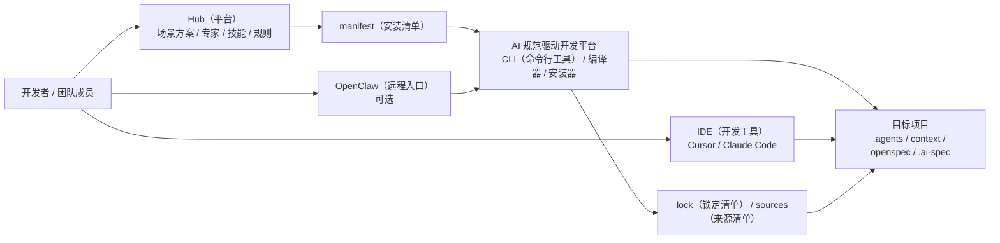
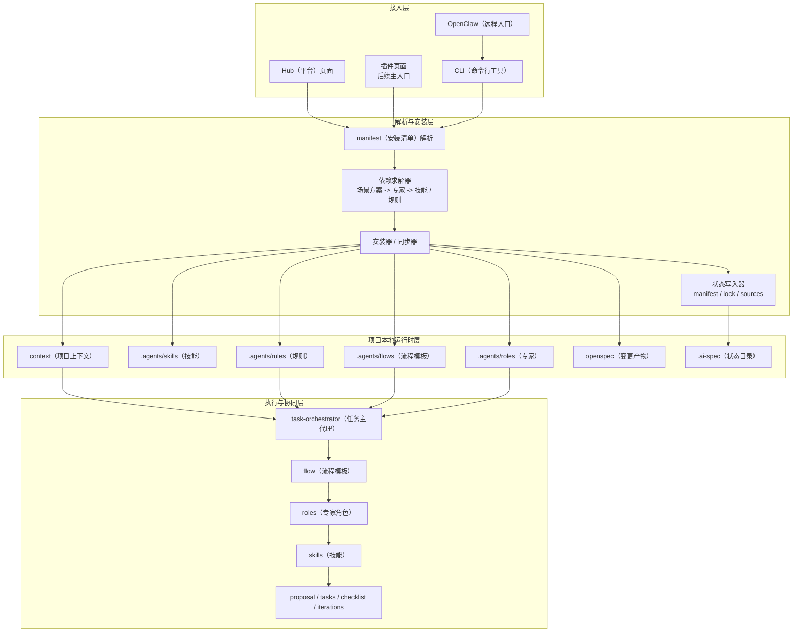
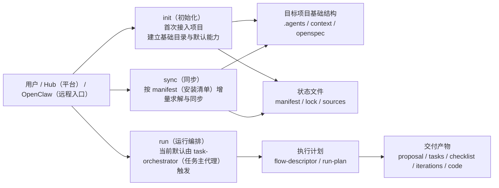
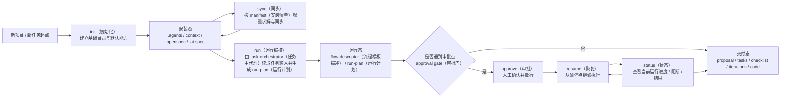
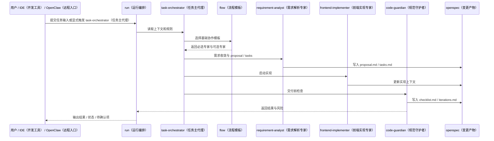

# AI 规范驱动开发平台：项目技术架构与操作流程说明

## 1. 文档目的

这份文档用于向第三人说明当前项目的整体设计。

目标不是只讲某一个脚本、某一个 `skill（技能）` 或某一个 `rule（规则）`，而是回答 5 个问题：

1. 这个系统是什么
2. 系统里有哪些核心内容
3. 系统和其他平台或项目怎么串联
4. 用户怎么安装、同步、使用
5. 当前已经做到哪一步，后续还会往哪里演进

这份文档适合：

- 团队内部分享
- 跨部门同步
- 给新同学做项目介绍
- 给管理层讲系统结构时作为辅助材料

## 2. 推荐的讲解方式

这类项目不适合只用一张图说明。

更稳的方式是采用“多视角”表达：

1. `System Context Diagram（系统上下文图）`
   - 说明系统与 Hub（平台）、IDE（开发工具）、目标项目、OpenClaw（远程入口）之间的关系
2. `Logical Architecture Diagram（逻辑架构图）`
   - 说明系统内部模块如何分层
3. `Swimlane Diagram（泳道图）`
   - 说明用户安装和同步的操作路径
4. `Sequence Diagram（时序图）`
   - 说明专家协同执行时，任务如何在主代理、流程模板、专家、技能之间流转
5. `Project Structure Diagram（目录结构图）`
   - 说明目标项目落地后有哪些目录和文件

一句话：

> 外部关系看上下文图，内部结构看逻辑架构图，用户操作看泳道图，专家协同看时序图。

## 3. 一句话定位

当前项目建议统一定位为：

> 一个可按需安装、可验证、可观测、可跨 IDE（开发工具）复用的 AI 规范驱动开发平台。当前以 CLI（命令行工具）作为底层安装与编译引擎，以 Hub（平台）作为资产管理与选择入口，后续逐步演进为以插件页面为主入口、支持专家协同与远程触发的 AI 驱动研发流水线平台。

这个定位里有 3 个关键词：

- `平台`
  - 说明它不是单一脚本，而是可持续扩展的能力系统
- `规范驱动`
  - 说明它不是自由生成，而是围绕规则、上下文和设计约束组织 AI 工作
- `专家协同`
  - 说明它不是堆技能，而是把任务组织成可编排、可验证的协作链路

## 4. 系统全景图

### 4.1 `System Context Diagram（系统上下文图）`



### 4.2 这张图说明了什么

这张图表达的是 4 个边界：

1. `Hub（平台）`
   - 负责管理和分发资产，不直接承担本地安装执行
2. `CLI（命令行工具）`
   - 负责读取 `manifest（安装清单）`、解析依赖、安装资产、写入状态文件
3. `目标项目`
   - 负责承接最终消费结构，并被 IDE（开发工具）或远程入口实际使用
4. `OpenClaw（远程入口）`
   - 不是资产源，而是未来的远程任务触发入口

这也是当前项目与其他平台或项目串联时最稳的关系：

```text
Hub（平台）负责选和管
CLI（命令行工具）负责解和装
目标项目负责存和用
IDE / OpenClaw（远程入口）负责触发和执行
```

## 5. 内部逻辑架构图

### 5.1 `Logical Architecture Diagram（逻辑架构图）`



### 5.2 核心模块解释

#### 1. 接入层

负责接收用户选择或任务输入。

当前有两种现实入口：

- `Hub（平台）`
  - 用于选择资产和生成安装清单
- `CLI（命令行工具）`
  - 用于实际安装和同步

未来会增强两种入口：

- `插件页面`
  - 成为页面化的主入口
- `OpenClaw（远程入口）`
  - 成为远程触发和状态回传入口
- `IDE（开发工具） AI（智能体）`
  - 成为默认的 `run（运行编排）` 触发入口

#### 2. 解析与安装层

这是当前项目的“底层发动机”。

它负责：

- 解析 `manifest（安装清单）`
- 把“用户选了什么”展开成“系统最终安装什么”
- 把资产编译到目标项目目录
- 记录状态与来源

这一层决定了系统是否：

- 可审计
- 可复现
- 可回滚
- 可跨 IDE（开发工具）复用

#### 3. 项目本地运行时层

这是当前项目落地到目标仓库后的消费结构。

它至少包括：

```text
.agents/
  rules/
  skills/
  roles/
  flows/
context/
openspec/
.ai-spec/
```

其中：

- `.agents/`
  - 保存被 IDE（开发工具）和执行引擎消费的能力资产
- `context/`
  - 保存项目背景和稳定上下文
- `openspec/`
  - 保存需求变更和交付过程产物
- `.ai-spec/`
  - 保存安装状态和来源关系

#### 4. 执行与协同层

这是“规范驱动 + 专家协同”真正发生的地方。

它的运行模型不是简单的“直接调用某个技能”，而是：

```text
规则 / 上下文
  -> 任务主代理
    -> flow（流程模板）
      -> roles（专家角色）
        -> skills（技能）
```

当前设计原则是：

- `task-orchestrator（任务主代理）`
  - 负责读取上下文、分析任务、选择基础协作模板
- `flow（流程模板）`
  - 不是僵硬脚本，而是协作骨架
- `role（专家角色）`
  - 负责承担明确职责
- `skill（技能）`
  - 负责提供具体执行方法

## 6. 目标项目结构图

### 6.1 `Project Structure Diagram（目录结构图）`

```text
目标项目
├── .agents/
│   ├── rules/
│   ├── skills/
│   ├── roles/
│   └── flows/
├── context/
│   └── PROJECT.md
├── openspec/
│   └── changes/
│       └── <change-id>/
│           ├── proposal.md
│           ├── tasks.md
│           ├── checklist.md
│           └── iterations.md
└── .ai-spec/
    ├── manifest.json
    ├── lock.json
    └── sources.json
```

### 6.2 目录职责

| 目录 / 文件 | 作用 |
| --- | --- |
| `.agents/rules/` | 项目规则、约束、规范入口 |
| `.agents/skills/` | 具体技能定义和执行方法 |
| `.agents/roles/` | 专家定义与角色索引 |
| `.agents/flows/` | 协作模板和路由依据 |
| `context/PROJECT.md` | 项目背景、业务术语、稳定上下文 |
| `openspec/changes/` | 当前变更的设计与交付产物 |
| `.ai-spec/manifest.json` | 用户想装什么 |
| `.ai-spec/lock.json` | 系统实际装了什么 |
| `.ai-spec/sources.json` | 资产从哪里来 |
| `.ai-spec/current-run.json` | 当前一次运行的状态快照 |
| `.ai-spec/runs/<run-id>.json` | 每次运行的完整状态记录 |
| `.ai-spec/current-dispatch.json` | 当前专家的执行载荷 |
| `.ai-spec/current-execution.json` | 当前专家这一轮的执行输入 |
| `.ai-spec/current-runtime-action.json` | 当前专家单轮结束后建议的标准运行动作 |

## 7. 用户安装与同步流程

### 7.1 `Swimlane Diagram（泳道图）`

```mermaid
flowchart LR
    subgraph User["用户"]
        U1["选择场景方案"]
        U2["调整专家与技能"]
        U3["复制命令"]
    end

    subgraph Hub["Hub（平台）"]
        H1["生成 manifest（安装清单）"]
        H2["输出安装 / 同步命令"]
    end

    subgraph CLI["CLI（命令行工具）"]
        C1["读取 manifest（安装清单）"]
        C2["解析场景方案"]
        C3["解析专家 / 技能 / 规则<br/>汇总能力域标签，并安装内置流程模板"]
        C4["安装或同步到目标项目"]
        C5["写入 manifest / lock / sources"]
    end

    subgraph Project["目标项目"]
        P1["生成 .agents / context / openspec / .ai-spec"]
        P2["被 IDE（开发工具）直接消费"]
    end

    U1 --> U2 --> U3 --> H1 --> H2 --> C1 --> C2 --> C3 --> C4 --> C5 --> P1 --> P2
```



### 7.2 这条流程的意义

这条流程解决的是“怎么把平台内容带进目标项目”。

核心原则是：

- 用户在 Hub（平台）上做选择
- Hub（平台）不直接改项目
- CLI（命令行工具）负责实际写入和同步
- 目标项目保留稳定消费结构

这样可以保证：

- 同一份选择结果可复现
- 安装行为可审计
- 平台、插件、CLI（命令行工具）职责分离

补充说明：

- `ai-spec-auto sync（同步）`
  - 负责安装与求解
- `ai-spec-auto run（运行）`
  - 负责编排与执行，当前默认由 `task-orchestrator（任务主代理）` 在 `IDE（开发工具） AI（智能体）` 环境中触发

也就是说：

> 先通过 `sync（同步）` 把能力装进目标项目，再通过 `task-orchestrator（任务主代理）` 触发 `run（运行编排）` 启动一次真实任务。

### 7.3 `init（初始化） / sync（同步） / run（运行编排）` 入口职责图



这张图想表达的是：

- `init（初始化）`
  - 解决“项目第一次怎么接进来”
- `sync（同步）`
  - 解决“已经接入后，如何按选择结果增量更新”
- `run（运行编排）`
  - 解决“当前这次任务应该怎么被编排和推进”

补充说明：

- `init（初始化）` 更偏首次安装
- `sync（同步）` 更偏增量安装
- `run（运行编排）` 更偏任务执行

### 7.4 命令职责对照表

| 命令 | 主要职责 | 典型输入 | 典型输出 | 当前状态 |
| --- | --- | --- | --- | --- |
| `init（初始化）` | 首次接入项目，建立基础结构和默认能力 | `profile（技术栈）`、`level（安装层级）`、`ide（IDE 预设）` | `.agents / context / openspec` 基础目录与文件 | 已实现 |
| `sync（同步）` | 根据 `manifest（安装清单）` 做增量求解、安装和状态落盘 | `manifest（安装清单）`、覆盖参数 | `.ai-spec/manifest.json / lock.json / sources.json` | 已实现最小版本：先支持本地 `manifest.json`，远程 URL（链接） 清单待扩展 |
| `run（运行编排）` | 读取任务输入，选择 `flow（流程模板）`，产出 `run-plan（运行计划）` 并逐步驱动专家协同 | 自然语言需求、`change（变更 ID）`、设计说明、可选 `flow（流程模板）` | `flow-descriptor（流程模板描述）`、`run-plan（运行计划）`、首轮桥接载荷、交接更新后的 `run-state（运行状态）`、由 `task-orchestrator（任务主代理）` 产出的 `current-dispatch（当前专家派发载荷）`、由当前专家产出的 `current-execution（当前专家执行载荷）`、由 `task-orchestrator（任务主代理）` 产出的 `current-runtime-action（当前运行动作草案）` | 契约已定义，当前默认由 `task-orchestrator（任务主代理）` 触发；若上游为自然语言/Markdown（标记文本） 回复，则优先经 `task-orchestrator-extractor（输出抽取器）` 再进入 `task-orchestrator-adapter（自动执行适配层）` 落盘；本地工具只负责校验、落盘和状态应用 |

### 7.4.1 完整运行路径

如需直接用于汇报或培训的一张图版本，可配合阅读：

- `docs/paser_two/完整运行路径单页图-03-31-16-07.md`

一次完整的运行路径应按下面的职责边界理解：

1. `Hub（平台） / CLI（命令行工具）`
   - 先通过 `init（初始化） / sync（同步）` 把 `rules（规则） / skills（技能） / roles（专家角色） / flows（流程模板） / commands（命令模板）` 安装进目标项目。
2. `IDE（开发工具） / OpenClaw（远程入口）`
   - 用户显式触发 `/spec-start` 或 `/spec-continue`，把任务交给 `task-orchestrator（任务主代理）`。
3. `task-orchestrator（任务主代理）`
   - 读取任务输入与项目上下文。
   - 选择 `flow（流程模板）`。
   - 选择当前 `role（专家角色）` 和推荐 `skill（技能）`。
   - 产出 `run-plan（运行计划）` 与 `task-anchor（任务锚点）`。
   - 首轮时产出 `task-orchestrator-bootstrap（主代理首轮桥接载荷）`。
4. `extractor（输出抽取器） + adapter（自动执行适配层）`
   - 从主代理回复中抽取结构化载荷。
   - 调用 `runtime-state（运行状态）` 把 `.ai-spec/current-run.json` 和 `.ai-spec/runs/<run-id>.json` 落盘。
5. `task-orchestrator（任务主代理）`
   - 根据最新 `run-state（运行状态）` 产出 `expert-dispatch（专家派发载荷）`。
6. `expert-dispatch（专家派发载荷）` 落盘器
   - 只负责校验并写入 `.ai-spec/current-dispatch.json`。
7. `当前专家`
   - 消费 `current-dispatch（当前专家派发载荷）`。
   - 执行本轮工作。
   - 产出 `expert-execution（专家执行载荷）` 或直接产出业务产物。
8. `expert-executor（专家执行器）`
   - 只负责校验并写入 `.ai-spec/current-execution.json` / `.md`。
9. `task-orchestrator（任务主代理）`
   - 读取本轮执行结果。
   - 产出下一步 `task-orchestrator-runtime-action（主代理运行动作载荷）`，例如 `handoff（交接） / gate-blocked（阻断） / approve（审批） / complete（完成） / fail（失败）`。
10. `task-orchestrator-adapter（自动执行适配层）`
    - 应用该动作到 `run-state（运行状态）`。
    - 清理旧的 `current-dispatch / current-execution / current-runtime-action`。
11. 若未结束
    - 回到第 5 步，由 `task-orchestrator（任务主代理）` 为下一轮重新产出 `expert-dispatch（专家派发载荷）`。
12. 若结束
    - 运行态进入 `success（成功） / failed（失败） / cancelled（已取消）`，保留历史记录供审计和回放。

### 7.5 `init（初始化） -> sync（同步） -> run（运行编排） -> approve（审批） / resume（恢复） / status（状态）` 生命周期图



这张图表达的不是“所有命令都已经实现”，而是整个系统后续推荐的运行生命周期。

可以分成 3 个阶段理解：

- `init（初始化） / sync（同步）`
  - 属于安装态命令
  - 负责把平台能力装进目标项目，并保持状态可追踪
- `run（运行编排）`
  - 属于运行时执行入口
  - 负责把任务输入转换成结构化执行计划
- `approve（审批） / resume（恢复） / status（状态）`
  - 属于运行态协议和最小控制命令
  - 负责处理人工确认、暂停恢复和运行状态追踪
- `complete（完成） / fail（失败）`
  - 属于运行态终态控制命令
  - 负责把任务稳定落到 `success（成功） / failed（失败）`
- `gate-blocked（阻断） / cancel（取消）`
  - 属于运行态控制补充命令
  - 负责把任务稳定挂起或取消，而不是只停留在对话里

当前建议的实现节奏是：

1. 先稳定 `init（初始化）`
2. 再落 `sync（同步）`
3. 再落 `run（运行编排）`
4. 再继续补强 `approve（审批） / resume（恢复） / status（状态）`

原因是：

- 没有 `init（初始化） / sync（同步）`，项目没有稳定运行底座
- 没有 `run（运行编排）`，专家协同无法进入可结构化编排
- 没有 `approve（审批） / resume（恢复） / status（状态）`，远程协作和长链路执行就不稳定

所以从工程节奏看，更准确的关系是：

```text
init（初始化） / sync（同步） 先把底座装好
run（运行编排） 负责把任务跑起来
approve（审批） / resume（恢复） / status（状态） 负责把任务跑稳
```

## 8. 专家协同执行流程

### 8.1 `Sequence Diagram（时序图）`



### 8.2 这条流程当前代表什么

当前仓库里，专家协同已经有基础骨架，但仍属于 MVP（最小可行版本）。

它已经明确了：

- `task-orchestrator（任务主代理）`
  - 负责路由和交接
- `prd-to-delivery（需求到交付）`
  - 作为当前默认的交付类协作模板
- 4 个已激活专家
  - `task-orchestrator（任务主代理）`
  - `requirement-analyst（需求解析专家）`
  - `frontend-implementer（前端实现专家）`
  - `code-guardian（规范守护者）`

同时，`run（运行编排）` 这一层现在已经有独立的输入输出契约文档，用来定义：

- `flow-descriptor（流程模板描述）`
- `run-plan（运行计划）`

但要注意：

- 当前只是“契约已定义”
- 当前默认运行入口应理解为 `IDE（开发工具） AI（智能体）` 或 OpenClaw（远程入口）中的 `task-orchestrator（任务主代理）`
- CLI（命令行工具）里的 `run（运行）` 子命令目前不是优先实现目标

但它还没有完全进入“全自动远程流水线”阶段。

更准确的说法应该是：

> 当前已经完成了协作骨架和结构约定，正在从“规范驱动开发工具”升级为“规范驱动开发平台 + 专家协同运行时”。

## 9. 平台与其他系统的串联方式

### 9.1 与 Hub（平台）的关系

Hub（平台）负责：

- 维护 `场景方案`
- 维护 `role（专家角色） / skill（技能） / rule（规则）` 元数据
- 生成 `manifest（安装清单）`
- 生成安装命令和同步命令

当前项目负责：

- 解析 `manifest（安装清单）`
- 求解依赖
- 安装到目标项目
- 写入状态文件

一句话：

> Hub（平台）是目录和分发中心，当前项目是本地编译与执行引擎。

### 9.2 与目标项目的关系

目标项目不是平台的一部分，而是平台能力的承接方。

平台安装到目标项目后，目标项目中保存的是：

- AI 使用的本地资产
- 项目上下文
- 当前变更的设计与执行产物
- 状态文件

这使得：

- 不同项目可以按需安装不同组合
- 同一个平台可以服务多个目标项目
- 目标项目仍然保留自己的本地控制权

### 9.3 与 IDE（开发工具）的关系

IDE（开发工具）当前是主要消费端。

例如：

- `Cursor`
- `Claude Code`

CLI（命令行工具）负责把本地结构编译成这些 IDE（开发工具）能消费的形态。

因此：

- IDE（开发工具）不是资产管理中心
- IDE（开发工具）也不是版本控制中心
- IDE（开发工具）是运行时入口

### 9.4 与 OpenClaw（远程入口）的关系

OpenClaw（远程入口）更适合作为“任务入口”和“状态回传入口”。

更推荐的关系是：

```text
OpenClaw（远程入口） -> 触发 task-orchestrator（任务主代理） -> 任务主代理编排专家
```

而不是：

```text
OpenClaw（远程入口）自己决定调用哪个专家
```

这样做的好处是：

- 路由逻辑不会分散
- 平台、IDE（开发工具）、远程入口能共用同一套流程和专家定义
- 后续更容易做审计和回放

当前项目内已经补了真实 `IDE（开发工具）` 入口：

- `Cursor（开发工具）`：`/spec-start` / `/spec-continue`
- `Claude（开发工具）`：`/spec-start` / `/spec-continue`

兼容入口：

- `/spec-orchestrate`

## 10. 当前阶段与后续阶段

### 10.1 当前已具备

- 多 IDE（开发工具）基础接入能力
- `init（初始化）` 基础安装命令
- `rules（规则） + skills（技能） + openspec（变更产物）` 基础骨架
- Hub（平台）方向的 `manifest（安装清单） / sync（同步） / lock（锁定清单） / sources（来源清单）` 规范
- `run（运行编排）` 方向的 `flow-descriptor（流程模板描述） / run-plan（运行计划）` 契约文档
- `task-orchestrator（任务主代理）` 与 `flow（流程模板）` 基础骨架
- `task-orchestrator-extractor（主代理输出抽取器）` 与 `task-orchestrator-adapter（主代理自动执行适配层）`
- `Cursor（开发工具） / Claude（开发工具）` 的项目级触发命令 `/spec-start`、`/spec-continue`
- 兼容触发命令 `/spec-orchestrate`
- 4 个 MVP（最小可行版本）专家
- 27 个候选专家模板

### 10.2 正在建设

- Hub（平台）与本地安装结构的进一步对接
- `ai-spec-auto sync（同步）` 的真实实现
- `run（运行编排）` 的 skill（技能）入口与运行态协议落地
- 主代理动态选专家
- 流程模板的统一解析和运行契约

### 10.3 后续演进

- 插件页面成为主入口
- 远程入口驱动真实协同执行
- 可观测、评估、审计能力补齐
- 从前端规范驱动平台逐步扩展到更完整的研发场景

## 11. 推荐的讲解顺序

如果你要向第三人讲这套系统，建议按下面的顺序：

1. 先讲一句话定位
2. 再讲 `System Context Diagram（系统上下文图）`
3. 再讲 `Logical Architecture Diagram（逻辑架构图）`
4. 再讲“安装与同步”的泳道图
5. 最后讲“专家协同执行”的时序图

这样对方会从“它是什么”，逐步理解到“它怎么装”，最后理解“它怎么跑”。

## 12. 一句话总结

> 当前项目不是一个单独的 `skill（技能）` 仓库，也不是单纯的安装脚本，而是一个围绕 `规则（rule）`、`上下文（context）`、`流程模板（flow）`、`专家角色（role）` 和 `技能（skill）` 组织起来的 AI 规范驱动开发平台。Hub（平台）负责选择与分发，CLI（命令行工具）负责解析与安装，目标项目负责承接与消费，`task-orchestrator（任务主代理）` 负责在 `IDE（开发工具） AI（智能体）` 或远程入口中把这些能力编排成可执行、可验证、可扩展的协作链路。

## 13. 相关文档

- [AI规范驱动开发平台-综合蓝图.md](AI规范驱动开发平台-综合蓝图.md)
- [Hub平台融合与OpenClaw对接方案.md](Hub平台融合与OpenClaw对接方案.md)
- [Manifest安装清单规范.md](Manifest安装清单规范.md)
- [ai-spec-auto-sync输入输出契约-03-27-17-09.md](ai-spec-sync输入输出契约-03-27-17-09.md)
- [ai-spec-auto-run输入输出契约-03-27-17-55.md](ai-spec-run输入输出契约-03-27-17-55.md)
- [IDE里触发run的最小交互协议-03-30-14-04.md](IDE里触发run的最小交互协议-03-30-14-04.md)
- [运行状态落盘规范-03-30-14-58.md](运行状态落盘规范-03-30-14-58.md)
- [lock与sources结构规范-03-27-17-17.md](lock与sources结构规范-03-27-17-17.md)
