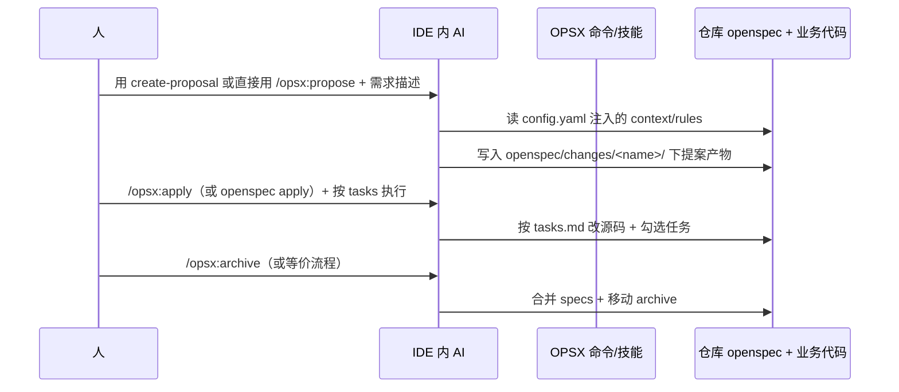

下面按「三阶段」说明 **ai-spec-auto（你这套规范库）起什么作用**，以及 **和 IDE 里的 AI 怎么交接**。

---

## 1. 三阶段各自在干什么（OpenSpec 管流程，你管规范）

| 阶段 | OpenSpec 侧（流程与产物） | 你项目（ai-spec-auto）侧 |
|------|---------------------------|-------------------------|
| **创建提案** | 在 `openspec/changes/<name>/` 生成 `proposal.md`、`design.md`、`specs/`、`tasks.md` 等 | 通过 **`openspec/config.yaml`** 的 `context` + `rules.proposal/design/specs`，让 AI 写提案时**自动带上** `.agents/rules/`、设计稿分析、路由/组件/API 等约束；**`create-proposal` 技能**是「先做人话需求分析 → 再让 AI 去跑 `/opsx:propose`」的**增强层** |
| **Apply（实施）** | 按 `tasks.md` 逐项落地，改业务代码 | `rules.tasks` 要求读 **Superpowers / execute-task**、组件/API 规范、UI 验收与审计汇报等，避免 AI 脱离团队流程乱改 |
| **归档** | 把变更目录里的增量 spec **合并进** `openspec/specs/`，并把变更挪到 `changes/archive/...` | `rules.archive` 写明了合并与归档路径约定；另有 **archive-change** 类技能（与文档一致）在归档时做规范合并摘要 |

一句话：**OpenSpec 负责「目录结构 + 三阶段节奏」；ai-spec-auto 负责「每个阶段 AI 必须遵守的规范与操作手册」，靠 `config.yaml` 注入到 OpenSpec 的指令里。**

---

## 2. 与 IDE AI 的交接流程（谁在什么时候说话）

可以看成 **「人 → IDE AI（带规范上下文）→ 仓库里的文件」**：

要点：

1. **没有「后台独立进程替你写码」**：交接面是 **当前 IDE 会话里的 AI**；斜杠命令（或你复制的提示语）触发它去读 **OpenSpec 生成的命令说明 + `config.yaml` 里指向的 `.agents`**。
2. **第一次交接（提案）**：理想路径是 **先做需求/UI 分析（技能）→ 把结论写进给 AI 的说明里 → 再执行 propose**，这样生成的 `tasks.md` / `design.md` 才和团队规范对齐。
3. **第二次交接（apply）**：AI 的「单一事实来源」是 **`tasks.md`**；规范侧通过 `rules.tasks` 强制它走 **execute-task / 审计** 等。
4. **第三次交接（归档）**：AI（或人）按 OpenSpec + `rules.archive` 做 **spec 合并与目录移动**，把「这次变更」收进长期 **`openspec/specs/`**。

---

## 3. 你项目在整个链路里的「边界」

- **你提供**：`.agents`（Rules + Skills）、安装后的 **`openspec/config.yaml`（由模板合并而来）**、L3 下的 `openspec/` 目录与 OPSX 集成方式。
- **你不替代**：OpenSpec 自带的 propose/apply/archive **命令形态与目录约定**（那是 OpenSpec 的职责）。
- **非侵入**：规范库通过 **配置与链接** 影响 AI 行为，不要求改业务代码才能装上（见需求说明里的非侵入原则）。

若你只想记一句：**ai-spec-auto 是「挂在 OpenSpec 三阶段上的规范与控制面」；IDE AI 是每个阶段的执行者，通过 `config.yaml` 和技能完成交接。**