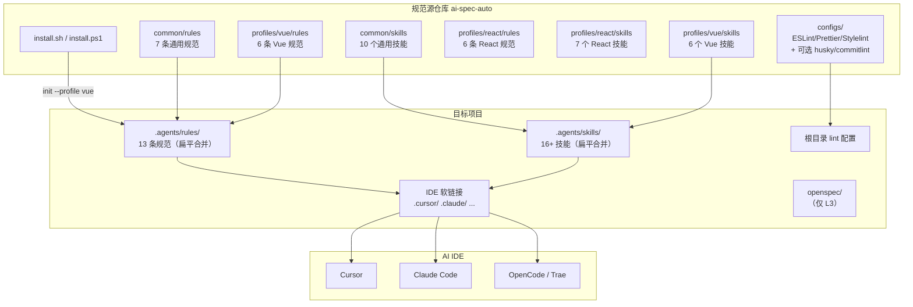
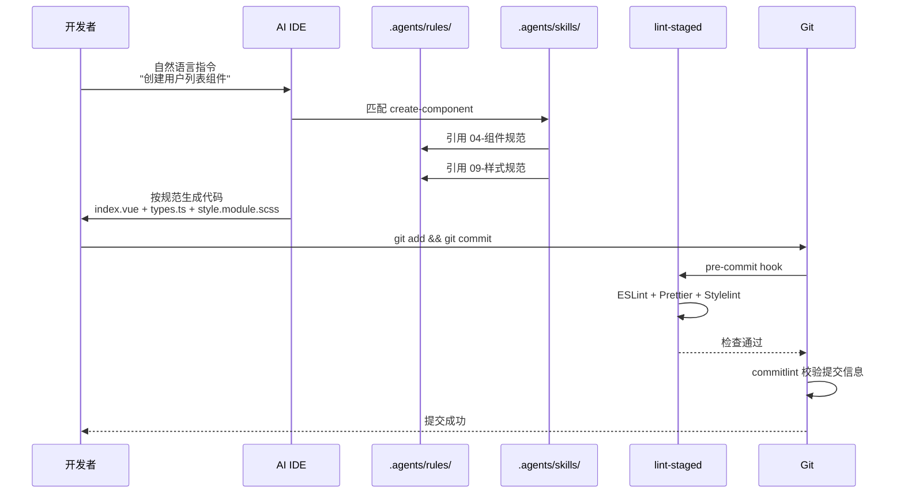
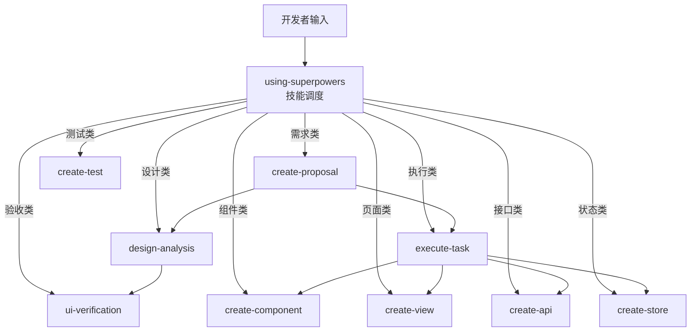

# ai-spec-auto  项目需求说明

> 版本：v1.0.2 | AI Coding 团队规范驱动开发 CLI

---

## 1. 项目概述

### 1.1 项目定位

ai-spec-auto 是一套 **AI Coding 团队规范驱动开发 CLI（当前版本面向前端）**，内置 **Vue 3** 与 **React** 两套 Profile，旨在让 Cursor、Claude Code、OpenCode、Trae 等 AI 编码助手在 **前端工程** 中自动遵循统一的开发规范、工作流程和最佳实践。

### 1.2 项目愿景

**让每一个使用 AI 编码的团队成员，无论提示词能力高低，都能产出符合团队标准的高质量代码。**

**完整能力集**：在 **L3** 下，**`.agents`（规范 + 技能）** 与 **`openspec/`（OpenSpec 需求流程）** 经 **`openspec/config.yaml`** 桥接为 **一体方案**——编码约束与「提案 → 实施 → 归档」闭环同属本库安装交付范围（L1/L2 为渐进路径，详见 2.4）。

### 1.3 一句话描述

> 把"提示词能力"改造成"项目内资产"——从依赖个人记忆和口头约定，转变为结构化的规范文件让 AI 自动遵循。

---

## 2. 设计原则

### 2.1 单源多链接

**原则**：维护一份规范源（`.agents/`），多个 IDE 通过软链接共享。

**设计动机**：
- 避免多 IDE 间规范不同步的问题
- 修改一处，所有 IDE 同步生效
- 降低维护成本

**实现方式**：

```
.agents/          ← 唯一规范维护源
.cursor/rules  → ../.agents/rules   (symlink)
.claude/rules  → ../.agents/rules   (symlink)
.opencode/rules → ../.agents/rules  (symlink)
.trae/rules    → ../.agents/rules   (symlink)
```

### 2.2 声明 + 过程双层设计

**原则**：Rules 定义边界（什么能做、什么不能做），Skills 定义步骤（具体怎么做）。

**设计动机**：
- 仅有 Rules 时，AI 知道规矩但不知道执行步骤
- 仅有 Skills 时，AI 知道步骤但不知道约束边界
- 两层配合才能产出"既符合规范又按正确流程执行"的代码

**关系**：

| 层次 | 性质 | 内容 | 类比 |
|------|------|------|------|
| Rules | 声明式 | 约束、禁令、规范条目 | 法律法规 |
| Skills | 过程式 | 步骤、示例、检查清单 | 操作手册 |

### 2.3 Profile 分层

**原则**：通用规范（common）+ 技术栈特定规范（profiles）分层组织，安装时按 Profile 合并。

**设计动机**：
- 编码规范、API 规范、测试规范等与技术栈无关，可共享
- 组件、路由、状态管理、样式等与技术栈强相关，需分别定义
- 一套规范库同时支持 Vue 和 React 团队

**合并机制**：

```
源仓库 common/02-编码规范.md  →  目标 .agents/rules/02-编码规范.md
源仓库 profiles/vue/04-组件规范.md → 目标 .agents/rules/04-组件规范.md
```

### 2.4 渐进式接入

**原则**：L1 → L2 → L3 三级递进，按团队成熟度灵活选择；**安装脚本与 npx 未指定 `--level` 时默认为 L3**（团队主推含 OpenSpec 的完整闭环）。

**设计动机**：
- 降低接入门槛，允许"先体验再全量"
- 不同团队的流程成熟度不同，无需一步到位
- 试点验证后再逐步升级

**L3 为完整能力集**：在 **L1 / L2** 可先落地 **`.agents`** 与 **IDE + MCP**；团队需要 **规范驱动的前端交付闭环** 时，应升级到 **L3**，安装 **`openspec/`** 与 OPSX 工作流，并与 `.agents` 通过 **`config.yaml`** 联动（非与规范库割裂的第三方外挂）。

| 层级 | 内容 | 适合场景 |
|------|------|----------|
| L1 | 仅 `.agents`（规范 + 技能） | 个人试用、快速体验 |
| L2 | `.agents` + IDE 适配 + MCP 模板 | 团队编码规范 + 外部上下文（**不含** OpenSpec，需显式 `--level L2`） |
| L3 | L2 + OpenSpec（`openspec/`、OPSX） | **默认安装层级、团队主推**：需求治理与归档，与 `.agents` 一体联动 |

### 2.5 可扩展性

**原则**：团队可以自由添加自定义规范和技能，不受框架限制。

**设计动机**：
- ai-spec-auto  提供"骨架"，团队填充"血肉"
- 不同项目有不同的业务约定，需要可定制
- 支持社区技能生态（通过 find-skills 搜索安装）

### 2.6 非侵入性

**原则**：规范库不修改项目源代码，仅通过配置文件和元数据影响 AI 行为。

**设计动机**：
- 安装/卸载不影响项目本身的编译和运行
- 不引入运行时依赖
- 可随时移除，零残留

---

## 3. 解决的痛点

### 3.1 AI 生成代码不遵循团队目录结构

**痛点描述**：AI 在 `src/` 下随意创建 `helpers/`、`services/`、`shared/`、`utils2/` 等非标准目录，导致项目结构混乱，不同人用 AI 生成的代码放在不同位置。

**解决方式**：通过 `03-项目结构.md` 规范定义标准目录清单，明确标注"NON-NEGOTIABLE"，AI 在创建文件时自动遵循，禁止新建非标准目录。

### 3.2 组件、API、样式命名风格不统一

**痛点描述**：同一项目中出现 `fetchUser`、`getUserApi`、`loadUserData`、`requestUserList` 等多种命名风格；样式中混用硬编码颜色和变量。

**解决方式**：
- `02-编码规范.md`：统一变量/函数/组件/接口的命名规则
- `05-API规范.md`：统一接口命名为 `getXxxListApi` / `createXxxApi` 等格式
- `09-样式规范.md`：禁止硬编码颜色，强制使用主题 CSS 变量

### 3.3 换项目/换人后规范"失忆"

**痛点描述**：AI 的上下文是对话级别的。换一个对话窗口、换一个项目、换一个开发者，AI 就"忘记"之前约定的规则，需要重新解释。

**解决方式**：规范作为文件存储在项目中（`.agents/rules/`），AI IDE 自动加载，不依赖对话上下文。无论谁打开项目、何时打开，规范始终生效。

### 3.4 提示词能力无法规模化复制

**痛点描述**：团队中只有 1-2 个人擅长写高质量提示词，能让 AI 按规范输出代码。其他人写的提示词质量参差不齐，导致 AI 输出质量不稳定。

**解决方式**：Skills 将"高质量提示词"沉淀为结构化的技能文件。任何人只需说自然语言（如"创建一个组件"），AI 自动调用技能按规范执行，无需开发者具备提示词能力。

### 3.5 Code Review 中反复指出相同问题

**痛点描述**：Reviewer 在每次 Code Review 中反复指出相同的规范问题——"API 命名不对"、"组件放错位置"、"样式没用变量"。浪费 Reviewer 时间，也让开发者感到受挫。

**解决方式**：
- Rules 在 AI 生成代码时就约束了输出
- Configs（ESLint/Prettier/Stylelint）在提交前自动检查
- 双重保障减少规范类问题进入 Review 环节

### 3.6 缺乏从需求到归档的闭环

**痛点描述**：需求口头讨论后直接开始编码，没有提案、没有任务拆分、没有验收标准。实现完成后也没有归档，下次类似需求又从零开始。

**解决方式**：
- `create-proposal` 技能：前置分析后委托 `/opsx:propose` 在 **`openspec/changes/`** 下生成提案（**需 L3** 与 OpenSpec CLI）
- `execute-task` 技能：按 tasks.md 逐条执行
- `ui-verification` 技能：实现后 UI 验收
- OpenSpec（**L3**）：管理需求 propose → apply → archive 全流程；**`openspec/config.yaml`** 注入 ai-spec-auto 的 `context` / `rules`，与 **`.agents`** 协同

### 3.7 AI 输出缺乏质量控制

**痛点描述**：AI 倾向于"一股脑"输出大量代码，其中可能包含遗漏的错误处理、不严谨的类型定义、不符合设计的实现。

**解决方式**：`12-Superpowers执行规范` 要求 AI 必须经过"头脑风暴 → TDD → 双重审查"三道关卡，禁止直接输出大量代码。每条任务的头脑风暴结论需用户确认后才可编码。

---

## 4. 解决的核心问题

ai-spec-auto  解决的核心问题可以用一句话概括：

> **将团队的"口头约定"和"个人提示词能力"转化为"项目内的结构化资产"，让 AI 编码助手自动、持续、一致地遵循团队规范。**

```
Before:                              After:
┌─────────────────┐                  ┌─────────────────┐
│ 口头约定         │                  │ .agents/rules/  │
│ 个人记忆         │      →          │ .agents/skills/ │
│ 反复提醒         │                  │ configs/（可选）│
│ 仍然犯错         │                  │ openspec/（L3） │
└─────────────────┘                  └─────────────────┘
                                     AI 自动遵循 + 流程闭环（L3）
```

---

## 5. 项目作用与核心价值

### 5.1 对团队开发者的价值

| 价值维度 | 具体表现 |
|----------|----------|
| **降低认知负担** | 开发者无需记忆 13 条规范，说自然语言 AI 自动遵循 |
| **新人快速上手** | 新人第一天就能用 AI 产出符合团队标准的代码 |
| **消除规范争论** | 规范写在文件里，而非存在于某个人的口头习惯中 |
| **提升编码体验** | 不再需要反复纠正 AI 的输出，更流畅的人机协作 |
| **能力均等化** | 无论提示词能力高低，产出质量趋于一致 |

### 5.2 对项目质量的价值

| 价值维度 | 具体表现 |
|----------|----------|
| **代码一致性** | 全项目统一目录结构、命名风格、组件模式 |
| **可维护性** | 规范的代码更容易理解、修改和扩展 |
| **Bug 减少** | TypeScript 严格类型 + 测试规范 + 质量门禁 |
| **主题适配** | 统一使用 CSS 变量，暗色模式开箱即用 |
| **安全性** | 禁止硬编码密钥、防 XSS、第三方依赖评估 |

### 5.3 对 AI 协作的价值

| 价值维度 | 具体表现 |
|----------|----------|
| **提高代码采纳率** | AI 生成的代码直接可用，减少人工修改 |
| **减少上下文重复** | 规范持久化在文件中，无需每次对话重复 |
| **规模化复制** | 一套规范 N 个项目、N 个开发者同时受益 |
| **持续进化** | 团队发现新问题时，沉淀为新规范，AI 立即遵循 |
| **流程闭环（L3）** | **`openspec/`** 与 **`.agents`** 经 **`config.yaml`** 联动，支撑提案、实施、归档与规范增量同步 |

### 5.4 对团队管理的价值

| 价值维度 | 具体表现 |
|----------|----------|
| **Code Review 提效** | 规范类问题大幅减少，Reviewer 聚焦业务逻辑 |
| **标准化交付** | 不同项目、不同成员的交付物结构一致 |
| **知识沉淀** | 团队的最佳实践不会随人员流动而丢失 |
| **可度量** | AI 代码采纳率、Review 修改次数等可量化跟踪 |

---

## 6. 效率提升量化指标

**参照说明**：涉及 **MCP、接口文档、设计稿** 等上下文的预期以 **L2 及以上** 为准；**L3** 在 L2 基础上增加 **OpenSpec 流程与归档**，长期收益需结合 **`openspec/` + `.agents`** 一体使用评估。仅 **L1** 时主要体现目录、命名与规范采纳，不宜直接对照「设计稿/接口驱动」的峰值指标。

### 6.1 AI 代码接受行比

**定义**：AI 生成的代码中，无需修改直接保留的行数占总生成行数的比例。

| 阶段 | 预期值 | 说明 |
|------|--------|------|
| 无规范时 | ~30% | 大量代码需要手动修改命名、目录、样式等 |
| 接入 L1 后 | ~55% | 基础规范生效，目录和命名问题大幅减少 |
| 接入 L2 后 | ~70% | IDE 适配 + MCP 提供更完整上下文 |
| 成熟期 | ~80%+ | 规范不断优化，技能覆盖更多场景 |

### 6.2 代码采纳率

**定义**：AI 生成的代码片段中，被开发者采纳（保留或微调后使用）的比例。

| 阶段 | 预期值 | 说明 |
|------|--------|------|
| 无规范时 | ~40% | 超过半数代码片段因不符合规范而被丢弃重写 |
| 接入 L1 后 | ~65% | 结构和命名正确，减少丢弃 |
| 接入 L2 后 | ~80% | MCP 提供接口文档、设计稿，产出更贴合需求 |
| 成熟期 | ~90%+ | 规范全覆盖、技能全场景 |

### 6.3 Code Review 效率

| 指标 | 无规范 | 接入后预期 | 提升幅度 |
|------|--------|------------|----------|
| 规范类评审意见数/PR | 5-8 条 | 1-2 条 | 减少 60-75% |
| PR 平均修改轮次 | 2-3 轮 | 1-1.5 轮 | 减少 40-50% |
| 单次 Review 耗时 | 20-30 分钟 | 10-15 分钟 | 减少 50% |

### 6.4 新人上手效率

| 指标 | 无规范 | 接入后预期 |
|------|--------|------------|
| 了解项目规范 | 1-2 周 | 1-2 天（读规范文件 + 跑通场景） |
| 产出第一个合规 PR | 3-5 天 | 第 1 天（AI 自动遵循规范） |
| 独立开发页面 | 2-3 周 | 3-5 天 |

### 6.5 沟通成本

| 指标 | 无规范 | 接入后预期 |
|------|--------|------------|
| "这个文件应该放在哪" | 每天 2-3 次 | 基本消除（AI 自动放对位置） |
| "命名应该用什么格式" | 每天 1-2 次 | 基本消除 |
| "样式变量怎么用" | 每周 3-5 次 | 基本消除 |

### 6.6 综合效率提升预估

| 维度 | 提升幅度 |
|------|----------|
| AI 代码接受行比 | 从 ~30% 到 ~70%+（提升 130%+） |
| 代码采纳率 | 从 ~40% 到 ~80%+（提升 100%+） |
| Code Review 耗时 | 减少 50%+ |
| 新人上手时间 | 缩短 70%+ |
| 规范沟通频次 | 减少 80%+ |

---

## 7. 功能清单

### 7.1 规范体系（13 条 Rules）

| 编号 | 名称 | 级别 | 核心内容 |
|------|------|------|----------|
| 01 | 项目概述 | Profile | 项目定位、技术栈声明 |
| 02 | 编码规范 | 通用 | TypeScript、命名约定、函数命名 |
| 03 | 项目结构 | Profile | src/ 标准目录、文件放置规则 |
| 04 | 组件规范 | Profile | SFC 结构、Props/Emits、组件分层 |
| 05 | API 规范 | 通用 | 接口目录、命名、错误处理 |
| 06 | 路由规范 | Profile | 懒加载、集中管理、meta、导航守卫 |
| 07 | 状态管理 | Profile | Pinia/Zustand、Setup Store、持久化 |
| 08 | 通用约束 | 通用 | 语言、安全、依赖、调试、Git |
| 09 | 样式规范 | Profile | CSS Modules、主题变量、暗色模式 |
| 10 | 文档规范 | 通用 | JSDoc、注释风格 |
| 11 | 测试规范 | 通用 | Vitest、测试范围、AAA 模式 |
| 12 | Superpowers | 通用 | 头脑风暴 → TDD → 双重审查 |
| 13 | 格式化与检查 | 通用 | ESLint/Prettier/Stylelint/commitlint |

### 7.2 技能体系（16+ Skills）

**通用技能（10 个）**：

| 技能 | 用途 |
|------|------|
| using-superpowers | 技能调度核心，自动匹配适用技能 |
| create-proposal | 提案前置分析与 OpenSpec 增强层（委托 `/opsx:propose`；**需 L3** 与 `openspec/`） |
| execute-task | Superpowers 模式执行任务 |
| design-analysis | 设计稿分析，产出 UI 分析清单 |
| ui-verification | UI 还原验收 |
| create-test | 创建 Vitest 测试用例 |
| project-init | 分析项目，生成 01/03，并在自定义规则缺失时补生成 04/05/06/07/09 |
| find-skills | 搜索和安装社区技能 |
| skill-creator | 创建新的自定义技能 |
| web-design-guidelines | Web 设计规范审查 |

**Vue Profile 技能（6 个）**：

| 技能 | 用途 |
|------|------|
| create-component | 按规范创建 SFC 组件 |
| create-view | 创建页面 + 路由配置 |
| create-store | 创建 Pinia Store |
| create-api | 创建 HTTP 接口封装 |
| theme-variables | 主题 CSS 变量使用指导 |
| vue-best-practices | Vue 3 Composition API 最佳实践 |

**React Profile 技能（7 个）**：

| 技能 | 用途 |
|------|------|
| create-component | 按规范创建 React 组件 |
| create-route | 创建页面 + React Router 配置 |
| create-store | 创建 Zustand/Redux Store |
| create-api | 创建 HTTP 接口封装 |
| theme-variables | Ant Design 主题变量使用指导 |
| vercel-react-best-practices | React 性能优化指南 |
| vercel-composition-patterns | React 组合模式 |

### 7.3 自动化工具链

| 工具 | 版本 | 用途 |
|------|------|------|
| ESLint | `@koi-design/eslint-config` | 代码质量与风格检查 |
| Prettier | 最新 | 代码格式化 |
| Stylelint | `stylelint-config-standard` | CSS/SCSS 样式检查 |
| commitlint | v19 | Git 提交信息校验 |
| husky | v8 | Git hooks 管理 |
| lint-staged | v15 | 暂存文件检查 |

### 7.4 安装脚本

| 功能 | 说明 |
|------|------|
| 多平台 | macOS / Linux / Windows（Bash + PowerShell） |
| 四命令 | init / update / check / uninstall |
| Profile 选择 | Vue / React |
| 层级选择 | L1 / L2 / L3 |
| IDE 适配 | Cursor / Claude Code / OpenCode / Trae / all |
| 规范源 | 本地 / Git 远程 / 缓存 |
| 交互模式 | 终端交互式引导 / 参数指定 |

### 7.5 MCP 集成

| 服务 | 能力 |
|------|------|
| ApiFox | AI 读取接口文档，自动对接 |
| Figma | AI 分析设计稿，提取 UI 结构 |
| Context7 | AI 检索技术文档 |
| Playwright | AI 操作浏览器，UI 验收截图 |
| Pencil | VS Code 设计协作插件 |

---

## 8. 非功能需求

### 8.1 跨平台支持

| 平台 | 链接方式 | 安装脚本 |
|------|----------|----------|
| macOS | `ln -s` | `install.sh` |
| Linux | `ln -s` | `install.sh` |
| Windows (Git Bash/WSL) | `mklink /J` | `install.sh` |
| Windows (PowerShell) | Junction | `install.ps1` |

### 8.2 多 IDE 支持

| IDE | 支持级别 |
|-----|----------|
| Cursor | 完整支持（rules + skills + mcp + commands） |
| Claude Code | 完整支持（rules + skills） |
| OpenCode | 支持（rules + skills） |
| Trae | 支持（rules + skills） |

### 8.3 可扩展性

- 自定义规范：在 `.agents/rules/` 下新增 `14-xxx.md`
- 自定义技能：在 `.agents/skills/` 下创建目录和 SKILL.md
- 社区技能：通过 `npx skills find/add` 搜索安装
- 自定义 MCP：在 `.cursor/mcp.json` 中添加新服务

### 8.4 向后兼容

- `update` 命令不覆盖项目特有规则（01/03）
- `update` 命令不覆盖已有的 lint/format/husky 配置
- init 时若跳过提交校验（`--no-husky` 或交互选 N），不下发 `.husky/`、`.lintstagedrc`、`commitlint.config.js`；若目标已有 `.husky`，`update` 仍可同步 hook 模板
- 通用规范和技能全量更新，确保最新
- 安装/卸载不影响项目源代码

### 8.5 安全性

- 规范文件不包含任何敏感信息
- MCP 配置中的 token 为占位符，需用户自行替换
- Git 提交前的 hooks 防止敏感文件误提交
- 08-通用约束中明确禁止硬编码密钥

---

## 9. 技术架构

### 9.1 整体架构



### 9.2 数据流



### 9.3 文件组织

```
ai-spec-auto /                          # 规范源仓库
├── .agents/
│   ├── rules/
│   │   ├── common/                   # 7 条通用规范
│   │   └── profiles/
│   │       ├── react/                # 6 条 React 规范
│   │       └── vue/                  # 6 条 Vue 规范
│   └── skills/
│       ├── common/                   # 10 个通用技能
│       └── profiles/
│           ├── react/                # 7 个 React 技能
│           └── vue/                  # 6 个 Vue 技能
├── configs/
│   ├── common/                       # 共享配置（prettier/stylelint；husky/commitlint 模板仅在选择提交校验时下发）
│   └── profiles/
│       ├── react/                    # React ESLint/Stylelint
│       └── vue/                      # Vue ESLint
├── docs/                             # 文档
├── openspec/                         # OpenSpec 模板
├── install.sh                        # Bash 安装脚本
└── install.ps1                       # PowerShell 安装脚本
```

### 9.4 技能调度架构



---

## 10. 版本与里程碑

### 10.1 当前版本 v0.0.16

- 13 条规范 + 16+ 技能
- Vue / React 双 Profile
- L1 / L2 / L3 三级安装
- Cursor / Claude Code / OpenCode / Trae 多 IDE
- macOS / Linux / Windows 跨平台
- OpenSpec L3 集成
- Bash + PowerShell 双安装脚本

### 10.2 未来方向

| 方向 | 说明 |
|------|------|
| 更多 Profile | Angular、Svelte、React Native 等 |
| 规范模板市场 | 团队间共享和复用规范模板 |
| 效果度量工具 | 自动统计代码采纳率、Review 效率等指标 |
| CI/CD 集成 | 在 CI 流水线中自动校验规范合规性 |
| 社区生态 | 更丰富的社区技能库 |
